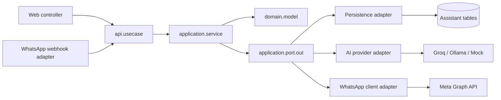

# Assistant Module Template Migration Implementation Plan

> **For agentic workers:** REQUIRED SUB-SKILL: Use superpowers:subagent-driven-development (recommended) or superpowers:executing-plans to implement this plan task-by-task. Steps use checkbox (`- [ ]`) syntax for tracking.

**Goal:** Migrate `modules/assistant` in `emme-service` from its legacy `entity`/`application`/`web`/`ai` layout to the current approved Spring Modulith DDD + Hexagonal module template. The service is pre-release: the current header-versioned `/api` contract is authoritative and no legacy path aliases or compatibility shims are retained.

**Architecture:** The latest `docs/templates/module-package-structure-template.md` is authoritative. The module will expose grouped public contracts under `api/{command,query,result,usecase,exception,type}`, keep framework-free business models under `domain/model`, place JPA and provider implementations behind `adapter/out`, and keep inbound HTTP/provider callbacks under `adapter/in`. Only responsibilities that exist in Assistant will be materialized; optional branches such as `api/event`, `domain/event`, `application/process`, `domain/factory`, `scheduler`, `messaging`, and `observability` are not created without a real responsibility.

**Tech Stack:** Java 21, Spring Boot 3, Spring Modulith 2.1.0 baseline, Spring Data JPA, Jackson, OkHttp, JUnit 5, AssertJ, ArchUnit, Gradle TestKit/module integration tests.

## Global Constraints

- The current module template is the source of truth; the older 2026-07-23 assistant plan is superseded by this plan.
- `domain/model` must not import Spring, JPA, Jackson, OkHttp, HTTP, or persistence classes.
- Existing database table names, column names, constraints, migration ownership, and persisted enum values remain unchanged.
- Current HTTP paths, status codes, JSON field names, feature-flag expressions, webhook verification behavior, error text, and database mappings are verified as the active contract. Legacy `/api/v1` aliases are not retained; endpoint versioning is supplied by the global `API-Version` header.
- JPA entities live only under `adapter/out/persistence/entity`; application and API code must never expose them.
- Every materialized production package receives a `package-info.java`; no empty architectural package is created merely to reproduce the maximum template tree.
- The module root keeps `@ApplicationModule`; grouped API child packages join the logical `api` named interface, and `api.event` is omitted because Assistant currently has no public published event contract.
- `api.result` uses the existing service convention of descriptive read-model suffixes (`ConversationInfo`, `ConversationEventInfo`, `PendingActionInfo`, `ChatInfo`, `IntentInfo`, `RagAnswerInfo`); HTTP transport records use `*Response`.
- Every public use-case contract ends with `UseCase`; every application implementation is named `<Verb><Subject>Service`; every persistence implementation is named `<Aggregate>PersistenceAdapter`; every Spring Data repository is named `SpringData<Aggregate>Repository`.
- External AI and WhatsApp integrations are accessed through application-owned outbound ports. Provider/client classes never become application dependencies.
- `api.exception` contains only caller-visible expected failures. Domain rule failures remain under `domain.exception`; infrastructure exceptions never cross the module boundary.
- The current `ConversationEvent` is a persisted conversation-history record, not a public Spring Modulith event. It remains a domain model and does not create `api/event` or `domain/event`.
- No `application/process`, `domain/factory`, `domain/specification`, `adapter/in/messaging`, `adapter/in/scheduler`, `adapter/out/messaging`, `adapter/out/observability`, `adapter/out/cache`, or `adapter/out/storage` package is created because the current Assistant source has no durable responsibility for those branches. Document search remains owned by Studio and is consumed through `studio :: documents-api`.
- WhatsApp webhook handling is a provider callback and therefore belongs under `adapter/in/webhook`, not `adapter/in/web/controller`.
- The migration is structural and must not invent new Assistant capabilities. Remaining behavior that is still a placeholder stays explicitly tracked while its boundary is normalized.

## Completed public AI capability boundary slice — 2026-08-01

- [x] Exposed captioning and embedding through separate public use-case ports.
- [x] Added one focused application service per AI use case.
- [x] Kept `ModelProvider` private to the Assistant AI application boundary.
- [x] Added delegation tests and source-tree convention coverage.
- Tests are moved to mirror the canonical production package layout. Existing HTTP assertions remain unchanged.
- Each implementation task follows Red → Green → Refactor, with a focused commit after verification. No implementation code is written without a failing or boundary-regression test first.

---

## 1. Current-to-target architecture

### 1.1 Current source ownership

```text
com.emme.assistant
├── entity/                         JPA entities and Spring Data repositories mixed
├── application/                   services and WhatsApp provider workflow mixed
├── web/                           HTTP controllers and nested DTOs
└── ai/
    ├── application/               AI services, provider ports, provider adapters, dead helpers
    ├── config/                     AI configuration
    └── web/                        AI controller and nested DTOs
```

### 1.2 Approved target ownership

```text
com.emme.assistant
├── package-info.java
│
├── api/
│   ├── command/                   state-changing intentions
│   ├── query/                     read/inference requests
│   ├── result/                    public application read models
│   ├── usecase/                   inbound ports
│   ├── exception/                 caller-visible expected failures
│   └── type/                      stable semantic API types
│
├── application/
│   ├── service/                   use-case orchestration
│   ├── port/out/                  outbound ports
│   └── mapper/                    API/domain translation
│
├── domain/
│   ├── model/                     framework-free business models
│   └── exception/                 business rule violations
│
├── adapter/
│   ├── in/
│   │   ├── web/{controller,request,response,mapper,advice}
│   │   └── webhook/                WhatsApp provider callback
│   └── out/
│       ├── persistence/{entity,repository,adapter,mapper}
│       └── client/{groq,ollama,mock,whatsapp}
│
└── configuration/                 Spring wiring and typed properties
```

### 1.3 Dependency direction



Forbidden directions:

```text
domain              → Spring/JPA/HTTP/JSON/adapter
application         → adapter.out concrete classes
web/webhook         → repository/entity/provider implementation
api                 → domain implementation/application/adapter
other modules       → assistant.application/assistant.adapter
```

---

## 2. Normalized public contracts

The following contracts are created only when the migrated use case needs them. Method signatures use semantic API IDs while web DTOs continue to use UUIDs so the JSON wire format does not change.

### 2.1 Commands

| File | Contract |
|---|---|
| `api/command/StartConversationCommand.java` | `StartConversationCommand(UUID tenantId, UUID participantId, ChannelType channel)` |
| `api/command/CloseConversationCommand.java` | `CloseConversationCommand(UUID conversationId)` |
| `api/command/AddConversationEventCommand.java` | `AddConversationEventCommand(UUID conversationId, String eventType, String payload)` |
| `api/command/ProposeActionCommand.java` | `ProposeActionCommand(UUID conversationId, ActionType actionType, String details, Instant expiresAt)` |
| `api/command/ConfirmActionCommand.java` | `ConfirmActionCommand(UUID actionId)` |
| `api/command/RejectActionCommand.java` | `RejectActionCommand(UUID actionId)` |
| `api/command/ProcessWhatsAppMessageCommand.java` | parsed tenant, sender, text, and provider message metadata required by the workflow |

Commands express an intention to perform work. They do not contain Spring annotations, HTTP request validation, persistence entities, or business behavior.

### 2.2 Queries

| File | Contract |
|---|---|
| `api/query/GetConversationQuery.java` | `GetConversationQuery(UUID conversationId)` |
| `api/query/ListConversationsByTenantQuery.java` | `ListConversationsByTenantQuery(UUID tenantId)` |
| `api/query/GetConversationHistoryQuery.java` | `GetConversationHistoryQuery(UUID conversationId)` |
| `api/query/GetActiveActionsQuery.java` | `GetActiveActionsQuery(UUID conversationId)` |
| `api/query/ChatQuery.java` | `ChatQuery(String conversationContext, String userMessage)` |
| `api/query/RouteIntentQuery.java` | `RouteIntentQuery(String message)` |
| `api/query/RagQuestionQuery.java` | `RagQuestionQuery(UUID tenantId, String question)` |

Queries do not mutate Assistant state. AI inference is query-shaped even though it calls an external provider.

### 2.3 Results

| File | Required fields |
|---|---|
| `api/result/ConversationInfo.java` | existing conversation response fields, including `createdAt` |
| `api/result/ConversationEventInfo.java` | existing event response fields |
| `api/result/PendingActionInfo.java` | existing pending-action response fields |
| `api/result/ChatInfo.java` | `response` |
| `api/result/IntentInfo.java` | `intent`, `confidence`, `parameters` |
| `api/result/RagAnswerInfo.java` | `answer` |

Results are immutable records and never expose JPA entities, provider response maps, or mutable aggregates.

### 2.4 Use cases

```text
StartConversationUseCase
CloseConversationUseCase
AddConversationEventUseCase
GetConversationUseCase
ListConversationsByTenantUseCase
GetConversationHistoryUseCase
ProposeActionUseCase
ConfirmActionUseCase
RejectActionUseCase
ExpireStaleActionsUseCase
GetActiveActionsUseCase
ChatUseCase
RouteIntentUseCase
RagQueryUseCase
ProcessWhatsAppMessageUseCase
```

Each interface has one operation named after the use case and accepts exactly one command/query object. Each result is an `api.result` record or `void` only when the existing behavior has no result. `ProcessWhatsAppMessageUseCase` remains an inbound module contract so the webhook adapter does not depend on a concrete service.

### 2.5 Public and domain exceptions

```text
api/exception/ConversationNotFoundException.java
api/exception/PendingActionNotFoundException.java
domain/exception/ConversationNotActiveException.java
domain/exception/PendingActionNotPendingException.java
```

The two not-found exceptions are public expected failures. The two state exceptions extend `IllegalStateException` to preserve the existing default 500 behavior while giving the domain rule a stable name. No SQL, JPA, OkHttp, or provider exception becomes public API.

### 2.6 API types

```text
api/type/ConversationId.java
api/type/PendingActionId.java
```

These records provide semantic identity at module boundaries. Web request/response DTOs continue to serialize UUIDs exactly as today; web mappers perform the conversion.

---

## 3. Implementation tasks

### Completed package-boundary slice — 2026-08-01

- [x] Added red/green package guard coverage for legacy-package removal and AI
  capability materialization.
- [x] Moved conversation persistence representations under
  `adapter/out/persistence/entity` and renamed them with the `Entity` suffix.
- [x] Moved Spring Data repositories under `adapter/out/persistence/repository`
  and normalized their `SpringData<Aggregate>Repository` names.
- [x] Moved conversation status/action/consent vocabulary into
  `domain/model` and added framework-free conversation models.
- [x] Moved conversation and WhatsApp HTTP/provider entry points into canonical
  inbound adapter packages.
- [x] Materialized the initial Assistant and AI use-case package boundaries,
  including `StartConversationUseCase` and `ChatUseCase`.
- [x] Updated source guard tests and Assistant tests to the canonical paths.
- [x] Verified Assistant compilation, formatting, package guard, and module test
  suite.

The historical implementation checklist below was written before the migration
slices landed. The source tree and focused tests are now the authoritative
status; the reconciliation below identifies only evidence that is genuinely
still open.

### Migration status reconciliation — 2026-08-02

| Area | Current status | Evidence | Remaining work |
|---|---|---|---|
| Package guardrails and metadata | Complete | `AiCapabilityConventionTest`, `AssistantPackageConventionTest`, and metadata in every materialized production package | None in the Assistant source tree |
| Domain and persistence separation | Complete | Framework-free `domain/model`, `*Entity`, mappers, persistence adapters, and tenant predicates | PostgreSQL lifecycle evidence is part of the service-wide gate |
| Application ports and one-service-per-use-case | Complete | Grouped `api/usecase`, focused application services, and port-only application imports | None in the Assistant source tree |
| AI capability boundary | Complete | `assistant-ai-api`, focused AI services, private `ModelProvider`, and isolated Groq/Ollama/Mock providers | Credentialed provider contract tests |
| WhatsApp boundary | Complete | Webhook adapter, typed properties, signature verification, tenant resolver, durable replay claim, and outbound client port | PostgreSQL replay and provider-contract evidence |
| HTTP adapters | Complete | Dedicated request/response records, mappers, inbound use-case dependencies, and header-versioned neutral `/api` routes | No compatibility aliases by design |
| Modulith visibility | Complete for current source | Assistant module tests and `documents-api` dependency boundary | Final service-wide dependency report |
| Dead legacy code | Complete | Repository-wide reference check; unused AI helpers and empty legacy configuration package removed | None |

The remaining items are operational evidence only: credentialed provider
contracts, PostgreSQL replay/idempotency execution, clean test-context lifecycle,
and the final service-wide quality/boot/recovery gate. They must not be marked
complete merely because a Gradle task exits successfully while shutdown SQL
warnings remain.

### Task 1: Establish the migration guardrails and package metadata

**Files:**

- Create: `modules/assistant/src/test/java/com/emme/assistant/architecture/AssistantArchitectureTest.java`
- Create: `modules/assistant/src/test/java/com/emme/assistant/architecture/AssistantPackageStructureTest.java`
- Create: `modules/assistant/src/main/java/com/emme/assistant/api/package-info.java`
- Create: `modules/assistant/src/main/java/com/emme/assistant/application/package-info.java`
- Create: `modules/assistant/src/main/java/com/emme/assistant/domain/package-info.java`
- Create: `modules/assistant/src/main/java/com/emme/assistant/adapter/package-info.java`
- Create: `modules/assistant/src/main/java/com/emme/assistant/adapter/in/package-info.java`
- Create: `modules/assistant/src/main/java/com/emme/assistant/adapter/out/package-info.java`
- Create: `modules/assistant/src/main/java/com/emme/assistant/configuration/package-info.java`
- Modify: `modules/assistant/src/main/java/com/emme/assistant/package-info.java`

**Interfaces:**

- `AssistantArchitectureTest` asserts domain framework isolation, application-to-adapter isolation, inbound adapter dependency direction, and persistence entity containment.
- `AssistantPackageStructureTest` scans `src/main/java/com/emme/assistant` and fails when a production package containing Java types lacks `package-info.java`.
- The module root remains the only `@ApplicationModule` declaration.

- [ ] **Step 1: Write the failing architecture assertions**

Add rules that intentionally fail against the legacy tree, including:

```java
@ArchTest
static final ArchRule application_must_not_depend_on_adapters =
    noClasses().that().resideInAPackage("com.emme.assistant.application..")
        .should().dependOnClassesThat()
        .resideInAnyPackage("com.emme.assistant.adapter..", "com.emme.assistant.entity..");

@ArchTest
static final ArchRule domain_must_not_depend_on_frameworks =
    noClasses().that().resideInAPackage("com.emme.assistant.domain..")
        .should().dependOnClassesThat()
        .resideInAnyPackage("org.springframework..", "jakarta.persistence..", "com.fasterxml..",
            "okhttp3..", "com.emme.assistant.adapter..");
```

- [ ] **Step 2: Run the focused architecture test and record the expected failure**

Run:

```bash
./gradlew :modules:assistant:test --tests '*AssistantArchitectureTest*' --no-daemon --no-configuration-cache
```

Expected: failure naming legacy package dependencies and missing canonical package metadata.

- [ ] **Step 3: Add only root/package namespace documentation**

Create `package-info.java` with Javadoc for each materialized top-level package. Do not annotate `api/package-info.java`; annotations belong on each materialized API-kind child package in Task 4.

- [ ] **Step 4: Commit the guardrail baseline**

```bash
git add modules/assistant/src/main/java/com/emme/assistant modules/assistant/src/test/java/com/emme/assistant/architecture
git commit -m "test(assistant): define canonical module boundary guardrails"
```

### Task 2: Split Assistant persistence entities from pure domain models

**Files:**

- Create: `domain/model/{ActionStatus,ActionType,ConsentStatus,ConversationStatus}.java`
- Create: `domain/model/{Conversation,ConversationEvent,PendingAction,ChannelParticipant}.java`
- Create: `domain/model/package-info.java`
- Create: `adapter/out/persistence/entity/{ConversationEntity,ConversationEventEntity,PendingActionEntity,ChannelParticipantEntity}.java`
- Create: `adapter/out/persistence/entity/package-info.java`
- Create: `adapter/out/persistence/package-info.java`
- Create: `adapter/out/persistence/mapper/{ConversationPersistenceMapper,ConversationEventPersistenceMapper,PendingActionPersistenceMapper,ChannelParticipantPersistenceMapper}.java`
- Create: `adapter/out/persistence/mapper/package-info.java`
- Create: domain model tests under `modules/assistant/src/test/java/com/emme/assistant/domain/model/`
- Create: mapper tests under `modules/assistant/src/test/java/com/emme/assistant/adapter/out/persistence/mapper/`
- Delete after references are migrated: `entity/{ActionStatus,ActionType,ChannelParticipant,ConsentStatus,Conversation,ConversationEvent,ConversationStatus,PendingAction}.java`

**Interfaces:**

- Pure domain models expose the behavior currently consumed by application services: identifiers, tenant identity, participant/channel data, status transitions, timestamps, and action/event fields.
- Persistence entities retain the existing `TenantOwnedEntity` inheritance, JPA annotations, table names, column names, enum storage, and constraints.
- Mappers translate in both directions. New domain models use `IdGenerator.generate()` for new identifiers; entity mappers call `setId()` only while constructing persistence representations.
- Domain timestamps are represented as nullable/known values so existing response fields remain available after rehydration without importing `BaseEntity`.

- [ ] **Step 1: Add red domain behavior tests**

Cover construction, status changes, action transitions, identifier preservation, and the fact that domain source files have no framework imports.

- [ ] **Step 2: Implement pure domain models**

Move business state out of JPA classes. Do not copy `@Entity`, `@Column`, `TenantOwnedEntity`, or `BaseEntity` into `domain/model`.

- [ ] **Step 3: Add persistence entity representations**

Copy the current database mappings into `*Entity` classes and retain exact schema metadata. Add `fromDomain()`/`toDomain()` through the dedicated mappers rather than static transport conversions.

- [ ] **Step 4: Add mapper tests and run focused tests**

Run:

```bash
./gradlew :modules:assistant:test --tests '*domain.model*' --tests '*PersistenceMapperTest*' --no-daemon --no-configuration-cache
```

Expected: all new domain and round-trip mapper tests pass; no database schema changes are generated.

- [ ] **Step 5: Commit**

```bash
git add modules/assistant/src/main/java/com/emme/assistant/domain modules/assistant/src/main/java/com/emme/assistant/adapter/out/persistence
git commit -m "refactor(assistant): separate domain models from persistence entities"
```

### Task 3: Split Spring Data repositories into outbound ports and persistence adapters

**Files:**

- Create: `application/port/package-info.java`
- Create: `application/port/out/package-info.java`
- Create: `application/port/out/{ConversationRepository,ConversationEventRepository,PendingActionRepository,ChannelParticipantRepository}.java`
- Create: `adapter/out/persistence/repository/package-info.java`
- Create: `adapter/out/persistence/repository/{SpringDataConversationRepository,SpringDataConversationEventRepository,SpringDataPendingActionRepository,SpringDataChannelParticipantRepository}.java`
- Create: `adapter/out/persistence/adapter/package-info.java`
- Create: `adapter/out/persistence/adapter/{ConversationPersistenceAdapter,ConversationEventPersistenceAdapter,PendingActionPersistenceAdapter,ChannelParticipantPersistenceAdapter}.java`
- Create: port/adaptor tests under `modules/assistant/src/test/java/com/emme/assistant/adapter/out/persistence/`
- Delete: `entity/{ConversationRepository,ConversationEventRepository,PendingActionRepository,ChannelParticipantRepository}.java`

**Interfaces:**

- Port methods use domain models and preserve every existing finder, including unreferenced tenant/status finders.
- Spring Data interfaces use `*Entity` types only.
- Persistence adapters implement ports, map domain ↔ entity, and update managed entities in place when an identifier already exists to avoid JPA duplicate-identity failures.

- [ ] **Step 1: Write port contract tests against fakes**
- [ ] **Step 2: Create application-owned repository ports**
- [ ] **Step 3: Create Spring Data interfaces and persistence adapters**
- [ ] **Step 4: Add managed-entity save regression coverage**
- [ ] **Step 5: Run `./gradlew :modules:assistant:compileJava :modules:assistant:test --no-daemon --no-configuration-cache`**
- [ ] **Step 6: Commit**

```bash
git add modules/assistant/src/main/java/com/emme/assistant/application/port modules/assistant/src/main/java/com/emme/assistant/adapter/out/persistence
git commit -m "refactor(assistant): isolate persistence behind application ports"
```

### Task 4: Create grouped API commands, queries, results, exceptions, and types

**Files:**

- Create: `api/{command,query,result,usecase,exception,type}/package-info.java`
- Create all command/query/result/type files listed in §2.
- Create: `api/exception/{ConversationNotFoundException,PendingActionNotFoundException}.java`
- Create: `api/type/{ConversationId,PendingActionId}.java`
- Create: `api/usecase/package-info.java` with no implementation classes.

**Interfaces:**

- Every class is a top-level type in a filename matching its class name.
- Commands and queries are immutable records.
- Result records contain only stable contract values and do not import domain models or entities.
- `IntentInfo` replaces the nested `ModelProvider.IntentResult` as the public AI result; the provider port receives its own provider-neutral internal result type.

- [ ] **Step 1: Add compile-level contract tests**

Assert record component names and JSON-compatible shapes through existing MockMvc tests without changing their assertions.

- [ ] **Step 2: Create API package metadata and named-interface annotations**

Each materialized API-kind package joins `@NamedInterface("api")`. Do not add `api.event` because no published Assistant fact exists.

- [ ] **Step 3: Create immutable contract records and expected exceptions**
- [ ] **Step 4: Run API compilation and contract tests**
- [ ] **Step 5: Commit**

```bash
git add modules/assistant/src/main/java/com/emme/assistant/api
git commit -m "refactor(assistant): define grouped public module contracts"
```

### Task 5: Normalize AI ports, services, and configuration

**Files:**

- Move: `ai/config/AiProperties.java` → `configuration/AiProperties.java`
- Move: `ai/config/AiProvider.java` → `configuration/AiProvider.java`
- Create: `configuration/package-info.java`
- Create: `application/port/out/ModelProvider.java`
- Create: `application/port/out/ModelIntentResult.java`
- Create: `application/service/ChatService.java`
- Create: `application/service/RouteIntentService.java`
- Create: `application/service/RagQueryService.java`
- Create: `application/mapper/AiApplicationMapper.java`
- Create: `application/mapper/package-info.java`
- Create: `application/service/package-info.java`
- Move/update tests under `modules/assistant/src/test/java/com/emme/assistant/application/`
- Delete: `ai/application/{AiService,RagService,ModelProvider}.java`
- Delete: `ai/config/{AiProperties,AiProvider}.java` after migration

**Interfaces:**

- `ChatService implements ChatUseCase`.
- `RouteIntentService implements RouteIntentUseCase`.
- `RagQueryService implements RagQueryUseCase`.
- `ModelProvider` remains an outbound port with chat, embedding, intent routing, caption, name, and mock behavior; its nested public result is replaced by `ModelIntentResult`.
- Unused `embed()`, `isMockMode()`, and `providerName()` wrappers are not promoted to public use cases.

- [ ] **Step 1: Add failing service tests using fake `ModelProvider`**
- [ ] **Step 2: Implement use-case-oriented AI services**
- [ ] **Step 3: Move typed AI properties into `configuration`**
- [ ] **Step 4: Verify `catalog` and every other external consumer imports the new port path**

Run:

```bash
rg -n 'com\.emme\.assistant\.ai|AiService|RagService|ModelProvider\.IntentResult' modules --glob '*.java'
```

Expected: no legacy production imports after the task, except deliberate test names or migration documentation.

- [ ] **Step 5: Run focused service tests and commit**

```bash
./gradlew :modules:assistant:test :modules:catalog:compileJava --no-daemon --no-configuration-cache
git add modules/assistant modules/catalog
git commit -m "refactor(assistant): normalize AI ports and use-case services"
```

### Task 6: Normalize AI provider adapters by external system

**Files:**

- Create: `adapter/out/provider/package-info.java`
- Create: `adapter/out/provider/groq/package-info.java`
- Create: `adapter/out/provider/groq/{GroqHttpClient,GroqClientMapper,GroqModelProvider}.java`
- Create: `adapter/out/provider/ollama/package-info.java`
- Create: `adapter/out/provider/ollama/{OllamaHttpClient,OllamaClientMapper,OllamaModelProvider}.java`
- Create: `adapter/out/provider/mock/package-info.java`
- Create: `adapter/out/provider/mock/MockModelProvider.java`
- Create provider contract tests under `modules/assistant/src/integrationTest/java/com/emme/assistant/ai/adapter/out/provider/`
- Delete legacy `ai/application/{GroqModelProvider,OllamaModelProvider,MockModelProvider}.java` after references migrate.

**Interfaces:**

- Each `*ModelProvider` implements `ModelProvider`.
- Each HTTP client owns only OkHttp request execution.
- Each client mapper owns provider JSON/request translation.
- Provider adapters preserve current fallback strings, intent sanitization, embedding behavior, conditional activation, and configuration defaults.
- No provider class reads environment variables directly after configuration wiring; secrets enter through `AiProperties` or a dedicated configuration port.

- [ ] **Step 1: Add fake HTTP client tests for success, provider errors, malformed payloads, and empty results**
- [x] **Step 2: Extract Groq transport client/mapper/provider boundary**
- [x] **Step 3: Extract Ollama transport client/mapper/provider boundary**
- [x] **Step 4: Move mock provider into the same external-system package convention**
- [ ] **Step 5: Run provider tests and full Assistant compile**
- [ ] **Step 6: Commit**

```bash
git add modules/assistant/src/main/java/com/emme/assistant/adapter/out/client modules/assistant/src/main/java/com/emme/assistant/configuration
git commit -m "refactor(assistant): organize AI providers as outbound client adapters"
```

### Task 7: Move and decompose the WhatsApp provider boundary

**Files:**

- Create: `application/port/out/WhatsAppReplyPort.java`
- Create: `adapter/in/webhook/package-info.java`
- Create: `adapter/in/webhook/WhatsAppSignatureVerifier.java`
- Create: `adapter/in/webhook/WhatsAppWebhookMapper.java`
- Create: `adapter/in/webhook/WhatsAppWebhookMessage.java`
- Create: `adapter/out/client/whatsapp/package-info.java`
- Create: `adapter/out/client/whatsapp/{WhatsAppHttpClient,WhatsAppClientMapper,WhatsAppReplyAdapter}.java`
- Create: `configuration/WhatsAppProperties.java`
- Create: `application/service/ProcessWhatsAppMessageService.java`
- Create: `application/service/WhatsAppMessageWorkflow.java` only if the workflow remains larger than one focused service after extraction
- Create tests under `modules/assistant/src/test/java/com/emme/assistant/adapter/in/webhook/` and `modules/assistant/src/test/java/com/emme/assistant/application/`
- Delete: `application/WhatsAppMessageService.java` after behavior is covered and callers migrate.

**Interfaces:**

- `WhatsAppWebhookController` will depend on `ProcessWhatsAppMessageUseCase`, `WhatsAppSignatureVerifier`, and `WhatsAppWebhookMapper`; it will not parse JSON, query repositories, construct OkHttp clients, or depend on a concrete application service.
- `ProcessWhatsAppMessageService` orchestrates participant lookup, active-conversation lookup/creation, conversation events, AI chat, and outbound reply through ports/use cases.
- `WhatsAppReplyPort` hides Meta Graph API transport.
- `WhatsAppProperties` preserves current defaults for verify token, tenant fallback, Graph API base URL, and credentials while replacing direct `System.getenv`/`@Value` access in services.
- Signature validation, malformed payload handling, status-update filtering, tenant fallback, and response error mapping remain behavior-compatible.

- [ ] **Step 1: Add red webhook tests for verification, invalid signature, status updates, malformed payloads, and normal messages**
- [ ] **Step 2: Extract signature verification and payload mapping**
- [ ] **Step 3: Add the application process command/use case/service**
- [ ] **Step 4: Add the WhatsApp outbound port and client adapter**
- [ ] **Step 5: Run existing integration tests and webhook regression tests**
- [ ] **Step 6: Commit**

```bash
git add modules/assistant/src/main/java/com/emme/assistant/adapter/in/webhook modules/assistant/src/main/java/com/emme/assistant/adapter/out/client/whatsapp modules/assistant/src/main/java/com/emme/assistant/application modules/assistant/src/main/java/com/emme/assistant/configuration
git commit -m "refactor(assistant): isolate WhatsApp webhook and client boundaries"
```

### Task 8: Split Conversation application orchestration into use-case services

**Files:**

- Create under `application/service/`:

```text
StartConversationService.java
CloseConversationService.java
AddConversationEventService.java
GetConversationService.java
ListConversationsByTenantService.java
GetConversationHistoryService.java
ProposeActionService.java
ConfirmActionService.java
RejectActionService.java
ExpireStaleActionsService.java
GetActiveActionsService.java
```

- Create: `application/mapper/ConversationApplicationMapper.java`
- Create tests under `modules/assistant/src/test/java/com/emme/assistant/application/service/`
- Delete: `application/ConversationService.java` after all use-case callers migrate.

**Interfaces:**

- Each service implements exactly one `api.usecase` interface and receives only ports, clock/configuration collaborators, and domain/application mappers.
- Services return `api.result` records, not domain objects, to prevent inbound adapters from coupling to the domain model.
- `@Transactional` belongs on application service methods; read use cases use `readOnly = true`.
- Not-found lookups throw the new typed API exceptions. State-transition failures use the domain exceptions that preserve existing HTTP behavior.
- `findByTenantId` retains the current tenant-scoped finder semantics and does not broaden data access.

- [ ] **Step 1: Add use-case service tests with fake repository ports**
- [ ] **Step 2: Implement create/read/update workflow services**
- [ ] **Step 3: Implement pending-action workflow services**
- [ ] **Step 4: Add mapper tests for all public result shapes**
- [ ] **Step 5: Run Assistant unit tests and compile all dependent modules**
- [ ] **Step 6: Commit**

```bash
git add modules/assistant/src/main/java/com/emme/assistant/application modules/assistant/src/main/java/com/emme/assistant/api/usecase modules/assistant/src/test/java/com/emme/assistant/application
git commit -m "refactor(assistant): split conversation workflows into use-case services"
```

### Task 9: Rewrite HTTP controllers as inbound web adapters

**Files:**

- Create: `adapter/in/web/package-info.java`
- Create: `adapter/in/web/controller/package-info.java`
- Create: `adapter/in/web/controller/ConversationController.java`
- Create: `adapter/in/web/controller/AiController.java`
- Create: `adapter/in/web/request/{StartConversationRequest,ProposeActionRequest,ChatRequest,IntentRequest,RagRequest}.java`
- Create: `adapter/in/web/response/{ConversationResponse,EventResponse,PendingActionResponse,ChatResponse,IntentResponse,RagResponse}.java`
- Create: `adapter/in/web/mapper/{ConversationWebMapper,AiWebMapper}.java`
- Create: `adapter/in/web/advice/{AssistantExceptionHandler}.java`
- Create corresponding `package-info.java` files in every materialized web child package.
- Move existing tests to `modules/assistant/src/test/java/com/emme/assistant/adapter/in/web/` without changing assertions.
- Delete: legacy `web/ConversationController.java`, `ai/web/AiController.java`, and nested DTO declarations after migration.

**Interfaces:**

- Controllers depend only on `api.usecase` interfaces and web mappers.
- Requests contain transport validation and UUID/wire representations only.
- Responses preserve the exact existing field names, values, status codes, and location headers.
- `AssistantExceptionHandler` maps not-found failures consistently and lets unexpected failures retain the existing default/error behavior.
- `WhatsAppWebhookController` is handled by Task 7 under `adapter/in/webhook`, not duplicated here.

- [ ] **Step 1: Add web slice tests asserting dependency and JSON compatibility**
- [ ] **Step 2: Extract request/response records into dedicated files**
- [ ] **Step 3: Add web mappers**
- [ ] **Step 4: Rewrite controllers to call use cases**
- [ ] **Step 5: Add exception advice without changing existing status behavior**
- [ ] **Step 6: Run `ConversationWebTest` and `AiWebTest` unchanged**
- [ ] **Step 7: Commit**

```bash
git add modules/assistant/src/main/java/com/emme/assistant/adapter/in/web modules/assistant/src/test/java/com/emme/assistant/adapter/in/web
git commit -m "refactor(assistant): normalize HTTP controllers and transport DTOs"
```

### Task 10: Complete package metadata and Spring Modulith visibility

**Files:**

- Create/update `package-info.java` in every materialized Assistant production package, including:

```text
api/{command,query,result,usecase,exception,type}
application/{service,port,out,mapper}
domain/{model,exception}
adapter/{in,webhook,out,persistence,entity,repository,adapter,mapper,client,groq,ollama,mock,whatsapp}
configuration
```

- Modify: `modules/assistant/src/main/java/com/emme/assistant/package-info.java`
- Modify: `modules/assistant/src/main/java/com/emme/assistant/ai/package-info.java`
- Modify any consuming module `package-info.java` declarations only when the new public port/API package requires it; do not weaken allowed dependencies.

**Interfaces:**

- Root package contains `@ApplicationModule(displayName = "Assistant", allowedDependencies = {"shared", "tenancy"})` plus no business types.
- Each materialized `api` kind is annotated `@NamedInterface("api")`.
- The AI capability root is not a named interface; only the grouped AI public
  API package is exposed through `assistant-ai-api`.
- The module's event named interface is not created because the current persisted conversation history is not a published module event.

- [ ] **Step 1: Add source-tree package-info verification for every materialized package**
- [ ] **Step 2: Add named-interface and API signature closure assertions**
- [ ] **Step 3: Ensure the AI capability root does not expose implementation packages**
- [ ] **Step 4: Run `ApplicationModules.verify()` and inspect every Assistant dependency**
- [ ] **Step 5: Commit**

```bash
git add modules/assistant/src/main/java modules/*/src/main/java/com/emme/*/package-info.java
git commit -m "chore(assistant): enforce package metadata and named API boundaries"
```

### Task 11: Relocate tests and remove legacy implementation packages

**Files:**

- Move `src/test` files into canonical package paths:

```text
com/emme/assistant/ai/module/AiModuleTest.java
  → com/emme/assistant/architecture/AiModuleTest.java
com/emme/assistant/ai/web/AiWebTest.java
  → com/emme/assistant/adapter/in/web/AiWebTest.java
com/emme/conversations/module/ConversationModuleTest.java
  → com/emme/assistant/architecture/ConversationModuleTest.java
com/emme/conversations/web/ConversationWebTest.java
  → com/emme/assistant/adapter/in/web/ConversationWebTest.java
```

- Move: `src/integrationTest/java/com/emme/assistant/ai/AssistantIntegrationTest.java` → `src/integrationTest/java/com/emme/assistant/AssistantIntegrationTest.java`
- Delete obsolete legacy production directories: `entity/`, flat `application/`,
  and `web/` after confirming no source references remain. Preserve the
  normalized `ai/` capability because it owns real AI use cases and adapters.
- Delete dead classes only after a repository-wide reference check: `FallbackHandler`, `ToolExecutor`, and `ToolRegistry`.

- [ ] **Step 1: Run repository-wide reference checks before deleting files**

```bash
rg -n 'com\.emme\.assistant\.(entity|application|web|ai)|FallbackHandler|ToolExecutor|ToolRegistry' . --glob '*.java' --glob '*.kt'
```

Expected: only files being migrated or intentionally documented references remain.

- [ ] **Step 2: Relocate tests and update only package/import declarations**
- [ ] **Step 3: Delete legacy production files and empty directories**
- [ ] **Step 4: Print the final Assistant source tree and compare it with §1.2**
- [ ] **Step 5: Commit**

```bash
git add -A modules/assistant
git commit -m "chore(assistant): remove legacy package structure"
```

### Task 12: Full verification, operational review, and migration completion

**Files:**

- Modify: `tasks/todo.md`
- Modify: `tasks/lessons.md` if a new failure mode is discovered.
- Modify: `docs/architecture/05-operations/service-architecture-migration.md` with the Assistant migration result.
- Create: `docs/superpowers/reviews/2026-07-31-assistant-module-template-migration-verification.md`

- [ ] **Step 1: Run all Assistant unit, integration, architecture, and application-module tests**

```bash
./gradlew :modules:assistant:compileJava \
  :modules:assistant:test \
  :modules:assistant:integrationTest \
  :applications:emme-platform:test --tests '*ModularityTest*' \
  --no-daemon --no-configuration-cache
```

Expected: `BUILD SUCCESSFUL`, zero failures, zero skipped tests, and no new unrelated module-boundary violations.

- [ ] **Step 2: Run service quality gates**

```bash
./gradlew spotlessCheck checkstyleMain checkstyleTest ci \
  -x test -x integrationTest -x e2eTest \
  --no-daemon --no-configuration-cache
```

Expected: all formatting, static analysis, dependency, and packaging checks pass.

- [ ] **Step 3: Verify schema and HTTP compatibility**

Compare the Assistant migration scripts and integration schema before/after. Run unchanged MockMvc assertions for:

```text
POST /api/conversations
GET  /api/conversations
GET  /api/conversations/{id}
POST /api/conversations/{id}/close
GET  /api/conversations/{id}/events
POST /api/conversations/{id}/actions
POST /api/conversations/actions/{id}/confirm
POST /api/conversations/actions/{id}/reject
POST /api/ai/chat
POST /api/ai/intent
POST /api/ai/rag
GET/POST /api/webhooks/whatsapp
```

- [ ] **Step 4: Verify production-readiness controls from the current template**

Record evidence for tenant scoping, transaction boundaries, provider secret handling, signature validation, replay/idempotency behavior, structured error logging, and absence of persistence entities in public signatures. If a control is not implemented by existing behavior, document the exact follow-up rather than silently inventing it during this structural migration.

- [ ] **Step 5: Update the service migration checklist and verification report**
- [ ] **Step 6: Commit and push the completed migration**

```bash
git add tasks/todo.md tasks/lessons.md docs/architecture/05-operations/service-architecture-migration.md docs/superpowers/reviews/2026-07-31-assistant-module-template-migration-verification.md
git commit -m "docs(assistant): record canonical module migration verification"
git push origin feat/assistant-module-migration
git log --oneline origin/feat/assistant-module-migration -1
```

---

## 4. Definition of Done

- [ ] No obsolete `assistant/entity`, flat `assistant/application`, or
  `assistant/web` production package remains; the normalized `assistant/ai`
  capability is retained.
- [ ] Every materialized production package has `package-info.java`.
- [ ] Domain models are framework-free and persistence entities are adapter-owned.
- [ ] All application services depend on ports, not concrete outbound adapters.
- [ ] All inbound adapters depend on use-case interfaces, not repositories or entities.
- [ ] All public API types are grouped by kind and named according to the current template.
- [ ] Current header-versioned `/api` paths, response JSON, status codes, feature flags, webhook behavior, and database mappings are verified; no legacy compatibility aliases are required for this pre-release service.
- [ ] AI and WhatsApp provider implementations are isolated under external-system client packages.
- [ ] Dead Assistant helpers are removed only after repository-wide reference verification.
- [ ] Spring Modulith and ArchUnit checks enforce the new boundary.
- [ ] Unit, integration, architecture, formatting, static-analysis, and CI checks pass with zero failures and zero skipped tests.
- [ ] Migration evidence is documented and committed.
- [ ] All commits are logical, pushed to `origin/feat/module-plans-normalization`, and the remote tip is verified.

## 5. Risks and controlled decisions

| Risk | Mitigation |
|---|---|
| Moving JPA entities into domain would violate the latest template | Create pure domain models and explicit persistence entities/mappers in Task 2 |
| Splitting one large WhatsApp service can change edge-case behavior | Add webhook, mapper, workflow, and provider regression tests before deleting the legacy service |
| Changing nested DTOs can alter JSON | Keep response component names/types and existing MockMvc assertions unchanged |
| Provider extraction can change fallback/error strings | Capture current provider behavior in adapter contract tests before extraction |
| More named interfaces can accidentally expose implementation packages | Annotate only materialized API kinds and run custom named-interface closure checks |
| Existing placeholder RAG behavior may be mistaken for a feature redesign | Preserve current output and record future behavior as a separate capability task |
| Long migration branch divergence | Keep commits focused by task, push after each verified milestone, and merge within the active service migration window |

## Completed typed WhatsApp configuration slice — 2026-08-01

- [x] Added `WhatsAppProperties` for webhook verification, tenant routing, and
  Cloud API credentials/endpoints.
- [x] Replaced direct `@Value` injection and `System.getenv` access in the
  WhatsApp service/controller path with constructor-injected properties.
- [x] Added complete `app.whatsapp.*` configuration to both deployable
  application profiles.
- [x] Added property and source-boundary regression tests.
- [x] Verified Assistant unit and integration tests with formatting.

Remaining Assistant migration work includes the broader domain/persistence and
adapter normalization tasks already listed above. The Groq provider-specific
configuration cleanup is complete: its API key now enters through typed
`AiProperties` and the deployable application profiles.

## Completed typed Groq configuration slice — 2026-08-01

- [x] Reused `AiProperties.ProviderConfig.apiKey` as the single configuration
  boundary for the Groq API key.
- [x] Removed direct `System.getenv` access from `GroqModelProvider`.
- [x] Added `app.ai.chat.api-key` placeholders to both deployable application
  configurations without storing secret material.
- [x] Updated the missing-key diagnostic to refer to the typed property path.
- [x] Added a source-boundary regression test and verified Assistant formatting
  plus the focused test.

The remaining Assistant provider work is the broader adapter/package migration
described in the approved tasks above; this slice deliberately changes only
configuration ownership.

## Completed conversation boundary slice — 2026-08-01

- [x] Added grouped conversation commands, queries, results, exceptions, and
  use-case contracts.
- [x] Added application-owned conversation, event, and pending-action ports.
- [x] Added persistence mappers and adapters so application code no longer
  imports JPA entities or Spring Data repositories.
- [x] Replaced the legacy multi-operation `ConversationService` with focused
  services for start, close, event append, action proposal/confirmation/
  rejection, conversation reads, history, and active-action reads.
- [x] Extracted HTTP request/response/mapper types and rewired the WhatsApp
  inbound adapter to public use cases.
- [x] Added application dependency-direction coverage and verified Assistant
  formatting, compilation, and tests.

The AI, channel-participant, and webhook adapter details were completed in the
subsequent slices recorded below; only operational evidence remains open.

## Completed AI capability boundary slice — 2026-08-01

- [x] Moved `ModelProvider` into the AI application outbound-port package.
- [x] Moved Mock, Groq, and Ollama implementations into AI outbound provider
  adapters and typed configuration into `ai/configuration`.
- [x] Replaced the multi-operation AI facade with focused Chat, Detect Intent,
  and RAG query use-case boundaries.
- [x] Rewired HTTP and WhatsApp inbound adapters to public AI use cases.
- [x] Updated source-boundary tests and verified Assistant formatting,
  compilation, and tests.

Channel-participant persistence and AI use-case boundaries are complete; the
remaining work is provider contract evidence and final service verification.

## Completed channel-participant boundary slice — 2026-08-01

- [x] Added the application-owned `ChannelParticipantRepository` port.
- [x] Added the persistence mapper and `ChannelParticipantPersistenceAdapter`.
- [x] Kept `ChannelParticipantEntity` and Spring Data access inside outbound
  persistence packages.
- [x] Rewired the WhatsApp inbound adapter to use the domain participant and
  application port without importing persistence types.
- [x] Added the source boundary regression test and verified the complete
  Assistant check.

Remaining Assistant work is live provider contract coverage, PostgreSQL replay
execution evidence, and final service-wide Modulith/CI verification.

## Completed AI and WhatsApp adapter normalization — 2026-08-01

- [x] Grouped Mock, Groq, and Ollama implementations by external technology
  under `ai/adapter/out/client/` and removed the generic `provider` package.
- [x] Extracted AI HTTP request/response records into named files under the
  inbound web adapter.
- [x] Injected `AiHttpClient` and `ObjectMapper` through the AI configuration
  composition root; provider adapters no longer instantiate transports.
- [x] Replaced `WhatsAppMessageService` with the focused
  `ProcessWhatsAppMessageUseCase` and `ProcessWhatsAppMessageService`.
- [x] Extracted webhook mapping and Graph API delivery into inbound/outbound
  adapters with application-owned ports.
- [x] Added unit coverage for malformed payloads, status updates, successful
  processing, durable duplicate claims, and provider-account tenant routing.
- [x] Assistant unit, web, module, formatting, and compilation checks pass.

The remaining evidence is intentionally operational: live provider contract
tests and PostgreSQL replay verification belong to the final service-wide gate.

## Completed WhatsApp delivery ownership and replay boundary — 2026-08-01

- [x] Added application-owned `WhatsAppTenantResolver` and a configured-account
  adapter; unknown `phone_number_id` values are rejected instead of falling
  back to a zero/default tenant.
- [x] Added `WhatsAppWebhookEventRepository`, persistence entity/repository/
  adapter, and Liquibase change `012-assistant-webhook-events.sql`.
- [x] Required the provider message/status identifier and atomically claim
  inbound message deliveries before creating conversations or sending replies.
- [x] Added focused tenant-resolution and webhook-verifier tests and re-ran
  Assistant formatting and module checks.

The durable replay boundary is implemented; live PostgreSQL replay execution,
provider contract coverage, and final service-wide verification remain.

## Completed WhatsApp webhook security boundary slice — 2026-08-01

- [x] Moved `WhatsAppWebhookController` to `adapter/in/webhook` and added
  package metadata.
- [x] Extracted `WhatsAppWebhookSignatureVerifier` from the orchestration
  service and injected it through the adapter composition boundary.
- [x] Reject missing app secrets, malformed signatures, and invalid digests;
  verification uses `MessageDigest.isEqual` for constant-time comparison.
- [x] Removed insecure placeholder verify-token and zero-tenant defaults from
  deployable application profiles; the webhook bean is disabled until real
  configuration is supplied.
- [x] Removed message text and generated AI response content from production
  logs to avoid accidental personal-data disclosure.
- [x] Added focused verifier, properties, and source-boundary tests.

Durable replay, provider-account tenant routing, and webhook security are
implemented; live provider and service-wide evidence remains.

## Completed tenant-scoped Assistant lookup slice — 2026-08-02

- [x] Added tenant identity to conversation, event, and pending-action
  commands/queries that address existing user-owned records.
- [x] Changed application-owned persistence ports to require tenant-scoped
  lookup methods for conversations, conversation history, and pending actions.
- [x] Changed persistence adapters and Spring Data repositories to use
  tenant-qualified predicates instead of identifier-only reads.
- [x] Added tenant scoping to all conversation HTTP routes, including get,
  close, history, action proposal, confirmation, and rejection.
- [x] Added a source-boundary regression test that prevents reintroducing
  identifier-only reads in the Assistant persistence boundary.
- [x] Verified `:modules:assistant:check` with zero test failures and zero
  skipped tests.

This slice closes an application-level tenant-isolation gap without changing
HTTP paths, response shapes, or database schema. Live provider contract tests,
PostgreSQL replay evidence, and the final service-wide verification gate remain
open by design.

## Completed unsupported-embedding contract slice — 2026-08-02

- [x] Added a regression test for the `ModelProvider` contract when Groq cannot
  generate embeddings.
- [x] Changed `GroqModelProvider` to return an empty list instead of a zero
  vector, preventing invalid cosine-search data from being persisted.
- [x] Preserved typed AI configuration and the provider composition boundary.
- [x] Verified the focused Assistant test and formatting.

## Completed Documents-backed RAG slice — 2026-08-02

- [x] Added the Studio Documents `SearchDocumentChunksUseCase` public contract
  with immutable tenant-scoped query validation.
- [x] Added application-owned `DocumentSearchPort` and ranked search result
  types, keeping Shared PostgreSQL hybrid search behind a Studio adapter.
- [x] Added tenant-scoped chunk hydration that restores search rank order and
  never returns chunks outside the requested tenant.
- [x] Replaced the real-provider RAG placeholder with embedding, hybrid search,
  context assembly, and model chat orchestration.
- [x] Preserved keyword-only retrieval when an embedding provider returns an
  empty vector and preserved the mock-mode canned response.
- [x] Added focused Assistant and Studio unit tests and verified both module
  `check` tasks.

The remaining Assistant work is live provider contract execution, PostgreSQL
replay evidence, and final service-wide verification.

## Completed Assistant request-validation boundary slice — 2026-08-03

- [x] Added a red/green architecture regression test for Assistant command
  request validation.
- [x] Applied `@Valid` to conversation creation and pending-action proposal
  endpoints.
- [x] Added explicit `@NotNull` constraints for participant, channel, action
  type, and expiry values, plus `@NotBlank` for action details.
- [x] Verified the focused and complete Assistant unit suite together with
  Checkstyle.

## Repository-local closure — 2026-08-03

- [x] Verified Assistant integration, provider contract, WhatsApp signature,
  replay, tenant-routing, and persistence-boundary tests.
- [x] Verified the complete service-wide integration matrix, platform Modulith,
  CI, boot JAR, and Markdown gates.
- [x] Kept AI provider and WhatsApp transport implementations behind explicit
  application ports and capability-owned adapters.

Credentialed AI/WhatsApp provider execution, live PostgreSQL replay/recovery,
and deployed operational evidence remain environment-dependent release gates.
The repository-local migration is complete; consolidated evidence is recorded
in `docs/superpowers/reviews/2026-08-03-final-service-verification.md`.
