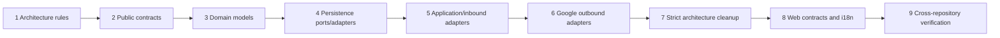

# Calendar Module Migration Implementation Plan

> **For agentic workers:** REQUIRED SUB-SKILL: Use `superpowers:executing-plans` to implement this plan task-by-task with a verification checkpoint after each task.

**Goal:** Migrate the Calendar module from legacy `application`, `entity`, `web`, and `infrastructure` packages to the canonical DDD + Hexagonal structure, while preserving API behavior and aligning the web calendar contracts.

**Architecture:** `api` contains stable public commands, queries, results, use cases, events, exceptions, and types. `application` coordinates workflows through outbound ports. `domain` contains framework-independent calendar behavior. `adapter.in` owns HTTP and event entry points, while `adapter.out` owns JPA, Google, and external integration implementations. The Gradle build remains governed by the existing CDD capability plugins.

**Tech Stack:** Java 21, Spring Boot, Spring Modulith, Spring Data JPA, ArchUnit, JUnit 5, Gradle, TypeScript, Vitest, Bun.

## Global Constraints

- Other modules may depend only on Calendar named interfaces and public events.
- Domain packages must not depend on Spring, JPA, HTTP, JSON, brokers, or cloud SDKs.
- Inbound adapters invoke application use-case contracts and never access repositories directly.
- Outbound adapters implement application-owned ports.
- Persistence entities and Google DTOs never cross the Calendar public API boundary.
- Public events use past-tense names and stable contract fields.
- Empty architectural layers are not created when a module has no responsibility for them.
- Existing HTTP routes and response shapes remain compatible unless a contract test documents the intentional change.
- Backend error responses expose stable machine-readable codes; translated user-facing text remains in `emme-web`.
- Every implementation task follows Red → Green → Refactor and ends with a logical commit.

---

## Existing files and target ownership

### Existing Calendar files

```text
modules/calendar/src/main/java/com/emme/calendar/
├── api/CalendarEventLinkInfo.java
├── api/CalendarSyncApi.java
├── api/TokenSource.java
├── application/CalendarService.java
├── application/CalendarSyncApiImpl.java
├── application/CalendarSyncListener.java
├── application/GoogleCalendarClient.java
├── entity/CalendarEventLink.java
├── entity/CalendarEventLinkRepository.java
├── entity/CalendarEventLinkStatus.java
├── entity/CalendarProvider.java
├── entity/CalendarSyncState.java
├── entity/CalendarSyncStateRepository.java
├── entity/CalendarSyncStatus.java
├── event/CalendarSyncRequested.java
├── infrastructure/google/application/ClientCalendarSyncService.java
├── infrastructure/google/application/GoogleOAuthService.java
├── infrastructure/google/application/SheetsExportService.java
├── infrastructure/google/application/StaffCalendarSyncService.java
├── infrastructure/google/config/GoogleOAuthConfig.java
├── infrastructure/google/entity/GoogleOAuthToken.java
├── infrastructure/google/entity/GoogleOAuthTokenRepository.java
├── infrastructure/google/entity/GoogleSpreadsheetLink.java
├── infrastructure/google/entity/GoogleSpreadsheetLinkRepository.java
├── infrastructure/google/entity/PersonaType.java
├── infrastructure/google/provider/GoogleSheetsClient.java
├── infrastructure/google/provider/OAuthTokenSource.java
├── infrastructure/google/provider/TokenEncryptionService.java
├── infrastructure/google/web/ClientCalendarController.java
├── infrastructure/google/web/GoogleOAuthController.java
├── infrastructure/google/web/SheetsController.java
└── web/CalendarController.java
```

### Canonical target ownership

```text
modules/calendar/src/main/java/com/emme/calendar/
├── api/
│   ├── result/CalendarEventLinkInfo.java
│   ├── usecase/CalendarSyncApi.java
│   ├── type/TokenSource.java
│   └── event/CalendarSyncRequested.java
├── application/
│   ├── service/CalendarService.java
│   ├── service/CalendarSyncListener.java
│   ├── service/CalendarSyncApiService.java
│   ├── port/out/CalendarEventLinkRepository.java
│   ├── port/out/CalendarSyncStateRepository.java
│   ├── port/out/GoogleCalendarPort.java
│   ├── port/out/GoogleOAuthPort.java
│   └── mapper/CalendarApplicationMapper.java
├── domain/
│   ├── model/CalendarEventLink.java
│   ├── model/CalendarSyncState.java
│   ├── model/CalendarEventLinkStatus.java
│   ├── model/CalendarProvider.java
│   └── model/CalendarSyncStatus.java
├── adapter/in/
│   ├── web/CalendarController.java
│   ├── web/ClientCalendarController.java
│   ├── web/GoogleOAuthController.java
│   ├── web/SheetsController.java
│   └── messaging/CalendarSyncListener.java
├── adapter/out/
│   ├── persistence/entity/
│   │   ├── CalendarEventLinkEntity.java
│   │   ├── CalendarSyncStateEntity.java
│   │   ├── GoogleOAuthTokenEntity.java
│   │   └── GoogleSpreadsheetLinkEntity.java
│   ├── persistence/repository/
│   │   ├── SpringDataCalendarEventLinkRepository.java
│   │   ├── SpringDataCalendarSyncStateRepository.java
│   │   ├── SpringDataGoogleOAuthTokenRepository.java
│   │   └── SpringDataGoogleSpreadsheetLinkRepository.java
│   ├── persistence/adapter/CalendarPersistenceAdapter.java
│   ├── persistence/mapper/CalendarPersistenceMapper.java
│   ├── google/client/GoogleCalendarClient.java
│   ├── google/client/GoogleSheetsClient.java
│   ├── google/client/GoogleOAuthClient.java
│   ├── google/adapter/GoogleCalendarAdapter.java
│   ├── google/adapter/GoogleOAuthAdapter.java
│   ├── google/adapter/GoogleSheetsAdapter.java
│   ├── google/config/GoogleOAuthConfig.java
│   ├── google/provider/OAuthTokenSource.java
│   └── google/provider/TokenEncryptionService.java
└── configuration/CalendarConfiguration.java
```

The target names are intentionally explicit. `CalendarSyncApi` remains the
public API contract for existing internal consumers; `CalendarSyncApiService`
is the application implementation. The existing public `CalendarEventLinkInfo`
record remains a result type, and `CalendarSyncRequested` moves to `api.event`
because it is consumed by Google synchronization adapters.

The exact entity and repository names above are the canonical names for new
code. Database table names and columns remain unchanged.

---

## Task 1: Add failing Calendar architecture rules

**Files:**

- Modify: `applications/studio-api/src/test/java/com/emme/LayerConventionTest.java`
- Modify: `applications/studio-api/src/test/java/com/emme/GoogleModuleArchTest.java`
- Create: `modules/calendar/src/test/java/com/emme/calendar/CalendarPackageConventionTest.java`

**Interfaces:**

- Consumes: current `com.emme.calendar` classes and Spring/ArchUnit metadata.
- Produces: executable rules that reject Calendar legacy package ownership after migration.

- [ ] **Step 1: Write the failing test**

Add this test to `CalendarPackageConventionTest.java` before moving production
classes:

```java
package com.emme.calendar;

import static org.assertj.core.api.Assertions.assertThat;

import com.tngtech.archunit.core.domain.JavaClass;
import com.tngtech.archunit.core.domain.JavaClasses;
import com.tngtech.archunit.core.importer.ClassFileImporter;
import com.tngtech.archunit.core.importer.ImportOption;
import java.util.Set;
import org.junit.jupiter.api.Test;

class CalendarPackageConventionTest {

  private static final JavaClasses CLASSES =
      new ClassFileImporter()
          .withImportOption(ImportOption.Predefined.DO_NOT_INCLUDE_TESTS)
          .importPackages("com.emme.calendar");

  @Test
  void calendarProductionTypesDoNotRemainInLegacyPackages() {
    Set<String> legacyPrefixes =
        Set.of(
            "com.emme.calendar.application",
            "com.emme.calendar.entity",
            "com.emme.calendar.event",
            "com.emme.calendar.infrastructure",
            "com.emme.calendar.web");

    assertThat(CLASSES.stream().map(JavaClass::getPackageName))
        .noneMatch(
            packageName ->
                legacyPrefixes.stream()
                    .anyMatch(
                        legacyPrefix ->
                            packageName.equals(legacyPrefix)
                                || packageName.startsWith(legacyPrefix + ".")));
  }
}
```

- [ ] **Step 2: Run test to verify it fails**

Run:

```bash
./gradlew :modules:calendar:test --tests com.emme.calendar.CalendarPackageConventionTest --no-daemon --no-configuration-cache
```

Expected: `FAIL` because the current Calendar classes still reside in
`application`, `entity`, `event`, `infrastructure`, and `web` packages.

- [ ] **Step 3: Write minimal implementation**

Do not weaken the rule. Add only the test source and update the shared
`LayerConventionTest` wording so the migration target is explicit while the
legacy allowance remains limited to modules not yet migrated.

- [ ] **Step 4: Run test to verify it passes**

Run the command from Step 2. Expected: the new test remains red until Task 2–6
move all Calendar production types. This is the intentional red checkpoint for
the migration slice.

- [ ] **Step 5: Commit**

```bash
git add applications/studio-api/src/test/java/com/emme/LayerConventionTest.java \
  applications/studio-api/src/test/java/com/emme/GoogleModuleArchTest.java \
  modules/calendar/src/test/java/com/emme/calendar/CalendarPackageConventionTest.java
git commit -m "test(calendar): enforce canonical package boundaries"
```

Do not push a branch with the complete test suite failing; the red test is a
local TDD checkpoint and the commit is completed after Task 6 makes it green.

---

## Task 2: Normalize Calendar public contracts and package metadata

**Files:**

- Create: `modules/calendar/src/main/java/com/emme/calendar/api/result/package-info.java`
- Create: `modules/calendar/src/main/java/com/emme/calendar/api/usecase/package-info.java`
- Create: `modules/calendar/src/main/java/com/emme/calendar/api/type/package-info.java`
- Move: `api/CalendarEventLinkInfo.java` → `api/result/CalendarEventLinkInfo.java`
- Move: `api/CalendarSyncApi.java` → `api/usecase/CalendarSyncApi.java`
- Move: `api/TokenSource.java` → `api/type/TokenSource.java`
- Move: `event/CalendarSyncRequested.java` → `api/event/CalendarSyncRequested.java`
- Modify: `api/package-info.java`
- Create: `api/event/package-info.java`
- Modify: `package-info.java`
- Modify: `modules/calendar/src/test/java/com/emme/calendar/module/CalendarModuleTest.java`
- Modify: `modules/calendar/src/test/java/com/emme/calendar/infrastructure/google/module/GoogleModuleTest.java`

**Interfaces:**

- Consumes: existing public Calendar types and Modulith named interfaces.
- Produces: `calendar-result`, `calendar-usecases`, `calendar-types`, and `calendar-events` named interfaces with unchanged public record/interface methods.

- [ ] **Step 1: Write the failing test**

Add a metadata test to `CalendarPackageConventionTest.java`:

```java
@Test
void publicContractsAreGroupedByKind() {
  assertThat(CLASSES.contains("com.emme.calendar.api.result.CalendarEventLinkInfo")).isTrue();
  assertThat(CLASSES.contains("com.emme.calendar.api.usecase.CalendarSyncApi")).isTrue();
  assertThat(CLASSES.contains("com.emme.calendar.api.type.TokenSource")).isTrue();
  assertThat(CLASSES.contains("com.emme.calendar.api.event.CalendarSyncRequested")).isTrue();
}
```

- [ ] **Step 2: Run test to verify it fails**

Run:

```bash
./gradlew :modules:calendar:test --tests com.emme.calendar.CalendarPackageConventionTest --no-daemon --no-configuration-cache
```

Expected: `FAIL` because the grouped API classes do not exist yet.

- [ ] **Step 3: Write minimal implementation**

Move the four source files, update package declarations and imports, and use
these package annotations:

```java
@org.springframework.modulith.NamedInterface("calendar-result")
package com.emme.calendar.api.result;
```

```java
@org.springframework.modulith.NamedInterface("calendar-usecases")
package com.emme.calendar.api.usecase;
```

```java
@org.springframework.modulith.NamedInterface("calendar-types")
package com.emme.calendar.api.type;
```

```java
@org.springframework.modulith.NamedInterface("calendar-events")
package com.emme.calendar.api.event;
```

Update `calendar/package-info.java` to allow only the named interfaces needed
by current consumers. Do not expose the whole `calendar.api` package as a
single catch-all contract.

- [ ] **Step 4: Run test to verify it passes**

Run:

```bash
./gradlew :modules:calendar:test --tests com.emme.calendar.CalendarPackageConventionTest --no-daemon --no-configuration-cache
```

Expected: `PASS` for public contract locations; compilation failures from old
imports are resolved in the next task.

- [ ] **Step 5: Commit**

```bash
git add modules/calendar/src/main/java modules/calendar/src/test/java
git commit -m "refactor(calendar): group public contracts by kind"
```

---

## Task 3: Extract Calendar domain models from JPA entities

**Files:**

- Create: `modules/calendar/src/main/java/com/emme/calendar/domain/model/CalendarEventLink.java`
- Create: `modules/calendar/src/main/java/com/emme/calendar/domain/model/CalendarSyncState.java`
- Move: `entity/CalendarEventLinkStatus.java` → `domain/model/CalendarEventLinkStatus.java`
- Move: `entity/CalendarProvider.java` → `domain/model/CalendarProvider.java`
- Move: `entity/CalendarSyncStatus.java` → `domain/model/CalendarSyncStatus.java`
- Create: `modules/calendar/src/main/java/com/emme/calendar/domain/model/package-info.java`
- Create: `modules/calendar/src/test/java/com/emme/calendar/domain/model/CalendarEventLinkTest.java`
- Create: `modules/calendar/src/test/java/com/emme/calendar/domain/model/CalendarSyncStateTest.java`

**Interfaces:**

- Consumes: `TenantOwnedEntity` behavior only through persistence mapping, not from domain classes.
- Produces: pure domain models with constructors and methods `markSynced()`, `markFailed()`, `markDeleted()`, and `markStale()`.

- [ ] **Step 1: Write the failing test**

Create tests for business transitions:

```java
class CalendarEventLinkTest {

  @Test
  void marksPendingLinkAsSynced() {
    CalendarEventLink link =
        CalendarEventLink.pending(UUID.randomUUID(), UUID.randomUUID(), CalendarProvider.GOOGLE_CALENDAR, "event-1");

    link.markSynced();

    assertThat(link.status()).isEqualTo(CalendarEventLinkStatus.SYNCED);
  }

  @Test
  void rejectsSyncingAnAlreadySyncedLink() {
    CalendarEventLink link =
        CalendarEventLink.pending(UUID.randomUUID(), UUID.randomUUID(), CalendarProvider.GOOGLE_CALENDAR, "event-1");
    link.markSynced();

    assertThatThrownBy(link::markSynced)
        .isInstanceOf(IllegalStateException.class)
        .hasMessageContaining("Cannot mark synced");
  }
}
```

```java
class CalendarSyncStateTest {

  @Test
  void doesNotMarkFailedStateAsStale() {
    CalendarSyncState state = CalendarSyncState.active(UUID.randomUUID(), CalendarProvider.GOOGLE_CALENDAR);
    state.markFailed();

    assertThatThrownBy(state::markStale)
        .isInstanceOf(IllegalStateException.class)
        .hasMessageContaining("Cannot mark failed sync as stale");
  }
}
```

- [ ] **Step 2: Run test to verify it fails**

Run:

```bash
./gradlew :modules:calendar:test --tests 'com.emme.calendar.domain.model.*' --no-daemon --no-configuration-cache
```

Expected: `FAIL` because the pure domain model types do not exist.

- [ ] **Step 3: Write minimal implementation**

Implement immutable identity fields and controlled state transitions in the
domain models. The domain source must contain no `jakarta.persistence`,
`org.springframework`, `TenantOwnedEntity`, logging, or JSON imports.

Move the three enums into `domain.model`. Keep the existing enum constants and
database string values unchanged.

- [ ] **Step 4: Run test to verify it passes**

Run the command from Step 2 and then:

```bash
./gradlew :applications:studio-api:test --tests com.emme.LayerConventionTest --no-daemon --no-configuration-cache
```

Expected: domain transition tests pass and the framework-dependency rule passes
for the new domain package.

- [ ] **Step 5: Commit**

```bash
git add modules/calendar/src/main/java/com/emme/calendar/domain modules/calendar/src/test/java/com/emme/calendar/domain
git commit -m "refactor(calendar): extract pure domain models"
```

---

## Task 4: Move Calendar persistence behind outbound ports and adapters

**Files:**

- Move: `entity/CalendarEventLink.java` → `adapter/out/persistence/entity/CalendarEventLinkEntity.java`
- Move: `entity/CalendarSyncState.java` → `adapter/out/persistence/entity/CalendarSyncStateEntity.java`
- Move: `entity/CalendarEventLinkRepository.java` → `adapter/out/persistence/repository/SpringDataCalendarEventLinkRepository.java`
- Move: `entity/CalendarSyncStateRepository.java` → `adapter/out/persistence/repository/SpringDataCalendarSyncStateRepository.java`
- Create: `application/port/out/CalendarEventLinkRepository.java`
- Create: `application/port/out/CalendarSyncStateRepository.java`
- Create: `adapter/out/persistence/mapper/CalendarPersistenceMapper.java`
- Create: `adapter/out/persistence/adapter/CalendarPersistenceAdapter.java`
- Create: `adapter/out/persistence/entity/package-info.java`
- Create: `adapter/out/persistence/repository/package-info.java`
- Create: `adapter/out/persistence/mapper/package-info.java`
- Create: `adapter/out/persistence/adapter/package-info.java`
- Create: `application/port/out/package-info.java`
- Create: `modules/calendar/src/test/java/com/emme/calendar/adapter/out/persistence/CalendarPersistenceAdapterTest.java`

**Interfaces:**

- Consumes: domain `CalendarEventLink` and `CalendarSyncState`.
- Produces: application-owned repository ports returning domain models; Spring Data repositories returning entities only; `CalendarPersistenceAdapter` implementing both ports.

- [ ] **Step 1: Write the failing test**

Create a unit test that uses an in-memory fake Spring Data repository and asserts
domain/entity mapping without exposing entities to the application port:

```java
class CalendarPersistenceAdapterTest {

  @Test
  void savesDomainLinkAndReturnsMappedDomainLink() {
    InMemorySpringDataCalendarEventLinkRepository springRepository =
        new InMemorySpringDataCalendarEventLinkRepository();
    InMemorySpringDataCalendarSyncStateRepository syncStateRepository =
        new InMemorySpringDataCalendarSyncStateRepository();
    CalendarPersistenceMapper mapper = new CalendarPersistenceMapper();
    CalendarPersistenceAdapter adapter =
        new CalendarPersistenceAdapter(springRepository, syncStateRepository, mapper);
    UUID tenantId = UUID.randomUUID();
    UUID appointmentId = UUID.randomUUID();
    CalendarEventLink link = CalendarEventLink.pending(
        tenantId, appointmentId, CalendarProvider.GOOGLE_CALENDAR, "event-1");

    CalendarEventLink saved = adapter.save(link);

    assertThat(saved.appointmentId()).isEqualTo(link.appointmentId());
    assertThat(saved.externalEventId()).isEqualTo("event-1");
  }
}
```

The test double must implement the port or repository interface used by the
adapter and must not be imported by production code.

- [ ] **Step 2: Run test to verify it fails**

Run:

```bash
./gradlew :modules:calendar:test --tests com.emme.calendar.adapter.out.persistence.CalendarPersistenceAdapterTest --no-daemon --no-configuration-cache
```

Expected: `FAIL` because ports, entities, mapper, and adapter do not exist.

- [ ] **Step 3: Write minimal implementation**

Create repository ports with these signatures:

```java
public interface CalendarEventLinkRepository {
  List<CalendarEventLink> findByAppointmentId(UUID appointmentId);
  Optional<CalendarEventLink> findByTenantIdAndAppointmentId(UUID tenantId, UUID appointmentId);
  CalendarEventLink save(CalendarEventLink link);
}
```

```java
public interface CalendarSyncStateRepository {
  Optional<CalendarSyncState> findByTenantIdAndProvider(UUID tenantId, CalendarProvider provider);
  CalendarSyncState save(CalendarSyncState state);
}
```

Use explicit mappers between pure domain objects and JPA entities. Preserve
table names, columns, tenant IDs, enum string values, and optimistic/version
fields inherited from the shared persistence base.

- [ ] **Step 4: Run test to verify it passes**

Run:

```bash
./gradlew :modules:calendar:test --tests com.emme.calendar.adapter.out.persistence.CalendarPersistenceAdapterTest --no-daemon --no-configuration-cache
./gradlew :applications:studio-api:test --tests com.emme.LayerConventionTest --no-daemon --no-configuration-cache
```

Expected: adapter mapping and persistence package rules pass; no application
class imports a Spring Data repository.

- [ ] **Step 5: Commit**

```bash
git add modules/calendar/src/main/java modules/calendar/src/test/java
git commit -m "refactor(calendar): isolate persistence behind outbound ports"
```

---

## Task 5: Move Calendar application services and inbound adapters

**Files:**

- Move: `application/CalendarService.java` → `application/service/CalendarService.java`
- Move: `application/CalendarSyncApiImpl.java` → `application/service/CalendarSyncApiService.java`
- Move: `application/CalendarSyncListener.java` → `adapter/in/messaging/CalendarSyncListener.java`
- Move: `web/CalendarController.java` → `adapter/in/web/CalendarController.java`
- Create: `application/mapper/CalendarApplicationMapper.java`
- Create: `application/service/package-info.java`
- Create: `application/mapper/package-info.java`
- Create: `adapter/in/web/package-info.java`
- Create: `adapter/in/messaging/package-info.java`
- Modify: `api/result/CalendarEventLinkInfo.java`
- Modify: `api/usecase/CalendarSyncApi.java`
- Modify: `modules/calendar/src/test/java/com/emme/calendar/module/CalendarModuleTest.java`
- Modify: `modules/calendar/src/integrationTest/java/com/emme/calendar/GoogleCalendarClientLiveTest.java`

**Interfaces:**

- Consumes: public Calendar API, domain models, outbound repository/Google ports.
- Produces: `CalendarService` as the application workflow for busy-time queries; `CalendarSyncApiService` implementing `CalendarSyncApi`; HTTP controller depending on application use-case/service contracts only.

- [ ] **Step 1: Write the failing test**

Add an application test that verifies the service delegates through ports and
returns API results rather than persistence entities:

```java
@Test
void findsEventLinksThroughTheOutboundPort() {
  UUID tenantId = UUID.randomUUID();
  UUID appointmentId = UUID.randomUUID();
  CalendarEventLink link = CalendarEventLink.pending(
      tenantId, appointmentId, CalendarProvider.GOOGLE_CALENDAR, "event-1");
  FakeCalendarEventLinkRepository repositoryPort = new FakeCalendarEventLinkRepository(List.of(link));
  CalendarSyncApiService service = new CalendarSyncApiService(repositoryPort);

  assertThat(service.findByAppointmentId(appointmentId))
      .extracting(CalendarEventLinkInfo::externalEventId)
      .containsExactly("event-1");
}
```

Add an ArchUnit rule that controllers must not depend on `..adapter.out..`,
`..entity..`, or `org.springframework.data..`.

- [ ] **Step 2: Run test to verify it fails**

Run:

```bash
./gradlew :modules:calendar:test --tests 'com.emme.calendar..*' --no-daemon --no-configuration-cache
./gradlew :applications:studio-api:test --tests com.emme.LayerConventionTest --no-daemon --no-configuration-cache
```

Expected: `FAIL` because services and controllers still reference legacy entity
and application packages.

- [ ] **Step 3: Write minimal implementation**

Move services and update imports. Keep transaction boundaries in application
services. Keep request validation and HTTP status mapping in the controller.
The controller may call `CalendarService` and `CalendarSyncApi`, but it must not
load a repository or construct a Google client.

Replace the nested `CalendarService.TimeRange` transport leak with a result
type under `api.result` and map that result to the existing HTTP response shape
inside `CalendarController`.

- [ ] **Step 4: Run test to verify it passes**

Run:

```bash
./gradlew :modules:calendar:test --tests 'com.emme.calendar..*' --no-daemon --no-configuration-cache
./gradlew :modules:calendar:integrationTest --no-daemon --no-configuration-cache
```

Expected: Calendar unit and integration tests pass with unchanged endpoint
behavior for `/api/v1/calendar/busy` and `/api/v1/calendar/sync`.

- [ ] **Step 5: Commit**

```bash
git add modules/calendar/src/main/java modules/calendar/src/test/java modules/calendar/src/integrationTest/java
git commit -m "refactor(calendar): separate application and inbound adapters"
```

---

## Task 6: Move Google integration into outbound adapters

**Files:**

- Move: `infrastructure/google/application/ClientCalendarSyncService.java` → `adapter/out/google/adapter/ClientCalendarSyncAdapter.java`
- Move: `infrastructure/google/application/GoogleOAuthService.java` → `adapter/out/google/adapter/GoogleOAuthAdapter.java`
- Move: `infrastructure/google/application/SheetsExportService.java` → `adapter/out/google/adapter/GoogleSheetsAdapter.java`
- Move: `infrastructure/google/application/StaffCalendarSyncService.java` → `adapter/out/google/adapter/StaffCalendarSyncAdapter.java`
- Move: `application/GoogleCalendarClient.java` → `adapter/out/google/client/GoogleCalendarClient.java`
- Move: `infrastructure/google/provider/GoogleSheetsClient.java` → `adapter/out/google/client/GoogleSheetsClient.java`
- Move: `infrastructure/google/provider/OAuthTokenSource.java` → `adapter/out/google/provider/OAuthTokenSource.java`
- Move: `infrastructure/google/provider/TokenEncryptionService.java` → `adapter/out/google/provider/TokenEncryptionService.java`
- Move: `infrastructure/google/config/GoogleOAuthConfig.java` → `configuration/GoogleOAuthConfig.java`
- Move: `infrastructure/google/entity/GoogleOAuthToken.java` → `adapter/out/persistence/entity/GoogleOAuthTokenEntity.java`
- Move: `infrastructure/google/entity/GoogleOAuthTokenRepository.java` → `adapter/out/persistence/repository/SpringDataGoogleOAuthTokenRepository.java`
- Move: `infrastructure/google/entity/GoogleSpreadsheetLink.java` → `adapter/out/persistence/entity/GoogleSpreadsheetLinkEntity.java`
- Move: `infrastructure/google/entity/GoogleSpreadsheetLinkRepository.java` → `adapter/out/persistence/repository/SpringDataGoogleSpreadsheetLinkRepository.java`
- Move: `infrastructure/google/entity/PersonaType.java` → `adapter/out/google/model/PersonaType.java`
- Move: `infrastructure/google/web/ClientCalendarController.java` → `adapter/in/web/ClientCalendarController.java`
- Move: `infrastructure/google/web/GoogleOAuthController.java` → `adapter/in/web/GoogleOAuthController.java`
- Move: `infrastructure/google/web/SheetsController.java` → `adapter/in/web/SheetsController.java`
- Create: `application/port/out/GoogleCalendarPort.java`
- Create: `application/port/out/GoogleOAuthPort.java`
- Create: `application/port/out/GoogleSheetsPort.java`
- Create: `adapter/out/google/package-info.java`
- Create: `adapter/out/google/client/package-info.java`
- Create: `adapter/out/google/adapter/package-info.java`
- Create: `adapter/out/google/provider/package-info.java`
- Create: `adapter/out/google/model/package-info.java`
- Modify: `applications/studio-api/src/test/java/com/emme/GoogleModuleArchTest.java`
- Modify: `modules/calendar/src/test/java/com/emme/calendar/infrastructure/google/module/GoogleModuleTest.java`
- Move tests under: `modules/calendar/src/test/java/com/emme/calendar/adapter/out/google/`

**Interfaces:**

- Consumes: Google configuration, Calendar public events, application outbound ports, and persistence adapters.
- Produces: technology-specific adapters that can be replaced by fakes in application tests.

- [ ] **Step 1: Write the failing test**

Add a Google package rule:

```java
@Test
void googleImplementationsAreOutboundAdapters() {
  classes()
      .that()
      .resideInAnyPackage("com.emme.calendar.adapter.out.google..")
      .should()
      .notDependOnClassesThat()
      .resideInAnyPackage("com.emme.calendar.domain..")
      .check(CLASSES);
}
```

Add focused tests for token encryption and OAuth status under their target
package. Preserve existing tests for no-token status, unauthorized access, and
Google redirect behavior.

- [ ] **Step 2: Run test to verify it fails**

Run:

```bash
./gradlew :modules:calendar:test --tests 'com.emme.calendar.adapter.out.google..*' --no-daemon --no-configuration-cache
```

Expected: `FAIL` because the target packages and port abstractions do not yet
exist.

- [ ] **Step 3: Write minimal implementation**

Move Google classes and update package declarations. Separate transport clients
from application adapters:

- `GoogleCalendarClient` performs Google HTTP requests only.
- `GoogleCalendarAdapter` implements `GoogleCalendarPort`.
- `GoogleOAuthClient` performs OAuth HTTP requests only.
- `GoogleOAuthAdapter` implements `GoogleOAuthPort`.
- `GoogleSheetsClient` performs Sheets HTTP requests only.
- `GoogleSheetsAdapter` implements `GoogleSheetsPort`.

Keep tenant and user context at the adapter boundary. Do not put Google SDK or
HTTP types in `domain` or `application.port.out`.

- [ ] **Step 4: Run test to verify it passes**

Run:

```bash
./gradlew :modules:calendar:test --tests 'com.emme.calendar..*' --no-daemon --no-configuration-cache
./gradlew :modules:calendar:integrationTest --no-daemon --no-configuration-cache
./gradlew :applications:studio-api:test --tests com.emme.GoogleModuleArchTest --no-daemon --no-configuration-cache
```

Expected: Google focused tests, Calendar integration tests, and one-way Google
adapter rules pass.

- [ ] **Step 5: Commit**

```bash
git add modules/calendar applications/studio-api/src/test/java/com/emme/GoogleModuleArchTest.java
git commit -m "refactor(calendar): isolate Google integrations as adapters"
```

---

## Task 7: Add Calendar configuration and remove legacy package allowances

**Files:**

- Create: `modules/calendar/src/main/java/com/emme/calendar/configuration/CalendarConfiguration.java`
- Create: `modules/calendar/src/main/java/com/emme/calendar/configuration/package-info.java`
- Modify: `modules/calendar/src/main/java/com/emme/calendar/package-info.java`
- Modify: `applications/studio-api/src/test/java/com/emme/LayerConventionTest.java`
- Modify: `applications/studio-api/src/test/java/com/emme/GoogleModuleArchTest.java`
- Delete: `modules/calendar/src/main/java/com/emme/calendar/infrastructure/google/package-info.java`
- Delete: `modules/calendar/src/main/java/com/emme/calendar/infrastructure/google/client/package-info.java`
- Delete: `modules/calendar/src/main/java/com/emme/calendar/event/package-info.java`

**Interfaces:**

- Consumes: all migrated Calendar beans and named interfaces.
- Produces: explicit Calendar bean wiring and strict architecture rules with no Calendar-specific legacy exceptions.

- [ ] **Step 1: Write the failing test**

Update the architecture test to require all Calendar persistence types under
`adapter.out.persistence` and all controllers under `adapter.in`:

```java
@Test
void migratedCalendarTypesUseCanonicalPackages() {
  classes()
      .that()
      .areAnnotatedWith(jakarta.persistence.Entity.class)
      .and()
      .resideInAPackage("com.emme.calendar..")
      .should()
      .resideInAnyPackage("com.emme.calendar.adapter.out.persistence.entity..")
      .check(CLASSES);
}
```

- [ ] **Step 2: Run test to verify it fails**

Run:

```bash
./gradlew :applications:studio-api:test --tests com.emme.LayerConventionTest --no-daemon --no-configuration-cache
```

Expected: `FAIL` until all Calendar entities, repositories, controllers, and
configuration classes use the canonical packages.

- [ ] **Step 3: Write minimal implementation**

Create `CalendarConfiguration` only for bean registration and configuration
properties. Keep business behavior in application services and adapter behavior
in adapters. Remove Calendar from the legacy allowance in shared architecture
tests after all classes have moved.

- [ ] **Step 4: Run test to verify it passes**

Run:

```bash
./gradlew :applications:studio-api:test --tests com.emme.LayerConventionTest --tests com.emme.GoogleModuleArchTest --no-daemon --no-configuration-cache
```

Expected: `PASS` with no Calendar legacy package exceptions.

- [ ] **Step 5: Commit**

```bash
git add applications/studio-api/src/test/java/com/emme modules/calendar/src/main/java/com/emme/calendar
git commit -m "test(calendar): remove legacy package allowances"
```

---

## Task 8: Align service error contracts and web Calendar APIs

**Files:**

- Modify: `packages/contracts/src/calendar-sync.ts`
- Modify: `packages/contracts/src/google-oauth.ts`
- Modify: `packages/contracts/src/google-sheets.ts`
- Modify: `packages/api-client/src/errors.ts`
- Modify: `packages/api-client/src/client.ts`
- Modify: `packages/api-client/src/client.test.ts`
- Modify: `apps/emme-salon-app/src/api/restClient.ts`
- Modify: `apps/emme-salon-app/src/features/google-workspace/hooks/useCalendarSync.ts`
- Modify: `apps/emme-salon-app/src/features/google-workspace/hooks/useGoogleOAuth.ts`
- Modify: `apps/emme-salon-app/src/features/google-workspace/hooks/useSheetsExport.ts`
- Modify: `apps/emme-salon-app/src/locales/en-US/common.json`
- Modify: `apps/emme-salon-app/src/locales/es-MX/common.json`
- Create: `packages/contracts/src/calendar-sync.test.ts`
- Create: `packages/contracts/src/google-oauth.test.ts`
- Create: `packages/contracts/src/google-sheets.test.ts`

**Interfaces:**

- Consumes: existing Calendar and Google HTTP routes and backend problem details.
- Produces: typed `ApiProblem` error codes and contract factories that remain independent of React and translated copy.

- [ ] **Step 1: Write the failing test**

Add the stable problem contract:

```ts
export interface ApiProblem {
  type?: string;
  title?: string;
  status?: number;
  detail?: string;
  code?: string;
  instance?: string;
}
```

Add a test proving the client preserves `code` from an RFC 9457-style response:

```ts
it("preserves a backend problem code for localized UI mapping", async () => {
  const fetcher = vi.fn<Fetcher>(async () =>
    new Response(JSON.stringify({ status: 409, code: "CALENDAR_SYNC_CONFLICT" }), {
      status: 409,
      headers: { "Content-Type": "application/problem+json" },
    }),
  );

  const client = createApiClient({ baseUrl: "https://api.emme.app", fetcher });

  await expect(client.getHealth()).rejects.toMatchObject({
    status: 409,
    code: "CALENDAR_SYNC_CONFLICT",
  });
});
```

- [ ] **Step 2: Run test to verify it fails**

Run from `emme-web`:

```bash
bun run vitest run packages/api-client/src/client.test.ts packages/contracts/src/calendar-sync.test.ts
```

Expected: `FAIL` because `ApiHttpError` does not expose a typed problem code.

- [ ] **Step 3: Write minimal implementation**

Extend `ApiHttpError` with `code: string | undefined` derived only from a
structured problem body. Keep the original `body` for compatibility. Update
the Calendar hooks to map known codes to translation keys and use localized
fallback messages rather than hardcoded toast text. Keep the route constants and
successful response shapes unchanged.

Add matching translation keys to both locale catalogs and keep their leaf-key
sets identical.

- [ ] **Step 4: Run test to verify it passes**

Run from `emme-web`:

```bash
bun run vitest run packages/api-client/src/client.test.ts packages/contracts/src/calendar-sync.test.ts apps/emme-salon-app/src/app/locale.test.ts
bun run quality
```

Expected: API client, contract, locale, typecheck, lint, i18n, and production
quality gates pass.

- [ ] **Step 5: Commit**

```bash
git add packages/api-client packages/contracts apps/emme-salon-app/src/features/google-workspace apps/emme-salon-app/src/locales
git commit -m "feat(web): map calendar problem codes to localized messages"
```

Push this commit to the web repository's `feat/architecture-docs-separation`
branch after the service contract tests in Task 9 pass.

---

## Task 9: Run full cross-repository verification and update migration evidence

**Files:**

- Modify: `tasks/todo.md` in `emme-service`
- Modify: `tasks/lessons.md` in `emme-service` only if a new failure mode is discovered
- Modify: `docs/architecture/05-operations/service-architecture-migration.md`
- Modify: `docs/architecture/03-integration/frontend-backend.md` in `emme-web`

**Interfaces:**

- Consumes: all migrated Calendar service/web changes and repository quality gates.
- Produces: auditable evidence that the Calendar vertical slice is complete and ready for the next module plan.

- [ ] **Step 1: Write the failing test**

Add the Calendar completion checklist to `tasks/todo.md` with unchecked gates:

```markdown
- [ ] Calendar canonical package migration complete
- [ ] Calendar domain has no framework imports
- [ ] Calendar named interfaces expose only grouped API packages
- [ ] Calendar persistence entities are not imported outside Calendar adapters
- [ ] Calendar service tests and integration tests pass
- [ ] Web Calendar contracts preserve stable routes and error codes
- [ ] Web quality gate passes
```

- [ ] **Step 2: Run test to verify it fails**

Run the complete gates before marking the checklist:

```bash
./gradlew :modules:calendar:test :modules:calendar:integrationTest \
  :applications:studio-api:test --tests com.emme.ModularityTest \
  --tests com.emme.LayerConventionTest --tests com.emme.GoogleModuleArchTest \
  --no-daemon --no-configuration-cache
```

Run from `emme-web`:

```bash
bun run quality
```

Expected: every command exits non-zero until the migration and web alignment
are complete.

- [ ] **Step 3: Write minimal implementation**

Update the checklist only after the commands pass. Add the final Calendar
package tree and the stable web error-code mapping to the integration
architecture document. Record any new failure mode in `tasks/lessons.md` with
its detection signal and prevention rule.

- [ ] **Step 4: Run test to verify it passes**

Run the commands from Step 2 again, then verify both feature branches:

```bash
git status --short --branch
git log --oneline origin/feat/architecture-docs-separation -1
```

Expected: clean worktrees, green local gates, and remote refs containing the
final commits.

- [ ] **Step 5: Commit**

Service repository:

```bash
git add tasks/todo.md tasks/lessons.md docs/architecture/05-operations/service-architecture-migration.md
git commit -m "docs(calendar): record migration verification"
git push origin feat/architecture-docs-separation
```

Web repository:

```bash
git add docs/architecture/03-integration/frontend-backend.md
git commit -m "docs(web): record calendar contract alignment"
git push origin feat/architecture-docs-separation
```

---

## Task dependencies



Tasks 2–7 are service-only. Task 8 is web-only unless a service error contract
must be adjusted. Task 9 updates evidence in both repositories.

## Definition of done

- [ ] Calendar no longer contains production classes in `application`, `entity`, `event`, `infrastructure`, or `web`.
- [ ] Calendar public types are grouped by API kind and exposed through named interfaces.
- [ ] Calendar domain models are framework-independent and tested in isolation.
- [ ] Calendar persistence and Google integrations are outbound adapters behind application ports.
- [ ] Controllers and listeners are inbound adapters and do not access persistence directly.
- [ ] Existing Calendar and Google endpoint tests pass without route regressions.
- [ ] Service Modulith, ArchUnit, unit, integration, quality, and infrastructure gates pass.
- [ ] Web API client preserves machine-readable backend problem codes.
- [ ] Web Calendar/Google messages are localized in every supported locale.
- [ ] Both repositories are clean, committed, pushed, and independently verifiable.

## Follow-up plans

After this plan is complete, create separate plans for:

1. contract-only `customer`, `workforce`, and `booking` module normalization;
2. `studio`, `assistant`, and `notification` workflow migration;
3. `payment`, `audit`, and `shared` integration migration;
4. final service-wide legacy package removal and strict architecture enforcement.
