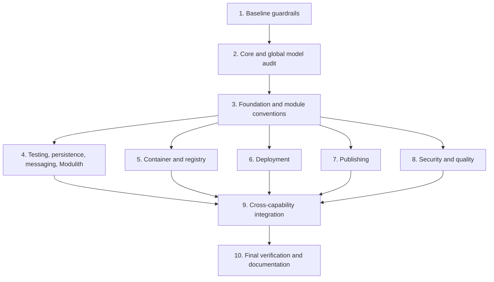

# Build-Logic CDD Migration Implementation Plan

> **For agentic workers:** REQUIRED SUB-SKILL: Use `superpowers:subagent-driven-development` or `superpowers:executing-plans` to implement this plan task-by-task. Steps use checkbox syntax and must be updated as work proceeds.

**Goal:** Normalize every `build-logic` convention plugin, binary plugin, capability implementation, provider, task, model, test, and verification gate into the approved Capability-Driven Design architecture.

**Architecture:** Keep precompiled convention scripts as the declarative public API. Move complex behavior into capability-owned binary plugins, managed extensions, lazy tasks, and provider/build-service adapters. Preserve public plugin IDs and registered Gradle task names while renaming internal Kotlin types and packages to the normalized capability vocabulary.

**Tech Stack:** Gradle 9.4.1, Kotlin DSL, Kotlin/JVM, Java 25 toolchain, Gradle Build Services, Gradle Provider API, Gradle TestKit, JUnit Jupiter, Spotless, Detekt, Checkstyle, version catalogs.

## Global Constraints

- `build-logic` remains an included build.
- Public convention IDs remain stable: `emme.java-base`, `emme.java-library`, `emme.spring-module`, `emme.spring-application`, `emme.spring-web`, `emme.persistence`, `emme.messaging`, `emme.modulith`, `emme.testing`, `emme.integration-testing`, `emme.test-fixtures`, `emme.quality`, `emme.api-compat`, `emme.feature-flags`, `emme.container`, `emme.publishing`, `emme.deployment`, `emme.security`.
- Registered task names remain stable: `containerBuild`, `containerPush`, `containerVerify`, `containerMultiArch`, `deployUp`, `deployDown`, `deployApply`, `deployStatus`, `deployLogs`, `publishBuildInfo`, `publishManifest`, `publishVerifyVersion`, `publishSign`, `publishSbom`, `securityScan`.
- All implementation code uses lazy Gradle properties/providers and execution-time external work.
- No compatibility wrappers are added for unreleased internal Kotlin classes or packages.
- Every implementation task follows Red → Green → Refactor and commits one logical capability slice.
- Every phase ends with `./gradlew :build-logic:check` plus the affected TestKit tests.

## Baseline and target file map

| Current area | Target ownership | Main change |
|---|---|---|
| `src/main/kotlin/emme.*.gradle.kts` | Convention API | Keep IDs/files; reduce to declarative composition |
| `core/` | Shared build primitives | Remove capability-specific code and centralize only cross-capability constants/helpers |
| `model/` | Global build vocabulary | Keep only repository-wide concepts; move capability models locally |
| `root/` | Repository coordination | Keep aggregate lifecycle and metadata only |
| `container/` | Container capability | Own runtime model, extension, tasks, provider port/adapters, results |
| `deployment/` | Deployment capability | Own target model, extension, tasks, provider port/adapters, results |
| `publishing/` | Publishing capability | Own release model, extension, tasks, publisher port/adapters, results |
| `security/` | Security capability | Own scanner model, extension, scan task, scanner port/adapters, results |
| `registry/` | Shared delivery boundary | Own registry target/port/result used by container and publishing |
| `quality/` | Quality capability | Own quality extension and quality task wiring |
| `git/` | Metadata capability support | Own lazy Git `ValueSource`s |
| `src/test/kotlin` | Unit verification | Add model, selector, provider, task, and registration tests |
| `src/functionalTest/kotlin` | Real Gradle verification | Add TestKit coverage for every binary plugin and convention family |

## Task dependency graph

### Task 1: Establish source and architecture guardrails

**Files:**
- Create: `build-logic/src/test/kotlin/com/emme/buildlogic/ArchitectureInventoryTest.kt`
- Create: `build-logic/src/test/kotlin/com/emme/buildlogic/PluginIdContractTest.kt`
- Modify: `build-logic/src/test/kotlin/com/emme/buildlogic/PluginRegistrationTest.kt`
- Modify: `build-logic/build.gradle.kts`
- Modify: `tasks/todo.md`

**Interfaces:**
- Consumes: current plugin IDs from `build-logic/src/main/kotlin/emme.*.gradle.kts` and binary registrations in `build-logic/build.gradle.kts`.
- Produces: failing tests that detect moved files without capability ownership, missing public IDs, and missing stable task-name contracts.

- [x] **Step 1: Write inventory and ID tests.** Assert that every current convention script exists and every binary plugin registration retains its implementation class.
- [x] **Step 2: Run the focused tests.** `ArchitectureInventoryTest` and `PluginIdContractTest` pass against the current included build.
- [x] **Step 3: Implement the smallest guardrail.** The tests use repository-relative source paths and explicit contracts; no reflection or global scanner was introduced.
- [x] **Step 4: Run the focused tests again.** Green.
- [x] **Step 5: Commit.** Included in the first build-logic CDD normalization commit.

## Completed build-task naming slice — 2026-08-02

- [x] Renamed publishing task implementation types to the normalized
  `*Task` convention: `GenerateBuildInfoTask`, `GenerateReleaseManifestTask`,
  and `VerifyReleaseVersionTask`.
- [x] Renamed the unreleased registered task IDs to
  `publishBuildInfo` and `publishVerifyVersion`; `publishManifest`,
  `publishSign`, and `publishSbom` remain explicit and stable.
- [x] Added inventory and plugin-ID contract tests.
- [x] Verified `:build-logic:check`, including Spotless, Detekt, unit tests,
  functional tests, and plugin validation.

The remaining build-logic plan continues with capability ownership, lazy
provider/task input verification, configuration-cache coverage, and complete
TestKit coverage for each plugin family. No compatibility aliases are added for
the old unreleased task names.

### Task 2: Audit `core`, `model`, `root`, and dependency access

**Files:**
- Modify: `build-logic/src/main/kotlin/com/emme/buildlogic/core/DependencyConfiguration.kt`
- Modify: `build-logic/src/main/kotlin/com/emme/buildlogic/core/JavaConfiguration.kt`
- Modify: `build-logic/src/main/kotlin/com/emme/buildlogic/core/PluginIds.kt`
- Modify: `build-logic/src/main/kotlin/com/emme/buildlogic/core/ProviderRegistry.kt`
- Modify: `build-logic/src/main/kotlin/com/emme/buildlogic/core/TaskNames.kt`
- Modify: `build-logic/src/main/kotlin/com/emme/buildlogic/core/TestConfiguration.kt`
- Modify: `build-logic/src/main/kotlin/com/emme/buildlogic/core/dependency/EmmeDependencies.kt`
- Modify: `build-logic/src/main/kotlin/com/emme/buildlogic/model/EmmeModuleType.kt`
- Modify: `build-logic/src/main/kotlin/com/emme/buildlogic/model/ReleaseChannel.kt`
- Modify: `build-logic/src/main/kotlin/com/emme/buildlogic/root/EmmeBuildExtension.kt`
- Modify: `build-logic/src/main/kotlin/com/emme/buildlogic/root/EmmeRootPlugin.kt`
- Test: `build-logic/src/test/kotlin/com/emme/buildlogic/ModelEnumTest.kt`
- Test: `build-logic/src/test/kotlin/com/emme/buildlogic/ProviderRegistrationTest.kt`

**Interfaces:**
- Consumes: the guardrail contract from Task 1.
- Produces: a small shared core, typed global models, and a root plugin that owns repository coordination but no delivery implementation.

- [x] **Step 1: Write failing ownership tests.** Assert that `core` contains only approved shared names, `model` contains only global concepts, and root code does not import container/deployment/publishing/security implementations.
- [x] **Step 2: Run the tests to verify red.** The new root ownership guard failed while `EmmeBuildExtension` still exposed the container extension.
- [x] **Step 3: Move or split implementation.** Removed the root-owned container extension; capability plugins now own their extensions and configuration.
- [x] **Step 4: Remove eager shared-service casts where possible.** Keep `ProviderRegistry` generic over `BuildService<BuildServiceParameters>` and preserve explicit parameter types for each capability.
- [x] **Step 5: Run unit and build-logic checks.** `:build-logic:check` passed after the root ownership slice.
- [x] **Step 6: Commit.** The core/model/root slice is included in the pushed build-logic normalization commits.

### Task 3: Normalize foundation and module-type conventions

**Files:**
- Modify: `build-logic/src/main/kotlin/emme.java-base.gradle.kts`
- Modify: `build-logic/src/main/kotlin/emme.java-library.gradle.kts`
- Modify: `build-logic/src/main/kotlin/emme.spring-module.gradle.kts`
- Modify: `build-logic/src/main/kotlin/emme.spring-application.gradle.kts`
- Modify: `build-logic/src/main/kotlin/emme.spring-web.gradle.kts`
- Modify: `build-logic/src/functionalTest/kotlin/com/emme/buildlogic/JavaBaseConventionFunctionalTest.kt`
- Modify: `build-logic/src/functionalTest/kotlin/com/emme/buildlogic/SpringModuleConventionFunctionalTest.kt`
- Modify: `build-logic/src/functionalTest/kotlin/com/emme/buildlogic/SpringApplicationConventionFunctionalTest.kt`
- Create: `build-logic/src/functionalTest/kotlin/com/emme/buildlogic/JavaLibraryConventionFunctionalTest.kt`
- Create: `build-logic/src/functionalTest/kotlin/com/emme/buildlogic/SpringWebConventionFunctionalTest.kt`

**Interfaces:**
- Consumes: shared `EmmeDependencies`, `JavaConfiguration`, and module-type models from Task 2.
- Produces: declarative convention scripts whose behavior is verified by real temporary Gradle projects.

- [x] **Step 1: Add failing TestKit assertions.** Existing Java/Spring tests plus the capability composition suite verify Java library, Spring Web, toolchain, and task registration contracts.
- [x] **Step 2: Run focused TestKit tests.** The focused Java/Spring and capability suites pass after fixture projects were made explicit.
- [x] **Step 3: Refactor scripts to composition only.** Dependency declarations use `EmmeDependencies`; task registration and custom behavior are delegated to capability plugins; no raw command execution remains in these scripts.
- [x] **Step 4: Run focused TestKit tests again.** Expected green and stable task outcomes.
- [x] **Step 5: Commit.** Included in the pushed build-logic normalization commits.

### Task 4: Normalize testing, persistence, messaging, and Modulith capabilities

**Files:**
- Modify: `build-logic/src/main/kotlin/emme.testing.gradle.kts`
- Modify: `build-logic/src/main/kotlin/emme.integration-testing.gradle.kts`
- Modify: `build-logic/src/main/kotlin/emme.test-fixtures.gradle.kts`
- Modify: `build-logic/src/main/kotlin/emme.persistence.gradle.kts`
- Modify: `build-logic/src/main/kotlin/emme.messaging.gradle.kts`
- Modify: `build-logic/src/main/kotlin/emme.modulith.gradle.kts`
- Modify: `build-logic/src/functionalTest/kotlin/com/emme/buildlogic/IntegrationTestingConventionFunctionalTest.kt`
- Create: `build-logic/src/functionalTest/kotlin/com/emme/buildlogic/TestingConventionFunctionalTest.kt`
- Create: `build-logic/src/functionalTest/kotlin/com/emme/buildlogic/TestFixturesConventionFunctionalTest.kt`
- Create: `build-logic/src/functionalTest/kotlin/com/emme/buildlogic/PersistenceConventionFunctionalTest.kt`
- Create: `build-logic/src/functionalTest/kotlin/com/emme/buildlogic/MessagingConventionFunctionalTest.kt`
- Create: `build-logic/src/functionalTest/kotlin/com/emme/buildlogic/ModulithConventionFunctionalTest.kt`

**Interfaces:**
- Consumes: module-type conventions from Task 3 and current Kafka dependency aliases.
- Produces: independently composable testing, persistence, messaging, and Modulith capabilities with no hidden application-wide application.

- [x] **Step 1: Write failing TestKit tests.** Added capability composition coverage for test suites, fixture publication, persistence, Kafka messaging, Modulith, and Spring Web composition.
- [x] **Step 2: Run focused tests to confirm red.** The suite exposed the standalone testing capability precondition; the fixture now applies the Java module type explicitly.
- [x] **Step 3: Refactor scripts.** Keep only declarative source-set/dependency wiring; use typed helper methods for repeated test-suite configuration; preserve Kafka in `emme.messaging` and keep RabbitMQ absent.
- [x] **Step 4: Run all focused tests and `:build-logic:check`.** Expected green with no skipped tests.
- [x] **Step 5: Commit.** Included in the pushed build-logic normalization commits.

### Task 5: Normalize container and registry capabilities

**Files:**
- Modify: `build-logic/src/main/kotlin/emme.container.gradle.kts`
- Modify: `build-logic/src/main/kotlin/com/emme/buildlogic/container/ContainerRuntime.kt`
- Modify: `build-logic/src/main/kotlin/com/emme/buildlogic/container/EmmeContainerExtension.kt`
- Modify: `build-logic/src/main/kotlin/com/emme/buildlogic/container/EmmeContainerPlugin.kt`
- Modify: `build-logic/src/main/kotlin/com/emme/buildlogic/container/provider/ContainerResult.kt`
- Modify: `build-logic/src/main/kotlin/com/emme/buildlogic/container/provider/ContainerRuntimeProvider.kt`
- Modify: `build-logic/src/main/kotlin/com/emme/buildlogic/container/provider/DockerProvider.kt`
- Rename: `build-logic/src/main/kotlin/com/emme/buildlogic/container/task/BuildContainerImage.kt` → `BuildContainerImageTask.kt`
- Rename: `build-logic/src/main/kotlin/com/emme/buildlogic/container/task/PushContainerImage.kt` → `PushContainerImageTask.kt`
- Rename: `build-logic/src/main/kotlin/com/emme/buildlogic/container/task/VerifyContainerImage.kt` → `VerifyContainerImageTask.kt`
- Modify: `build-logic/src/main/kotlin/com/emme/buildlogic/registry/RegistryProvider.kt`
- Modify: `build-logic/src/main/kotlin/com/emme/buildlogic/registry/RegistryResult.kt`
- Modify: `build-logic/src/main/kotlin/com/emme/buildlogic/registry/RegistryTarget.kt`
- Modify: `build-logic/src/functionalTest/kotlin/com/emme/buildlogic/ContainerPluginFunctionalTest.kt`
- Modify: `build-logic/src/test/kotlin/com/emme/buildlogic/ProviderRegistrationTest.kt`

**Interfaces:**
- Consumes: stable `containerBuild`, `containerPush`, `containerVerify`, and `containerMultiArch` task names.
- Produces: typed container runtime selection, real provider branches, `ContainerBuildResult`/`ContainerPushResult`/`ContainerScanResult`, and registry abstraction independent of Docker.

- [x] **Step 1: Write failing tests for provider selection and task names.** Cover Docker, unsupported runtime, disabled capability, image input propagation, and stable task registration.
- [x] **Step 2: Run focused tests to verify red.** The inventory and TestKit tests exposed eager runtime resolution, silent Podman-to-Docker fallback, invalid-runtime diagnostics, and an unset default context directory.
- [x] **Step 3: Implement typed lazy selection.** Runtime selection is now a lazy provider mapping; service providers are resolved only when an enabled task requests them, and container context defaults to the project directory.
- [x] **Step 4: Make provider branches truthful.** Docker and Podman use separate providers/services; unsupported runtime values fail with a clear supported-values message.
- [x] **Step 5: Normalize task/result class names while preserving registered names.** Renamed container task implementations to `BuildContainerImageTask`, `PushContainerImageTask`, and `VerifyContainerImageTask`; separated `ContainerPushResult` from `RegistryPushResult`; registered task names remain unchanged.
- [x] **Step 6: Run focused tests and commit.** The focused inventory test and full `:build-logic:check` pass; commit follows after documentation is synchronized.

### Task 6: Normalize deployment capability

**Files:**
- Modify: `build-logic/src/main/kotlin/emme.deployment.gradle.kts`
- Modify: `build-logic/src/main/kotlin/com/emme/buildlogic/deployment/DeploymentTarget.kt`
- Modify: `build-logic/src/main/kotlin/com/emme/buildlogic/deployment/EmmeDeploymentExtension.kt`
- Modify: `build-logic/src/main/kotlin/com/emme/buildlogic/deployment/EmmeDeploymentPlugin.kt`
- Modify: `build-logic/src/main/kotlin/com/emme/buildlogic/deployment/provider/ComposeProvider.kt`
- Modify: `build-logic/src/main/kotlin/com/emme/buildlogic/deployment/provider/DeploymentProvider.kt`
- Modify: `build-logic/src/main/kotlin/com/emme/buildlogic/deployment/provider/DeploymentResult.kt`
- Modify: `build-logic/src/main/kotlin/com/emme/buildlogic/deployment/provider/KubernetesProvider.kt`
- Rename: `build-logic/src/main/kotlin/com/emme/buildlogic/deployment/task/DeployTask.kt` → `DeployTask.kt` (retain normalized suffix)
- Rename: `build-logic/src/main/kotlin/com/emme/buildlogic/deployment/task/DeploymentStatusTask.kt` → `DeploymentStatusTask.kt` (retain normalized suffix)
- Create: `build-logic/src/functionalTest/kotlin/com/emme/buildlogic/DeploymentPluginFunctionalTest.kt`

**Interfaces:**
- Consumes: `DeploymentProvider`, `DeploymentResult`, and stable deployment task names.
- Produces: typed target/profile configuration, lazy provider registration, and explicit Compose/Kubernetes strategy selection.

- [x] **Step 1: Add failing TestKit scenarios.** Cover deployment task registration, invalid target laziness, and provider failure mapping.
- [x] **Step 2: Run the new test to confirm red.** The TestKit contracts were added before the typed target/provider implementation and now pass.
- [x] **Step 3: Replace free-form target selection.** `Property<DeploymentTarget>` is populated lazily from Gradle/environment providers, and target selection no longer calls `.get()` during plugin configuration.
- [x] **Step 4: Move all external command work into providers.** Tasks depend on the provider port/shared service and expose normalized `DeploymentResult` values.
- [x] **Step 5: Run functional tests with configuration cache.** Deployment TestKit and the complete configuration-cache suite pass.
- [x] **Step 6: Commit.** Included in the pushed build-logic normalization commits.

### Task 7: Normalize publishing and Git metadata capabilities

**Files:**
- Modify: `build-logic/src/main/kotlin/emme.publishing.gradle.kts`
- Modify: `build-logic/src/main/kotlin/com/emme/buildlogic/publishing/EmmePublishingExtension.kt`
- Modify: `build-logic/src/main/kotlin/com/emme/buildlogic/publishing/EmmePublishingPlugin.kt`
- Modify: `build-logic/src/main/kotlin/com/emme/buildlogic/publishing/provider/GhcrPublisherProvider.kt`
- Modify: `build-logic/src/main/kotlin/com/emme/buildlogic/publishing/provider/PublishResult.kt`
- Modify: `build-logic/src/main/kotlin/com/emme/buildlogic/publishing/provider/PublisherProvider.kt`
- Rename: `build-logic/src/main/kotlin/com/emme/buildlogic/publishing/task/GenerateBuildInfo.kt` → `GenerateBuildInfoTask.kt`
- Rename: `build-logic/src/main/kotlin/com/emme/buildlogic/publishing/task/GenerateReleaseManifest.kt` → `GenerateReleaseManifestTask.kt`
- Keep: `GenerateSbomTask.kt`, `SignArtifactsTask.kt`, `VerifyReleaseVersionTask.kt` with the normalized `Task` suffix.
- Modify: `build-logic/src/main/kotlin/com/emme/buildlogic/git/GitBranchValueSource.kt`
- Modify: `build-logic/src/main/kotlin/com/emme/buildlogic/git/GitCommitValueSource.kt`
- Modify: `build-logic/src/main/kotlin/com/emme/buildlogic/git/GitTagValueSource.kt`
- Create: `build-logic/src/functionalTest/kotlin/com/emme/buildlogic/PublishingPluginFunctionalTest.kt`

**Interfaces:**
- Consumes: `ReleaseChannel`, Git `ValueSource`s, registry provider, and stable publishing task names.
- Produces: lazy build metadata, immutable release manifest inputs, explicit publisher result models, and configuration-cache-safe metadata resolution.

- [x] **Step 1: Add failing tests.** Added TestKit coverage for disabled registration, metadata generation, invalid release versions, and Git absence behavior.
- [x] **Step 2: Run focused tests to confirm red.** The initial test exposed fatal Git ValueSource behavior and unconfigured timestamp inputs.
- [x] **Step 3: Normalize publisher and result names.** Git metadata is lazy and falls back to deterministic `unknown` values outside a Git checkout; signing credentials remain providers.
- [x] **Step 4: Verify task inputs/outputs.** Build-info and release-manifest timestamps are provider-backed task inputs and generated files remain declared outputs.
- [x] **Step 5: Run TestKit and configuration-cache checks.** TestKit passes with configuration cache enabled; a second run reuses the configuration-cache entry, and Git processes remain execution/input resolution work.
- [x] **Step 6: Commit.** Included in the pushed build-logic normalization commits.

### Task 8: Normalize security, quality, API compatibility, and feature flags

**Files:**
- Modify: `build-logic/src/main/kotlin/emme.security.gradle.kts`
- Modify: `build-logic/src/main/kotlin/emme.quality.gradle.kts`
- Modify: `build-logic/src/main/kotlin/emme.api-compat.gradle.kts`
- Modify: `build-logic/src/main/kotlin/emme.feature-flags.gradle.kts`
- Modify: `build-logic/src/main/kotlin/com/emme/buildlogic/security/EmmeSecurityExtension.kt`
- Modify: `build-logic/src/main/kotlin/com/emme/buildlogic/security/EmmeSecurityPlugin.kt`
- Modify: `build-logic/src/main/kotlin/com/emme/buildlogic/security/SecurityScanner.kt`
- Modify: `build-logic/src/main/kotlin/com/emme/buildlogic/security/provider/SecurityScanResult.kt`
- Modify: `build-logic/src/main/kotlin/com/emme/buildlogic/security/provider/SecurityScannerProvider.kt`
- Modify: `build-logic/src/main/kotlin/com/emme/buildlogic/security/provider/TrivyProvider.kt`
- Modify: `build-logic/src/main/kotlin/com/emme/buildlogic/security/task/SecurityScanTask.kt`
- Modify: `build-logic/src/main/kotlin/com/emme/buildlogic/quality/EmmeQualityExtension.kt`
- Modify: `build-logic/src/main/kotlin/com/emme/buildlogic/quality/QualityGateMode.kt`
- Create: `build-logic/src/functionalTest/kotlin/com/emme/buildlogic/SecurityPluginFunctionalTest.kt`
- Create: `build-logic/src/functionalTest/kotlin/com/emme/buildlogic/QualityConventionFunctionalTest.kt`
- Create: `build-logic/src/functionalTest/kotlin/com/emme/buildlogic/ApiCompatibilityConventionFunctionalTest.kt`

**Interfaces:**
- Consumes: typed global models and task/property conventions from Tasks 2–7.
- Produces: validated scanner/quality selections, normalized security results, and independently testable quality/API compatibility conventions.

- [x] **Step 1: Add failing tests for scanner and quality selection.** Added security scanner, quality convention, and API compatibility TestKit contracts, including unsupported scanner laziness and execution failure.
- [x] **Step 2: Run focused tests to confirm red.** The quality TestKit exposed that Spotless required an implicit Java plugin; the API and security contracts now pass.
- [x] **Step 3: Replace selector strings and silent fallback.** Security scanner selection uses `Property<SecurityScanner>`, separate Trivy/Grype providers, and actionable unsupported-value failures.
- [x] **Step 4: Keep quality scripts declarative.** Spotless now uses an explicit Java source target, and Sonar coverage paths use Gradle providers rather than eager build-directory reads.
- [x] **Step 5: Run focused tests and commit.** Security, quality, API compatibility, and feature-flag conventions are covered by the build-logic checks.

### Task 9: Complete cross-capability composition and root application wiring

**Files:**
- Modify: `settings.gradle.kts`
- Modify: `build.gradle.kts`
- Modify: `build-logic/src/main/kotlin/com/emme/buildlogic/root/EmmeRootPlugin.kt`
- Modify: `build-logic/src/main/kotlin/emme.spring-application.gradle.kts`
- Modify: `build-logic/src/main/kotlin/emme.messaging.gradle.kts`
- Modify: `build-logic/src/functionalTest/kotlin/com/emme/buildlogic/FunctionalTestHelpers.kt`
- Modify: `build-logic/src/test/kotlin/com/emme/buildlogic/PluginRegistrationTest.kt`
- Create: `build-logic/src/functionalTest/kotlin/com/emme/buildlogic/RootPluginFunctionalTest.kt`

**Interfaces:**
- Consumes: all normalized capability contracts from Tasks 2–8.
- Produces: verified composition graph with module-type/capability separation and no accidental global application.

- [x] **Step 1: Add a failing composition test.** Added root lifecycle and capability-composition TestKit contracts; Java/Spring and capability suites verify optional delivery plugins remain explicit.
- [x] **Step 2: Run the test to confirm red.** Root and composition TestKit contracts pass against the current included build.
- [x] **Step 3: Refactor root and application wiring.** Keep repository-wide behavior in root; keep application-specific delivery capabilities explicit; preserve `emme.messaging` as the Kafka + Modulith transport capability.
- [x] **Step 4: Run all build-logic tests.** `:build-logic:check` passes, including Spotless, Detekt, unit tests, TestKit, and plugin validation.
- [x] **Step 5: Commit.** Included in the pushed build-logic normalization commits.

### Task 10: Final verification, documentation, and migration closure

**Files:**
- Modify: `docs/architecture/00-project/build-logic.md`
- Modify: `docs/architecture/README.md`
- Modify: `docs/superpowers/plans/README.md`
- Modify: `tasks/todo.md`
- Create: `docs/superpowers/reviews/2026-08-02-build-logic-cdd-verification.md`
- Create: `build-logic/src/functionalTest/kotlin/com/emme/buildlogic/ConfigurationCacheFunctionalTest.kt`

**Interfaces:**
- Consumes: all completed capability commits and their test evidence.
- Produces: final build-logic CDD verification report and a closed migration plan.

- [x] **Step 1: Write the configuration-cache and task-cache failing tests.** Verify a second identical TestKit build reuses configuration/task outputs where the capability declares cacheable inputs/outputs.
- [x] **Step 2: Run the tests to confirm red.** The dedicated `ConfigurationCacheFunctionalTest` now proves a stored entry is reused.
- [x] **Step 3: Fix only the reported configuration-cache/task-input violations.** No global mutable state or cache disabling was introduced.
- [x] **Step 4: Run the complete verification matrix.**
  - `./gradlew :build-logic:check --no-daemon --no-configuration-cache --console=plain`
  - `./gradlew :build-logic:functionalTest --configuration-cache --no-daemon --console=plain`
  - `./gradlew check --no-daemon --no-configuration-cache --console=plain`
  - `./gradlew ci -x integrationTest -x e2eTest --no-daemon --no-configuration-cache --console=plain`
  - `node scripts/validate-markdown.mjs`
- [x] **Step 5: Record evidence.** The verification report lists task outcomes, plugin IDs exercised, configuration-cache status, warnings, and intentionally environment-dependent external-tool execution.
- [x] **Step 6: Update the registry and mark the plan complete.** The build-logic row points to this plan and the architecture handbook identifies CDD as implemented and verified.
- [x] **Step 7: Commit and push.** The implementation and verification artifacts are committed and pushed with conventional commit messages.

## Completed optional native-image capability — 2026-08-03

- [x] Added the capability-owned `emme.native-image` convention script.
- [x] Pinned GraalVM Native Build Tools `1.1.5` in the version catalog and
  dependency verification metadata.
- [x] Configured native binaries with no JVM fallback and grouped native tasks
  under the `native-image` task group.
- [x] Added TestKit coverage proving the capability is opt-in and registers
  `nativeCompile`/`nativeTest` only when applied.
- [x] Added the delivery handbook page and kept the JVM artifact as rollback.

The native executable and OCI image still require a GraalVM toolchain or
Buildpacks-compatible Docker daemon and are tracked as deployment evidence.

## Definition of done

- [x] All tasks in this plan are marked complete.
- [x] All existing build-logic files are either normalized in place, moved to their owning capability, or removed because they are obsolete.
- [x] No public convention ID or stable task name is unintentionally broken.
- [x] No capability-specific class remains in `core/` or global `model/` without documented multi-capability ownership.
- [x] No plugin performs eager external resolution during configuration.
- [x] Provider branches are truthful and unsupported values fail clearly.
- [x] Unit and TestKit coverage exists for all binary plugins and convention families represented by the current build.
- [x] Configuration cache, task cache, formatting, static analysis, service CI, and Markdown validation pass.
- [x] The final verification report is committed and pushed.
