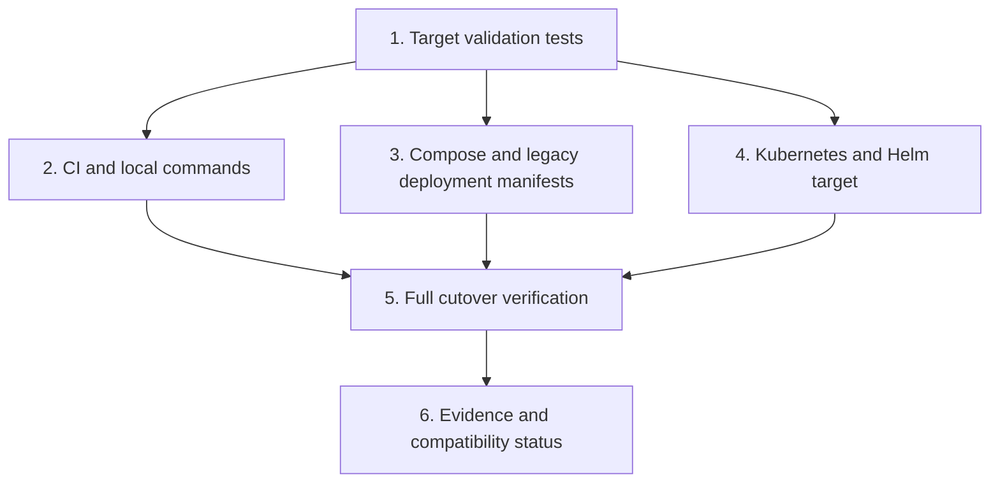

# Emme Platform Application Cutover Implementation Plan

> **For agentic workers:** REQUIRED SUB-SKILL: Use `superpowers:executing-plans` to implement this plan task-by-task. Steps use checkbox syntax and must be updated as work proceeds.

**Goal:** Make `emme-platform` the only deployed application target while retaining `studio-api` temporarily as a compatibility/build target until a later deletion decision.

**Architecture:** `emme-platform` is the canonical composition root, container image, Kubernetes workload, Compose service, Helm workload, and deployment-plugin target. `studio-api` remains included in Gradle and continues to compile/test until all compatibility responsibilities are migrated and its references are removed in a separate destructive cleanup.

**Tech Stack:** Gradle Kotlin DSL, Spring Boot, Spring Modulith, Docker Compose, Kustomize, Helm, GitHub Actions, Node.js built-in test runner.

## Global Constraints

- Do not delete `applications/studio-api` in this plan.
- Preserve the `emme-platform` HTTP port `8081` and existing public routes.
- Preserve PostgreSQL, Redis, Keycloak, health probes, and database migration behavior.
- Use `ghcr.io/migangdelzar/emme-service` as the canonical backend image.
- Do not introduce Kafka as a deployment prerequisite for local/test profiles.
- Active deployment and CI surfaces must not target `studio-api` after this plan.
- Every configuration migration must have a deterministic source validation test.
- Keep historical migration plans and verification reports readable; update them only to identify the canonical target.

## Target ownership

| Surface | Current target | Target |
|---|---|---|
| Gradle settings | both applications | both applications temporarily |
| Backend quality/test | both applications | `emme-platform` primary; `studio-api` compatibility test remains |
| Module-boundary verification | `studio-api` | `emme-platform` |
| JVM image | both image names | `ghcr.io/migangdelzar/emme-service` |
| Docker Compose | `studio-api` | `emme-platform` |
| Legacy deployment tree | `studio-api` | `emme-platform` |
| Canonical `infra/kubernetes` tree | `backend` + emme-service image | keep and verify |
| Helm | studio-api image | emme-service image |
| Native image later | none | optional `emme-platform` native image |

## Task dependency graph

### Task 1: Add failing canonical-target validation

**Files:**

- Create: `scripts/validate-emme-platform-target.test.mjs`
- Create: `scripts/validate-emme-platform-target.mjs`

**Interfaces:**

- Consumes: repository-root-relative text files and target rules.
- Produces: a reusable `validateTargetFiles({repositoryRoot, rules})` function and a CLI that exits non-zero for active `studio-api` deployment targets.

- [ ] **Step 1: Write the failing test.** Use `node:test` and `node:assert/strict` to verify that a fixture containing `studio-api` in an active deployment file fails and a fixture containing `emme-platform` passes.
- [ ] **Step 2: Run the test to verify red.** Run `node --test scripts/validate-emme-platform-target.test.mjs`; expected failure is an import/module-not-found failure because the validator does not exist yet.
- [ ] **Step 3: Implement the validator.** Read only declared active files, assert required tokens, reject forbidden `studio-api` image/service/workload tokens, and expose a CLI for the real repository.
- [ ] **Step 4: Run the test and repository validation.** Run `node --test scripts/validate-emme-platform-target.test.mjs` and `node scripts/validate-emme-platform-target.mjs`; the fixture tests must pass and the current repository must fail until the cutover edits are made.
- [ ] **Step 5: Commit.** `git commit -m "test(deployment): add emme-platform target guardrail"`.

### Task 2: Switch CI, `mise`, and deployment-plugin target names

**Files:**

- Modify: `.github/workflows/ci-module-boundaries.yml`
- Modify: `.github/workflows/ci-backend.yml`
- Modify: `mise.toml`
- Modify: `build-logic/src/main/kotlin/com/emme/buildlogic/deployment/provider/KubernetesProvider.kt`
- Modify: `build-logic/detekt-baseline.xml`
- Modify: `scripts/validate-emme-platform-target.mjs`

**Interfaces:**

- Consumes: Task 1 validation contract.
- Produces: CI/module verification and Kubernetes status/log commands that target the canonical `backend` workload and `emme-platform` image without deleting `studio-api`.

- [ ] **Step 1: Update the failing target fixtures.** Extend the Node test rules to cover CI, `mise`, and Kubernetes provider target names.
- [ ] **Step 2: Run the validator to verify red/green boundaries.** Confirm it fails against the old references before changing them.
- [ ] **Step 3: Update active commands.** Point module-boundary checks and architecture commands at `:applications:emme-platform`; keep the compatibility build task for `studio-api` only in the explicit compatibility job.
- [ ] **Step 4: Normalize provider workload names.** Replace hardcoded `studio-api` Kubernetes deployment/selector names with the canonical `backend` workload used by `infra/kubernetes`; keep provider arguments lazy and do not change unrelated provider behavior.
- [ ] **Step 5: Run focused verification.** Run `node --test scripts/validate-emme-platform-target.test.mjs`, `node scripts/validate-emme-platform-target.mjs`, and `./gradlew :build-logic:check --no-daemon --no-configuration-cache`.
- [ ] **Step 6: Commit.** `git commit -m "refactor(delivery): target emme-platform in CI"`.

### Task 3: Switch Compose and legacy deployment manifests

**Files:**

- Modify: `deployment/compose/compose.yml`
- Modify: `deployment/compose/compose.local.yml`
- Modify: `deployment/compose/compose.test.yml`
- Modify: `deployment/helm/emme/values.yaml`
- Modify: `deployment/kubernetes/base/kustomization.yml`
- Rename: `deployment/kubernetes/base/studio-api/deployment.yml` → `deployment/kubernetes/base/emme-platform/deployment.yml`
- Rename: `deployment/kubernetes/base/studio-api/service.yml` → `deployment/kubernetes/base/emme-platform/service.yml`
- Modify: `deployment/kubernetes/overlays/local/kustomization.yml`
- Modify: `deployment/kubernetes/overlays/production/kustomization.yml`
- Modify: `deployment/kubernetes/base/ingress/ingress.yml`
- Modify: `deployment/scripts/wait-for-cluster.sh`

**Interfaces:**

- Consumes: canonical image and workload names from Tasks 1–2.
- Produces: local Compose, legacy Kubernetes, and Helm manifests that deploy `emme-platform` while preserving port 8081 and health probes.

- [ ] **Step 1: Extend target tests.** Assert service, deployment, selector, image, Helm, ingress, and wait-script names use `emme-platform`/`emme-service`.
- [ ] **Step 2: Run the target validator to confirm red.** The old deployment manifests must fail the new assertions.
- [ ] **Step 3: Rename and update Compose services.** Change the service key and image to `emme-platform`/`ghcr.io/migangdelzar/emme-service`; preserve dependency services and health checks.
- [ ] **Step 4: Rename and update legacy Kubernetes resources.** Move the resource directory, update names/selectors, image references, overlays, ingress backend, and wait script; do not alter security contexts or resource limits except where required by the target name.
- [ ] **Step 5: Update Helm values.** Use the canonical image repository and preserve chart-level service naming behavior.
- [ ] **Step 6: Render manifests.** Run `node scripts/validate-emme-platform-target.mjs`, `kubectl kustomize infra/kubernetes/overlays/dev >/dev/null`, `kubectl kustomize infra/kubernetes/overlays/prod >/dev/null`, and `kubectl kustomize deployment/kubernetes/overlays/local >/dev/null` when the tools are available.
- [ ] **Step 7: Commit.** `git commit -m "refactor(delivery): migrate deployment manifests to emme-platform"`.

### Task 4: Verify application parity and compatibility target

**Files:**

- Modify: `applications/emme-platform/src/main/java/com/emme/configuration/JacksonConfiguration.java` only if parity tests identify a required behavior gap.
- Create: `applications/emme-platform/src/test/java/com/emme/PlatformApplicationParityTest.java`
- Modify: `docs/architecture/00-project/project-layout.md`
- Modify: `docs/architecture/00-project/repository-split.md`
- Modify: `docs/architecture/05-operations/service-architecture-migration.md`
- Modify: `docs/superpowers/reviews/2026-08-01-service-wide-architecture-verification.md`

**Interfaces:**

- Consumes: `emme-platform` as the canonical application and `studio-api` as a temporary compatibility target.
- Produces: executable evidence that the canonical application owns the deployable runtime and that deletion is not attempted before zero-reference verification.

- [ ] **Step 1: Write the failing parity test.** Assert the canonical Spring application name, port, health endpoint, and presence of the core module composition in `emme-platform`.
- [ ] **Step 2: Run the focused test to confirm red.** Run `./gradlew :applications:emme-platform:test --tests '*PlatformApplicationParityTest' --no-daemon --no-configuration-cache`.
- [ ] **Step 3: Implement only required parity fixes.** Migrate missing non-legacy configuration from `studio-api` only when the test or deployed smoke path requires it; do not copy deprecated profiles wholesale.
- [ ] **Step 4: Update documentation.** State that `emme-platform` is canonical, `studio-api` remains compatibility/build-only, and deletion requires a separate cleanup plan.
- [ ] **Step 5: Run focused application verification.** Run the platform tests, Modulith tests, boot JAR, and target validator.
- [ ] **Step 6: Commit.** `git commit -m "test(platform): verify canonical application parity"`.

### Task 5: Complete cutover verification and evidence

**Files:**

- Create: `docs/superpowers/reviews/2026-08-02-emme-platform-cutover-verification.md`
- Modify: `tasks/todo.md`
- Modify: `docs/superpowers/plans/2026-08-02-emme-platform-cutover.md`

**Interfaces:**

- Consumes: all cutover changes and verification commands from Tasks 1–4.
- Produces: a committed report proving active deployment surfaces use `emme-platform` and documenting remaining compatibility references.

- [ ] **Step 1: Run the complete cutover verification.** Run the target validator, Markdown validation, `git diff --check`, platform tests, module-boundary tests, `:applications:emme-platform:bootJar`, and the relevant manifest renderers.
- [ ] **Step 2: Search for remaining references.** Classify every remaining `studio-api` reference as compatibility source, historical documentation, or unexpected active runtime usage.
- [ ] **Step 3: Record evidence.** Include commands, outcomes, warnings, image/workload names, and the explicit reason `studio-api` remains.
- [ ] **Step 4: Mark only completed tasks.** Do not mark deletion complete; create a follow-up deletion plan only after all compatibility responsibilities move.
- [ ] **Step 5: Commit and push.** `git commit -m "docs(delivery): record emme-platform cutover"` followed by `git push origin feat/module-plans-normalization`.

## Definition of done

- [ ] `emme-platform` is the only active deployment target in CI, Compose, Helm, legacy Kubernetes, and deployment scripts.
- [ ] The canonical image is `ghcr.io/migangdelzar/emme-service`.
- [ ] `studio-api` remains build-compatible but is not deployed by active manifests.
- [ ] Port 8081, health probes, database migrations, security context, and resource policies are preserved.
- [ ] Platform module-boundary, application, boot-JAR, and deployment validation pass.
- [ ] A verification report is committed and pushed.
