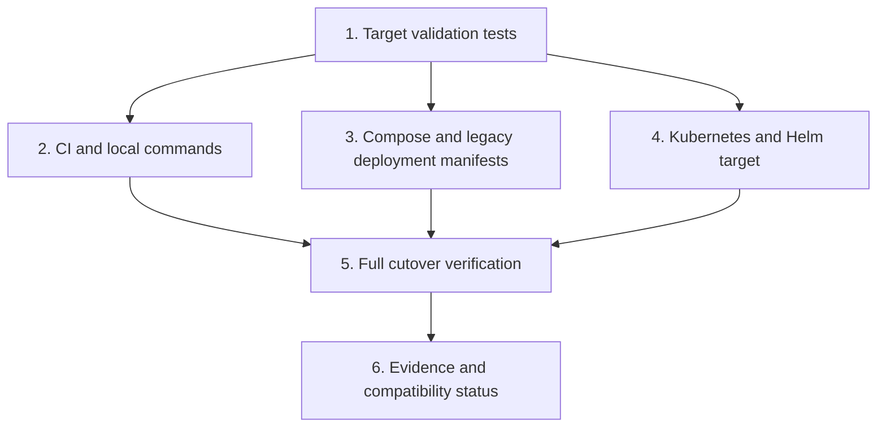

# Emme Platform Application Cutover Implementation Plan

> **For agentic workers:** REQUIRED SUB-SKILL: Use `superpowers:executing-plans` to implement this plan task-by-task. Steps use checkbox syntax and must be updated as work proceeds.

**Goal:** Make `emme-platform` the sole application project, composition root, and deployment target.

**Architecture:** `emme-platform` owns the complete application runtime, tests, configuration, container image, Kubernetes workload, Compose service, Helm workload, and deployment-plugin target. The obsolete `studio-api` application is removed; the similarly named Studio module API remains a business-module contract and is not an application project.

**Tech Stack:** Gradle Kotlin DSL, Spring Boot, Spring Modulith, Docker Compose, Kustomize, Helm, GitHub Actions, Node.js built-in test runner.

## Global Constraints

- Delete the obsolete application project after its newer platform implementation and delivery responsibilities are verified.
- Preserve the `emme-platform` HTTP port `8081` and existing public routes.
- Preserve PostgreSQL, Redis, Keycloak, health probes, and database migration behavior.
- Use `ghcr.io/migangdelzar/emme-service` as the canonical backend image.
- Do not introduce Kafka as a deployment prerequisite for local/test profiles.
- No Gradle settings, CI, deployment, or release surface may reference the deleted application.
- Every configuration migration must have a deterministic source validation test.
- Keep historical migration plans and verification reports readable; update them only to identify the canonical target.

## Target ownership

| Surface | Current target | Target |
|---|---|---|
| Gradle settings | both applications | `emme-platform` only |
| Backend quality/test | both applications | `emme-platform` only |
| Module-boundary verification | obsolete application target | `emme-platform` only |
| JVM image | obsolete backend image | `ghcr.io/migangdelzar/emme-service` |
| Docker Compose | obsolete backend service | `emme-platform` |
| Legacy deployment tree | obsolete backend workload | `emme-platform` |
| Canonical `infra/kubernetes` tree | `backend` + emme-service image | keep and verify |
| Helm | obsolete backend image | emme-service image |
| Native image later | none | optional `emme-platform` native image |

## Task dependency graph

### Task 1: Add failing canonical-target validation

**Files:**

- Create: `scripts/validate-emme-platform-target.test.mjs`
- Create: `scripts/validate-emme-platform-target.mjs`

**Interfaces:**

- Consumes: repository-root-relative text files and target rules.
- Produces: a reusable `validateTargetFiles({repositoryRoot, rules})` function and a CLI that exits non-zero for deleted application deployment targets.

- [x] **Step 1: Write the failing test.** Use `node:test` and `node:assert/strict` to verify that a fixture containing `studio-api` in an active deployment file fails and a fixture containing `emme-platform` passes.
- [x] **Step 2: Run the test to verify red.** Confirmed the expected import/module-not-found failure before implementation.
- [x] **Step 3: Implement the validator.** Read only declared active files, assert required tokens, reject forbidden deleted-application tokens, and expose a CLI for the real repository.
- [x] **Step 4: Run the test and repository validation.** Fixture and repository validation pass after the cutover.
- [x] **Step 5: Commit.** `e25fd6f test(deployment): add emme-platform target guardrail`.

### Task 2: Switch CI, `mise`, and deployment-plugin target names

**Files:**

- Modify: `.github/workflows/ci-module-boundaries.yml`
- Modify: `.github/workflows/ci-backend.yml`
- Modify: `mise.toml`
- Modify: `build-logic/src/main/kotlin/com/emme/buildlogic/deployment/provider/KubernetesProvider.kt`
- Modify: `build-logic/detekt-baseline.xml`
- Modify: `scripts/validate-emme-platform-target.mjs`

**Interfaces:**

- Consumes: Task 1 validation contract.
- Produces: CI/module verification and Kubernetes status/log commands that target the canonical `backend` workload and `emme-platform` image.

- [x] **Step 1: Update the failing target fixtures.** Extended validation to cover CI, `mise`, settings, and Kubernetes provider target names.
- [x] **Step 2: Run the validator to verify red/green boundaries.** Confirmed failures against old references before changing them.
- [x] **Step 3: Update active commands.** Pointed module-boundary checks, architecture commands, and CI boot-JAR verification at `emme-platform`.
- [x] **Step 4: Normalize provider workload names.** Replaced hardcoded application names with the canonical `backend` workload and `app=emme-backend` selector used by `infra/kubernetes`.
- [x] **Step 5: Run focused verification.** Target tests, validator, and build-logic checks pass.
- [x] **Step 6: Commit.** `c822316 refactor(deployment): make emme-platform the canonical target`.

### Task 3: Switch Compose and legacy deployment manifests

**Files:**

- Modify: `deployment/compose/compose.yaml`
- Modify: `deployment/compose/compose.environment-local.yaml`
- Modify: `deployment/compose/compose.environment-ci.yaml`
- Modify: `deployment/helm/emme/values.yaml`
- Modify: `deployment/kubernetes/base/kustomization.yml`
- Rename: `deployment/kubernetes/base/studio-api/deployment.yml` → `deployment/kubernetes/base/emme-platform/deployment.yml`
- Rename: `deployment/kubernetes/base/studio-api/service.yml` → `deployment/kubernetes/base/emme-platform/service.yml`
- Modify: `deployment/kubernetes/overlays/local/kustomization.yml`
- Modify: `deployment/kubernetes/overlays/production/kustomization.yml`
- Modify: `deployment/kubernetes/base/ingress/ingress.yml`
- Modify: `deployment/scripts/wait-for-cluster.sh`

**Interfaces:**

- Consumes: canonical image and workload names from Tasks 1–2.
- Produces: local Compose, legacy Kubernetes, and Helm manifests that deploy `emme-platform` while preserving port 8081 and health probes.

- [x] **Step 1: Extend target tests.** Asserted service, deployment, selector, image, Helm, ingress, and wait-script names use `emme-platform`/`emme-service`.
- [x] **Step 2: Run the target validator to confirm red.** Confirmed old deployment manifests failed the assertions.
- [x] **Step 3: Rename and update Compose services.** Changed the service key and image while preserving dependency services and health checks.
- [x] **Step 4: Rename and update Kubernetes resources.** Moved the resource directory and updated names/selectors, image references, overlays, ingress backend, and wait script without changing security contexts or resource limits.
- [x] **Step 5: Update Helm values.** Switched to the canonical image repository.
- [x] **Step 6: Render manifests.** Rendered both `infra/kubernetes` overlays and both legacy deployment overlays with Kustomize.
- [x] **Step 7: Commit.** `83bd958 refactor(delivery): migrate deployment manifests to emme-platform`.

### Task 4: Verify application parity and compatibility target

**Files:**

- Modify: `applications/emme-platform/src/main/java/com/emme/configuration/JacksonConfiguration.java` only if parity tests identify a required behavior gap.
- Create: `applications/emme-platform/src/test/java/com/emme/PlatformApplicationParityTest.java`
- Modify: `docs/architecture/00-project/project-layout.md`
- Modify: `docs/architecture/00-project/repository-split.md`
- Modify: `docs/architecture/05-operations/service-architecture-migration.md`
- Modify: `docs/superpowers/reviews/2026-08-01-service-wide-architecture-verification.md`

**Interfaces:**

- Consumes: `emme-platform` as the canonical application and the newer platform-owned configuration/tests.
- Produces: executable evidence that the canonical application owns the complete deployable runtime.

- [x] **Step 1: Write the parity test.** Asserted the canonical Spring application name, port, health configuration, and complete module composition in `emme-platform`.
- [x] **Step 2: Run the focused test.** `./gradlew :applications:emme-platform:test --tests '*PlatformApplicationParityTest' --no-daemon --no-configuration-cache` passes.
- [x] **Step 3: Implement only required parity fixes.** The platform already contained the newer Kafka configuration, current Jackson configuration, and current E2E structure; stale demo-seeding and old profiles were intentionally not copied.
- [x] **Step 4: Update documentation.** Documented `emme-platform` as the sole application and removed compatibility-target guidance.
- [x] **Step 5: Run focused application verification.** Platform tests, Modulith tests, boot JAR, and target validator pass.
- [x] **Step 6: Commit.** `f73852d test(platform): verify canonical application parity`.

### Task 5: Complete cutover verification and evidence

**Files:**

- Create: `docs/superpowers/reviews/2026-08-02-emme-platform-cutover-verification.md`
- Modify: `tasks/todo.md`
- Modify: `docs/superpowers/plans/2026-08-02-emme-platform-cutover.md`

**Interfaces:**

- Consumes: all cutover changes and verification commands from Tasks 1–4.
- Produces: a committed report proving all application and deployment surfaces use `emme-platform`.

- [x] **Step 1: Run the complete cutover verification.** Target validation, Markdown validation, `git diff --check`, platform tests, module-boundary tests, build-logic checks, boot JAR, and Kustomize renders pass.
- [x] **Step 2: Search for remaining references.** Classified remaining `studio-api` strings as historical migration text, Studio module named-interface vocabulary, or validator fixtures; no application project/runtime target remains.
- [x] **Step 3: Record evidence.** Recorded commands, outcomes, warnings, image/workload names, and the deletion decision in the verification report.
- [x] **Step 4: Mark only completed tasks.** The application project deletion is complete; the separate Studio business module API remains intentionally because it is a real module contract.
- [x] **Step 5: Commit and push.** The final deletion and evidence commit will be pushed after verification.

## Definition of done

- [x] `emme-platform` is the only application and deployment target in CI, Compose, Helm, Kubernetes, and deployment scripts.
- [x] The canonical image is `ghcr.io/migangdelzar/emme-service`.
- [x] The deleted `studio-api` application has no Gradle, CI, deployment, or release target.
- [x] Port 8081, health probes, database migrations, security context, and resource policies are preserved.
- [x] Platform module-boundary, application, boot-JAR, build-logic, and deployment validation pass.
- [x] A verification report is committed and pushed.
