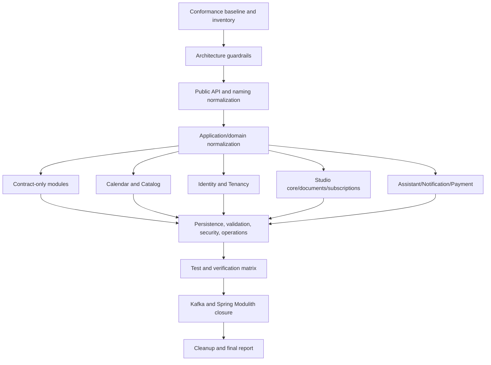

# Enterprise Module Template Conformance Implementation Plan

> **For agentic workers:** REQUIRED SUB-SKILL: Use `superpowers:subagent-driven-development` or `superpowers:executing-plans` to implement this plan task-by-task.

**Goal:** Bring every backend module in `emme-service` into conformance with the downloaded enterprise template, `enterprise-module-template-ddd-hexagonal-spring-modulith.md`, while preserving the repository’s current DDD + Hexagonal Architecture, Spring Modulith boundaries, one-use-case-per-service rule, and unreleased-system cleanup policy.

**Architecture:** Each business module is a bounded Spring Modulith module. Its only cross-module surface is `api/` and explicitly declared named interfaces. `application/` orchestrates use cases through outbound ports, `domain/` owns framework-free business rules, `adapter/in/` translates external input, `adapter/out/` implements technical integrations, and `configuration/` wires the module. Package trees are materialized only for responsibilities that exist. Gradle `build-logic` remains a separate Capability-Driven Design architecture and is not converted to this backend package tree.

**Tech Stack:** Java 25, Spring Boot, Spring Modulith, Gradle, JPA/JDBC, Liquibase, PostgreSQL, Kafka with Spring Modulith event publication, JUnit 5, Mockito, AssertJ, ArchUnit, Spring Modulith verification, Testcontainers, Spotless, Checkstyle, and the `emme-platform` application.

## Global Constraints

1. The downloaded enterprise template is the backend conformance reference. Local architecture documentation and module plans must link to it or reproduce its approved rules where the repository needs an executable rule.
2. This is an unreleased system. Use the latest canonical names and packages. Do not retain compatibility wrappers, aliases, duplicate controllers, deprecated package bridges, or legacy class names unless a persisted schema or an explicitly documented external contract requires them.
3. Do not create empty ceremonial packages. Every materialized package must contain a real responsibility, a `package-info.java`, and tests where the package has behavior or a boundary.
4. Preserve the distinction between backend modules and Gradle build logic. Backend modules use DDD + Hexagonal Architecture; `build-logic` uses capability-first CDD with convention plugins, binary plugins, extensions, tasks, providers, and value sources.
5. Every concrete application service implements exactly one matching use-case interface. If one class implements multiple use cases, split it into one service per use case unless a documented technical constraint proves that the operations are inseparable. The preferred relationship is `<Verb><Subject>UseCase` → `<Verb><Subject>Service`.
6. Other modules may depend only on another module’s public `api/` named interfaces. They must not import another module’s domain, application, adapter, configuration, persistence repository, JPA entity, web DTO, or provider implementation.
7. Domain code must not depend on Spring, JPA, HTTP, JSON, Kafka, database classes, or external SDKs. Application code must not depend on inbound adapters. Controllers and consumers must call use-case interfaces rather than repositories.
8. Use Java records for immutable commands, queries, results, requests, responses, events, immutable configuration views, and small value types. Use classes for behavior, aggregates, entities, services, adapters, and stateful components. Use enums only for closed vocabularies.
9. Normalize initialisms as words: `HttpClient`, `JsonMapper`, `Uuid`, `Jwt`, `Api`, `Url`, and `Sse`. Do not introduce `HTTPClient`, `JSONMapper`, `UUID`, `JWT`, `API`, `URL`, or `SSE` in type names.
10. Do not introduce `Impl`, `Manager`, `Helper`, `Utils`, `Common`, `Base`, `Default`, or ambiguous `Dto` names. Replace generic names with names describing the responsibility. `ProcessManager` is allowed only for a real long-running business process coordinator.
11. Keep endpoint versioning consistent with the current unreleased API policy. Audit every controller and normalize the path/header decision centrally; do not maintain duplicate old routes.
12. Keep the existing generic throwable connection-execution abstraction as the shared mechanism for database connections. Audit all modules for direct `DataSource#getConnection()` usage and route connection lifecycle through the approved `withConnection`/throwing functional interfaces.
13. Preserve the current Kafka + Spring Modulith direction. Do not reintroduce RabbitMQ. Event publication, replay, idempotency, recovery, and broker evidence are final closure work after module boundaries are stable.
14. Every phase must follow Red → Green → Refactor, update the applicable module plan, commit a coherent change, and run the smallest relevant verification before continuing.

---

## 1. Current Baseline and Target State

### 1.1 Modules in scope

| Module | Current role | Target treatment |
|---|---|---|
| `customer` | Small public contract boundary | Keep minimal; validate API types, metadata, and dependency direction. |
| `workforce` | Small public contract boundary | Keep minimal; validate API types, metadata, and dependency direction. |
| `booking` | Small public contract boundary | Keep minimal; validate API types, metadata, and dependency direction. |
| `calendar` | Calendar integration and synchronization | Conformance audit; normalize Google client/adapter naming and operational boundaries. |
| `catalog` | Catalog aggregate, images, storage, hybrid search | Close baseline verification; separate read search from aggregate behavior and external storage. |
| `identity` | Authentication, membership, authorization, feature flags | Complete domain/application/persistence separation and security evidence. |
| `tenancy` | Tenant lifecycle, routing, provisioning, database registry | Close operational evidence; keep provisioning as a process, not a generic service. |
| `studio` | Core studio business capabilities | Keep core module boundary and nested `documents`/`subscriptions` capabilities explicit. |
| `studio.documents` | Document ingestion and retrieval | Verify nested module API, domain lifecycle, persistence, search, and migration ownership. |
| `studio.subscriptions` | Subscription and entitlement lifecycle | Verify nested module API, domain lifecycle, payment boundary, and recovery behavior. |
| `assistant` | Conversations and assistant workflows | Normalize core/AI capability boundaries, providers, webhook adapters, and credentialed evidence. |
| `notification` | Notification request and delivery | Normalize provider ports/adapters, typed properties, retry, idempotency, and tenant isolation. |
| `payment` | Payment lifecycle and provider callbacks | Normalize payment domain, provider adapters, webhook signatures, replay protection, and recovery. |
| `shared` | Technical cross-cutting infrastructure | Keep non-business primitives only; remove generic ownership and accidental business coupling. |
| `audit` | Reserved metadata-only boundary | Keep only if the ADR confirms ownership; do not grow it into a second business event system. |
| `emme-platform` | Runtime composition root | Wire modules, verify Modulith, expose only application-level configuration, and own end-to-end checks. |

### 1.2 Target module shape

```text
<module>/
├── package-info.java
├── api/
│   ├── command/          # state-changing intentions
│   ├── query/            # read intentions
│   ├── result/           # public application read models
│   ├── usecase/          # inbound ports
│   ├── event/            # public past-tense facts
│   ├── exception/        # intentionally public expected failures
│   └── type/             # stable public vocabulary
├── application/
│   ├── service/          # one concrete service per use case
│   ├── validation/       # application workflow validation
│   ├── authorization/   # use-case authorization decisions
│   ├── mapper/           # API/domain translation
│   ├── process/          # only real long-running process managers
│   └── port/out/         # repository, provider, publisher, and integration ports
├── domain/
│   ├── model/            # aggregate roots and business objects
│   ├── service/          # cross-object business policy/calculation
│   ├── specification/    # reusable business predicates
│   ├── event/            # internal domain facts
│   └── exception/        # invariant violations
├── adapter/
│   ├── in/
│   │   ├── web/{controller,request,response,mapper,advice,webhook}/
│   │   ├── messaging/{consumer,mapper}/
│   │   ├── scheduler/
│   │   └── listener/
│   └── out/
│       ├── persistence/{entity,repository,adapter,mapper,projection}/
│       ├── messaging/{publisher,mapper}/
│       ├── client/<provider>/
│       ├── security/
│       ├── time/
│       └── observability/
├── configuration/
└── resources/db/changelog/<module>/
```

The tree is a decision catalogue, not a requirement to create every directory. A module with only public contracts must remain small. A module with a real provider, scheduler, webhook, projection, or process must materialize the corresponding package and document its ownership.

---

## 2. Phase A — Establish the Conformance Baseline

### A1. Freeze the canonical rules before code changes

- [x] Add a link from `docs/architecture/README.md` to the repository module template, which incorporates the supplied enterprise template, and state that it is the module-structure reference.
- [x] Reconcile `docs/templates/module-package-structure-template.md` with the supplied enterprise template; optional tactical DDD folders, validation, authorization, process, listener, webhook, projection, migration, and testing guidance are present.
- [x] Audit the focused backend architecture pages and update the module overview where optional validation, authorization, process, webhook, listener, provider, and client branches were not shown.
- [x] Confirm the one-use-case-per-service rule and the exception process for inseparable workflows in the application and naming guidance.
- [x] Confirm `Client` versus `Provider`: use `HttpClient` for a transport client, `ClientAdapter` for an adapter implementing an application port, and `Provider` for a selectable external strategy or vendor implementation.
- [x] Confirm that `shared/` is technical infrastructure, not a business module, and that `audit/` is metadata-only until ownership is decided.

### A2. Produce an evidence-backed inventory

- [ ] Inventory every production Java type in all modules and classify it as API, application, domain, inbound adapter, outbound adapter, configuration, test support, or obsolete.
- [ ] Inventory every `application/service` class and verify its implemented use-case count, name, transaction mode, and dependency count.
- [ ] Inventory every `api` package and compare command/query/result/use-case/event/exception/type names as a vertical slice.
- [ ] Inventory every `package-info.java`, `ApplicationModule`, and `NamedInterface` declaration and detect duplicates, empty interfaces, mismatched names, and missing package metadata.
- [ ] Inventory all imports crossing module boundaries and produce a list of forbidden implementation imports.
- [ ] Inventory all `DataSource#getConnection()` calls, direct JPA repository use from application/web code, direct external SDK use from domain code, and non-Kafka broker configuration.
- [ ] Inventory empty directories and files with no production references. Delete only after `rg`, compiler, test, and build verification prove they are unused.
- [x] Store the baseline evidence in `docs/superpowers/reviews/2026-08-03-enterprise-module-template-conformance-baseline.md` and link it from this plan.
- [x] Refresh the production type, application-service, package-metadata, and boundary inventory in `docs/superpowers/reviews/2026-08-04-enterprise-module-template-conformance-inventory.md` after public contract naming normalization.

### A3. Add executable architecture guardrails

- [x] Keep `ModularityTest` as the repository-wide Modulith verification and add explicit named-interface checks through `NamedInterfaceArchitectureTest`.
- [x] Add or extend per-module/package convention tests for API visibility, package metadata, forbidden imports, and one-use-case-per-service.
- [x] Add ArchUnit rules for domain framework independence, application inward dependency, controller/use-case usage, persistence isolation, API-only cross-module imports, and absence of the normalized generic public-contract names.
- [x] Add deterministic naming audits for public contract categories, suffixes, and one-use-case-per-service; initialism cleanup remains part of the residual inventory review.
- [x] Add a test that confirms `emme-platform` has no dependency on the removed `studio-api` project or legacy package.

**Verification:** Run all affected module tests, `:applications:emme-platform:test`, `:applications:emme-platform:check`, `./gradlew test`, and `./gradlew ci --no-daemon` after the guardrails are introduced.

---

## 3. Phase B — Normalize the Public API Contract

Apply the following mapping to every module that has public contracts:

| Package | Required type/name pattern | Type kind | Boundary rule |
|---|---|---|---|
| `api.command` | `<Verb><Subject>Command` | `record` | State-changing intention only; no service calls or domain behavior. |
| `api.query` | `<ReadVerb><Subject>Query` | `record` | Read intention only; no mutation language. |
| `api.result` | `<Subject><Shape>` | `record` | Stable public read model; never a JPA entity or aggregate. |
| `api.usecase` | `<Verb><Subject>UseCase` | `interface` | Public inbound port; one operation with a clear result. |
| `api.event` | `<Subject><PastParticiple>` | `record` | Fact that already happened; immutable and versionable. |
| `api.exception` | `<Subject><Failure>Exception` | `class` | Expected failure intentionally handled by callers. |
| `api.type` | `<Concept>.java` or `<Concept>Status.java`/`<Concept>Type.java` | `record`/`enum` | Small stable vocabulary; use `Status` for lifecycle and `Type` for classification; do not expose aggregate internals. |

### B1. Contract migration tasks

- [ ] For every module, align commands, queries, results, use cases, events, exceptions, and types into coherent vertical slices.
- [ ] Rename ambiguous `Info`, `Data`, `Payload`, `Model`, `Dto`, `DTO`, `View`, and `Response` types to their actual contract shape. Keep `Response` only under a transport adapter.
- [x] Normalize the public contract names covered by this migration: `Status` for lifecycle/current condition, `Type` for classification, `Details`/`Summary`/`Page` for read shapes, and `Result` only for operation outcomes. Remove ambiguous public `Info`/`View` names and the OIDC query's `UserInfo` suffix.
- [ ] Convert immutable public data carriers to records and validate them at the transport boundary.
- [ ] Convert public mutable classes that expose persistence or framework state into dedicated records or stable value types.
- [ ] Ensure event names are past tense and commands remain imperative. Remove duplicate command/event concepts.
- [ ] Ensure public exceptions do not expose SQL, JPA, HTTP-client, Kafka, or provider implementation exceptions.
- [ ] Apply `@NotNull`, `@Size`, `@Pattern`, `@Positive`, `@Valid`, and type-level `@Valid<Concept>` only to inbound records where the rule is transport/application validation. Keep business invariants in the domain.
- [ ] Ensure every public package has package-level documentation and only intentional `NamedInterface` annotations.
- [ ] Delete empty API child packages and empty named interfaces. Materialize a grouped API child only when that kind exists.

**Verification:** Compile each affected module, run API contract tests, Modulith verification, ArchUnit, and the application test suite.

---

## 4. Phase C — Normalize Application and Domain Layers

### C1. Application service rules

- [ ] Rename every application service to `<Verb><Subject>Service` and its interface to the exact matching `<Verb><Subject>UseCase`.
- [ ] Split any service implementing multiple use cases into separate classes with focused dependencies and transactions.
- [ ] Keep service classes responsible for loading aggregates, invoking domain behavior, calling outbound ports, mapping results, publishing public events, and defining transaction boundaries.
- [ ] Move reusable business decisions out of services into aggregate methods, domain policies, specifications, or calculators.
- [ ] Move workflow input checks into `application/validation`; keep authorization decisions in `application/authorization`; do not mix either with transport parsing.
- [ ] Use `@Transactional(readOnly = true)` for query services and a single explicit transaction boundary for normal commands.
- [ ] Use process managers only for long-running, resumable workflows such as tenant provisioning or payment reconciliation.
- [ ] Keep application ports in `application/port/out`; name them `<Capability>Port`, `<Aggregate>Repository`, `<Fact>Publisher`, or `<Capability>Entry` according to their role.

### C2. Domain rules

- [ ] Keep aggregates, entities, value objects, identifiers, enumerations, factories, policies, specifications, domain events, and domain exceptions framework-free.
- [ ] Materialize `domain/model/aggregate`, `entity`, `valueobject`, `identifier`, `enumeration`, and `factory` only when the module has more than one meaningful type in that category; otherwise use the smallest semantically correct package.
- [ ] Ensure aggregate roots protect invariants and expose behavior rather than public setters.
- [ ] Rename generic domain services to a business concept such as `<Subject>EligibilityPolicy`, `<Subject>PricingPolicy`, or `<Subject>Calculator`.
- [ ] Keep internal domain events under `domain/event`; translate them to public events under `api/event` when another module is allowed to react.
- [ ] Keep domain exceptions independent of HTTP status codes and persistence technology.
- [ ] Add domain tests for state transitions, invariants, value-object validation, policies, and specifications.

**Verification:** Plain JUnit domain tests must run without a Spring context. Application service tests must use ports as mocks/fakes and verify transaction-relevant behavior without real infrastructure.

---

## 5. Phase D — Normalize Inbound and Outbound Adapters

### D1. Inbound adapters

- [ ] Rename controllers to `<Resource>Controller`; webhook controllers to `<Provider>WebhookController`; schedulers to `<Action><Subject>Scheduler`; message consumers to `<Fact>Consumer`.
- [ ] Keep request records under `adapter/in/web/request` and response records under `adapter/in/web/response`.
- [ ] Keep web mappers under `adapter/in/web/mapper`; translate request → command/query and result → response.
- [ ] Keep module exception translation under `<Module>ExceptionHandler`; return the repository’s RFC Problem Details representation.
- [ ] Move business behavior out of controllers, consumers, schedulers, listeners, and webhooks into use-case services.
- [ ] Normalize endpoint versioning using the approved path/header policy and remove duplicate legacy routes.
- [ ] Ensure inbound message consumers validate envelope metadata, enforce idempotency where needed, and call a use case.
- [ ] Ensure schedulers and listeners only trigger application operations and do not implement domain rules.

### D2. Outbound adapters

- [ ] Keep persistence entities under `adapter/out/persistence/entity` and never return them from public APIs.
- [ ] Name Spring Data repositories `SpringData<Aggregate>Repository` and keep them inside the persistence adapter package.
- [ ] Name application-facing persistence adapters `<Aggregate>PersistenceAdapter` and mappers `<Aggregate>PersistenceMapper`.
- [ ] Name read projections `<ReadShape>Projection`; use them for read-only queries without loading aggregates.
- [ ] Use `HttpClient` for provider transport, `<Provider>Request`/`<Provider>Response` for external wire types, and `<Provider>ClientAdapter` for the application-port implementation.
- [ ] Use `Provider` for pluggable vendor/strategy implementations selected through configuration; do not rename every HTTP client to provider.
- [ ] Keep security, time, metrics, tracing, audit, and storage adapters behind ports when they affect application behavior.
- [ ] Route all database connection acquisition through the generic throwable connection executor. Add regression tests for checked exceptions, runtime exceptions, resource closure, and suppressed close failures.

**Verification:** `@WebMvcTest` for controllers, `@DataJpaTest`/Testcontainers for persistence, provider contract tests for external adapters, and integration tests for adapter wiring.

---

## 6. Phase E — Module-Specific Migration Work

### E1. `customer`, `workforce`, and `booking`

- [ ] Confirm these remain minimal contract boundaries rather than artificial full DDD trees.
- [ ] Verify the root `ApplicationModule` metadata and absence of empty legacy API named interfaces.
- [ ] Normalize any public records, identifiers, events, and use-case names.
- [ ] Add only the package-info and dependency tests required by their actual contents.
- [ ] Confirm no module imports their implementation packages because no implementation should be invented merely to satisfy the template.

### E2. `calendar`

- [ ] Audit the current calendar aggregate, synchronization workflow, Google transport client, OAuth configuration, scheduler/listener, and persistence adapters against the target tree.
- [ ] Rename configuration types to semantic names such as `GoogleCalendarProperties` where they represent typed properties and `GoogleCalendarConfiguration` where they wire beans.
- [x] Rename `GoogleOAuthConfig` to `GoogleOAuthProperties` and move Calendar HTTP controllers into `adapter/in/web/controller` with package metadata.
- [x] Extract Calendar HTTP response records into `adapter/in/web/response` so controllers contain no nested transport types.
- [x] Move Google OAuth HTTP operations behind one-use-case-per-operation application services and an application-owned OAuth port; keep Google persona/token types out of the inbound adapter.
- [ ] Keep transport classes as `GoogleCalendarHttpClient` or equivalent and adapters as `<Capability>ClientAdapter`; do not collapse transport and port implementation.
- [ ] Ensure synchronization services remain one use case per service and event listeners invoke use cases.
- [ ] Verify tenant/staff isolation, token refresh, retry behavior, idempotency, and failure recovery.
- [ ] Reconcile stale calendar plan checkboxes and attach final verification evidence.

### E3. `catalog`

- [ ] Complete the existing catalog baseline verification plan: package materialization, named interfaces, domain imports, application direction, persistence mapper ownership, tenant predicates, and hybrid-search ownership.
- [x] Rename `CatalogMatchService` to `MatchCatalogItemsService` so the concrete service matches `MatchCatalogItemsUseCase`.
- [ ] Separate catalog aggregate behavior from hybrid search orchestration and external image-caption/embedding integrations through explicit ports.
- [ ] Keep image storage, search, and projections in outbound capability packages; do not expose search implementation types through the API.
- [ ] Add tenant-isolation, search ranking, empty-result, provider failure, and read-model tests.

### E4. `identity`

- [ ] Complete framework-free domain models for membership, role, permission, customer identity, customer membership, and feature flags.
- [ ] Split any identity service with multiple responsibilities into one service per use case.
- [x] Move feature-flag evaluation out of `application/service` into the
  focused `application/authorization/FeatureFlagEvaluator` collaborator so the
  one-use-case-per-service rule remains executable.
- [ ] Move repositories behind application-owned ports and create persistence entities, mappers, adapters, and projections.
- [ ] Move membership synchronization into an inbound consumer that invokes a use case.
- [ ] Put Keycloak operations behind explicit ports and provider/client adapters.
- [ ] Replace untyped security/Keycloak configuration with typed properties records/classes and semantic configuration names.
- [ ] Remove controller-to-controller calls from authentication flows.
- [ ] Add identity exception advice and tests for tenant isolation, privilege escalation, JWT validation, rate limiting, idempotency, audit publication, and realm provisioning recovery.
- [ ] Confirm only intentional identity API and security named interfaces are public.

### E5. `tenancy`

- [ ] Reconcile the tenancy plan with the implemented pool lifecycle, routing, provisioning, and migration slices.
- [x] Move the internal audit recorder to `application/audit/AuditEventRecorder`;
  it is not a public use-case service and must not occupy `application/service`.
- [ ] Keep `TenantProvisioningProcessManager` only for the actual resumable provisioning workflow; keep individual use cases in separate services.
- [ ] Separate database registry/pool/routing technical adapters from tenant domain and application ports.
- [ ] Normalize `BootstrapJdbcConfiguration`, `DataSourceConfiguration`, and typed tenant properties according to their actual wiring responsibility.
- [ ] Verify routing failures, pool lifecycle, provisioning replay/idempotency, rollback/recovery, audit correlation, and tenant isolation.
- [ ] Confirm the public tenant API named interfaces are complete and non-duplicated.

### E6. `studio` core

- [ ] Keep studio as a business module with explicit core capabilities; do not reintroduce `studio-api`.
- [ ] Audit the core API, application services, domain aggregates, web adapters, persistence adapters, and configuration against the module template.
- [x] Move core Studio HTTP controllers into `adapter/in/web/controller` and rename `BusinessConfigController` to `BusinessConfigurationController`.
- [x] Extract the core Studio service web request/response records into dedicated `request` and `response` files.
- [x] Migrate the Studio customer vertical slice to public `CustomerDetails`
  results, application mapping, dedicated web contracts, and normalized
  `CustomerSummary` naming without controller-to-domain imports.
- [x] Migrate the Studio service-catalog vertical slice to public
  `ServiceDetails` results, application mapping, and domain-free web contracts;
  remove the unused duplicate `ListServiceCatalogEntries` surface.
- [x] Migrate Studio business-configuration contracts to public profile,
  operating-hours, and booking-policy results with the API-owned `BusinessDay`
  type and dedicated HTTP records.
- [x] Migrate the Studio artist and capability vertical slice to public result
  records, application mapping, and dedicated HTTP contracts; remove the
  unused duplicate artist-capability listing surface.
- [x] Move Calendar client-calendar synchronization behind focused inbound use
  cases and an application-owned outbound port; keep Google transport details
  inside the outbound adapter.
- [ ] Rename `GetBusinessProfileConfig*` to the actual business concept represented by the contract after its API/result semantics are reviewed.
- [ ] Split any service that combines customer, artist, appointment, catalog, operating-hours, or booking-policy use cases.
- [ ] Verify nested `documents` and `subscriptions` dependencies remain one-way and use only named public APIs.

### E7. `studio.documents`

- [ ] Verify document and chunk aggregates, status transitions, value objects, and domain tests.
- [ ] Verify upload, process, fail, retire, search, and retrieval services are one-use-case services.
- [ ] Separate persistence entities/mappers/adapters from search and embedding ports.
- [ ] Normalize document web request/response/controller names and module exception advice.
- [ ] Verify module-owned database migrations, tenant predicates, rollback evidence, and nested Modulith named interfaces.

### E8. `studio.subscriptions`

- [ ] Verify subscription and entitlement domain lifecycle rules and explicit value types.
- [ ] Separate subscription use cases from payment-provider interactions through application ports.
- [ ] Normalize controller, request, response, mapper, persistence, and provider names.
- [ ] Add tenant and authorization guardrails, payment-boundary tests, idempotency, retry, and recovery evidence.
- [ ] Verify nested module metadata and public API exposure.

### E9. `assistant`

- [ ] Keep conversation orchestration and the AI capability distinct without duplicating public contracts.
- [ ] Verify conversation aggregate behavior, pending action state transitions, and one-service-per-use-case implementation.
- [ ] Move AI provider interfaces to application-owned ports and provider implementations to outbound adapters.
- [ ] Normalize provider transport/client names, typed AI properties, webhook controller/consumer names, and request/response models.
- [ ] Add webhook signature/idempotency tests, credentialed provider contract tests, tenant isolation, prompt/input limits, timeout/retry, and recovery evidence.
- [ ] Verify the assistant AI named interface is the only public surface needed by catalog and other modules.

### E10. `notification`

- [ ] Keep notification domain state framework-free and define delivery lifecycle invariants.
- [ ] Split request, deliver, cancel, and query use cases into matching services.
- [ ] Move channel/provider abstractions to application ports and provider-specific implementations to outbound adapters.
- [ ] Replace generic provider configuration names with typed channel/provider properties and module configuration names.
- [ ] Normalize web and messaging adapters, exception advice, provider contract tests, tenant isolation, retry policy, idempotency, and delivery evidence.

### E11. `payment`

- [ ] Define payment aggregate lifecycle and domain rules independently of provider SDKs.
- [ ] Verify initiate, authorize, capture, refund, callback processing, and query services are single-use-case services.
- [ ] Separate payment ports, provider clients, provider adapters, request/response wire models, and mappers.
- [x] Rename `PaymentProviderConfig` to `PaymentProviderConfiguration`; retain `PaymentProperties` for typed provider selection properties.
- [ ] Normalize webhook controllers and signature validation; add replay protection, idempotency, tenant isolation, provider failure, and financial recovery tests.
- [ ] Keep provider output and SDK exceptions out of public API and domain types.

### E12. `shared`

- [ ] Classify every shared type as persistence, JDBC/connection execution, identity vocabulary, search, time, web, or test support.
- [x] Replace generic `BaseEntity` with the semantic `PersistedEntity` persistence primitive; retain `TenantOwnedEntity` for the additional tenant-owned concern.
- [ ] Keep `JdbcConnectionExecutor` and throwable functional interfaces generic, resource-safe, and infrastructure-owned.
- [ ] Keep shared named interfaces narrow and documented; remove business concepts from shared.
- [ ] Add architecture tests preventing business module dependencies on shared implementation packages that are not explicitly public.

### E13. `audit`

- [ ] Inspect all identity, tenancy, security, and integration audit facts and determine whether audit is an owned module or only a shared event/port concern.
- [ ] Record the decision in an ADR before adding implementation.
- [ ] If retained, keep it metadata-only with a minimal public contract and persistence ownership; if not retained, remove its module/build registration and stale references.
- [ ] Do not create a second generic event bus or duplicate Spring Modulith publication mechanism.

### E14. `emme-platform`

- [ ] Keep application composition and runtime wiring here; do not move business services into the application project.
- [ ] Verify component scanning, module dependencies, endpoint versioning, security, profiles, migrations, Kafka publication, and boot JAR packaging.
- [ ] Remove all `studio-api` references and verify the project is not included in settings, dependencies, CI, Docker, or documentation.
- [ ] Add end-to-end flows for the MVP-critical paths and archive deterministic evidence for later action artifacts/video recording.

---

## 7. Phase F — Persistence, Validation, Security, and Operations

- [ ] Ensure every module owns its tables and Liquibase changelogs under its module namespace.
- [ ] Ensure persistence entities never cross module or adapter boundaries and all mappings are explicit.
- [ ] Ensure tenant-owned tables have tenant predicates at the repository/adapter boundary and tests that prove isolation.
- [ ] Use database constraints for persistence invariants, application validation for workflow preconditions, and domain behavior for business invariants.
- [ ] Standardize fluent/annotation validation on request, command, query, and configuration records without placing transport annotations on domain objects.
- [ ] Standardize typed properties records/classes for Keycloak, calendar, notification, payment, AI providers, tenancy, and database routing.
- [ ] Verify authorization is explicit at the use-case boundary and cannot be bypassed by another inbound adapter.
- [ ] Verify rate limiting, JWT validation, webhook signature checks, replay protection, idempotency keys, correlation IDs, audit signals, and safe error responses.
- [ ] Verify scheduling is profile/property gated and that disabled scheduling does not instantiate scheduled work.
- [ ] Verify `withConnection` closes resources on success and every failure path, preserves the generic exception type, and does not leak provider-specific exceptions across application boundaries.

---

## 8. Phase G — Test and Verification Matrix

Every migrated module must complete the following applicable test levels:

| Level | Required evidence |
|---|---|
| Domain | Plain JUnit tests for aggregates, value objects, policies, specifications, events, and invariant failures. |
| Application | Service tests with port fakes/mocks; one test class per use-case service where behavior is non-trivial. |
| Web | `@WebMvcTest` for request validation, versioned routing, response mapping, and exception advice. |
| Messaging | Consumer/listener tests for mapping, idempotency, ordering assumptions, and use-case delegation. |
| Persistence | `@DataJpaTest` plus Testcontainers where database behavior matters; mapper and tenant-predicate tests. |
| Provider | Contract tests with fake HTTP/broker/provider responses; signature, retry, timeout, and failure behavior. |
| Module | Spring Modulith `ApplicationModuleTest` or equivalent module integration tests. |
| Architecture | ArchUnit and package convention tests for dependencies, naming, visibility, and metadata. |
| Application | `ApplicationModules.verify`, full context/integration tests, endpoint smoke flows, and event publication checks. |
| Delivery | Spotless, Checkstyle, Gradle `check`, `ci`, boot JAR, container build, and dependency/report checks. |

- [ ] Update each module’s existing `*PackageConventionTest` instead of creating duplicate architecture test styles.
- [ ] Add missing tests for modules currently limited to package metadata.
- [ ] Run tests after each module slice and record the command/output in its migration plan.
- [x] Normalize GitHub Actions around one Gradle setup action, complete unit/module and integration gates, failure artifacts, a required CI summary, and main-only production smoke execution.
- [ ] Keep zero skipped tests and zero ignored architecture rules.
- [ ] Compare the final module graph against the baseline and explain every remaining dependency.

---

## 9. Phase H — Kafka and Spring Modulith Event Closure

This phase runs after module structure and naming are stable.

- [ ] Confirm Kafka is the only broker direction and RabbitMQ is absent from Gradle, application configuration, Docker, CI, and documentation.
- [ ] Verify public events are emitted only from application/domain boundaries and use past-tense names.
- [ ] Verify Spring Modulith event publication, event externalization, Kafka serialization, topic naming, consumer group naming, and retry/dead-letter behavior.
- [ ] Verify event consumers are idempotent and use application use cases rather than repositories.
- [ ] Verify transaction/event publication consistency, outbox or event-publication registry behavior, replay, duplicate delivery, ordering, and recovery.
- [ ] Add service-level tests for critical event flows and a documented operational recovery procedure.
- [ ] Update `docs/superpowers/plans/README.md` and all module plans with final event evidence.

---

## 10. Phase I — Cleanup and Finalization

- [ ] Remove unused files, empty directories, stale package-info files, obsolete class names, old package references, duplicate configuration, and dead compatibility wrappers only after reference/build verification.
- [ ] Remove generated artifacts from source control unless the repository explicitly requires them.
- [ ] Run dependency analysis and inspect unused dependencies introduced by the migration.
- [ ] Run `rg` audits for legacy names, `studio-api`, RabbitMQ, direct repository/controller coupling, direct connection acquisition, generic forbidden names, and duplicate endpoint versions.
- [ ] Update all module migration plans, `tasks/todo.md`, the plan registry, architecture documentation, ADR index, and final verification report.
- [ ] Create `docs/superpowers/reviews/2026-08-03-enterprise-module-template-conformance-final-verification.md` with module-by-module evidence and unresolved production risks.
- [ ] Run the complete verification sequence:
  - [ ] `./gradlew spotlessCheck checkstyleMain test`
  - [ ] `./gradlew :applications:emme-platform:test`
  - [ ] `./gradlew :applications:emme-platform:check`
  - [ ] `./gradlew ci --no-daemon`
  - [ ] `./gradlew :applications:emme-platform:bootJar`
  - [ ] container build and startup smoke test
  - [ ] documented MVP HTTP, persistence, authentication, scheduling, and event flows
- [ ] Confirm the working tree is clean and no merge is performed as part of this plan.

---

## 11. Execution Order and Dependencies



Implementation order:

1. Baseline, documentation reconciliation, inventory, and executable guardrails.
2. Public API and naming rules, because all later module changes depend on the canonical vocabulary.
3. Contract-only modules, Calendar, and Catalog to validate the template on low-risk slices.
4. Identity and Tenancy because they are foundational security and tenant boundaries.
5. Studio core, Documents, and Subscriptions because they share the nested module boundary.
6. Assistant, Notification, and Payment because their provider/webhook/retry concerns are higher risk.
7. Shared ownership and Audit ADR/implementation decision.
8. Cross-cutting persistence, validation, security, connection execution, and operational evidence.
9. Kafka + Spring Modulith event closure.
10. Full cleanup, plan reconciliation, final verification, and review before any merge.

---

## 12. Definition of Done

- [ ] Every in-scope module has a documented ownership decision and target package tree.
- [ ] Every materialized package has a real responsibility and package metadata.
- [ ] Every public contract is grouped by contract type and exposed only through intentional named interfaces.
- [ ] Every concrete application service implements exactly one matching use case.
- [ ] Every type follows the normalized file/class/package naming matrix.
- [ ] Domain code is framework-free and application code depends on ports rather than technical adapters.
- [ ] Inbound and outbound adapters are thin and correctly named.
- [ ] Persistence entities, repositories, mappers, projections, and migrations are module-owned.
- [ ] Validation, authorization, transaction, tenant-isolation, security, idempotency, retry, and recovery rules have tests.
- [ ] Kafka + Spring Modulith event flows are verified and RabbitMQ is absent.
- [ ] `studio-api` is absent from source, settings, dependencies, CI, and documentation.
- [ ] All module plans, architecture docs, ADRs, and final evidence are updated.
- [ ] Spotless, Checkstyle, unit, integration, architecture, Modulith, boot JAR, container, and CI verification pass.
- [ ] Changes are committed in logical units, pushed to `feat/module-plans-normalization`, and not merged.
