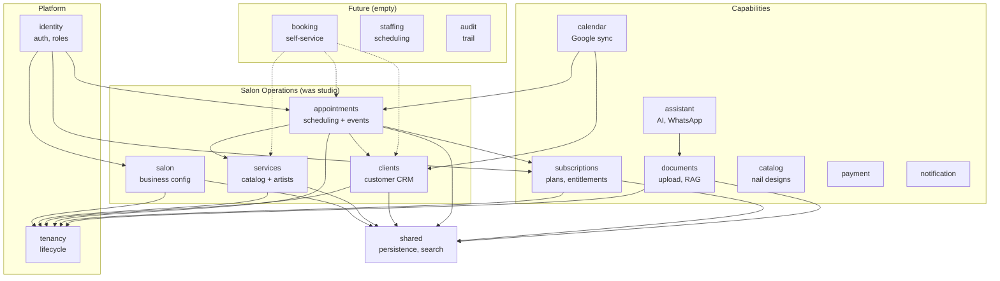

# Studio Module Decomposition — Implementation Plan

> **For agentic workers:** Use superpowers:subagent-driven-development to implement this plan task-by-task.

**Goal:** Decompose `modules/studio` (200+ Java files, 4 bounded contexts) into 6 DDD modules using a scripted migration with precise type-to-module mapping.

**Architecture:** The `studio` monolith dissolves into `services` (catalog + artists), `clients` (customer CRM), `appointments` (scheduling + events), `salon` (business config), `subscriptions` (plans, entitlements), and `documents` (upload, RAG). Empty modules `customer` and `workforce` are renamed to `clients` and `staffing`. Result: 17 modules.

**Tech Stack:** Java 25, Spring Boot 4.1, Spring Modulith 2.1, Gradle Kotlin DSL, Bun (for migration script)

## Global Constraints

- Java 25: `JAVA_HOME=$(mise exec -- printenv JAVA_HOME)`
- Gradle: `./gradlew --no-configuration-cache`
- Package: `com.emme.<module>`
- Every module needs `build.gradle.kts`, root `@ApplicationModule` on `package-info.java`, `api/package-info.java`
- Zero `com.emme.studio` imports after migration
- Each task independently committable, build green before each commit

## Dependency Graph (target state)



## Type-to-Module Mapping

Every `com.emme.studio.*` type maps to exactly ONE target module. Use this table for ALL import rewrites.

### Appointments module

| Original type/pattern | New import |
|---|---|
| `com.emme.studio.domain.model.Appointment` | `com.emme.appointments.domain.model.Appointment` |
| `com.emme.studio.domain.model.AppointmentStatus` | `com.emme.appointments.domain.model.AppointmentStatus` |
| `com.emme.studio.domain.model.ExternalCalendarStatus` | `com.emme.appointments.domain.model.ExternalCalendarStatus` |
| `com.emme.studio.api.event.*` | `com.emme.appointments.api.event.*` |
| `com.emme.studio.api.usecase.*Appointment*UseCase` | `com.emme.appointments.api.usecase.*` |
| `com.emme.studio.api.usecase.FindAvailableSlotsUseCase` | `com.emme.appointments.api.usecase.FindAvailableSlotsUseCase` |
| `com.emme.studio.api.result.*Appointment*` | `com.emme.appointments.api.result.*` |
| `com.emme.studio.api.result.AvailableSlot` | `com.emme.appointments.api.result.AvailableSlot` |
| `com.emme.studio.application.port.out.AppointmentRepository` | `com.emme.appointments.application.port.out.AppointmentRepository` |
| `com.emme.studio.application.port.out.AppointmentCollisionPort` | `com.emme.appointments.application.port.out.AppointmentCollisionPort` |
| `com.emme.studio.application.port.out.AppointmentEventPublisher` | `com.emme.appointments.application.port.out.AppointmentEventPublisher` |
| `com.emme.studio.application.service.*Appointment*Service` | `com.emme.appointments.application.service.*` |
| `com.emme.studio.application.service.FindAvailableSlotsService` | `com.emme.appointments.application.service.FindAvailableSlotsService` |
| `com.emme.studio.application.service.AppointmentApplicationSupport` | `com.emme.appointments.application.service.AppointmentApplicationSupport` |
| `com.emme.studio.application.mapper.AppointmentApplicationMapper` | `com.emme.appointments.application.mapper.AppointmentApplicationMapper` |
| `com.emme.studio.adapter.out.persistence.entity.AppointmentEntity` | `com.emme.appointments.adapter.out.persistence.entity.AppointmentEntity` |
| `com.emme.studio.adapter.out.persistence.mapper.AppointmentPersistenceMapper` | `com.emme.appointments.adapter.out.persistence.mapper.AppointmentPersistenceMapper` |
| `com.emme.studio.adapter.out.persistence.repository.SpringDataAppointmentRepository` | `com.emme.appointments.adapter.out.persistence.repository.SpringDataAppointmentRepository` |
| `com.emme.studio.adapter.out.persistence.adapter.AppointmentPersistenceAdapter` | `com.emme.appointments.adapter.out.persistence.adapter.AppointmentPersistenceAdapter` |
| `com.emme.studio.adapter.out.persistence.adapter.AppointmentCollisionAdapter` | `com.emme.appointments.adapter.out.persistence.adapter.AppointmentCollisionAdapter` |
| `com.emme.studio.adapter.out.messaging.publisher.SpringAppointmentEventPublisher` | `com.emme.appointments.adapter.out.messaging.publisher.SpringAppointmentEventPublisher` |
| `com.emme.studio.adapter.in.web.controller.AppointmentController` | `com.emme.appointments.adapter.in.web.controller.AppointmentController` |
| `com.emme.studio.adapter.in.web.controller.DashboardController` | `com.emme.appointments.adapter.in.web.controller.DashboardController` |
| `com.emme.studio.adapter.in.web.sse.DashboardBroadcaster` | `com.emme.appointments.adapter.in.web.sse.DashboardBroadcaster` |
| `com.emme.studio.adapter.in.web.sse.DashboardSseEvent` | `com.emme.appointments.adapter.in.web.sse.DashboardSseEvent` |

### Services module

| Original type/pattern | New import |
|---|---|
| `com.emme.studio.domain.model.Service` | `com.emme.services.domain.model.Service` |
| `com.emme.studio.domain.model.ServiceStatus` | `com.emme.services.domain.model.ServiceStatus` |
| `com.emme.studio.domain.model.Artist` | `com.emme.services.domain.model.Artist` |
| `com.emme.studio.domain.model.ArtistStatus` | `com.emme.services.domain.model.ArtistStatus` |
| `com.emme.studio.domain.model.ArtistCapability` | `com.emme.services.domain.model.ArtistCapability` |
| `com.emme.studio.api.usecase.*Service*UseCase` | `com.emme.services.api.usecase.*` |
| `com.emme.studio.api.usecase.*Artist*UseCase` | `com.emme.services.api.usecase.*` |
| `com.emme.studio.api.result.*Service*` | `com.emme.services.api.result.*` |
| `com.emme.studio.api.result.*Artist*` | `com.emme.services.api.result.*` |
| `com.emme.studio.application.port.out.ServiceRepository` | `com.emme.services.application.port.out.ServiceRepository` |
| `com.emme.studio.application.port.out.ArtistRepository` | `com.emme.services.application.port.out.ArtistRepository` |
| `com.emme.studio.application.port.out.ArtistCapabilityRepository` | `com.emme.services.application.port.out.ArtistCapabilityRepository` |
| `com.emme.studio.application.service.*Service*Service` | `com.emme.services.application.service.*` |
| `com.emme.studio.application.service.*Artist*Service` | `com.emme.services.application.service.*` |
| `com.emme.studio.application.mapper.ServiceCatalogApplicationMapper` | `com.emme.services.application.mapper.ServiceCatalogApplicationMapper` |
| `com.emme.studio.application.mapper.ArtistApplicationMapper` | `com.emme.services.application.mapper.ArtistApplicationMapper` |
| `com.emme.studio.adapter.out.persistence.entity.ServiceEntity` | `com.emme.services.adapter.out.persistence.entity.ServiceEntity` |
| `com.emme.studio.adapter.out.persistence.entity.ArtistEntity` | `com.emme.services.adapter.out.persistence.entity.ArtistEntity` |
| `com.emme.studio.adapter.out.persistence.entity.ArtistCapabilityEntity` | `com.emme.services.adapter.out.persistence.entity.ArtistCapabilityEntity` |
| `com.emme.studio.adapter.out.persistence.mapper.ServicePersistenceMapper` | `com.emme.services.adapter.out.persistence.mapper.ServicePersistenceMapper` |
| `com.emme.studio.adapter.out.persistence.mapper.ArtistPersistenceMapper` | `com.emme.services.adapter.out.persistence.mapper.ArtistPersistenceMapper` |
| `com.emme.studio.adapter.out.persistence.mapper.ArtistCapabilityPersistenceMapper` | `com.emme.services.adapter.out.persistence.mapper.ArtistCapabilityPersistenceMapper` |
| `com.emme.studio.adapter.out.persistence.repository.SpringDataServiceRepository` | `com.emme.services.adapter.out.persistence.repository.SpringDataServiceRepository` |
| `com.emme.studio.adapter.out.persistence.repository.SpringDataArtistRepository` | `com.emme.services.adapter.out.persistence.repository.SpringDataArtistRepository` |
| `com.emme.studio.adapter.out.persistence.repository.SpringDataArtistCapabilityRepository` | `com.emme.services.adapter.out.persistence.repository.SpringDataArtistCapabilityRepository` |
| `com.emme.studio.adapter.out.persistence.adapter.ServicePersistenceAdapter` | `com.emme.services.adapter.out.persistence.adapter.ServicePersistenceAdapter` |
| `com.emme.studio.adapter.out.persistence.adapter.ArtistPersistenceAdapter` | `com.emme.services.adapter.out.persistence.adapter.ArtistPersistenceAdapter` |
| `com.emme.studio.adapter.out.persistence.adapter.ArtistCapabilityPersistenceAdapter` | `com.emme.services.adapter.out.persistence.adapter.ArtistCapabilityPersistenceAdapter` |
| `com.emme.studio.adapter.in.web.controller.ServiceController` | `com.emme.services.adapter.in.web.controller.ServiceController` |
| `com.emme.studio.adapter.in.web.controller.ArtistController` | `com.emme.services.adapter.in.web.controller.ArtistController` |
| `com.emme.studio.adapter.in.web.request.CreateServiceRequest` | `com.emme.services.adapter.in.web.request.CreateServiceRequest` |
| `com.emme.studio.adapter.in.web.request.UpdateServiceRequest` | `com.emme.services.adapter.in.web.request.UpdateServiceRequest` |
| `com.emme.studio.adapter.in.web.request.CreateArtistRequest` | `com.emme.services.adapter.in.web.request.CreateArtistRequest` |
| `com.emme.studio.adapter.in.web.request.UpdateArtistRequest` | `com.emme.services.adapter.in.web.request.UpdateArtistRequest` |
| `com.emme.studio.adapter.in.web.request.AddArtistCapabilityRequest` | `com.emme.services.adapter.in.web.request.AddArtistCapabilityRequest` |
| `com.emme.studio.adapter.in.web.response.ServiceResponse` | `com.emme.services.adapter.in.web.response.ServiceResponse` |
| `com.emme.studio.adapter.in.web.response.ArtistResponse` | `com.emme.services.adapter.in.web.response.ArtistResponse` |
| `com.emme.studio.adapter.in.web.response.ArtistCapabilityResponse` | `com.emme.services.adapter.in.web.response.ArtistCapabilityResponse` |

### Clients module

| Original type/pattern | New import |
|---|---|
| `com.emme.studio.domain.model.Customer` | `com.emme.clients.domain.model.Customer` |
| `com.emme.studio.domain.model.CustomerStatus` | `com.emme.clients.domain.model.CustomerStatus` |
| `com.emme.studio.api.usecase.*Customer*UseCase` | `com.emme.clients.api.usecase.*` |
| `com.emme.studio.api.usecase.ListCustomersUseCase` | `com.emme.clients.api.usecase.ListCustomersUseCase` |
| `com.emme.studio.api.usecase.SearchCustomersUseCase` | `com.emme.clients.api.usecase.SearchCustomersUseCase` |
| `com.emme.studio.api.result.*Customer*` | `com.emme.clients.api.result.*` |
| `com.emme.studio.application.port.out.CustomerRepository` | `com.emme.clients.application.port.out.CustomerRepository` |
| `com.emme.studio.application.service.*Customer*Service` | `com.emme.clients.application.service.*` |
| `com.emme.studio.application.mapper.CustomerApplicationMapper` | `com.emme.clients.application.mapper.CustomerApplicationMapper` |
| `com.emme.studio.adapter.out.persistence.entity.CustomerEntity` | `com.emme.clients.adapter.out.persistence.entity.CustomerEntity` |
| `com.emme.studio.adapter.out.persistence.mapper.CustomerPersistenceMapper` | `com.emme.clients.adapter.out.persistence.mapper.CustomerPersistenceMapper` |
| `com.emme.studio.adapter.out.persistence.repository.SpringDataCustomerRepository` | `com.emme.clients.adapter.out.persistence.repository.SpringDataCustomerRepository` |
| `com.emme.studio.adapter.out.persistence.adapter.CustomerPersistenceAdapter` | `com.emme.clients.adapter.out.persistence.adapter.CustomerPersistenceAdapter` |
| `com.emme.studio.adapter.in.web.controller.CustomerController` | `com.emme.clients.adapter.in.web.controller.CustomerController` |
| `com.emme.studio.adapter.in.web.request.CreateCustomerRequest` | `com.emme.clients.adapter.in.web.request.CreateCustomerRequest` |
| `com.emme.studio.adapter.in.web.request.UpdateCustomerRequest` | `com.emme.clients.adapter.in.web.request.UpdateCustomerRequest` |
| `com.emme.studio.adapter.in.web.response.CustomerResponse` | `com.emme.clients.adapter.in.web.response.CustomerResponse` |

### Salon module

| Original type/pattern | New import |
|---|---|
| `com.emme.studio.domain.model.BusinessProfile` | `com.emme.salon.domain.model.BusinessProfile` |
| `com.emme.studio.domain.model.OperatingHours` | `com.emme.salon.domain.model.OperatingHours` |
| `com.emme.studio.domain.model.BookingPolicy` | `com.emme.salon.domain.model.BookingPolicy` |
| `com.emme.studio.domain.model.NotificationPreference` | `com.emme.salon.domain.model.NotificationPreference` |
| `com.emme.studio.domain.model.DayOfWeek` | `com.emme.salon.domain.model.DayOfWeek` |
| `com.emme.studio.domain.model.TemplatePolicy` | `com.emme.salon.domain.model.TemplatePolicy` |
| `com.emme.studio.api.usecase.*BusinessProfile*UseCase` | `com.emme.salon.api.usecase.*` |
| `com.emme.studio.api.usecase.*OperatingHours*UseCase` | `com.emme.salon.api.usecase.*` |
| `com.emme.studio.api.usecase.*BookingPolicy*UseCase` | `com.emme.salon.api.usecase.*` |
| `com.emme.studio.api.result.*BusinessProfile*` | `com.emme.salon.api.result.*` |
| `com.emme.studio.api.result.*OperatingHours*` | `com.emme.salon.api.result.*` |
| `com.emme.studio.api.result.*BookingPolicy*` | `com.emme.salon.api.result.*` |
| `com.emme.studio.api.type.BusinessDay` | `com.emme.salon.api.type.BusinessDay` |
| `com.emme.studio.application.port.out.BusinessProfileRepository` | `com.emme.salon.application.port.out.BusinessProfileRepository` |
| `com.emme.studio.application.port.out.OperatingHoursRepository` | `com.emme.salon.application.port.out.OperatingHoursRepository` |
| `com.emme.studio.application.port.out.BookingPolicyRepository` | `com.emme.salon.application.port.out.BookingPolicyRepository` |
| `com.emme.studio.application.port.out.NotificationPreferenceRepository` | `com.emme.salon.application.port.out.NotificationPreferenceRepository` |
| `com.emme.studio.application.service.*BusinessProfile*Service` | `com.emme.salon.application.service.*` |
| `com.emme.studio.application.service.*OperatingHours*Service` | `com.emme.salon.application.service.*` |
| `com.emme.studio.application.service.*BookingPolicy*Service` | `com.emme.salon.application.service.*` |
| `com.emme.studio.application.mapper.BusinessConfigurationApplicationMapper` | `com.emme.salon.application.mapper.BusinessConfigurationApplicationMapper` |
| `com.emme.studio.adapter.out.persistence.entity.BusinessProfileEntity` | `com.emme.salon.adapter.out.persistence.entity.BusinessProfileEntity` |
| `com.emme.studio.adapter.out.persistence.entity.OperatingHoursEntity` | `com.emme.salon.adapter.out.persistence.entity.OperatingHoursEntity` |
| `com.emme.studio.adapter.out.persistence.entity.BookingPolicyEntity` | `com.emme.salon.adapter.out.persistence.entity.BookingPolicyEntity` |
| `com.emme.studio.adapter.out.persistence.entity.NotificationPreferenceEntity` | `com.emme.salon.adapter.out.persistence.entity.NotificationPreferenceEntity` |
| `com.emme.studio.adapter.out.persistence.mapper.BusinessProfilePersistenceMapper` | `com.emme.salon.adapter.out.persistence.mapper.BusinessProfilePersistenceMapper` |
| `com.emme.studio.adapter.out.persistence.mapper.OperatingHoursPersistenceMapper` | `com.emme.salon.adapter.out.persistence.mapper.OperatingHoursPersistenceMapper` |
| `com.emme.studio.adapter.out.persistence.mapper.BookingPolicyPersistenceMapper` | `com.emme.salon.adapter.out.persistence.mapper.BookingPolicyPersistenceMapper` |
| `com.emme.studio.adapter.out.persistence.repository.SpringDataBusinessProfileRepository` | `com.emme.salon.adapter.out.persistence.repository.SpringDataBusinessProfileRepository` |
| `com.emme.studio.adapter.out.persistence.repository.SpringDataOperatingHoursRepository` | `com.emme.salon.adapter.out.persistence.repository.SpringDataOperatingHoursRepository` |
| `com.emme.studio.adapter.out.persistence.repository.SpringDataBookingPolicyRepository` | `com.emme.salon.adapter.out.persistence.repository.SpringDataBookingPolicyRepository` |
| `com.emme.studio.adapter.out.persistence.repository.SpringDataNotificationPreferenceRepository` | `com.emme.salon.adapter.out.persistence.repository.SpringDataNotificationPreferenceRepository` |
| `com.emme.studio.adapter.out.persistence.adapter.BusinessProfilePersistenceAdapter` | `com.emme.salon.adapter.out.persistence.adapter.BusinessProfilePersistenceAdapter` |
| `com.emme.studio.adapter.out.persistence.adapter.OperatingHoursPersistenceAdapter` | `com.emme.salon.adapter.out.persistence.adapter.OperatingHoursPersistenceAdapter` |
| `com.emme.studio.adapter.out.persistence.adapter.BookingPolicyPersistenceAdapter` | `com.emme.salon.adapter.out.persistence.adapter.BookingPolicyPersistenceAdapter` |
| `com.emme.studio.adapter.in.web.controller.BusinessConfigurationController` | `com.emme.salon.adapter.in.web.controller.BusinessConfigurationController` |
| `com.emme.studio.adapter.in.web.request.UpdateProfileRequest` | `com.emme.salon.adapter.in.web.request.UpdateProfileRequest` |
| `com.emme.studio.adapter.in.web.request.UpdateHoursRequest` | `com.emme.salon.adapter.in.web.request.UpdateHoursRequest` |
| `com.emme.studio.adapter.in.web.request.UpdatePolicyRequest` | `com.emme.salon.adapter.in.web.request.UpdatePolicyRequest` |
| `com.emme.studio.adapter.in.web.response.BusinessProfileResponse` | `com.emme.salon.adapter.in.web.response.BusinessProfileResponse` |
| `com.emme.studio.adapter.in.web.response.OperatingHoursResponse` | `com.emme.salon.adapter.in.web.response.OperatingHoursResponse` |
| `com.emme.studio.adapter.in.web.response.BookingPolicyResponse` | `com.emme.salon.adapter.in.web.response.BookingPolicyResponse` |

### Subscriptions module

| Original type/pattern | New import |
|---|---|
| `com.emme.studio.subscriptions.*` | `com.emme.subscriptions.*` |
| `com.emme.studio.api.exception.StudioResourceNotFoundException` | `com.emme.subscriptions.api.exception.*` (if subscriptions-specific) |

### Documents module

| Original type/pattern | New import |
|---|---|
| `com.emme.studio.documents.*` | `com.emme.documents.*` |

### Shared exception (services module)

| Original type/pattern | New import |
|---|---|
| `com.emme.studio.api.exception.StudioResourceNotFoundException` | `com.emme.services.api.exception.StudioResourceNotFoundException` |

**Note:** All 4 consumers of `StudioResourceNotFoundException` (`AddArtistCapabilityService`, `DeactivateArtistService`, `UpdateArtistService`, `RemoveArtistCapabilityService`) move to the `services` module, so the exception stays in the same module as its consumers.

---

## Implementation Tasks

### Task 1: Rename empty modules

- [ ] **Step 1: Rename directories**

```bash
git mv modules/customer modules/clients
git mv modules/workforce modules/staffing
```

- [ ] **Step 2: Move Java sources to new package directories**

```bash
# clients: move from com/emme/customer/ to com/emme/clients/
mkdir -p modules/clients/src/main/java/com/emme/clients/api
cp modules/clients/src/main/java/com/emme/customer/api/package-info.java modules/clients/src/main/java/com/emme/clients/api/
cp modules/clients/src/main/java/com/emme/customer/package-info.java modules/clients/src/main/java/com/emme/clients/
rm -rf modules/clients/src/main/java/com/emme/customer

mkdir -p modules/clients/src/test/java/com/emme/clients
cp modules/clients/src/test/java/com/emme/customer/*.java modules/clients/src/test/java/com/emme/clients/ 2>/dev/null || true
rm -rf modules/clients/src/test/java/com/emme/customer

# staffing: move from com/emme/workforce/ to com/emme/staffing/
mkdir -p modules/staffing/src/main/java/com/emme/staffing/api
cp modules/staffing/src/main/java/com/emme/workforce/api/package-info.java modules/staffing/src/main/java/com/emme/staffing/api/
cp modules/staffing/src/main/java/com/emme/workforce/package-info.java modules/staffing/src/main/java/com/emme/staffing/
rm -rf modules/staffing/src/main/java/com/emme/workforce

mkdir -p modules/staffing/src/test/java/com/emme/staffing
cp modules/staffing/src/test/java/com/emme/workforce/*.java modules/staffing/src/test/java/com/emme/staffing/ 2>/dev/null || true
rm -rf modules/staffing/src/test/java/com/emme/workforce
```

- [ ] **Step 3: Update package-info.java annotations**

`modules/clients/src/main/java/com/emme/clients/package-info.java`:
```java
@org.springframework.modulith.ApplicationModule(
    displayName = "Clients",
    allowedDependencies = {"shared :: persistence", "tenancy"})
package com.emme.clients;
```

`modules/clients/src/main/java/com/emme/clients/api/package-info.java`:
```java
package com.emme.clients.api;
```

`modules/staffing/src/main/java/com/emme/staffing/package-info.java`:
```java
@org.springframework.modulith.ApplicationModule(
    displayName = "Staffing",
    allowedDependencies = {"shared", "tenancy"})
package com.emme.staffing;
```

`modules/staffing/src/main/java/com/emme/staffing/api/package-info.java`:
```java
package com.emme.staffing.api;
```

- [ ] **Step 4: Update test file package declarations**

```bash
sed -i '' 's/package com\.emme\.customer;/package com.emme.clients;/g' modules/clients/src/test/java/com/emme/clients/*.java
sed -i '' 's/"customer"/"clients"/g' modules/clients/src/test/java/com/emme/clients/CustomerModuleTest.java
sed -i '' 's/package com\.emme\.workforce;/package com.emme.staffing;/g' modules/staffing/src/test/java/com/emme/staffing/*.java
sed -i '' 's/"workforce"/"staffing"/g' modules/staffing/src/test/java/com/emme/staffing/WorkforceModuleTest.java
```

- [ ] **Step 5: Update settings.gradle.kts**

Replace `include(":modules:customer")` with `include(":modules:clients")`
Replace `include(":modules:workforce")` with `include(":modules:staffing")`

- [ ] **Step 6: Update emme-platform/build.gradle.kts**

Replace `implementation(project(":modules:customer"))` with `implementation(project(":modules:clients"))`
Replace `implementation(project(":modules:workforce"))` with `implementation(project(":modules:staffing"))`

- [ ] **Step 7: Update booking/build.gradle.kts**

Replace `implementation(project(":modules:customer"))` with `implementation(project(":modules:clients"))`
Replace `implementation(project(":modules:workforce"))` with `implementation(project(":modules:staffing"))`

- [ ] **Step 8: Verify and commit**

```bash
JAVA_HOME=$(mise exec -- printenv JAVA_HOME) ./gradlew :modules:clients:compileJava :modules:staffing:compileJava --no-configuration-cache
```
Expected: BUILD SUCCESSFUL

```bash
git add -A && git commit -m "refactor: rename customer->clients, workforce->staffing"
```

---

### Task 2: Create module shells (build + package-info)

- [ ] **Step 1: Create directory structure for new modules**

```bash
for mod in services appointments salon subscriptions documents; do
  mkdir -p modules/$mod/src/main/java/com/emme/$mod/api
  mkdir -p modules/$mod/src/test/java/com/emme/$mod
done
```

- [ ] **Step 2: Create build.gradle.kts for each module**

**modules/services/build.gradle.kts**:
```kotlin
plugins {
  id("emme.spring-module")
  id("emme.integration-testing")
  id("emme.spring-web")
  id("emme.persistence")
  id("emme.testing")
}
dependencies {
  implementation(project(":modules:shared"))
  implementation(project(":libraries:kernel"))
  implementation(project(":modules:tenancy"))
  implementation(libs.spring.boot.starter.web)
  implementation(libs.spring.boot.starter.validation)
  implementation(libs.springdoc.openapi.starter.webmvc.ui)
  testImplementation(testFixtures(project(":libraries:testing")))
}
```

**modules/appointments/build.gradle.kts**:
```kotlin
plugins {
  id("emme.spring-module")
  id("emme.integration-testing")
  id("emme.spring-web")
  id("emme.persistence")
  id("emme.messaging")
  id("emme.testing")
}
dependencies {
  implementation(project(":modules:shared"))
  implementation(project(":libraries:kernel"))
  implementation(project(":modules:tenancy"))
  implementation(project(":modules:services"))
  implementation(project(":modules:clients"))
  implementation(project(":modules:subscriptions"))
  implementation(libs.spring.boot.starter.web)
  implementation(libs.spring.boot.starter.validation)
  implementation(libs.springdoc.openapi.starter.webmvc.ui)
  testImplementation(testFixtures(project(":libraries:testing")))
}
```

**modules/salon/build.gradle.kts**:
```kotlin
plugins {
  id("emme.spring-module")
  id("emme.integration-testing")
  id("emme.spring-web")
  id("emme.persistence")
  id("emme.testing")
}
dependencies {
  implementation(project(":modules:shared"))
  implementation(project(":libraries:kernel"))
  implementation(project(":modules:tenancy"))
  implementation(libs.spring.boot.starter.web)
  implementation(libs.spring.boot.starter.validation)
  implementation(libs.springdoc.openapi.starter.webmvc.ui)
  testImplementation(testFixtures(project(":libraries:testing")))
}
```

**modules/subscriptions/build.gradle.kts**:
```kotlin
plugins {
  id("emme.spring-module")
  id("emme.integration-testing")
  id("emme.spring-web")
  id("emme.persistence")
  id("emme.testing")
  id("emme.test-fixtures")
}
dependencies {
  implementation(project(":modules:shared"))
  implementation(project(":libraries:kernel"))
  implementation(project(":modules:tenancy"))
  implementation(libs.spring.boot.starter.web)
  implementation(libs.spring.boot.starter.validation)
  implementation(libs.springdoc.openapi.starter.webmvc.ui)
  testImplementation(testFixtures(project(":libraries:testing")))
}
```

**modules/documents/build.gradle.kts**:
```kotlin
plugins {
  id("emme.spring-module")
  id("emme.integration-testing")
  id("emme.spring-web")
  id("emme.persistence")
  id("emme.testing")
}
dependencies {
  implementation(project(":modules:shared"))
  implementation(project(":libraries:kernel"))
  implementation(project(":modules:tenancy"))
  implementation(libs.spring.boot.starter.web)
  implementation(libs.spring.boot.starter.validation)
  implementation(libs.springdoc.openapi.starter.webmvc.ui)
  testImplementation(testFixtures(project(":libraries:testing")))
}
```

**Update modules/clients/build.gradle.kts**:
```kotlin
plugins {
  id("emme.spring-module")
  id("emme.integration-testing")
  id("emme.spring-web")
  id("emme.persistence")
  id("emme.testing")
}
dependencies {
  implementation(project(":modules:shared"))
  implementation(project(":libraries:kernel"))
  implementation(project(":modules:tenancy"))
  implementation(libs.spring.boot.starter.web)
  implementation(libs.spring.boot.starter.validation)
  implementation(libs.springdoc.openapi.starter.webmvc.ui)
  testImplementation(testFixtures(project(":libraries:testing")))
}
```

- [ ] **Step 3: Create package-info.java for each module**

**services** (`modules/services/src/main/java/com/emme/services/package-info.java`):
```java
@org.springframework.modulith.ApplicationModule(
    displayName = "Services",
    allowedDependencies = {"shared :: persistence", "tenancy"})
package com.emme.services;
```
No named interface needed — only consumed by `appointments` via full module access.

**appointments** (`modules/appointments/src/main/java/com/emme/appointments/package-info.java`):
```java
@org.springframework.modulith.ApplicationModule(
    displayName = "Appointments",
    allowedDependencies = {
      "shared :: persistence",
      "tenancy",
      "services",
      "clients",
      "subscriptions :: subscriptions-api"
    })
package com.emme.appointments;
```
Full access to `services` and `clients` (needed for repository port interfaces). Only named interface access to `subscriptions` (for `EnforceEntitlementUseCase`).

**salon** (`modules/salon/src/main/java/com/emme/salon/package-info.java`):
```java
@org.springframework.modulith.ApplicationModule(
    displayName = "Salon",
    allowedDependencies = {"shared :: persistence", "tenancy"})
package com.emme.salon;
```

**subscriptions** (`modules/subscriptions/src/main/java/com/emme/subscriptions/package-info.java`):
```java
@org.springframework.modulith.ApplicationModule(
    displayName = "Subscriptions",
    allowedDependencies = {"shared", "tenancy"})
package com.emme.subscriptions;
```

**documents** (`modules/documents/src/main/java/com/emme/documents/package-info.java`):
```java
@org.springframework.modulith.ApplicationModule(
    displayName = "Documents",
    allowedDependencies = {"shared :: persistence", "shared :: search", "tenancy"})
package com.emme.documents;
```

- [ ] **Step 4: Create api/package-info.java for each module**

```bash
for mod in services appointments salon subscriptions documents; do
  echo "package com.emme.$mod.api;" > "modules/$mod/src/main/java/com/emme/$mod/api/package-info.java"
done
```

- [ ] **Step 5: Create module test stubs**

```bash
for mod in services appointments salon subscriptions documents; do
  MOD_NAME="$(echo ${mod:0:1} | tr '[:lower:]' '[:upper:]')${mod:1}"
  cat > "modules/$mod/src/test/java/com/emme/$mod/${MOD_NAME}ModuleTest.java" << EOF
package com.emme.$mod;

import static org.assertj.core.api.Assertions.assertThat;
import com.emme.testing.BaseUnitTest;
import org.junit.jupiter.api.Test;

class ${MOD_NAME}ModuleTest extends BaseUnitTest {
  @Test void moduleLoads() { assertThat(getClass().getPackageName()).contains("$mod"); }
  @Test void testStructureExists() { assertThat(true).isTrue(); }
}
EOF
done
```

- [ ] **Step 6: Verify**

```bash
JAVA_HOME=$(mise exec -- printenv JAVA_HOME) ./gradlew :modules:services:compileJava :modules:appointments:compileJava :modules:salon:compileJava :modules:subscriptions:compileJava :modules:documents:compileJava --no-configuration-cache
```
Expected: BUILD SUCCESSFUL

```bash
git add -A && git commit -m "feat: create module shells for studio decomposition"
```

---

### Task 3: Run migration script

- [ ] **Step 1: Create the migration script**

Write `scripts/migrate-studio.mjs`:

```javascript
import { readFileSync, writeFileSync, mkdirSync, readdirSync, statSync } from 'fs';
import { join, dirname, relative } from 'path';

const STUDIO_SRC = 'modules/studio/src/main/java';
const STUDIO_TEST = 'modules/studio/src/test/java';

const TYPE_MAP = {
  // Appointments
  'Appointment': 'appointments', 'AppointmentStatus': 'appointments',
  'ExternalCalendarStatus': 'appointments', 'AppointmentCreated': 'appointments',
  'AppointmentCancelled': 'appointments', 'AppointmentRescheduled': 'appointments',
  'AppointmentDetails': 'appointments', 'AppointmentSummary': 'appointments',
  'AvailableSlot': 'appointments', 'FindAvailableSlot': 'appointments',
  // Services
  'Service': 'services', 'ServiceStatus': 'services',
  'Artist': 'services', 'ArtistStatus': 'services', 'ArtistCapability': 'services',
  'ArtistDetails': 'services', 'ServiceDetails': 'services',
  'ArtistCapabilityDetails': 'services', 'StudioResourceNotFound': 'services',
  // Clients
  'Customer': 'clients', 'CustomerStatus': 'clients',
  'CustomerDetails': 'clients', 'CustomerSummary': 'clients',
  // Salon
  'BusinessProfile': 'salon', 'OperatingHours': 'salon',
  'BookingPolicy': 'salon', 'NotificationPreference': 'salon',
  'DayOfWeek': 'salon', 'TemplatePolicy': 'salon',
  'BusinessProfileDetails': 'salon', 'BusinessProfileSummary': 'salon',
  'OperatingHoursDetails': 'salon', 'BookingPolicyDetails': 'salon',
  'BusinessDay': 'salon',
};

function getTargetModule(pkg) {
  const p = pkg === 'com.emme.studio' ? '' : pkg.replace('com.emme.studio.', '');
  if (p.startsWith('documents')) return 'documents';
  if (p.startsWith('subscriptions')) return 'subscriptions';
  return null; // determined per-file by imports
}

function mapTypeToModule(className) {
  if (TYPE_MAP[className]) return TYPE_MAP[className];
  for (const [key, mod] of Object.entries(TYPE_MAP)) {
    if (className.startsWith(key)) return mod;
  }
  return null;
}

function rewriteImports(content, defaultMod) {
  return content.replace(/import com\.emme\.studio(\.[a-z.]+)?\.([A-Z]\w*);/g, (match, subpkg, className) => {
    const mod = mapTypeToModule(className);
    if (!mod) {
      if (subpkg && subpkg.includes('subscriptions')) return match.replace('com.emme.studio', 'com.emme.subscriptions');
      if (subpkg && subpkg.includes('documents')) return match.replace('com.emme.studio', 'com.emme.documents');
      return match.replace('com.emme.studio', `com.emme.${defaultMod}`);
    }
    const suffix = match.substring('import com.emme.studio'.length);
    return `import com.emme.${mod}${suffix}`;
  });
}

function migrateDir(srcDir, srcBase, isTest) {
  const files = [];
  function walk(dir) {
    if (!statSync(dir, {throwIfNoEntry: false})?.isDirectory()) return;
    for (const entry of readdirSync(dir)) {
      const full = join(dir, entry);
      if (statSync(full).isDirectory()) walk(full);
      else if (entry.endsWith('.java')) files.push(full);
    }
  }
  walk(srcDir);

  let count = 0;
  for (const file of files) {
    const content = readFileSync(file, 'utf8');
    const pkgMatch = content.match(/^package (com\.emme\.studio(?:\.[a-z.]+)?);/m);
    if (!pkgMatch) continue;

    const originalPkg = pkgMatch[1];
    let targetMod = getTargetModule(originalPkg);

    // For core studio files, determine module from file path
    // IMPORTANT: check patterns in priority order — Customer before Service,
    // FindAvailableSlot before Appointment, etc. to avoid false matches.
    if (!targetMod) {
      const rel = relative(srcBase, file);
      if (rel.includes('Customer')) targetMod = 'clients';
      else if (rel.includes('FindAvailableSlot')) targetMod = 'appointments';
      else if (rel.includes('Appointment') || rel.includes('/sse/') || rel.includes('/messaging/')) targetMod = 'appointments';
      else if (rel.includes('Artist')) targetMod = 'services';
      else if (rel.includes('Service')) targetMod = 'services';  // checked AFTER Customer and Appointment
      else if (rel.includes('BusinessProfile') || rel.includes('OperatingHours') || rel.includes('BookingPolicy') || rel.includes('NotificationPreference')) targetMod = 'salon';
      else if (rel.includes('Dashboard')) targetMod = 'appointments';
      else continue; // skip unspecified
    }

    let newContent = content;
    // Rewrite package
    newContent = newContent.replace(
      new RegExp(`^package ${originalPkg.replace(/\./g, '\\.')};`, 'm'),
      `package ${originalPkg.replace('com.emme.studio', `com.emme.${targetMod}`)};`
    );
    // Rewrite imports
    newContent = rewriteImports(newContent, targetMod);

    // Output path
    const rel = relative(srcBase, file);
    const newRel = rel.replace('com/emme/studio', `com/emme/${targetMod}`);
    const outFile = isTest
      ? `modules/${targetMod}/src/test/java/${newRel}`
      : `modules/${targetMod}/src/main/java/${newRel}`;

    mkdirSync(dirname(outFile), { recursive: true });
    writeFileSync(outFile, newContent);
    count++;
  }
  return count;
}

const mainCount = migrateDir(`${STUDIO_SRC}/com/emme/studio`, STUDIO_SRC, false);
const docCount = migrateDir(`${STUDIO_SRC}/com/emme/studio/documents`, STUDIO_SRC, false);
const subCount = migrateDir(`${STUDIO_SRC}/com/emme/studio/subscriptions`, STUDIO_SRC, false);
const testCount = migrateDir(STUDIO_TEST, STUDIO_TEST, true);

console.log(`Migrated: ${mainCount} core + ${docCount} documents + ${subCount} subscriptions + ${testCount} test = ${mainCount + docCount + subCount + testCount} total files`);
```

- [ ] **Step 2: Run the migration script**

```bash
bun scripts/migrate-studio.mjs
```

Expected output: lists total files migrated

- [ ] **Step 3: Verify no studio imports remain in target modules**

```bash
rg "import com\.emme\.studio\." --glob "*.java" modules/services/ modules/clients/ modules/appointments/ modules/salon/ modules/subscriptions/ modules/documents/
```
Expected: zero output

- [ ] **Step 4: Create package-info.java files for ALL sub-packages in new modules (main + test)**

```bash
# Main source paths
for mod in services appointments salon subscriptions documents; do
  MOD_DIR="modules/$mod/src/main/java/com/emme/$mod"
  for dir in $(find "$MOD_DIR" -type d 2>/dev/null); do
    if [ ! -f "$dir/package-info.java" ]; then
      pkg=$(echo "$dir" | sed 's|.*/com/emme/||' | tr '/' '.')
      echo "package com.emme.$pkg;" > "$dir/package-info.java"
    fi
  done
done

# Test source paths (required by PackageMetadataArchitectureTest)
for mod in services appointments salon subscriptions documents clients; do
  TEST_DIR="modules/$mod/src/test/java/com/emme/$mod"
  if [ -d "$TEST_DIR" ]; then
    for dir in $(find "$TEST_DIR" -type d 2>/dev/null); do
      if [ ! -f "$dir/package-info.java" ]; then
        pkg=$(echo "$dir" | sed 's|.*/com/emme/||' | tr '/' '.')
        echo "package com.emme.$pkg;" > "$dir/package-info.java"
      fi
    done
  fi
done
```

- [ ] **Step 5: Verify compilation**

```bash
JAVA_HOME=$(mise exec -- printenv JAVA_HOME) ./gradlew :modules:services:compileJava :modules:appointments:compileJava :modules:salon:compileJava :modules:subscriptions:compileJava :modules:documents:compileJava :modules:clients:compileJava --no-configuration-cache
```
Expected: BUILD SUCCESSFUL. Fix any compilation errors from edge cases in the type map.

```bash
git add -A && git commit -m "refactor: migrate studio source files to new modules"
```

---

### Task 4: Update settings.gradle.kts, emme-platform, and ALL build.gradle.kts references

- [ ] **Step 1: Update settings.gradle.kts**

Remove `include(":modules:studio")`. Add:
```kotlin
include(":modules:services")
include(":modules:appointments")
include(":modules:salon")
include(":modules:subscriptions")
include(":modules:documents")
```

The final list should have 17 module includes (replacing `studio`, `customer`, `workforce` with 6 new + 2 renamed).

- [ ] **Step 2: Update applications/emme-platform/build.gradle.kts**

Remove:
```kotlin
  implementation(project(":modules:studio"))
  implementation(project(":modules:customer"))
  implementation(project(":modules:workforce"))
```

Add:
```kotlin
  implementation(project(":modules:services"))
  implementation(project(":modules:clients"))
  implementation(project(":modules:appointments"))
  implementation(project(":modules:salon"))
  implementation(project(":modules:subscriptions"))
  implementation(project(":modules:documents"))
  implementation(project(":modules:staffing"))
```

Also update integration test dependency (line ~95):
```kotlin
  add("integrationTestImplementation", project(":modules:services"))
```

- [ ] **Step 3: Update modules/booking/build.gradle.kts**

Replace `implementation(project(":modules:studio"))` with:
```kotlin
  implementation(project(":modules:services"))
  implementation(project(":modules:appointments"))
  implementation(project(":modules:salon"))
```

- [ ] **Step 4: Verify**

```bash
JAVA_HOME=$(mise exec -- printenv JAVA_HOME) ./gradlew :applications:emme-platform:compileJava --no-configuration-cache
```
Expected: BUILD SUCCESSFUL

```bash
git add -A && git commit -m "build: update settings and platform deps for new modules"
```

- [ ] **Step 5: Update build-logic archive name**

`build-logic/src/main/kotlin/emme.spring-application.gradle.kts` — replace:
```kotlin
  archiveFileName.set("emme-studio.jar")
```
With:
```kotlin
  archiveFileName.set("emme-platform.jar")
```

- [ ] **Step 6: Update libraries/testing/build.gradle.kts**

Replace:
```kotlin
  testFixturesImplementation(project(":modules:studio"))
```
With:
```kotlin
  testFixturesImplementation(project(":modules:salon"))
  testFixturesImplementation(project(":modules:subscriptions"))
```
(BaseSpringModuleTest needs `SpringDataBusinessProfileRepository` from salon and `PlanType` + `SubscriptionFixtures` from subscriptions. The direct `SubscriptionEntity`/`SpringDataSubscriptionRepository` imports are removed in Task 6.)

- [ ] **Step 7: Update ALL module build.gradle.kts files that declare studio as dependency**

Each of these files has `implementation(project(":modules:studio"))` — update to the correct new modules:

| File | Replace with |
|---|---|
| `modules/identity/build.gradle.kts` | `implementation(project(":modules:salon"))` + `implementation(project(":modules:appointments"))` + `implementation(project(":modules:subscriptions"))` |
| `modules/calendar/build.gradle.kts` | `implementation(project(":modules:appointments"))` + `implementation(project(":modules:clients"))` |
| `modules/assistant/build.gradle.kts` | `implementation(project(":modules:documents"))` |

- [ ] **Step 8: Verify all build files**

```bash
JAVA_HOME=$(mise exec -- printenv JAVA_HOME) ./gradlew :applications:emme-platform:compileJava --no-configuration-cache
```
Expected: BUILD SUCCESSFUL

```bash
git add -A && git commit -m "build: update all build files for new modules (build-logic, testing libs, module deps)"
```

---

### Task 5: Update cross-module consumers (identity, calendar, assistant)

- [ ] **Step 1: Update identity module imports**

```bash
# salon types
sed -i '' 's/import com\.emme\.studio\.api\.result\.BusinessProfileSummary/import com.emme.salon.api.result.BusinessProfileSummary/g' modules/identity/src/main/java/com/emme/identity/api/result/CurrentUserDetails.java
sed -i '' 's/import com\.emme\.studio\.api\.usecase\.GetBusinessProfileUseCase/import com.emme.salon.api.usecase.GetBusinessProfileUseCase/g' modules/identity/src/main/java/com/emme/identity/application/service/GetCurrentUserService.java

# appointment events
sed -i '' 's/import com\.emme\.studio\.api\.event\.AppointmentCreated/import com.emme.appointments.api.event.AppointmentCreated/g' modules/identity/src/main/java/com/emme/identity/adapter/in/messaging/consumer/AppointmentCreatedConsumer.java

# subscriptions types (all remaining studio.subscriptions imports)
for f in $(rg -l "com\.emme\.studio\.subscriptions" --glob "*.java" modules/identity/src/); do
  sed -i '' 's/import com\.emme\.studio\.subscriptions/import com.emme.subscriptions/g' "$f"
done
```

- [ ] **Step 2: Update identity test imports**

```bash
sed -i '' 's/import com\.emme\.studio\.api\.event/import com.emme.appointments.api.event/g' modules/identity/src/test/java/com/emme/identity/adapter/in/messaging/consumer/AppointmentCreatedConsumerTest.java
sed -i '' 's/import com\.emme\.studio\.api\.result/import com.emme.salon.api.result/g' modules/identity/src/test/java/com/emme/identity/application/service/GetCurrentUserServiceTest.java
sed -i '' 's/import com\.emme\.studio\.api\.usecase/import com.emme.salon.api.usecase/g' modules/identity/src/test/java/com/emme/identity/application/service/GetCurrentUserServiceTest.java

for f in $(rg -l "com\.emme\.studio\.subscriptions" --glob "*.java" modules/identity/src/test/); do
  sed -i '' 's/import com\.emme\.studio\.subscriptions/import com.emme.subscriptions/g' "$f"
done
```

- [ ] **Step 3: Update identity package-info.java allowedDependencies**

`modules/identity/src/main/java/com/emme/identity/package-info.java` — replace:
```java
  "studio :: studio-api",
  "studio :: studio-events",
  "studio :: subscriptions-api"
```
With:
```java
  "salon :: salon-api",
  "appointments :: appointments-events",
  "subscriptions :: subscriptions-api"
```

- [ ] **Step 4: Update calendar module imports**

```bash
# CalendarSyncListener
sed -i '' 's/import com\.emme\.studio\.api\.event/import com.emme.appointments.api.event/g' modules/calendar/src/main/java/com/emme/calendar/adapter/in/messaging/CalendarSyncListener.java

# GoogleSheetsAdapter
sed -i '' 's/import com\.emme\.studio\.api\.result\.AppointmentSummary/import com.emme.appointments.api.result.AppointmentSummary/g' modules/calendar/src/main/java/com/emme/calendar/adapter/out/google/adapter/GoogleSheetsAdapter.java
sed -i '' 's/import com\.emme\.studio\.api\.result\.CustomerSummary/import com.emme.clients.api.result.CustomerSummary/g' modules/calendar/src/main/java/com/emme/calendar/adapter/out/google/adapter/GoogleSheetsAdapter.java
sed -i '' 's/import com\.emme\.studio\.api\.usecase\.ListAppointmentsUseCase/import com.emme.appointments.api.usecase.ListAppointmentsUseCase/g' modules/calendar/src/main/java/com/emme/calendar/adapter/out/google/adapter/GoogleSheetsAdapter.java
sed -i '' 's/import com\.emme\.studio\.api\.usecase\.ListCustomersUseCase/import com.emme.clients.api.usecase.ListCustomersUseCase/g' modules/calendar/src/main/java/com/emme/calendar/adapter/out/google/adapter/GoogleSheetsAdapter.java
```

- [ ] **Step 5: Update calendar package-info.java allowedDependencies**

Replace `"studio"`, `"studio :: studio-api"`, `"studio :: studio-events"` with:
```java
  "appointments",
  "appointments :: appointments-api",
  "appointments :: appointments-events",
  "clients :: clients-api"
```

- [ ] **Step 6: Update assistant module imports**

```bash
sed -i '' 's/import com\.emme\.studio\.documents/import com.emme.documents/g' modules/assistant/src/main/java/com/emme/assistant/ai/application/service/RagQueryService.java

for f in $(rg -l "com\.emme\.studio\.documents" --glob "*.java" modules/assistant/src/test/); do
  sed -i '' 's/import com\.emme\.studio\.documents/import com.emme.documents/g' "$f"
done
```

- [ ] **Step 7: Update assistant package-info.java allowedDependencies**

Replace `"studio :: documents-api"` with `"documents :: documents-api"`.

- [ ] **Step 8: Update consumer @ApplicationModule allowedDependencies in package-info.java**

**identity** (`modules/identity/src/main/java/com/emme/identity/package-info.java`) — replace:
```java
      "studio :: subscriptions-api",
      "studio :: studio-api",
      "studio :: studio-events"
```
With:
```java
      "subscriptions :: subscriptions-api",
      "salon :: salon-api",
      "appointments :: appointments-events"
```

**calendar** (`modules/calendar/src/main/java/com/emme/calendar/package-info.java`) — replace:
```java
      "studio",
      "studio :: studio-api",
      "studio :: studio-events"
```
With:
```java
      "appointments :: appointments-api",
      "appointments :: appointments-events",
      "clients :: clients-api"
```
(Removed bare `"appointments"` — only named interfaces. calendar imports `AppointmentSummary`, `ListAppointmentsUseCase` from appointments-api; `AppointmentCreated/Rescheduled/Cancelled` from appointments-events; `CustomerSummary`, `ListCustomersUseCase` from clients-api.)

**assistant** (`modules/assistant/src/main/java/com/emme/assistant/package-info.java`) — replace:
```java
      "studio :: documents-api"
```
With:
```java
      "documents :: documents-api"
```

- [ ] **Step 9: Declare minimal @NamedInterface on new module API packages**

Only expose what external modules actually consume. `services` needs NO named interface (only consumed by `appointments` via full module access).

**clients** — calendar imports `CustomerSummary` and `ListCustomersUseCase`:
```bash
echo '@org.springframework.modulith.NamedInterface("clients-api")
package com.emme.clients.api.usecase;' > modules/clients/src/main/java/com/emme/clients/api/usecase/package-info.java
echo '@org.springframework.modulith.NamedInterface("clients-api")
package com.emme.clients.api.result;' > modules/clients/src/main/java/com/emme/clients/api/result/package-info.java
```

**appointments** — calendar imports `AppointmentSummary`, `ListAppointmentsUseCase`; calendar+identity import events:
```bash
echo '@org.springframework.modulith.NamedInterface("appointments-api")
package com.emme.appointments.api.usecase;' > modules/appointments/src/main/java/com/emme/appointments/api/usecase/package-info.java
echo '@org.springframework.modulith.NamedInterface("appointments-api")
package com.emme.appointments.api.result;' > modules/appointments/src/main/java/com/emme/appointments/api/result/package-info.java
echo '@org.springframework.modulith.NamedInterface("appointments-events")
package com.emme.appointments.api.event;' > modules/appointments/src/main/java/com/emme/appointments/api/event/package-info.java
```

**salon** — identity imports `BusinessProfileSummary`, `GetBusinessProfileUseCase`:
```bash
echo '@org.springframework.modulith.NamedInterface("salon-api")
package com.emme.salon.api.usecase;' > modules/salon/src/main/java/com/emme/salon/api/usecase/package-info.java
echo '@org.springframework.modulith.NamedInterface("salon-api")
package com.emme.salon.api.result;' > modules/salon/src/main/java/com/emme/salon/api/result/package-info.java
```

**subscriptions** — identity imports `PlanType`, `GetSubscriptionPlanUseCase`, etc.; appointments imports `EnforceEntitlementUseCase`:
```bash
echo '@org.springframework.modulith.NamedInterface("subscriptions-api")
package com.emme.subscriptions.api;' > modules/subscriptions/src/main/java/com/emme/subscriptions/api/package-info.java
```

**documents** — assistant imports `SearchDocumentChunksUseCase`, `SearchDocumentChunksQuery`, `DocumentChunkDetails`:
```bash
echo '@org.springframework.modulith.NamedInterface("documents-api")
package com.emme.documents.api;' > modules/documents/src/main/java/com/emme/documents/api/package-info.java
```

**services** — NO named interface needed (only consumed by `appointments` via full module access `"services"`). No other module imports services API types.

- [ ] **Step 10: Verify consumer modules compile with updated dependencies**

```bash
JAVA_HOME=$(mise exec -- printenv JAVA_HOME) ./gradlew :modules:identity:compileJava :modules:calendar:compileJava :modules:assistant:compileJava --no-configuration-cache
```
Expected: BUILD SUCCESSFUL

```bash
git add -A && git commit -m "refactor: update cross-module consumers after studio decomposition"
```

---

### Task 6: Create subscription test fixtures and fix test coupling

- [ ] **Step 1: Create SubscriptionFixtures**

Write `modules/subscriptions/src/testFixtures/java/com/emme/subscriptions/SubscriptionFixtures.java`:

```java
package com.emme.subscriptions;

import com.emme.subscriptions.api.type.PlanType;
import com.emme.subscriptions.domain.model.Subscription;
import com.emme.subscriptions.domain.model.SubscriptionStatus;
import java.time.Instant;
import java.time.temporal.ChronoUnit;
import java.util.UUID;

public final class SubscriptionFixtures {
  private SubscriptionFixtures() {}

  public static Subscription activeProSubscription(UUID tenantId) {
    return new Subscription(
      UUID.randomUUID(), tenantId, PlanType.PRO,
      SubscriptionStatus.ACTIVE,
      Instant.now().plus(30, ChronoUnit.DAYS),
      Instant.now()
    );
  }

  public static Subscription trialStarterSubscription(UUID tenantId) {
    return new Subscription(
      UUID.randomUUID(), tenantId, PlanType.STARTER,
      SubscriptionStatus.TRIAL,
      Instant.now().plus(14, ChronoUnit.DAYS),
      Instant.now()
    );
  }
}
```

- [ ] **Step 2: Create package-info for testFixtures**

```bash
mkdir -p modules/subscriptions/src/testFixtures/java/com/emme/subscriptions
echo "package com.emme.subscriptions;" > modules/subscriptions/src/testFixtures/java/com/emme/subscriptions/package-info.java
```

- [ ] **Step 3: Update 11 test files to use SubscriptionFixtures**

Files to update (replace `SubscriptionEntity` + `SpringDataSubscriptionRepository` with `SubscriptionFixtures`):
- `modules/appointments/src/test/java/com/emme/appointments/AppointmentWebTest.java`
- `modules/clients/src/test/java/com/emme/clients/CustomerWebTest.java`
- `modules/documents/src/test/java/com/emme/documents/DocumentWebTest.java`
- `modules/assistant/src/test/java/com/emme/assistant/ai/web/AiWebTest.java`
- `modules/assistant/src/test/java/com/emme/conversations/web/ConversationWebTest.java`
- `libraries/testing/src/testFixtures/java/com/emme/testing/BaseSpringModuleTest.java`

For each test file:
- Remove `import com.emme.studio.subscriptions.adapter.out.persistence.entity.SubscriptionEntity;`
- Remove `import com.emme.studio.subscriptions.adapter.out.persistence.repository.SpringDataSubscriptionRepository;`
- Add `import com.emme.subscriptions.SubscriptionFixtures;`
- Replace entity construction with `SubscriptionFixtures.activeProSubscription(tenantId)`

- [ ] **Step 4: Verify**

```bash
JAVA_HOME=$(mise exec -- printenv JAVA_HOME) ./gradlew :modules:subscriptions:compileTestFixturesJava --no-configuration-cache
```
Expected: BUILD SUCCESSFUL

```bash
git add -A && git commit -m "refactor: add subscription test fixtures, fix test coupling"
```

---

### Task 7: Update architecture tests

- [ ] **Step 1: Update ModularityTest**

Find `ModularityTest.java` in `applications/emme-platform/src/test/`. Update `EXPECTED_MODULES` to:
```java
Set.of("shared", "tenancy", "identity", "services", "clients", "appointments",
       "salon", "subscriptions", "documents", "catalog", "booking", "calendar",
       "notification", "payment", "assistant", "staffing", "audit")
```

- [ ] **Step 2: Delete StudioPackageConventionTest**

```bash
rm modules/studio/src/test/java/com/emme/studio/StudioPackageConventionTest.java
```
(The per-module convention tests already cover the structure.)

- [ ] **Step 3: Update BaseSpringModuleTest**

Remove imports of `SubscriptionEntity` and `SpringDataSubscriptionRepository` from `libraries/testing/src/testFixtures/java/com/emme/testing/BaseSpringModuleTest.java`. Replace with `SubscriptionFixtures` import.

- [ ] **Step 4: Verify**

```bash
JAVA_HOME=$(mise exec -- printenv JAVA_HOME) ./gradlew :applications:emme-platform:test --tests '*ModularityTest' --no-configuration-cache
```
Expected: BUILD SUCCESSFUL, ModularityTest passes

```bash
git add -A && git commit -m "test: update architecture tests for new module structure"
```

---

### Task 8: Remove studio module

- [ ] **Step 1: Delete studio**

```bash
git rm -r modules/studio/
```

- [ ] **Step 2: Verify zero remaining studio imports**

```bash
rg "import com\.emme\.studio\." --glob "*.java" --glob "!**/build/**" . | grep -v "modules/studio/"
```
Expected: zero output

- [ ] **Step 3: Verify full compilation**

```bash
JAVA_HOME=$(mise exec -- printenv JAVA_HOME) ./gradlew compileJava --no-configuration-cache
```
Expected: BUILD SUCCESSFUL

```bash
git add -A && git commit -m "refactor: remove decomposed studio module"
```

---

### Task 9: Full verification

- [ ] **Step 1: Compile everything**

```bash
JAVA_HOME=$(mise exec -- printenv JAVA_HOME) ./gradlew compileJava compileTestJava compileTestFixturesJava --no-configuration-cache
```
Expected: BUILD SUCCESSFUL

- [ ] **Step 2: Run all module tests**

```bash
JAVA_HOME=$(mise exec -- printenv JAVA_HOME) ./gradlew test --no-configuration-cache
```
Expected: BUILD SUCCESSFUL, all tests pass

- [ ] **Step 3: Run platform tests**

```bash
JAVA_HOME=$(mise exec -- printenv JAVA_HOME) ./gradlew :applications:emme-platform:test --no-configuration-cache
```
Expected: BUILD SUCCESSFUL, ModularityTest and all ArchUnit tests pass

- [ ] **Step 4: Run Spotless**

```bash
JAVA_HOME=$(mise exec -- printenv JAVA_HOME) ./gradlew spotlessApply spotlessCheck --no-configuration-cache
```
Expected: BUILD SUCCESSFUL, no formatting violations

- [ ] **Step 5: Verify module count**

```bash
ls modules/ | wc -l
```
Expected: 17

- [ ] **Step 6: Verify module list**

```bash
ls modules/ | sort
```
Expected:
```
appointments  assistant  audit  booking  calendar  catalog  clients
documents  identity  notification  payment  salon  services
shared  staffing  subscriptions  tenancy
```

```bash
git add -A && git commit -m "refactor: final verification — all tests pass, 17 modules"
```

---

### Task 11: Clean up test package naming (DDD/hex alignment)

Several existing modules have test packages that don't mirror the main DDD structure. Fix these as part of the decomposition to ensure all modules follow the same conventions.

- [ ] **Step 1: Fix notification `notifications` → `notification` package (plural→singular)**

```bash
# The test module has both com.emme.notification and com.emme.notifications
# Move notifications tests into the correct singular package
mkdir -p modules/notification/src/test/java/com/emme/notification/module
mv modules/notification/src/test/java/com/emme/notifications/module/*.java modules/notification/src/test/java/com/emme/notification/module/ 2>/dev/null || true
rm -rf modules/notification/src/test/java/com/emme/notifications

# Fix package declarations
for f in modules/notification/src/test/java/com/emme/notification/module/*.java; do
  sed -i '' 's/^package com\.emme\.notifications\.module;/package com.emme.notification.module;/g' "$f"
  sed -i '' 's/import com\.emme\.notifications\./import com.emme.notification./g' "$f"
done
```

- [ ] **Step 2: Fix assistant `conversations` → `assistant` test packages**

```bash
# Move conversations tests under the assistant package
for dir in module web; do
  if [ -d "modules/assistant/src/test/java/com/emme/conversations/$dir" ]; then
    mkdir -p "modules/assistant/src/test/java/com/emme/assistant/$dir"
    mv "modules/assistant/src/test/java/com/emme/conversations/$dir"/*.java "modules/assistant/src/test/java/com/emme/assistant/$dir/" 2>/dev/null || true
  fi
done
rm -rf modules/assistant/src/test/java/com/emme/conversations

# Fix package declarations
for f in modules/assistant/src/test/java/com/emme/assistant/module/*.java modules/assistant/src/test/java/com/emme/assistant/web/*.java; do
  [ -f "$f" ] && sed -i '' 's/^package com\.emme\.conversations\./package com.emme.assistant./g' "$f"
  [ -f "$f" ] && sed -i '' 's/import com\.emme\.conversations\./import com.emme.assistant./g' "$f"
done
```

- [ ] **Step 3: Rename `repository/` test packages → `adapter/out/persistence/repository/`**

```bash
# Fix: identity, tenancy, calendar, catalog
for mod in identity tenancy calendar catalog; do
  SRC="modules/$mod/src/test/java/com/emme/$mod/repository"
  DST="modules/$mod/src/test/java/com/emme/$mod/adapter/out/persistence/repository"
  if [ -d "$SRC" ]; then
    mkdir -p "$DST"
    mv "$SRC"/*.java "$DST/" 2>/dev/null || true
    rm -rf "$SRC"
    # Fix package declarations
    for f in "$DST"/*.java; do
      [ -f "$f" ] && sed -i '' "s/^package com\.emme\.$mod\.repository;/package com.emme.$mod.adapter.out.persistence.repository;/g" "$f"
    done
  fi
done
```

- [ ] **Step 4: Rename `web/` test packages → `adapter/in/web/`**

```bash
# Fix: tenancy (web/), assistant (ai/web/), assistant (web/)
for mod_info in "tenancy"; do
  SRC="modules/$mod_info/src/test/java/com/emme/$mod_info/web"
  DST="modules/$mod_info/src/test/java/com/emme/$mod_info/adapter/in/web"
  if [ -d "$SRC" ]; then
    mkdir -p "$DST"
    mv "$SRC"/*.java "$DST/" 2>/dev/null || true
    rm -rf "$SRC"
    for f in "$DST"/*.java; do
      [ -f "$f" ] && sed -i '' "s/^package com\.emme\.$mod_info\.web;/package com.emme.$mod_info.adapter.in.web;/g" "$f"
    done
  fi
done

# Fix: assistant ai/web/
SRC="modules/assistant/src/test/java/com/emme/assistant/ai/web"
DST="modules/assistant/src/test/java/com/emme/assistant/ai/adapter/in/web"
if [ -d "$SRC" ]; then
  mkdir -p "$DST"
  mv "$SRC"/*.java "$DST/" 2>/dev/null || true
  rm -rf "$SRC"
  for f in "$DST"/*.java; do
    [ -f "$f" ] && sed -i '' 's/^package com\.emme\.assistant\.ai\.web;/package com.emme.assistant.ai.adapter.in.web;/g' "$f"
  done
fi
```

- [ ] **Step 5: Add package-info.java to ALL test sub-packages**

```bash
for mod in identity tenancy calendar assistant notification payment catalog shared; do
  TEST_DIR="modules/$mod/src/test/java/com/emme/$mod"
  [ -d "$TEST_DIR" ] || continue
  for dir in $(find "$TEST_DIR" -type d 2>/dev/null); do
    if [ ! -f "$dir/package-info.java" ]; then
      pkg=$(echo "$dir" | sed 's|.*/com/emme/||' | tr '/' '.')
      echo "package com.emme.$pkg;" > "$dir/package-info.java"
    fi
  done
done
```

- [ ] **Step 6: Verify all test compilations**

```bash
JAVA_HOME=$(mise exec -- printenv JAVA_HOME) ./gradlew compileTestJava --no-configuration-cache
```
Expected: BUILD SUCCESSFUL

```bash
git add -A && git commit -m "refactor: align test packages with DDD/hex conventions

- Fixed notification notifications→notification (plural→singular)
- Fixed assistant conversations→assistant package
- Renamed repository/ → adapter/out/persistence/repository/ (identity, tenancy, calendar, catalog)
- Renamed web/ → adapter/in/web/ (tenancy, assistant)
- Added package-info.java to all test sub-packages"

### Task 10: Update documentation

- [ ] **Step 1: Update docs/architecture/README.md** — replace any `studio` references with new module names

- [ ] **Step 2: Update docs/studio/requirements.md** — note the decomposition

- [ ] **Step 3: Update docs/admin/entity-model.md** and `docs/studio/entity-model.md` — if they reference `studio` package names

- [ ] **Commit**

```bash
git add docs/ && git commit -m "docs: update architecture docs for module decomposition"
```

---

## Final Verification Checklist

Run before declaring complete:

- [ ] `JAVA_HOME=$(mise exec -- printenv JAVA_HOME) ./gradlew compileJava --no-configuration-cache` → SUCCESS
- [ ] `JAVA_HOME=$(mise exec -- printenv JAVA_HOME) ./gradlew test --no-configuration-cache` → SUCCESS
- [ ] `rg "import com\.emme\.studio\." --glob "*.java" --glob "!**/build/**" . | grep -v "modules/studio/"` → zero output
- [ ] `./gradlew :applications:emme-platform:test --tests '*ModularityTest'` → passes
- [ ] `ls modules/ | wc -l` → 17
- [ ] All 6 new modules have full DDD layers: `api/`, `application/`, `domain/`, `adapter/in/`, `adapter/out/`
