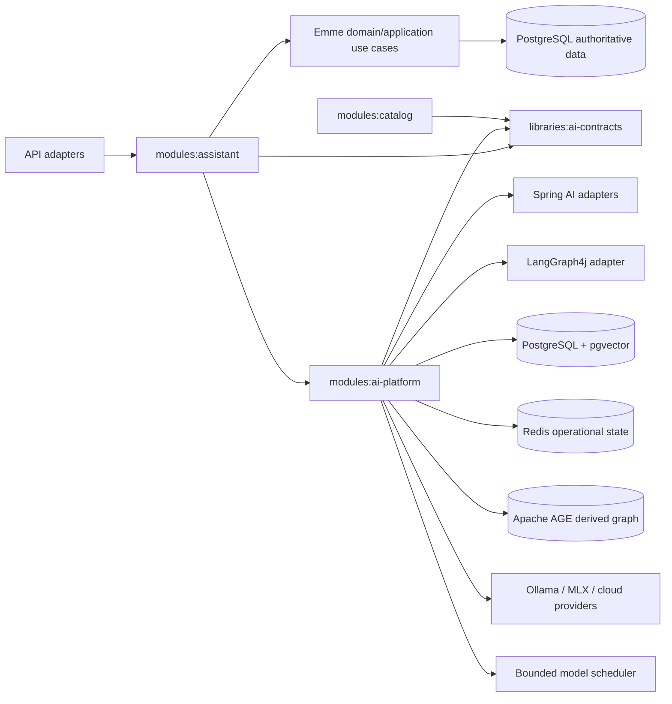
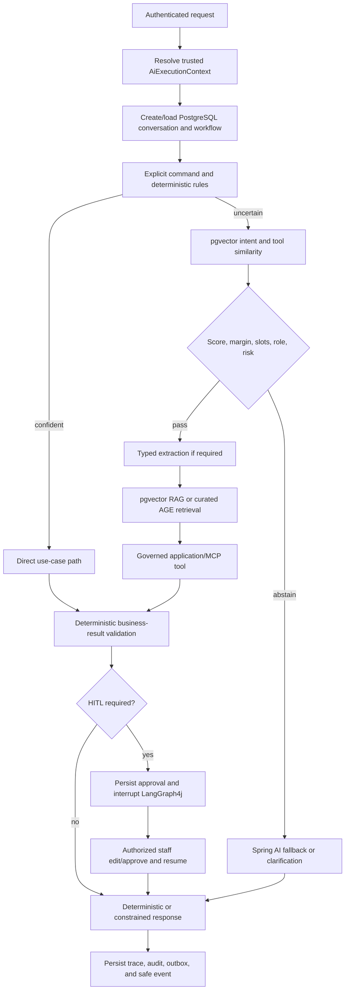
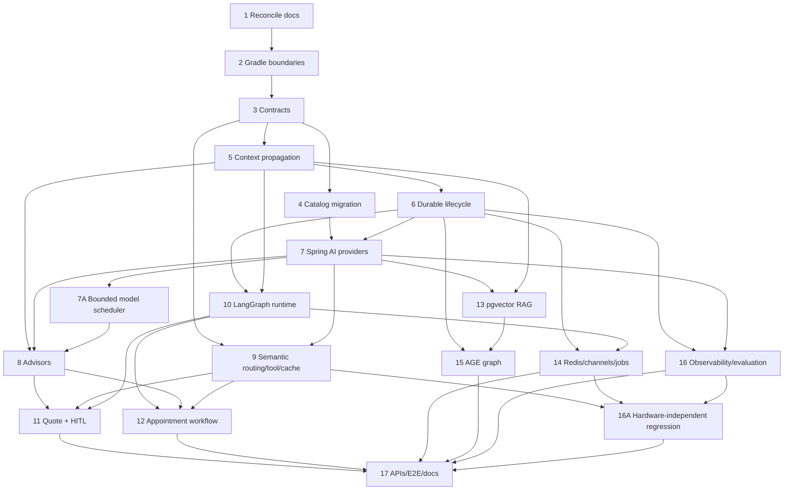

# Emme AI Platform Implementation Plan

> **For agentic workers:** REQUIRED SUB-SKILL: Use `superpowers:subagent-driven-development` (recommended) or `superpowers:executing-plans` to implement this plan task by task.

**Goal:** Move the reusable AI runtime out of `assistant`, establish the `ai-contracts` and `ai-platform` module boundaries, and incrementally implement a tenant-safe Spring AI plus LangGraph4j platform for semantic routing, deterministic tool execution, semantic caching, RAG, quote workflows, human approval, observability, and future graph retrieval.

**Architecture:** `libraries:ai-contracts` contains framework-neutral ports and value contracts. `modules:ai-platform` contains reusable AI infrastructure and orchestration adapters. `modules:assistant` owns Emme-specific use cases, workflow definitions, and business-facing composition. Domain and application rules remain authoritative for prices, availability, appointments, authorization, and tenant isolation.

**Tech Stack:** Java 25, Spring Boot 4.1.0, Spring Modulith 2.1.0, Spring AI 2.0.1, LangGraph4j 1.8.25, Ollama `embeddinggemma` for the initial local text embedding, Gemma 4 MLX variants for local chat/vision, PostgreSQL 17 with pgvector and Apache AGE 1.6.0, Redis Stack/Redis Query Engine with a pinned image digest, Gradle 9.4.1, JUnit 5, Testcontainers, OpenTelemetry/Micrometer.

## Global Constraints

- Work on `feat/ai-platform-foundation`; preserve the existing unrelated tenancy edits in the worktree.
- Use TDD for every behavior: write a focused failing test, implement the smallest passing change, then refactor and rerun the relevant suite.
- Do not use an LLM as authority for tenant, user, role, price, availability, policy, payment, appointment, or approval decisions.
- Resolve tenant and principal context from the authenticated backend request context. Reject client- or model-supplied tenant identifiers when they disagree with trusted context.
- PostgreSQL is authoritative for durable conversations, workflows, checkpoints, quotes, approvals, tool calls, traces, audit events, and canonical vector references. Redis Stack is rebuildable operational/hot-index state only.
- Keep AI contracts framework-neutral. Spring AI and LangGraph4j types must not leak into domain packages or `ai-contracts`.
- Keep one workflow orchestration boundary: Spring AI performs model/tool operations; LangGraph4j coordinates durable, branching, resumable workflows.
- Every write operation must enforce authorization, validation, audit logging, and idempotency.
- Every tenant-scoped relational, vector, cache, graph, and event operation must carry trusted tenant context.
- Every vector index must pin the embedding model/version, dimensions, normalization, distance metric, and query-instruction version; different embedding spaces never share an index.
- The Mac Studio is an optional model-inference host, never a required CI or regression dependency. Required regression uses deterministic fakes, pinned fixture vectors, and Testcontainers; live model evaluation is scheduled or manually dispatched.
- All local model calls pass through a bounded model scheduler with global, provider/model, tenant, and authenticated-user limits. Queues are bounded and deadline-aware; no direct unbounded submission to Ollama, the common pool, or a fire-and-forget executor is allowed.
- Do not replace existing functionality or stage unrelated files.

## 1. Repository Baseline and Target Boundary

The repository is a Java 25 Spring Modulith monolith. Existing AI infrastructure is concentrated in `modules/assistant`, while `modules/catalog` consumes image captioning and embedding contracts from assistant. Existing semantic routing, Redis state, Spring AI adapters, LangGraph4j quote workflow/checkpoint code, AI traces, and quote artifacts must be moved behind the new reusable boundary without breaking catalog or existing assistant behavior.

Target dependency direction:



The final split is:

| Boundary | Owns | Must not own |
|---|---|---|
| `libraries:ai-contracts` | Ports, records, enums, context-neutral tool and model contracts | Spring beans, persistence, prompts, provider SDKs, business rules |
| `modules:ai-platform` | Provider chains, Spring AI clients/advisors, semantic services, vector/RAG adapters, LangGraph runtime, Redis state, traces | Emme quote/appointment policy decisions, direct domain repository access from tools |
| `modules:assistant` | Emme assistant use cases, quote/appointment graph definitions, channel-facing orchestration, application use-case adapters | Provider construction, generic vector/cache implementation, duplicated tenant authorization |
| Domain/application modules | Prices, services, availability, appointment mutations, tenant authorization, policies | Prompt logic, model routing, RAG ranking, MCP handler business rules |

## 2. File and Package Map

### New files and packages

```text
libraries/ai-contracts/
  build.gradle.kts
  src/main/java/com/emme/ai/contracts/
    context/AiExecutionContext.java
    context/AuthenticatedPrincipal.java
    extraction/NailDesignFeatures.java
    extraction/NailDesignExtractionPort.java
    model/AiModelProvider.java
    model/ChatCompletionPort.java
    model/EmbeddingPort.java
    routing/IntentDefinition.java
    routing/IntentMatch.java
    routing/IntentRoute.java
    routing/IntentRouter.java
    semantic/SemanticCache.java
    semantic/SemanticCacheEntry.java
    tool/ToolDefinition.java
    tool/ToolExecutionContext.java
    tool/ToolPolicy.java
    tool/ToolResult.java
    workflow/WorkflowCheckpoint.java
    workflow/WorkflowCommand.java
    workflow/WorkflowState.java
    workflow/WorkflowStatus.java

modules/ai-platform/
  build.gradle.kts
  src/main/java/com/emme/ai/platform/
    config/AiPlatformProperties.java
    config/SpringAiPlatformConfiguration.java
    context/AiExecutionContextScope.java
    context/AiExecutionContextFilter.java
    context/ScopedValueTenantContextBridge.java
    model/SpringAiChatCompletionAdapter.java
    model/SpringAiEmbeddingAdapter.java
    model/ProviderChain.java
    model/OllamaProviderAdapter.java
    model/MlxProviderAdapter.java
    model/OxAlphaProviderAdapter.java
    model/ModelExecutionScheduler.java
    model/ModelCapacityProfile.java
    model/BoundedModelExecutionScheduler.java
    model/TenantFairModelQueue.java
    prompt/PromptVersionRegistry.java
    routing/DeterministicIntentRouter.java
    routing/PgVectorIntentClassifier.java
    routing/SemanticToolSelector.java
    semantic/PgVectorSemanticCache.java
    semantic/SemanticCacheKeyFactory.java
    tool/AuthorizedToolRegistry.java
    tool/UseCaseToolGateway.java
    tool/McpToolGateway.java
    advisor/TenantSecurityAdvisor.java
    advisor/PromptVersionAdvisor.java
    advisor/TraceAdvisor.java
    advisor/BudgetAdvisor.java
    rag/PgVectorKnowledgeRetriever.java
    rag/TenantRetrievalFilter.java
    workflow/LangGraphWorkflowRuntime.java
    workflow/PostgresCheckpointRepository.java
    redis/RedisOperationalStateStore.java
    redis/RedisWorkflowLock.java
    redis/RedisLiveEventPublisher.java
    observability/AiTraceRecorder.java
    observability/AiMetrics.java
    persistence/AiTracePersistenceAdapter.java
  src/test/java/com/emme/ai/platform/...

modules/assistant/
  src/main/java/com/emme/assistant/application/...
    ProcessConversationService.java
    QuoteDesignWorkflow.java
    AppointmentAssistanceWorkflow.java
    HumanApprovalService.java
  src/main/java/com/emme/assistant/config/AssistantAiConfiguration.java
  src/main/java/com/emme/assistant/adapter/in/web/...
  src/test/java/com/emme/assistant/...

database/src/main/resources/db/emme-studio/
  019-ai-platform-contracts.sql
  020-ai-conversation-lifecycle.sql
  021-ai-platform-rag.sql
  022-ai-platform-age.sql
  023-ai-platform-outbox.sql
  changelog.yaml updates

docs/ai-platform/
  implementation-plan.md reconciliation
  technical-specification.md reconciliation
  semantic-routing-and-cache.md
  operational-runbook.md updates
docs/adr/
  0013-ai-contracts-platform-boundary.md
  0014-ai-workflow-runtime-boundary.md
  0015-ai-context-propagation.md
tasks/
  implementation checklist
```

Existing files are updated only when they are part of a listed boundary migration, schema registration, configuration change, or regression test.

## 3. Contract Signatures and Runtime Invariants

The following signatures are the stable seams. Names may receive package-local formatting changes, but implementations must preserve these responsibilities and must not introduce framework types into `ai-contracts`. Supporting value types (`EmbeddingVector`, `EmbeddingModelVersion`, `RouteRequest`, `SemanticCacheQuery`, `ToolExecutionRequest`, `RetrievedDocument`, `KnowledgeQuery`, `WorkflowHandle`, and `InterruptReason`) are defined beside these ports in Task 3.

```java
public record AiExecutionContext(
    UUID tenantId,
    UUID userId,
    Set<String> roles,
    UUID conversationId,
    UUID workflowId,
    String traceId,
    String idempotencyKey,
    Channel channel
) {}

public interface EmbeddingPort {
    EmbeddingVector embed(String input, EmbeddingModelVersion modelVersion);
}

public interface IntentRouter {
    IntentRoute route(RouteRequest request, AiExecutionContext context);
}

public interface SemanticCache {
    Optional<SemanticCacheEntry> find(SemanticCacheQuery query, AiExecutionContext context);
    void put(SemanticCacheEntry entry, AiExecutionContext context);
}

public interface ToolGateway {
    ToolResult execute(ToolExecutionRequest request, ToolExecutionContext context);
}

public interface KnowledgeRetriever {
    List<RetrievedDocument> retrieve(KnowledgeQuery query, AiExecutionContext context);
}

public interface WorkflowRuntime {
    WorkflowHandle start(WorkflowCommand command, AiExecutionContext context);
    WorkflowHandle resume(WorkflowCommand command, AiExecutionContext context);
    WorkflowHandle interrupt(UUID workflowId, InterruptReason reason, AiExecutionContext context);
}
```

Required invariants at these seams:

- `AiExecutionContext` is created by the authenticated backend boundary. Deserialized request fields and model arguments may provide business input, but never replace its tenant, user, roles, or authorization claims.
- `EmbeddingPort` returns the model name, model version, dimension, and vector so indexes and semantic-cache entries can reject incompatible queries.
- `IntentRouter` returns top-1, top-2, margin, required-slot completeness, authorization eligibility, and an abstain reason; a route is not an authorization decision.
- `SemanticCache` namespaces keys by tenant, locale, policy version, prompt version, model version, and embedding version; cache hits are valid only while their TTL and business-result validity window hold.
- `ToolGateway` resolves a registered tool policy before dispatch and passes a backend-created `ToolExecutionContext` to an application use case or an authenticated external MCP client. It never accepts repository access from a model callback.
- `KnowledgeRetriever` applies tenant, locale, visibility, effective-date, and document-version filters before ranking. It returns source metadata so answer composition can distinguish reference knowledge from authoritative application results.
- `WorkflowRuntime` persists transitions and checkpoints before publishing notifications. Resume is idempotent and must not repeat a completed mutation.

Runtime flow:



## 4. Task List

### Phase 0 — Documentation and build boundary

### Task 1 — Reconcile the approved design documents and legacy naming

**Files:** update `docs/ai-platform/README.md`, `docs/ai-platform/implementation-plan.md`, `docs/ai-platform/technical-specification.md`, `docs/ai-platform/data-model.md`, `docs/ai-platform/operational-runbook.md`; add `docs/adr/0013-ai-contracts-platform-boundary.md`, `docs/adr/0014-ai-workflow-runtime-boundary.md`, `docs/adr/0015-ai-context-propagation.md`.

**Test first:** Add a documentation consistency check under `modules/assistant/src/test/java/com/emme/assistant/AiDocumentationConsistencyTest.java` that verifies the canonical module names are present in the authoritative design index and that deprecated `ai-foundation` references do not occur in active architecture documents.

**Implementation:** Make the current design document authoritative, update older documents to point to it, document why Spring AI and LangGraph4j are complementary, document the `ai-contracts`/`ai-platform`/`assistant` ownership split, and record the Java 25 context-propagation decision. Do not claim any future feature is implemented until its task is complete.

**Refactor and verify:** Run the documentation test and `git diff --check`. Expected result: the consistency test passes and active documents use only the canonical names.

**Commit:** `docs(ai): reconcile platform architecture documents`.

### Task 2 — Add Gradle module boundaries without changing runtime behavior

**Files:** update `settings.gradle.kts`, `build.gradle.kts`, `gradle/libs.versions.toml`, `modules/assistant/build.gradle.kts`, `modules/catalog/build.gradle.kts`, `modules/assistant/src/test/java/com/emme/assistant/AssistantPackageConventionTest.java`, `modules/catalog/src/test/java/com/emme/catalog/CatalogPackageConventionTest.java`; add `libraries/ai-contracts/build.gradle.kts`, `modules/ai-platform/build.gradle.kts`, package descriptors, and module smoke tests.

**Test first:** Add architecture tests that assert `ai-contracts` has no Spring/AI-provider dependency, `ai-platform` depends on contracts but not on assistant, and catalog consumes contracts rather than assistant implementation packages.

**Implementation:** Register `libraries:ai-contracts` and `modules:ai-platform`; use the already cataloged Spring AI and LangGraph4j versions; move only dependency declarations required for compilation; retain compatibility dependencies temporarily where migration tasks need them.

**Refactor and verify:** Run `./gradlew :libraries:ai-contracts:test :modules:ai-platform:test :modules:assistant:test :modules:catalog:test` and the architecture tests. Expected result: all existing tests remain green and the new dependency direction is enforced.

**Commit:** `build(ai): add contracts and platform module boundaries`.

### Phase 1 — Framework-neutral contracts and context safety

### Task 3 — Define the `ai-contracts` API

**Files:** add the contract types listed under `libraries/ai-contracts/src/main/java/com/emme/ai/contracts/`; add `libraries/ai-contracts/src/test/java/com/emme/ai/contracts/ContractValidationTest.java` and focused tests for extraction, routing, tool, cache, and workflow invariants.

**Test first:** Cover immutable records, enum validation, confidence values constrained to `[0, 1]`, nonblank tenant/workflow identifiers, explicit workflow terminal statuses, and rejection of model-controlled tenant or role fields in `ToolExecutionContext`.

**Implementation:** Define Java records/enums/interfaces for `NailDesignFeatures`, intent matches, semantic cache entries, tool policies/results, model ports, workflow commands/state/checkpoints, and trusted `AiExecutionContext`. Keep all types independent of Spring, LangGraph4j, Redis, JDBC, and provider SDKs.

**Refactor and verify:** Run `./gradlew :libraries:ai-contracts:test :libraries:ai-contracts:check`. Expected result: contracts compile on Java 25 and contain no infrastructure imports.

**Commit:** `feat(ai-contracts): define framework-neutral AI contracts`.

### Task 4 — Migrate image and embedding consumers to contracts

**Files:** add image/embedding ports and adapters in `libraries/ai-contracts`; update `modules/catalog/src/main/java/com/emme/catalog/application/service/AddCatalogItemImageService.java`, `MatchCatalogItemsService.java`, `modules/catalog/src/main/java/com/emme/catalog/package-info.java`, and catalog convention tests; add assistant compatibility adapters and migration tests.

**Test first:** Update catalog tests to inject contract ports and verify catalog behavior is unchanged for captioning and embedding success/failure. Add a compile-level test proving catalog has no import from `com.emme.assistant.ai`.

**Implementation:** Move the generic `CaptionImageUseCase` and `EmbedTextUseCase` contracts to `ai-contracts`, provide adapters from the platform, and keep assistant-facing compatibility only until all consumers are migrated.

**Refactor and verify:** Run catalog, assistant, and platform tests; remove obsolete imports only after the full compile succeeds. Expected result: catalog depends on contracts and existing image search behavior remains unchanged.

**Commit:** `refactor(ai): migrate image and embedding ports to contracts`.

### Task 5 — Establish canonical tenant and AI execution context propagation

**Files:** add/update `libraries/kernel/.../TenantExecutionContext.java`, `TenantExecutionContextScope.java`, `TenantContextBridge.java`; update `AiExecutionContext.java`, `AiExecutionContextScope.java`, `AiExecutionContextBridge.java`, `StructuredParallelTaskRunner.java`, `modules/tenancy/.../TenantContextFilter.java`, and context tests.

**Test first:** Add tests for trusted JWT-to-context resolution, nested scope restoration, virtual-thread child propagation through `StructuredTaskScope`, rejection of missing tenant context, rejection of mismatched supplied tenant IDs, and cleanup after request completion. Add a parallel test using `Joiner.allSuccessfulOrThrow()` to verify every child sees the same immutable tenant context.

**Implementation:** Use Java 25 `ScopedValue` as the canonical request/workflow context, bridge legacy `ThreadLocal` only at adapter boundaries, and capture/restore context explicitly for executor or callback APIs that do not inherit scoped bindings. Use `StructuredTaskScope` and joiners for bounded parallel subtasks; do not subclass `Thread` or use unbounded common-pool work for tenant-scoped AI work.

**Refactor and verify:** Run tenancy and kernel tests plus the structured-concurrency tests. Expected result: virtual threads do not lose tenant identity and context never leaks between requests.

**Commit:** `feat(context): standardize tenant propagation for AI execution`.

### Task 6 — Create a durable conversation and workflow lifecycle

**Files:** add migration `020-ai-conversation-lifecycle.sql`; update changelog; add/update `ConversationRepository`, `ConversationMessageRepository`, `WorkflowRunRepository`, and JDBC adapters; update `ai_model_execution` constraints where needed; add integration tests.

**Test first:** With PostgreSQL Testcontainers, verify conversation creation, append-only messages, workflow run creation, tenant-filtered reads, terminal state transitions, optimistic version checks, and restart-safe retrieval by workflow/conversation ID.

**Implementation:** Persist conversation messages and workflow runs independently from Spring AI chat memory and Redis. Store tenant ID, conversation ID, workflow ID, model/prompt/graph versions, status, timestamps, and correlation IDs. Make direct requests create a durable conversation before recording model execution; never fabricate a foreign conversation identifier.

**Refactor and verify:** Run migration validation and repository integration tests. Expected result: complete durable history exists even when Redis is unavailable.

**Commit:** `feat(ai): persist conversation and workflow lifecycle`.

### Phase 2 — Spring AI runtime and governed tool execution

### Task 7 — Move provider abstractions and specialized Spring AI clients into `ai-platform`

**Files:** move/update assistant provider classes into `modules/ai-platform/src/main/java/com/emme/ai/platform/model/`; add extraction, RAG-answer, fallback-agent, and response client configuration; update `AiProperties`, provider properties, test doubles, and configuration tests; keep `modules/assistant` as the composition owner.

**Test first:** Add tests for provider selection, ordered fallback on retryable provider failure, no fallback on validation/security failure, model and prompt version recording, structured extraction schema failure, and response-client prohibition on price recalculation.

**Implementation:** Use Spring AI `ChatClient`, model-specific adapters, typed structured output, and configured provider chains for Ollama-served Gemma 4 MLX variants and optional Ox Alpha cloud escalation. Configure Ollama `embeddinggemma` as the initial text embedding model for intent, tool, cache, RAG, and normalized design descriptions, starting with a verified 768-dimensional cosine index. Use `gemma4:e4b-mlx` for the Mac Studio M5 Max baseline and retain `gemma4:e2b-mlx` as a lower-memory compatibility profile. Inject providers through ports; do not hard-code a provider in domain logic. The first local integration uses Ollama as the single model boundary; a direct MLX sidecar is added only if benchmark results justify it. Configure cloud escalation per tenant and default private image processing to local execution. A different embedding provider must use a separate versioned index and must not be used to query the local vector space.

**Refactor and verify:** Run platform configuration and adapter tests with test doubles; run assistant tests to confirm composition still starts. Expected result: multiple providers are available without duplicate provider logic.

**Commit:** `feat(ai-platform): add provider chain and specialized Spring AI clients`.

### Task 7A — Add bounded local model execution and backpressure

**Files:** add model admission contracts and scheduler classes under
`modules/ai-platform/.../model/`; add capacity properties and metrics; update
provider adapters to submit through the scheduler; add unit and integration
tests for queues, fairness, deadlines, cancellation, and overload behavior.

**Test first:** Verify that global, model, tenant, and authenticated-user
in-flight limits are enforced; queue depth is bounded; weighted fairness keeps
one tenant from monopolizing the host; interactive work takes precedence over
background embedding; deadlines and cancellation release leases exactly once;
and provider unavailability follows the configured fallback policy. Verify that
logical conversations share a loaded model without sharing memory or tenant
context.

**Implementation:** Add a `ModelExecutionScheduler` port with a bounded,
deadline-aware fair queue. Configure separate capacity profiles for Gemma 4
generation/vision and EmbeddingGemma, plus a global limit. Start with one
concurrent generation/vision request and a small embedding limit, then tune
from benchmark evidence. Use virtual threads only to await bounded admission;
do not use unbounded queues, the common pool, or one model process per chat.
Persist accepted asynchronous workflow/outbox records before Redis Streams
transport. Return a safe busy result for interactive overload and defer
background work with bounded retry/backoff.

**Refactor and verify:** Run scheduler unit tests, provider contract tests, and
restart/cancellation integration tests. Expected result: the Mac model host
remains responsive under tenant bursts and a powered-off host does not block
hardware-independent regression.

**Commit:** `feat(ai-platform): add bounded model execution scheduler`.

### Task 8 — Add security, prompt, trace, budget, memory, and retrieval advisors

**Files:** add the advisor classes under `modules/ai-platform/.../advisor/`; add advisor ordering and configuration tests; update assistant configuration only to inject advisor beans.

**Test first:** Verify tenant security runs before retrieval/tool execution, prompt version is attached to every model call, trace correlation is stable, per-tenant budget rejection is deterministic, chat memory is recent context only, and retrieved content is marked as untrusted reference material.

**Implementation:** Implement `TenantSecurityAdvisor`, `PromptVersionAdvisor`, `TraceAdvisor`, `BudgetAdvisor`, and a hybrid memory adapter that reads recent Redis state while PostgreSQL remains authoritative. Apply retrieval and tool advisors only to the clients that need them. Register exactly one tool-calling path for the fallback agent.

**Refactor and verify:** Run advisor ordering tests and application-context tests. Expected result: direct deterministic routes bypass the fallback agent and protected clients cannot execute without trusted context.

**Commit:** `feat(ai-platform): add governed Spring AI advisors`.

### Task 9 — Implement semantic classification, proactive tool selection, and semantic caching

**Files:** add platform routing/cache implementations and ports listed in the package map; add/update migrations `019-ai-platform-contracts.sql` and vector indexes; add unit and PostgreSQL integration tests.

**Test first:** Cover deterministic explicit-command routing, Redis Stack top-1/top-2 score and margin calculation, pgvector fallback/rebuild behavior, required-slot and authorization gates, abstention below calibrated thresholds, tool selection constrained by role/risk, exact embedding-model/version/dimension/instruction matching for cache hits, tenant isolation, cache expiry, and fallback to Spring AI when semantic confidence is insufficient.

**Implementation:**

1. Route explicit UI actions and deterministic rules first.
2. Query Redis Stack FLAT indexes for the small hot intent/tool catalogs and calculate top-1, top-2, margin, required-field completeness, and authorization eligibility.
3. Rebuild or fall back to PostgreSQL/pgvector when Redis is unavailable; PostgreSQL stores the canonical references and index metadata.
4. Run semantic tool selection only for tools allowed by current intent, role, tenant, and risk policy.
5. Query the Redis Stack semantic response cache using the same embedding model/version, dimension, normalization, distance metric, and instruction version used for writes; namespace by tenant, audience scope, policy/model versions, and cache schema.
6. Fall back to structured Spring AI extraction or the bounded fallback agent; abstain or ask for clarification when confidence is inadequate.

Do not execute a mutating tool from similarity alone; require the use-case confirmation and idempotency policy. Store successful and corrected traces for offline candidate enrichment, never mutate the production index inline.

**Refactor and verify:** Benchmark bounded vector queries and run classifier/cache integration tests. Expected result: repetitive safe requests avoid unnecessary LLM calls while low-confidence requests remain safe.

**Commit:** `feat(ai-platform): add semantic routing tool selection and cache`.

### Task 10 — Implement the generic LangGraph4j workflow runtime

**Files:** add `LangGraphWorkflowRuntime.java`, `PostgresCheckpointRepository.java`, workflow state/command adapters, retry/terminal-state policies, and tests under `modules/ai-platform`.

**Test first:** Verify conditional edges, bounded retry behavior, independent subtask execution with structured concurrency, all terminal states, durable checkpoint save/load, idempotent resume, version conflict handling, interrupt/pause, and restart recovery.

**Implementation:** Adapt LangGraph4j as the single durable workflow orchestrator. Keep graph state separate from chat memory. Persist checkpoints to PostgreSQL, use Redis only for locks/live status, expose `start`, `resume`, and `interrupt` through a platform port, and make nodes call injected application/use-case ports. Use `StructuredTaskScope` only for independent read-only work and joiners that fail or cancel predictably.

**Refactor and verify:** Run workflow runtime tests, checkpoint Testcontainers tests, and a restart simulation. Expected result: a workflow can pause and resume by workflow ID without replaying a completed mutation.

**Commit:** `feat(ai-platform): add durable LangGraph workflow runtime`.

### Phase 3 — Vertical quote and appointment slices

### Task 11 — Migrate the quote-by-image workflow with first-class HITL

**Files:** update existing quote workflow classes under `modules/assistant/.../ai/adapter/out/workflow/`; move generic graph/checkpoint adapters to `modules/ai-platform`; add assistant `QuoteDesignWorkflow`, extraction/use-case adapters, approval services, and tests.

**Test first:** Cover high-confidence extraction, invalid schema rejection, deterministic tenant-template pricing, ambiguity routing, all required quote states, staff approval, staff edit, optimistic locking, duplicate approval idempotency, final deterministic quote persistence, and client response composition from validated results.

**Implementation:** Implement `receive → extract → validate → retrieve similar designs → load tenant quote templates → calculate deterministic range → confidence gate → approval interrupt → resume → persist decision → send response`. Persist original image metadata, extraction result, model/prompt versions, template version, confidence, reviewer identity/timestamp, edits, and final quote. The model never supplies final price.

**Refactor and verify:** Run assistant quote unit tests and PostgreSQL workflow integration tests. Expected result: staff review is a persisted workflow state, not an email fallback.

**Commit:** `feat(assistant): implement durable image quote and HITL workflow`.

### Task 12 — Add multi-intent appointment assistance through application use cases

**Files:** add/update assistant appointment workflow and decomposer classes; add typed platform tool definitions for availability, hold, create, reschedule, cancel, and profile reads; adapt existing `FindAvailableSlotsUseCase`, `CreateAppointmentUseCase`, `CancelAppointmentUseCase`, and `RescheduleAppointmentUseCase`; add tests.

**Test first:** Cover quote-plus-availability decomposition, independent read parallelism, confirmation before booking, backend-owned tenant/customer resolution, cancellation/reschedule policy delegation, idempotent booking, duplicate-message handling, and failure without partial mutation.

**Implementation:** Use deterministic decomposition for known phrases, structured Spring AI decomposition only when needed, and LangGraph4j for dependencies. Availability is read-only; holds and appointment mutations require the application layer, authorization, confirmation, and idempotency. Tool arguments may not override authenticated customer or tenant identity.

**Refactor and verify:** Run appointment and workflow integration tests. Expected result: a request such as “quote this design and book Friday afternoon” completes both bounded subtasks safely or pauses for the exact missing confirmation/review.

**Commit:** `feat(assistant): add governed appointment assistance workflow`.

### Phase 4 — RAG, operational state, channels, and messaging

### Task 13 — Implement tenant-safe pgvector RAG

**Files:** add migration `021-ai-platform-rag.sql`; add `PgVectorKnowledgeRetriever`, hybrid `tsvector`/pgvector retrieval, ingestion/chunking ports, tenant metadata filters, and Spring AI `VectorStore` configuration; add ingestion and retrieval tests.

**Test first:** Verify section-aware chunking, configurable size/overlap, required metadata, tenant/locale/visibility/effective-version filtering, prompt-injection marking, no price authority in RAG, and deterministic retrieval results using a fake and pgvector Testcontainer.

**Implementation:** Store unstructured FAQs, aftercare, service descriptions, approved design descriptions, manuals, and brand guidance in pgvector. Combine dense pgvector search with PostgreSQL `tsvector` search through deterministic reciprocal-rank fusion; keep services/prices/hours/availability/policies used transactionally in relational application use cases. Use a `KnowledgeRetriever` port and retrieval advisor only for answerable knowledge intents. The initial embedding is Ollama `embeddinggemma` with a verified 768-dimensional cosine index; embedding changes create a new index version and require reindexing.

**Refactor and verify:** Run vector integration tests and retrieval benchmarks for configured chunk sizes. Expected result: cross-tenant documents are not retrievable, and transactional answers never originate from RAG chunks.

**Commit:** `feat(ai-platform): add tenant-safe pgvector retrieval`.

### Task 14 — Add Redis state, live events, channels, and bounded async jobs

**Files:** add/update Redis adapters, event contracts, outbox migration `023-ai-platform-outbox.sql`, channel controllers/adapters, queue consumer/producer, and tests; update compose configuration only where required.

**Test first:** Verify Redis key namespaces, TTLs, lock ownership, idempotency keys, rate limits, live event replay/reconnection, SSE status events, WhatsApp acknowledgment/final-response ordering, retry/backoff, dead-letter handling, tenant fairness, and per-worker concurrency limits.

**Implementation:** Use a pinned Redis Stack deployment for `session`, `ai:thread`, `ai:lock`, hot semantic intent/tool indexes, short-lived semantic response cache, quote cache, rate, review, stream, and job status keys with tenant/user scoping. Use Spring AI's Redis `VectorStore` for vector operations and Spring Data Redis/Lettuce for locks, streams, TTLs, and native index administration. Use PostgreSQL transactional outbox for durable events. Use Redis Streams for the initial 20–30-salon target and define a Kafka-compatible event envelope for future scale. Never publish hidden reasoning or every model token.

**Refactor and verify:** Run Redis Testcontainers tests and channel contract tests. Expected result: web requests stream safe status/delta events with recovery, while WhatsApp receives acknowledgment then a persisted final response.

**Commit:** `feat(ai-platform): add redis operations channels and async jobs`.

### Phase 5 — Apache AGE, observability, evaluation, and release hardening

### Task 15 — Add Apache AGE as an optional derived knowledge graph

**Files:** add migration `022-ai-platform-age.sql`, graph projection ports/adapters, curated traversal queries, AGE bootstrap/container configuration, and integration tests.

**Test first:** Verify tenant-scoped graph projection, idempotent upserts, curated design-to-service-to-skill traversal, no transactional writes through AGE, and behavior when AGE is unavailable.

**Implementation:** Pin PostgreSQL 17 with AGE 1.6.0 in a custom compatible image/bootstrap path; retain pgvector as the durable vector store and PostgreSQL relational tables as transaction authority. Project curated relationships for designs, services, products, skills, artists, clients, promotions, and policies. Use predefined parameterized traversals only; the LLM cannot generate unrestricted Cypher or open graph queries.

**Refactor and verify:** Run AGE integration tests only in the graph profile and verify the default profile degrades to vector/relational retrieval. Expected result: graph recommendations remain tenant-scoped explanations and cannot calculate prices or create appointments.

**Commit:** `feat(ai-platform): add optional Apache AGE knowledge graph`.

### Task 16 — Persist traces, metrics, audit events, and offline Ragas evaluation

**Files:** add/update trace repositories/entities, evaluation migration, anonymization pipeline, evaluation worker scaffold, dashboards/alerts, and tests; update `docs/ai-platform/evaluation-specification.md` and operational runbook.

**Test first:** Verify complete trace persistence, PII redaction, tenant-scoped trace reads, model latency/token/cost metrics, tool and approval audit records, no hidden reasoning in logs, successful-example evidence rules, and asynchronous evaluation isolation from customer requests.

**Implementation:** Persist request, tenant, conversation/workflow, model/embedding/prompt/graph versions, candidate routes/scores, extraction, retrieved documents, tool result, validation, confirmation, staff correction, latency, tokens, cost, and final outcome. Build an offline Ragas-compatible worker that reads anonymized traces and computes router, extraction, retrieval, generation, safety, and operations metrics. Candidate enrichment requires successful validated outcomes and regression/canary evaluation before promotion.

**Refactor and verify:** Run trace/evaluation tests and inspect emitted metrics. Expected result: operational decisions are evidence-based and Ragas never replaces deterministic quote or appointment tests.

**Commit:** `feat(ai-platform): add AI observability and evaluation pipeline`.

### Task 16A — Add hardware-independent semantic regression and live-model evaluation

**Files:** add anonymized semantic regression fixtures and an embedding model
manifest under `modules/ai-platform/src/test/resources/`; add fixture-vector
providers, model contract tests, and scheduled evaluation workflow/configuration;
update CI documentation and the AI operational runbook.

**Test first:** Verify routing, tool selection, semantic-cache policy, tenant
isolation, schema validation, workflow outcomes, and deterministic business
invariants using pinned fixture vectors and model fakes. Add a separate live
contract suite that verifies the resolved Gemma 4/EmbeddingGemma model identity,
vector dimension, normalization, structured extraction compatibility, and
ranking quality when an approved model host is available.

**Implementation:** Keep the required pull-request and integration lanes on
hardware-independent Ubuntu runners. Use Testcontainers for PostgreSQL/pgvector
and Redis Stack, and never call Ollama from normal regression. Run live model
quality evaluation nightly or manually on the Mac Studio when online, or on an
approved hosted runner. A missing Mac must make only the optional model-quality
job unavailable; it must not make deterministic regression inconclusive. Store
model/version/dimension/normalization/index metadata with fixtures and require
an explicit reviewed regeneration plus evaluation before promotion.

**Refactor and verify:** Run the required CI matrix with the model host powered
off, then run the optional contract/evaluation lane with the host available.
Expected result: application regression is repeatable without special hardware,
while real-model drift remains observable and promotion-gated.

**Commit:** `test(ai-platform): add hardware-independent semantic regression`.

### Task 17 — Complete API security, end-to-end coverage, and operational documentation

**Files:** add/update conversation, human approval, workflow status controllers/resolvers; security tests; full E2E tests; `docs/ai-platform/README.md`, `docs/ai-platform/operational-runbook.md`, `docs/ai-platform/examples.md`.

**Test first:** Add end-to-end tests for FAQ, availability, booking, ambiguous booking, high-confidence quote, HITL quote, multi-intent request, wrong-tenant access, duplicate booking, model timeout, MCP failure, and resume after restart.

**Implementation:** Expose authenticated endpoints using existing API conventions. Require trusted context, permission checks, idempotency keys, correlation IDs, and audit events. Document local startup, provider configuration, PostgreSQL/pgvector/AGE profiles, Redis, migrations, test doubles, failure recovery, Mermaid architecture and workflow diagrams, and example requests/responses.

**Refactor and verify:** Run the complete verification matrix below, perform a code-quality/security review, and compare package/module dependencies against the approved architecture. Expected result: all enabled tests pass, documentation matches shipped behavior, and unsupported optional integrations are clearly profile-gated.

**Commit:** `feat(ai): complete platform APIs tests and runbook`.

## 5. Task Dependencies



Parallel work is permitted only where dependencies are complete and files do not overlap. Tasks 3–5 can begin after the build boundary. Tasks 9, 13, and 15 must not bypass tenant context or durable persistence. The model scheduler must be in place before provider calls are enabled in shared workflows. Appointment mutations and approval resume must not be implemented before the durable lifecycle and workflow runtime are tested. Task 16A may run its required fixture-based suite without a model host; its live contract lane is optional.

## 6. Verification Matrix

Run the narrowest command after each task, then the aggregate commands at phase boundaries:

| Scope | Command | Expected result |
|---|---|---|
| Formatting | `./gradlew spotlessCheck` | No formatting violations in changed files |
| Contracts | `./gradlew :libraries:ai-contracts:test :libraries:ai-contracts:check` | Contract tests and dependency checks pass |
| Platform | `./gradlew :modules:ai-platform:test :modules:ai-platform:check` | Platform unit tests, static checks, and architecture tests pass |
| Assistant/catalog | `./gradlew :modules:assistant:test :modules:catalog:test` | Existing behavior remains green |
| Database | `./gradlew :database:test` | Changelog and migration tests pass |
| Integration | `./gradlew integrationTest` | PostgreSQL/Redis/AGE profile tests pass where enabled |
| Full build | `./gradlew check` | Compilation, tests, static analysis, and architecture checks pass |
| Manual smoke | `docker compose -f deployment/compose/compose.yaml up ...` plus documented curl/SSE flows | Authenticated quote, approval, FAQ, and appointment flows work with local providers |

The current worktree has unrelated tenancy modifications and a known local Java/Spotless environment issue. Before implementation, resolve the toolchain used by the repository or document a reproducible Java 25 command; do not alter tenancy files as part of this plan.

## 7. Risks and Mitigations

| Risk | Mitigation |
|---|---|
| Moving existing assistant classes breaks Modulith boundaries | Add contract/module architecture tests first; migrate one consumer at a time; retain compatibility adapters only during the migration |
| Java 25 preview/concurrency APIs differ across local toolchains | Pin Java 25 in Gradle/toolchain, enable preview only for `StructuredTaskScope` where required, and test request, virtual-thread, and structured-concurrency paths explicitly |
| LangGraph4j checkpoint API changes | Isolate it behind `LangGraphWorkflowRuntime`; keep platform contracts independent and add adapter contract tests |
| Spring AI version/API drift | Use the version catalog and official API signatures in one platform adapter; avoid Spring types in contracts |
| Semantic false positives cause unsafe actions | Require score, margin, slot, authorization, risk, confirmation, and idempotency gates; abstain on uncertainty |
| Redis loss causes data loss | Persist durable records and outbox events in PostgreSQL; Redis is reconstructable operational state |
| Redis Stack memory pressure or index loss | Keep hot indexes bounded and TTL-controlled, use FLAT for small catalogs, alert on memory/eviction, and rebuild all semantic indexes from PostgreSQL |
| AGE packaging does not match pgvector image | Use a pinned custom PG17 image/profile and make graph retrieval optional; preserve relational/vector behavior without AGE |
| PII reaches logs/evaluation or cloud provider | Redact before logs/evaluation, default private image processing local, and make cloud fallback tenant-configurable |
| Online self-enrichment degrades routing | Persist candidates separately, run regression/canary evaluation, and promote versioned embeddings only after safety gates |
| Multiple orchestrators create unclear ownership | LangGraph4j owns durable workflow state; Spring AI owns model/tool invocation; Redis Streams owns job transport only |
| Local model host is overwhelmed by concurrent chats | Admit through bounded global/model/tenant/user limits, use weighted fair queues and deadlines, prioritize interactive work, and measure capacity before tuning |
| Model host is powered off during development or CI | Keep required regression on fakes, fixture vectors, and containers; run live Gemma/EmbeddingGemma contract tests only in optional scheduled/manual lanes |

## 8. Definition of Done

- [ ] `ai-contracts` and `ai-platform` are registered, documented, tested, and named consistently.
- [ ] `assistant` owns Emme-specific workflows; generic AI infrastructure is no longer duplicated there.
- [ ] Java 25 context propagation uses ScopedValue as the canonical mechanism, with explicit legacy bridges and structured concurrency tests.
- [ ] Tenant isolation is enforced for relational, vector, Redis, graph, tool, workflow, trace, and channel operations.
- [ ] Semantic classifier, proactive tool selector, and semantic cache have calibrated gates and LLM fallback/abstention behavior.
- [ ] Redis Stack hot indexes use the pinned embedding model/version and can be rebuilt from PostgreSQL without data loss.
- [ ] Spring AI specialized clients and advisors are configured without competing tool-calling paths.
- [ ] LangGraph4j workflows checkpoint to PostgreSQL and support idempotent pause/resume.
- [ ] Quote prices and appointments are produced only by deterministic application/domain use cases.
- [ ] HITL review is persisted, optimistic-locked, auditable, and resumable.
- [ ] pgvector RAG is tenant-filtered and cannot answer transactional price/availability questions.
- [ ] AGE is optional, derived, curated, tenant-scoped, and never transactional authority.
- [ ] Redis is operational only; durable records remain in PostgreSQL.
- [ ] Async jobs have idempotency, retries, backoff, dead letters, fairness, limits, and observability.
- [ ] Local model execution has bounded admission, per-model limits, tenant/user fairness, deadline-aware overload behavior, and permit-release coverage.
- [ ] Required regression passes with Ollama and the Mac Studio powered off; live model evaluation is separately scheduled and promotion-gated.
- [ ] Evaluation traces are redacted and Ragas runs asynchronously/offline.
- [ ] Unit, integration, E2E, architecture, security, and manual smoke checks pass or are explicitly profile-gated.
- [ ] Every implementation task has a logical conventional commit pushed to `feat/ai-platform-foundation`.

## 9. Open Technical Spikes Before Implementation

1. Confirm the exact Spring AI 2.0.1 structured-output, Redis VectorStore, semantic-cache, and advisor APIs exposed by the repository's dependency graph before writing adapters.
2. Confirm the LangGraph4j 1.8.25 checkpoint/interrupt API and isolate any preview or unstable API behind the platform adapter.
3. Validate the Java 25 `ScopedValue` and `StructuredTaskScope` compilation flags used by the repository's current Gradle toolchain.
4. Pin and smoke-test the Redis Stack image/digest with Spring AI Redis VectorStore and native KNN/filter queries before enabling hot semantic indexes.
5. Build and smoke-test a PostgreSQL 17 image containing pgvector and Apache AGE 1.6.0 before enabling the graph profile.
6. Establish labeled intent/extraction fixtures and baseline score distributions before setting production thresholds.
7. Benchmark the purchased Mac Studio profile to set initial global, generation,
   embedding, tenant, and user concurrency limits; do not infer capacity from
   the number of logical conversations.
