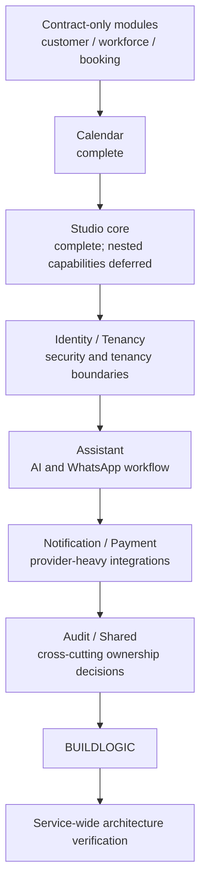

# Service module migration plan registry

This registry is the entry point for backend module package migrations. Every plan
uses the current [module package structure template](../../templates/module-package-structure-template.md)
as its architectural source of truth. The template is a maximum approved shape,
not a requirement to create empty packages.

## Scope and completed baseline

The completed contract, Calendar, Catalog, and Studio-core work is retained as
history and as the baseline for the remaining migration. The execution order
below is the authoritative order for open work.

## Plan matrix

| Module | Plan | Current status | Required outcome |
|---|---|---|---|
| `catalog` | [catalog baseline verification](2026-07-31-catalog-baseline-verification.md) | Verified canonical baseline (reverified 2026-08-01) | Keep canonical packages and preserve hybrid-search contracts |
| `customer` | [customer contract normalization](2026-07-31-customer-contract-normalization.md) | Complete boundary slice | Remove legacy named-interface shape without inventing business types |
| `workforce` | [workforce contract normalization](2026-07-31-workforce-contract-normalization.md) | Complete boundary slice | Keep the empty contract boundary honest and ready for real types |
| `booking` | [booking contract normalization](2026-07-31-booking-contract-normalization.md) | Complete boundary slice | Normalize API/event ownership and preserve declared consumers |
| `calendar` | [calendar migration](2026-07-31-calendar-module-migration.md) | Complete | Record conformance to the latest template and preserve Google adapters |
| `studio` | [studio migration](2026-07-31-studio-module-migration.md) | Core complete | Keep nested capabilities in separate plans |
| `studio.documents` | [documents capability migration](2026-07-31-studio-documents-module-migration.md) | Repository-local migration and verification complete; schema rollback evidence remains | Keep search/embedding ownership behind public capability contracts |
| `studio.subscriptions` | [subscriptions capability migration](2026-07-31-studio-subscriptions-module-migration.md) | Repository-local migration and verification complete; payment/recovery evidence remains | Keep subscription lifecycle and payment boundary explicit |
| `identity` | [identity module migration](2026-07-31-identity-module-migration.md) | Repository-local migration and verification complete; deployment evidence remains | Keep security domain, persistence, inbound security, and Keycloak adapters behind public contracts |
| `tenancy` | [tenancy module migration](2026-07-31-tenancy-module-migration.md) | Repository-local migration and verification complete; operational evidence remains | Keep tenant domain, focused lifecycle use cases, provisioning, database pool, and web infrastructure separated |
| `assistant` | [assistant module migration](2026-07-31-assistant-module-template-migration.md) | Repository-local migration and verification complete; credentialed provider/recovery evidence remains | Keep AI providers, conversations, participants, and WhatsApp webhook boundaries isolated |
| `notification` | [notification module migration](2026-07-31-notification-module-migration.md) | Repository-local migration and verification complete; credentialed provider/retry evidence remains | Keep channel providers behind application ports and preserve durable delivery boundaries |
| `payment` | [payment module migration](2026-07-31-payment-module-migration.md) | Repository-local migration and verification complete; credentialed financial/recovery evidence remains | Keep payment providers and webhook replay behind application-owned ports |
| `audit` | [audit module decision](2026-07-31-audit-module-normalization.md) | Reserved metadata-only boundary hardened | Keep metadata-only until a separately approved audit capability exists |
| `shared` | [shared infrastructure normalization](2026-07-31-shared-infrastructure-normalization.md) | Repository-local ownership, primitive packages, search integration, and dependency verification complete | Keep Shared technical and cross-cutting; run deployment rollback evidence before production |
| `build-logic` | [build-logic CDD migration](2026-08-02-build-logic-cdd-migration.md); [verification report](../reviews/2026-08-02-build-logic-cdd-verification.md) | Implemented and verified | Capability-owned Gradle conventions, binary plugins, lazy providers, normalized tasks/models, TestKit, and configuration-cache coverage |
| `event-streaming` | [Kafka + Spring Modulith closure](2026-08-02-kafka-modulith-event-streaming-closure.md); [verification report](../reviews/2026-08-02-kafka-modulith-event-streaming-verification.md) | Implemented and verified for MVP | Verify public event contracts, publication delivery, consumer idempotency, application-restart recovery configuration, broker configuration, and CI evidence |

## Remaining execution order: priority and type

Open work is ordered by production risk and dependency, not by filename or
alphabetical module name. A plan may be split into smaller commits, but it must
not move to the next priority band until its exit criteria are met.

| Priority | Type | Work item | Plan | Why this order | Exit gate |
|---|---|---|---|---|---|
| P0 | Security and tenant isolation | Close Identity security/application evidence | [Identity](2026-07-31-identity-module-migration.md) | Authentication, authorization, privilege boundaries, and public identity contracts protect every downstream capability | Identity security tests, architecture rules, integration tests, Modulith, CI, and production-readiness evidence pass |
| P0 | Security and tenant isolation | Close Tenancy operational evidence | [Tenancy](2026-07-31-tenancy-module-migration.md) | Tenant resolution, routing, pool lifecycle, and provisioning are isolation-critical | Tenant isolation, routing/pool lifecycle, provisioning replay/idempotency, integration, Modulith, and CI evidence pass |
| P1 | Cross-cutting decision | Decide Audit ownership or retirement | [Audit](2026-07-31-audit-module-normalization.md) | Prevents an empty module or duplicated audit system from becoming an architectural dependency | ADR records the owner/status and the registry reflects the decision |
| P1 | Shared infrastructure | Normalize Shared ownership and technical primitives | [Shared](2026-07-31-shared-infrastructure-normalization.md) | Shared changes have repository-wide blast radius and define boundaries consumed by later capability migrations | Shared architecture rules, integration tests, dependency graph, rollback notes, and CI pass |
| P2 | Domain capability | Migrate Studio Documents | [Documents](2026-07-31-studio-documents-module-migration.md) | Documents is a Studio-owned capability and should be canonical before Assistant or search consumers depend on its contracts | Domain/persistence/API/adapter boundaries and document behavior are regression-tested |
| P2 | Domain capability | Migrate Studio Subscriptions | [Subscriptions](2026-07-31-studio-subscriptions-module-migration.md) | Subscription ownership must be explicit before Payment and entitlement consumers rely on it | Lifecycle, tenant restrictions, public contracts, and payment boundary tests pass |
| P2 | AI and messaging capability | Close Assistant webhook/provider evidence | [Assistant](2026-07-31-assistant-module-template-migration.md) | Assistant has multiple provider and webhook boundaries and should consume stable Identity, Tenancy, and Shared contracts | AI provider, WhatsApp webhook, persistence, web, architecture, and service gates pass |
| P3 | Provider integration | Migrate Notification | [Notification](2026-07-31-notification-module-migration.md) | Provider-heavy behavior needs stable tenant, persistence, and application-port foundations | Email/SMS/push provider contracts, idempotency/retry, web, integration, and CI gates pass |
| P3 | Provider integration | Migrate Payment | [Payment](2026-07-31-payment-module-migration.md) | Payment has financial and webhook risk; it follows stable subscription, tenant, and provider boundaries | Provider/webhook signature and replay, transaction, tenant, integration, and CI evidence pass |
| P4 | Build platform | Execute the complete Capability-Driven Design build-logic migration | [Build-logic CDD](2026-08-02-build-logic-cdd-migration.md) | All module migrations consume the same build platform; its implementation is now normalized and verified | Complete for the current unreleased service; future capabilities must add provider ownership and TestKit coverage |
| P4 | Event streaming | Close Kafka + Spring Modulith event-streaming evidence | [Kafka + Modulith](2026-08-02-kafka-modulith-event-streaming-closure.md) | Events cross module and process boundaries; delivery, partitioning, replay, and failure semantics must be explicit | Complete for the current MVP; broker-outage chaos remains a deployment-environment acceptance test |
| P5 | Governance and verification | Run final repository-local service verification | [final service verification](../reviews/2026-08-03-final-service-verification.md) | Confirms no migration weakened Modulith boundaries or reintroduced legacy packages | Repository-local architecture, Modulith, Kafka, CI, integration, boot, documentation, and remote checks pass; deployment-only gates remain explicit |

### Parallelization rules

- P0 is sequential: finish Identity security contracts before finalizing Tenancy
  consumers and isolation evidence.
- Audit is a decision-only track and may be prepared during late P0, but its
  recorded decision must exist before Shared changes depend on audit ownership.
- Documents and Subscriptions may run in parallel after their public contracts
  and ownership boundaries are approved.
- Notification and Payment may run in parallel after Shared is stable; Payment
  must additionally wait for the Subscription contract it consumes.
- P4 build-logic and Kafka/Modulith closure tracks may run in parallel after the
  module implementation plans, but both must close before the final service-wide
  gate. Build-logic may consume stable module plugin IDs during earlier phases,
  but its migration is not complete until all capability tests and
  configuration-cache checks pass.
- The final P5 verification is sequential and follows every implementation
  plan, including build-logic and any parallel module tracks.

### Priority definitions

| Priority | Meaning |
|---|---|
| P0 | Production safety or tenant/security isolation; do first and fail fast |
| P1 | Cross-cutting ownership or infrastructure that can invalidate later work |
| P2 | Core business capabilities with bounded module scope |
| P3 | External-provider integrations with higher operational complexity |
| P4 | Build-platform normalization and verification |
| P5 | Final repository-wide governance and release evidence |

## Baseline rule

Catalog is the only module treated as a verified canonical implementation baseline
in the current service branch. Identity and Tenancy are not considered complete
merely because older migration work existed elsewhere; their current source trees
must satisfy the plans listed above before the service-wide migration is complete.

## Definition of plan completion

Every implementation plan must document:

- current source ownership and exact target ownership;
- public API and named-interface decisions;
- framework-free domain and persistence separation where applicable;
- package-info coverage for every materialized package;
- file/class naming rules and deliberate deviations;
- cross-module consumers and compatibility constraints;
- unit, adapter, architecture, integration, and service verification;
- production-readiness evidence for tenancy, security, transactions, idempotency,
  observability, migration safety, and recovery;
- a committed verification report and a pushed branch.

The build-logic CDD model is documented separately in
`docs/architecture/00-project/build-logic.md`. Its implementation is tracked by
the dedicated [build-logic CDD specification](../specs/2026-08-02-build-logic-cdd-migration.md)
and [implementation plan](2026-08-02-build-logic-cdd-migration.md); it must not
be copied into the business-module package tree.

## Plan audit rule

Historical TDD checklists may contain unchecked template steps after a slice has
been completed. The current status matrix, each plan's latest execution-status
section, and the committed verification reports are authoritative. An unchecked
historical line is not an implementation gap unless it is also listed as open in
the plan's current status or in the priority table above.

The current complete gap inventory is recorded in
[`2026-08-02-plan-audit.md`](../reviews/2026-08-02-plan-audit.md). The latest
repository-local closure and its environment-dependent release gates are
recorded in
[`2026-08-03-final-service-verification.md`](../reviews/2026-08-03-final-service-verification.md).
