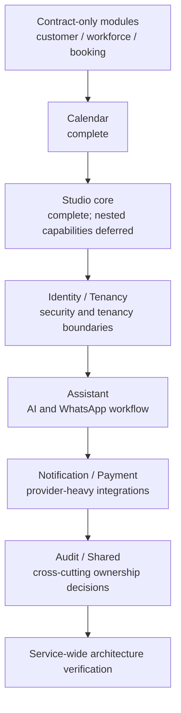

# Service module migration plan registry

This registry is the entry point for backend module package migrations. Every plan
uses the current [module package structure template](../../templates/module-package-structure-template.md)
as its architectural source of truth. The template is a maximum approved shape,
not a requirement to create empty packages.

## Scope and order

Plans are ordered by dependency and risk. A later plan must not silently absorb
unfinished work from an earlier plan; add a new plan or update the registry when
scope changes.

## Plan matrix

| Module | Plan | Current status | Required outcome |
|---|---|---|---|
| `catalog` | [catalog baseline verification](2026-07-31-catalog-baseline-verification.md) | Complete baseline pending audit | Keep canonical packages and preserve hybrid-search contracts |
| `customer` | [customer contract normalization](2026-07-31-customer-contract-normalization.md) | Planned | Remove legacy named-interface shape without inventing business types |
| `workforce` | [workforce contract normalization](2026-07-31-workforce-contract-normalization.md) | Planned | Keep the empty contract boundary honest and ready for real types |
| `booking` | [booking contract normalization](2026-07-31-booking-contract-normalization.md) | Planned | Normalize API/event ownership and preserve declared consumers |
| `calendar` | [calendar migration](2026-07-31-calendar-module-migration.md) | Complete | Record conformance to the latest template and preserve Google adapters |
| `studio` | [studio migration](2026-07-31-studio-module-migration.md) | Core complete | Keep nested capabilities in separate plans |
| `studio.documents` | [documents capability migration](2026-07-31-studio-documents-module-migration.md) | Planned | Normalize nested document and chunk ownership |
| `studio.subscriptions` | [subscriptions capability migration](2026-07-31-studio-subscriptions-module-migration.md) | Planned | Normalize nested subscription ownership |
| `identity` | [identity module migration](2026-07-31-identity-module-migration.md) | Planned | Separate security domain, persistence, inbound security, and Keycloak adapters |
| `tenancy` | [tenancy module migration](2026-07-31-tenancy-module-migration.md) | Planned | Separate tenant domain, provisioning, database pool, and web infrastructure |
| `assistant` | [assistant module migration](2026-07-31-assistant-module-template-migration.md) | Planned | Normalize AI providers, conversations, and WhatsApp webhook boundaries |
| `notification` | [notification module migration](2026-07-31-notification-module-migration.md) | Planned | Isolate notification persistence and email/SMS/push provider adapters |
| `payment` | [payment module migration](2026-07-31-payment-module-migration.md) | Planned | Isolate payment persistence, provider ports, and webhook adapters |
| `audit` | [audit module decision](2026-07-31-audit-module-normalization.md) | Planned | Decide whether the empty module is materialized or retired; create no fake layers |
| `shared` | [shared infrastructure normalization](2026-07-31-shared-infrastructure-normalization.md) | Planned | Keep cross-cutting primitives owned and prevent Shared from becoming a business dump |

## Baseline rule

Catalog is the only module treated as a verified canonical implementation baseline
in the current service branch. Identity and Tenancy are not considered complete
merely because older migration work existed elsewhere; their current source trees
must satisfy the plans listed above before the service-wide migration is complete.

## Definition of plan completion

Every implementation plan must document:

- current source ownership and exact target ownership;
- public API and named-interface decisions;
- framework-free domain and persistence separation where applicable;
- package-info coverage for every materialized package;
- file/class naming rules and deliberate deviations;
- cross-module consumers and compatibility constraints;
- unit, adapter, architecture, integration, and service verification;
- production-readiness evidence for tenancy, security, transactions, idempotency,
  observability, migration safety, and recovery;
- a committed verification report and a pushed branch.

The build-logic CDD model is documented separately in
`docs/architecture/00-project/build-logic.md`; it must not be copied into the
business-module package tree.
