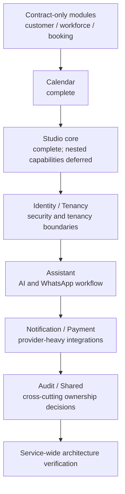

# Service module migration plan registry

This registry is the entry point for backend module package migrations. Every plan
uses the current [module package structure template](../../templates/module-package-structure-template.md)
as its architectural source of truth. The template is a maximum approved shape,
not a requirement to create empty packages.

## Scope and completed baseline

The completed contract, Calendar, Catalog, and Studio-core work is retained as
history and as the baseline for the remaining migration. The execution order
below is the authoritative order for open work.

## Plan matrix

| Module | Plan | Current status | Required outcome |
|---|---|---|---|
| `catalog` | [catalog baseline verification](2026-07-31-catalog-baseline-verification.md) | Verified canonical baseline (reverified 2026-08-01) | Keep canonical packages and preserve hybrid-search contracts |
| `customer` | [customer contract normalization](2026-07-31-customer-contract-normalization.md) | Complete boundary slice | Remove legacy named-interface shape without inventing business types |
| `workforce` | [workforce contract normalization](2026-07-31-workforce-contract-normalization.md) | Complete boundary slice | Keep the empty contract boundary honest and ready for real types |
| `booking` | [booking contract normalization](2026-07-31-booking-contract-normalization.md) | Complete boundary slice | Normalize API/event ownership and preserve declared consumers |
| `calendar` | [calendar migration](2026-07-31-calendar-module-migration.md) | Complete | Record conformance to the latest template and preserve Google adapters |
| `studio` | [studio migration](2026-07-31-studio-module-migration.md) | Core complete | Keep nested capabilities in separate plans |
| `studio.documents` | [documents capability migration](2026-07-31-studio-documents-module-migration.md) | Core complete | Finish search/embedding evidence and service-wide verification |
| `studio.subscriptions` | [subscriptions capability migration](2026-07-31-studio-subscriptions-module-migration.md) | Core boundary complete | Finish authorization/payment boundary and service-wide verification |
| `identity` | [identity module migration](2026-07-31-identity-module-migration.md) | In progress: remaining authorization separation and production evidence | Separate security domain, persistence, inbound security, and Keycloak adapters |
| `tenancy` | [tenancy module migration](2026-07-31-tenancy-module-migration.md) | In progress: operational evidence and port cleanup | Separate tenant domain, provisioning, database pool, and web infrastructure |
| `assistant` | [assistant module migration](2026-07-31-assistant-module-template-migration.md) | Planned | Normalize AI providers, conversations, and WhatsApp webhook boundaries |
| `notification` | [notification module migration](2026-07-31-notification-module-migration.md) | Core complete | Finish retry/idempotency evidence and service-wide verification |
| `payment` | [payment module migration](2026-07-31-payment-module-migration.md) | Core complete | Finish webhook replay/signature evidence and service-wide verification |
| `audit` | [audit module decision](2026-07-31-audit-module-normalization.md) | Decision complete | Keep metadata-only until a separately approved audit capability exists |
| `shared` | [shared infrastructure normalization](2026-07-31-shared-infrastructure-normalization.md) | Ownership complete | Finish search evidence and service-wide dependency verification |

## Remaining execution order: priority and type

Open work is ordered by production risk and dependency, not by filename or
alphabetical module name. A plan may be split into smaller commits, but it must
not move to the next priority band until its exit criteria are met.

| Priority | Type | Work item | Plan | Why this order | Exit gate |
|---|---|---|---|---|---|
| P0 | Security and tenant isolation | Finish Identity security/domain/application separation | [Identity](2026-07-31-identity-module-migration.md) | Authentication, authorization, privilege boundaries, and public identity contracts protect every downstream capability | Identity security tests, architecture rules, integration tests, Modulith, CI, and production-readiness evidence pass |
| P0 | Security and tenant isolation | Complete Tenancy boundary migration | [Tenancy](2026-07-31-tenancy-module-migration.md) | Tenant resolution, routing, pool lifecycle, and provisioning are isolation-critical and must be stable before adding more tenant-owned behavior | Tenant isolation, routing/pool lifecycle, provisioning replay/idempotency, integration, Modulith, and CI evidence pass |
| P1 | Cross-cutting decision | Decide Audit ownership or retirement | [Audit](2026-07-31-audit-module-normalization.md) | Prevents an empty module or duplicated audit system from becoming an architectural dependency | ADR records the owner/status and the registry reflects the decision |
| P1 | Shared infrastructure | Normalize Shared ownership and technical primitives | [Shared](2026-07-31-shared-infrastructure-normalization.md) | Shared changes have repository-wide blast radius and define boundaries consumed by later capability migrations | Shared architecture rules, integration tests, dependency graph, rollback notes, and CI pass |
| P2 | Domain capability | Migrate Studio Documents | [Documents](2026-07-31-studio-documents-module-migration.md) | Documents is a Studio-owned capability and should be canonical before Assistant or search consumers depend on its contracts | Domain/persistence/API/adapter boundaries and document behavior are regression-tested |
| P2 | Domain capability | Migrate Studio Subscriptions | [Subscriptions](2026-07-31-studio-subscriptions-module-migration.md) | Subscription ownership must be explicit before Payment and entitlement consumers rely on it | Lifecycle, tenant restrictions, public contracts, and payment boundary tests pass |
| P2 | AI and messaging capability | Migrate Assistant | [Assistant](2026-07-31-assistant-module-template-migration.md) | Assistant has multiple provider and webhook boundaries and should consume stable Identity, Tenancy, and Shared contracts | AI provider, WhatsApp webhook, persistence, web, architecture, and service gates pass |
| P3 | Provider integration | Migrate Notification | [Notification](2026-07-31-notification-module-migration.md) | Provider-heavy behavior needs stable tenant, persistence, and application-port foundations | Email/SMS/push provider contracts, idempotency/retry, web, integration, and CI gates pass |
| P3 | Provider integration | Migrate Payment | [Payment](2026-07-31-payment-module-migration.md) | Payment has financial and webhook risk; it follows stable subscription, tenant, and provider boundaries | Provider/webhook signature and replay, transaction, tenant, integration, and CI evidence pass |
| P4 | Governance and verification | Run final service-wide architecture verification | Registry and service verification checklist | Confirms no migration weakened Modulith boundaries or reintroduced legacy packages | Full architecture, Modulith, CI, boot artifacts, documentation, security, and rollback evidence pass |

### Parallelization rules

- P0 is sequential: finish Identity security contracts before finalizing Tenancy
  consumers and isolation evidence.
- Audit is a decision-only track and may be prepared during late P0, but its
  recorded decision must exist before Shared changes depend on audit ownership.
- Documents and Subscriptions may run in parallel after their public contracts
  and ownership boundaries are approved.
- Notification and Payment may run in parallel after Shared is stable; Payment
  must additionally wait for the Subscription contract it consumes.
- The final P4 verification is sequential and follows every implementation
  plan, including any parallel tracks.

### Priority definitions

| Priority | Meaning |
|---|---|
| P0 | Production safety or tenant/security isolation; do first and fail fast |
| P1 | Cross-cutting ownership or infrastructure that can invalidate later work |
| P2 | Core business capabilities with bounded module scope |
| P3 | External-provider integrations with higher operational complexity |
| P4 | Final repository-wide governance and release evidence |

## Baseline rule

Catalog is the only module treated as a verified canonical implementation baseline
in the current service branch. Identity and Tenancy are not considered complete
merely because older migration work existed elsewhere; their current source trees
must satisfy the plans listed above before the service-wide migration is complete.

## Definition of plan completion

Every implementation plan must document:

- current source ownership and exact target ownership;
- public API and named-interface decisions;
- framework-free domain and persistence separation where applicable;
- package-info coverage for every materialized package;
- file/class naming rules and deliberate deviations;
- cross-module consumers and compatibility constraints;
- unit, adapter, architecture, integration, and service verification;
- production-readiness evidence for tenancy, security, transactions, idempotency,
  observability, migration safety, and recovery;
- a committed verification report and a pushed branch.

The build-logic CDD model is documented separately in
`docs/architecture/00-project/build-logic.md`; it must not be copied into the
business-module package tree.
