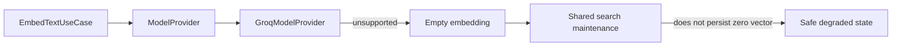

# Assistant Embedding Contract Verification

| Field | Value |
|---|---|
| Module | Assistant AI capability |
| Slice | Unsupported-provider embedding contract |
| Date | 2026-08-02 |
| Status | Verified |

## Decision

Groq is a chat/intent provider in the current integration and does not provide
embeddings. `GroqModelProvider.embed` therefore returns an empty list, matching
the `ModelProvider` contract and allowing callers to leave the row unembedded.



## Guardrail

Persisting a zero vector is invalid for cosine-distance search. The provider
must return an empty list for unsupported embedding operations; the existing
embedding application boundary can then skip persistence rather than storing a
synthetic vector.

## Verification

```text
./gradlew :modules:assistant:spotlessApply \
  :modules:assistant:test \
  --tests com.emme.assistant.ai.adapter.out.provider.groq.GroqModelProviderTest \
  --no-daemon --no-configuration-cache
```

Result: `BUILD SUCCESSFUL`.

Live Groq/Ollama provider contract tests and PostgreSQL replay evidence remain
environment-backed follow-up work.
