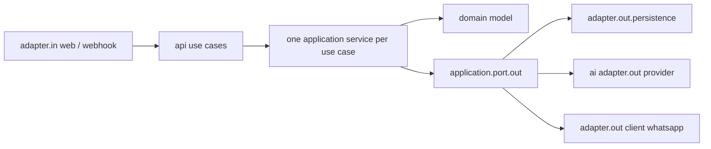

# Assistant Module Template Migration Verification

| Field | Detail |
|---|---|
| Module | `modules/assistant` |
| Branch | `feat/module-plans-normalization` |
| Date | 2026-08-02 |
| Template | `docs/templates/module-package-structure-template.md` |
| Status | Canonical source migration verified; operational evidence remains open |

## Result

The Assistant module now follows the approved DDD + Hexagonal package template.
The source tree has no legacy `entity`, flat `application`, or `web`
implementation package, and the AI capability remains a capability-owned
boundary rather than a type-first package bucket.

The service is pre-release. Its active endpoint contract uses version-neutral
`/api` routes and the global `API-Version` header. No `/api/v1` compatibility
aliases or other backwards-compatibility shims are retained.

## Verified structure



- Public contracts are grouped by kind under `api/command`, `api/query`,
  `api/result`, `api/usecase`, and `api/exception`.
- Each current conversation/action use case has a focused application service.
- Domain models are framework-free and persistence entities are owned by
  `adapter/out/persistence/entity`.
- Spring Data repositories use `SpringData<Aggregate>Repository` naming and are
  hidden behind application-owned ports and persistence adapters.
- AI providers are grouped by external technology under
  `ai/adapter/out/provider/{groq,ollama,mock}`.
- WhatsApp webhook verification, tenant resolution, replay claiming, and Graph
  API delivery are separated into inbound/outbound adapters.
- Every materialized production package contains `package-info.java`.
- Dead `FallbackHandler`, `ToolRegistry`, and `ToolExecutor` helpers and the
  empty legacy `ai/config` package were removed after reference checks.

## Verification evidence

Passed:

```text
./gradlew :modules:assistant:test --no-daemon --no-configuration-cache
./gradlew :modules:assistant:integrationTest --no-daemon --no-configuration-cache
./gradlew :modules:assistant:spotlessApply :modules:assistant:check \
  :applications:emme-platform:test --tests com.emme.ModularityTest \
  --no-daemon --no-configuration-cache
git diff --check
```

The final focused Gradle gate completed with `BUILD SUCCESSFUL`; Assistant
tests and checks reported zero failures and zero skipped tests. The source-tree
tests also enforce package metadata, legacy-package removal, AI provider
visibility, and tenant-scoped persistence lookups.

## Still open

These are not structural migration failures and must remain visible until
executed:

1. Credentialed Groq/Ollama provider contract tests.
2. PostgreSQL/Testcontainers replay and idempotency execution for WhatsApp.
3. Clean test-context lifecycle evidence for the JDBC Modulith publication
   registry; repository-wide runs still emit shutdown-time database warnings in
   some contexts even when Gradle exits successfully.
4. Final service-wide CI, boot-JAR, security, recovery, and dependency-cycle
   verification.

No implementation claim should be promoted to “fully production verified” until
these evidence items are closed.
