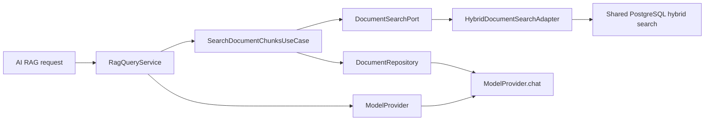

# Assistant Documents-backed RAG Verification

| Field | Value |
|---|---|
| Scope | Assistant AI RAG and Studio Documents search boundary |
| Date | 2026-08-02 |
| Status | Focused implementation verified |

## Decision

Assistant no longer returns a real-provider placeholder. The RAG workflow is
now composed from explicit boundaries:



The Studio Documents API owns retrieval because document chunks are its
capability. Assistant consumes only `studio :: documents-api`; it does not
depend on persistence entities, repositories, or Shared JDBC search details.

The query is tenant-scoped, validates a bounded result limit, restores the
rank returned by search, and hydrates only chunk IDs belonging to the
requested tenant. An empty embedding is passed through to the existing
keyword-only branch instead of persisting or searching with a fabricated zero
vector. Mock mode keeps its canned response.

## Verification

Focused red tests first failed because the public search contracts and service
implementation did not exist. After implementation, the following passed:

```text
./gradlew :modules:studio:test \
  --tests com.emme.studio.documents.application.service.SearchDocumentChunksServiceTest \
  :modules:assistant:test \
  --tests com.emme.assistant.ai.application.service.RagQueryServiceTest \
  --no-daemon --no-configuration-cache

./gradlew :modules:studio:check :modules:assistant:check \
  --no-daemon --no-configuration-cache
```

Both commands completed successfully. The module check output still emits
existing H2/Spring Modulith shutdown warnings for test contexts whose
`event_publication` table is already closed or absent; these remain tracked as
part of the final service-wide lifecycle verification and are not treated as
new RAG failures.

## Remaining evidence

- PostgreSQL/Testcontainers execution with real `document_chunk` vector and
  full-text indexes.
- Provider contract tests for live embedding/chat providers.
- Replay and failure recovery evidence for asynchronous document processing.
- Final service-wide Modulith, boot-artifact, and CI verification.
