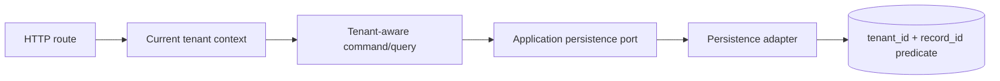

# Assistant Tenant-Scoped Lookup Verification

Date: 2026-08-02  
Module: `modules/assistant`  
Plan: [Assistant module template migration](../plans/2026-07-31-assistant-module-template-migration.md)  
Status: Slice complete; final module and service gates remain open

## Finding

The Assistant module had a tenant-isolation gap in existing-record operations.
Conversation and pending-action ports exposed identifier-only lookup methods,
their persistence adapters delegated to identifier-only Spring Data reads, and
several HTTP routes did not obtain the current tenant before invoking a use
case. Conversation-event reads were also not tenant-qualified.

## Correction

| Boundary | Correction |
|---|---|
| Existing-record commands/queries | Tenant ID added to close, event append, pending-action transitions, conversation reads, history, and active-action queries |
| Conversation port/adapter | `findByTenantIdAndId(tenantId, conversationId)` delegates to `findByIdAndTenantId` |
| Conversation-event port/adapter | Latest and history reads use tenant-qualified Spring Data predicates |
| Pending-action port/adapter | Existing action lookup and active-action lookup use tenant-qualified predicates |
| Web adapter | Get, close, history, proposal, confirmation, and rejection routes use `withCurrentTenant` |
| Regression coverage | `AssistantPackageConventionTest` rejects identifier-only lookup methods and adapter calls |

## Dependency direction

The tenant boundary remains explicit at the application contract. No domain
model or persistence entity was exposed to the web layer, and no schema or HTTP
path changed.

## Verification evidence

Passed:

- `./gradlew :modules:assistant:compileTestJava --no-daemon --no-configuration-cache`
- `./gradlew :modules:assistant:spotlessApply :modules:assistant:test :modules:assistant:check --no-daemon --no-configuration-cache`
- `./gradlew :modules:assistant:check --no-daemon --no-configuration-cache`
- `git diff --check`

The Assistant test reports contain zero failures and zero skipped tests. The
Gradle configuration emits existing dependency-analysis warnings about
`java-library` and Spring Boot in `emme-platform`; this slice does not change
that unrelated configuration.

## Remaining evidence

- Live AI provider contract tests.
- PostgreSQL replay/idempotency execution evidence for WhatsApp deliveries.
- Full application Modulith, CI, boot-JAR, security, and recovery verification.
