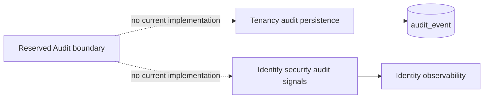

# Audit Ownership Verification

Date: 2026-08-02
Module: `modules/audit`
Status: Reserved metadata-only boundary confirmed

## Decision

Audit remains a reserved Spring Modulith boundary. Tenancy owns durable tenant
audit persistence through `AuditEventPort`; Identity owns security audit
signals. The Audit module has no independent production capability, so it must
not contain empty `api`, `domain`, `application`, or `adapter` packages.

## Changes

- Removed unnecessary Shared and Tenancy dependencies from the Audit Gradle
  project.
- Set the module metadata to `allowedDependencies = {}`.
- Replaced the placeholder `assertThat(true)` test with a filesystem invariant
  proving the boundary remains metadata-only.

## Verification

Passed:

- `./gradlew :modules:audit:spotlessApply :modules:audit:test :applications:emme-platform:test --tests com.emme.ModularityTest --no-daemon --no-configuration-cache`
- `node scripts/validate-markdown.mjs`
- `git diff --check`

Any future Audit implementation requires a separate approved ADR and migration
plan defining system of record, retention, redaction, tenant scope, availability,
and recovery semantics.
