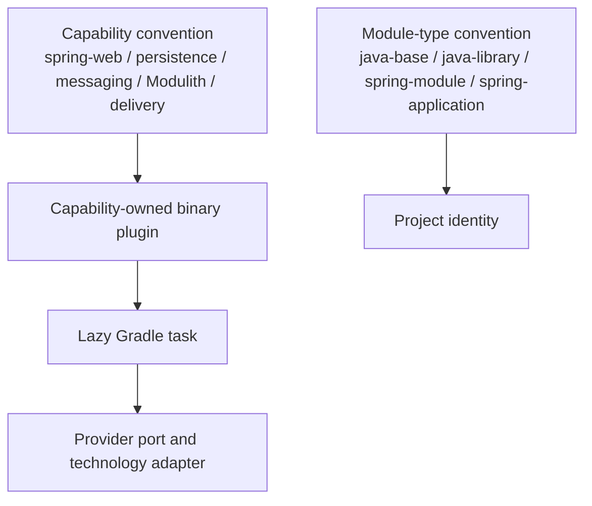

# Build-Logic Capability-Driven Design Verification

| Field | Value |
|---|---|
| Date | 2026-08-02 |
| Branch | `feat/module-plans-normalization` |
| Scope | Included `build-logic`, service composition, conventions, TestKit, configuration cache |
| Status | Implemented and verified for the current unreleased service |

## Verified boundary

The build logic now distinguishes project type from optional capability:

Capability conventions no longer apply `emme.spring-module` implicitly. A
project opts into its module type explicitly, then composes only the capabilities
it needs. Complex capabilities own their extensions, tasks, providers, results,
and tests. Shared `core`, `model`, and `root` code remains limited to genuine
cross-capability concerns.

## Verification evidence

| Command | Result |
|---|---|
| `./gradlew :build-logic:check --no-daemon --no-configuration-cache --console=plain` | Passed |
| `./gradlew :build-logic:functionalTest --configuration-cache --no-daemon --console=plain` | Passed; cold configuration-cache entry stored |
| Same configuration-cache command a second time | Passed; configuration-cache entry reused |
| `./gradlew :applications:emme-platform:test --tests com.emme.ModularityTest --tests com.emme.LayerConventionTest :applications:emme-platform:bootJar ...` | Passed |
| `./gradlew :applications:emme-platform:integrationTest --tests com.emme.KafkaEventStreamingIntegrationTest` | Passed against a real Kafka Testcontainer |
| `./gradlew ci --no-daemon --no-configuration-cache --console=plain` | Passed; 181 tasks, 93 executed, 88 up-to-date |
| `node scripts/validate-markdown.mjs` | Passed |
| `git diff --check` | Passed |

## Guardrails now enforced

- Public convention IDs and registered Gradle task names remain explicit and
  stable for this unreleased service.
- Capability scripts cannot apply module-type conventions implicitly.
- Provider selection is lazy, typed, truthful, and fails clearly for unsupported
  values.
- Tasks use Gradle lazy properties/providers for configuration-cache-safe inputs.
- Git metadata uses `ValueSource` implementations and deterministic values when
  a temporary project is outside a Git checkout.
- TestKit covers the current foundation, testing, persistence, messaging,
  Modulith, delivery, security, quality, API compatibility, root, and
  configuration-cache families.

## Known warnings

The verification commands still print non-failing environment warnings from
Zstandard/Gradle native access and H2/Hibernate test-context teardown. CI exits
successfully, and these warnings do not alter production PostgreSQL/Liquibase
behavior. They remain cleanup-quality follow-ups rather than architecture or
build-logic correctness failures.
