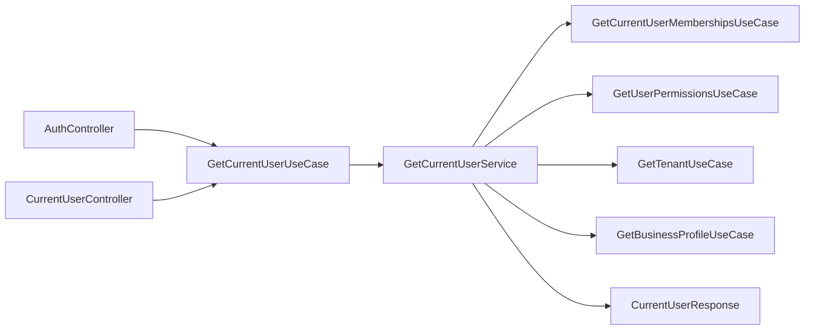

# Identity Current-User Boundary Verification

| Field | Value |
|---|---|
| Module | Identity |
| Slice | Current-user application boundary |
| Date | 2026-08-02 |
| Status | Verified |

## Decision

The current-user workflow is now owned by one focused application service:
`GetCurrentUserService`. Inbound HTTP controllers only translate authenticated
transport context into the public use-case contract and map the public result
back to the HTTP response.

This satisfies the service convention that one application service implements
one primary use case. `GetCurrentUserService` composes existing public
capabilities; it does not duplicate membership, tenant, permission, or profile
business rules.

## Boundary flow



## Responsibilities

| Type | Responsibility |
|---|---|
| `GetCurrentUserQuery` | Carries authenticated user identity and the optional tenant claim. |
| `GetCurrentUserUseCase` | Stable application capability exposed to inbound adapters. |
| `GetCurrentUserService` | Coordinates public Identity, Tenancy, and Studio capabilities and selects the profile tenant. |
| `CurrentUserDetails` | Identity-owned application result; does not expose Studio's profile result type. |
| `CurrentUserController` | Extracts `UserContext`, invokes the use case, and delegates response mapping. |
| `AuthController` | Performs authentication and invokes the same current-user capability for login enrichment. |
| `IdentityWebMapper` | Converts the Identity application result to the HTTP response contract. |

## Guardrails verified

- Controllers do not call other controllers.
- `AuthController` and `CurrentUserController` share the application use case,
  not implementation or HTTP-controller state.
- The application service uses public module contracts rather than persistence
  repositories or adapter implementations.
- The current-user result does not leak Studio's application result model.
- Membership permissions and tenant metadata are assembled once in the
  application boundary.
- Single-membership fallback and valid selected-tenant behavior remain in the
  application workflow.

## Verification evidence

```text
./gradlew :modules:identity:spotlessApply \
  :modules:identity:test \
  --tests com.emme.identity.IdentityPackageConventionTest \
  --tests com.emme.identity.application.service.GetCurrentUserServiceTest \
  --no-daemon --no-configuration-cache
```

Result: `BUILD SUCCESSFUL`.

```text
./gradlew :modules:identity:check \
  :modules:identity:integrationTest \
  :applications:emme-platform:test \
  --tests com.emme.ModularityTest \
  --no-daemon --no-configuration-cache
```

Result: `BUILD SUCCESSFUL`.

The test output includes known application-context shutdown warnings while
Testcontainers or H2 resources are being closed. They did not fail the build;
the follow-up service-wide verification should separately address lifecycle
noise and recovery evidence.
