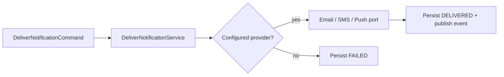

# Notification Unsupported-Channel Delivery Verification

| Field | Value |
|---|---|
| Scope | Notification delivery application service |
| Date | 2026-08-02 |
| Status | Focused implementation verified |

## Finding and decision

The delivery switch previously returned `null` for `WHATSAPP` and `WEB`. The
service then advanced the aggregate through `SENT` to `DELIVERED`, even though
no provider had run. That violated the delivery lifecycle contract.

Unsupported channels now fail explicitly inside the application service. The
existing failure path persists `FAILED`, avoids publishing
`NotificationDelivered`, and leaves provider ports untouched. This keeps
provider implementations behind the application-owned `EmailSender`,
`SmsSender`, and `PushSender` ports.



## Verification

The regression test was observed failing before implementation because an
unsupported channel was returned as `DELIVERED`. It now passes with:

```text
./gradlew :modules:notification:test \
  --tests com.emme.notification.application.service.NotificationDeliveryBoundaryTest \
  --no-daemon --no-configuration-cache
```

Full provider contract, transient retry, durable idempotency, and credentialed
live-provider evidence remain open in the Notification migration plan.

## Module gate — 2026-08-02

The following gate also passed:

```text
./gradlew :modules:notification:compileJava :modules:notification:test \
  :modules:notification:integrationTest --no-daemon --no-configuration-cache
```

The integration process still emits shutdown-time PostgreSQL connection errors
while Spring Modulith's event-publication registry and Hibernate close. The
Gradle process exits successfully, but clean connection-lifecycle evidence
remains open for the service-wide gate.
