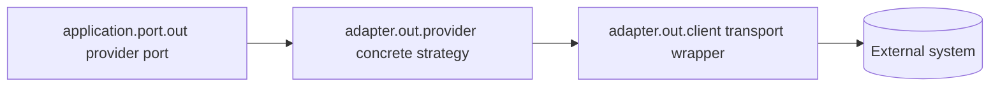

# Notification Normalization Verification

Date: 2026-08-02  
Module: `modules/notification`  
Status: Structural normalization complete; operational evidence remains open

## Changes verified

| Concern | Result |
|---|---|
| Public event naming | `NotificationDeliveredEvent` is now `NotificationDelivered`, a past-tense public fact |
| Cross-module event consumer | Studio `DashboardBroadcaster` and its wiring test use only `NotificationDelivered` |
| Provider package naming | Notification providers live under `adapter.out.provider.email`, `.sms`, and `.push` |
| AI provider package naming | Assistant model providers live under `ai.adapter.out.provider.groq`, `.ollama`, and `.mock` |
| Raw transport naming | Assistant WhatsApp remains under `adapter.out.client.whatsapp` because it is a transport adapter, not a provider strategy |
| Architecture documentation | Module template and backend infrastructure docs now define provider-versus-client ownership |

## Boundary rule

`adapter.out.provider` is used when a class implements a capability abstraction
such as `ModelProvider` or `SmsSender`. `adapter.out.client` is reserved for a
transport-focused wrapper and wire DTOs. This keeps package names aligned with
the class responsibility instead of making every external integration look like
a low-level HTTP client.

## Verification evidence

Passed:

- `./gradlew :modules:notification:spotlessApply :modules:notification:test :modules:notification:check :modules:studio:compileJava :modules:studio:compileTestJava --no-daemon --no-configuration-cache`
- `./gradlew :modules:assistant:spotlessApply :modules:assistant:test :modules:assistant:check --no-daemon --no-configuration-cache`
- `node scripts/validate-markdown.mjs`
- `git diff --check`

The Notification and Assistant checks completed with zero test failures and
zero skipped tests. Existing Gradle dependency-analysis warnings and
test-container shutdown messages remain unrelated to this naming slice.

## Remaining evidence

- Deterministic contract coverage for every external provider technology.
- Explicit transient-failure retry/backoff policy and recovery evidence.
- Credentialed provider sandbox/live checks.
- Final service-wide Modulith, CI, boot-JAR, security, and recovery gates.
