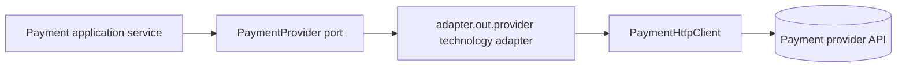

# Payment Provider Namespace Verification

Date: 2026-08-02  
Module: `modules/payment`  
Status: Structural normalization complete; operational evidence remains open

## Changes verified

Payment implementations named as providers now live under the canonical
provider namespace:

```text
adapter/out/provider/
├── conekta/ConektaProvider.java
├── mercadopago/MercadoPagoProvider.java
├── mock/MockPaymentProvider.java
├── paypal/PayPalProvider.java
└── stripe/StripeProvider.java
```

The application-owned `PaymentProvider` port remains under
`application/port/out`. `PaymentHttpClient` remains in `configuration` as a
transport composition-root dependency, which keeps provider strategy and raw
transport responsibilities distinct.

## Dependency direction



## Verification evidence

Passed:

- `./gradlew :modules:payment:spotlessApply :modules:payment:test :modules:payment:check --no-daemon --no-configuration-cache`
- `./gradlew :modules:payment:integrationTest --no-daemon --no-configuration-cache`
- `node scripts/validate-markdown.mjs`
- `git diff --check`

Payment checks completed with zero test failures and zero skipped tests. The
integration run reports existing database-container shutdown noise after the
test process exits; Gradle completed successfully.

## Remaining evidence

- Deterministic contract tests for every payment provider technology.
- Durable webhook replay/signature execution evidence across provider payloads.
- Credentialed provider sandbox/live checks.
- Final service-wide Modulith, CI, boot-JAR, security, and recovery gates.
