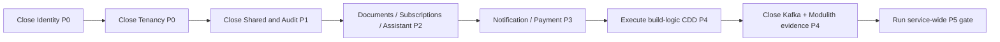

# Service Migration Plan Audit

| Field | Detail |
|---|---|
| Date | 2026-08-02 |
| Repository | `emme-service` |
| Scope | All module migration plans, the build-logic plan, cross-cutting event delivery, and final verification |
| Authority | Current status sections and verification reports, not stale historical checkbox counts |

## Executive result

The original eleven-item execution order is directionally correct for the
backend modules, but it is not complete. It contains completed baselines as if
they still required implementation, and it omits two required closure tracks:

1. the complete implementation of the Capability-Driven Design build-logic
   migration; and
2. final operational evidence for Spring Modulith event publication over Kafka.

The registry now separates implementation work, evidence work, and historical
checklist reconciliation.

## True remaining work by priority

| Priority | Plan or area | What is still missing | Classification |
|---|---|---|---|
| P0 | Identity | Distributed login-rate-limit state and failure behavior; final architecture dependency rules; explicit provisioning transaction/event-port evidence; broader authorization hardening; tenant-isolation, privilege-escalation, JWT issuer/audience, and migration/recovery evidence | Open implementation plus production evidence |
| P0 | Tenancy | Live tenant-pool eviction and routing-failure evidence; provisioning replay/idempotency and rollback evidence; transaction/after-commit evidence; architecture dependency rules; committed verification report | Open operational evidence |
| P1 | Shared | Live PostgreSQL vector/full-text search integration evidence; complete dependency-cycle and API-exposure verification; committed rollback/recovery evidence | Open verification |
| P1 | Audit | No implementation is missing. The metadata-only decision is complete; only historical plan wording needed reconciliation | Documentation only |
| P2 | Studio Documents | Full Studio integration and Modulith evidence; schema comparison; final service-wide verification | Open verification |
| P2 | Studio Subscriptions | Payment-boundary documentation/contract decision; final integration, Modulith, schema, security, and recovery evidence | Open boundary documentation plus verification |
| P2 | Assistant | Live AI/WhatsApp provider contract tests; PostgreSQL replay execution; final service-wide verification; Documents-backed RAG live search evidence | Focused RAG boundary now implemented; operational evidence remains open |
| P3 | Notification | Deterministic provider contract tests; explicit transient-failure retry policy and evidence; durable delivery replay/idempotency proof against PostgreSQL; final integration/CI verification | Open provider and operational evidence |
| P3 | Payment | Deterministic provider contract tests; tenant-scoped read coverage for every endpoint; PostgreSQL execution of webhook claims; final signature/replay and financial integration evidence | Open provider and operational evidence |
| P4 | Build-logic | Execute the new CDD migration specification and plan across all convention scripts, binary plugins, extensions, tasks, providers, models, ValueSources, tests, and verification gates; remove eager resolution and silent fallbacks; add complete TestKit/configuration-cache coverage | Open implementation |
| P4 | Kafka + Spring Modulith | Final event catalog and topic/key contract; consumer idempotency/replay behavior; retry/dead-letter policy; production broker settings; CI and real integration evidence | Open cross-cutting evidence |
| P5 | Service-wide gate | Full architecture and dependency-cycle checks; all module and application tests; Modulith verification; formatting/Checkstyle/Detekt; boot JARs; Kafka integration; security, migration, rollback/recovery, documentation, and warning review | Open final gate |

## Baselines that are not missing implementation

These areas already have canonical implementation or intentional boundary
decisions. Their old unchecked lines are historical plan steps and must not be
interpreted as requests to recreate legacy packages:

- Calendar is template-conformant and its historical checklist was reconciled.
- Catalog is the verified canonical implementation baseline, including search
  ownership, tenant predicates, typed storage configuration, and one-service-
  per-use-case application services.
- Studio core is complete; Documents and Subscriptions remain separate nested
  capability tracks.
- Customer, Workforce, and Booking are intentional contract-only boundaries.
  They must materialize implementation packages only when a real capability is
  approved.
- Audit is intentionally metadata-only. Identity and Tenancy own the current
  audit responsibilities; a future Audit capability requires a separate design.
- Shared ownership, global advice placement, and technical primitive ownership
  are decided. The remaining Shared work is evidence, not a second redesign.
- Shared REST/PostgreSQL test profiles and the common integration schema were
  centralized in test fixtures; their previous module-local duplicates are not
  remaining gaps.
- RabbitMQ/AMQP is not a remaining migration target. Kafka plus Spring Modulith
  is the selected event-streaming direction.

## Order to completion

Documents and Subscriptions can proceed in parallel after their dependency
contracts are stable. Notification and Payment can proceed in parallel after
Shared and the Subscription contract are stable. Build-logic CDD and Kafka
closure are separate tracks but both must close before the final gate.

## Verification policy

A plan is complete only when its current status section, executable tests, and
committed evidence agree. A passing focused module test is not equivalent to
service completion. The final gate must also record non-failing warnings that
remain operationally relevant, including current H2/PostgreSQL teardown noise
and dependency-analysis warnings, rather than silently treating them as zero-
warning verification.
