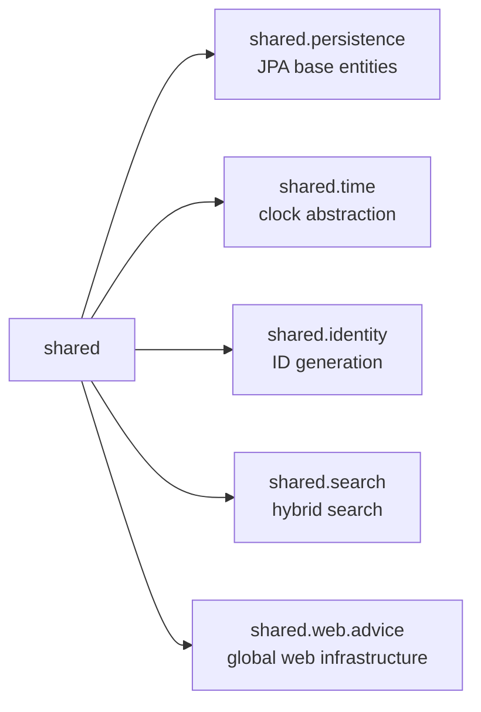

# Shared Capability Package Verification

Date: 2026-08-02
Module: `modules/shared`
Status: Capability package normalization complete; search and service-wide evidence remain open

## Decision

Shared is technical infrastructure rather than a business module, so its
packages are organized by capability:

The former root-package primitive locations are removed. This prevents the
root package from becoming a type-oriented dumping ground and makes ownership
obvious at every import site.

## Changes

- Moved `PersistedEntity` and `TenantOwnedEntity` to `shared.persistence`.
- Moved `ClockProvider` to `shared.time`.
- Moved `IdGenerator` to `shared.identity`.
- Updated all consuming modules and Shared tests.
- Kept the framework-free domain models independent from JPA base classes.

## TDD evidence

The source-convention test was changed first to require the capability-owned
paths and reject the old root paths. It failed before implementation because
the files were still in the root package. After the moves and import updates,
the test passed.

## Verification

Passed:

- `./gradlew :modules:shared:spotlessApply :modules:shared:test --no-daemon --no-configuration-cache`
- `./gradlew compileJava --no-daemon --no-configuration-cache`
- `./gradlew :modules:shared:test :modules:tenancy:test :applications:emme-platform:test --tests com.emme.ModularityTest --no-daemon --no-configuration-cache`
- `./gradlew :modules:shared:spotlessApply :modules:shared:integrationTest --no-daemon --no-configuration-cache`
- `git diff --check`

The PostgreSQL integration test passed after aligning the bounded-result
assertion with the query's explicit UUID ordering. Testcontainers/PostgreSQL
shutdown emits connection-cleanup warnings after the assertions complete, but
Gradle reports success.

Remaining evidence:

- PostgreSQL vector/full-text search integration coverage.
- Full service-wide dependency-cycle, Modulith, CI, boot-JAR, security, and
  recovery verification.
