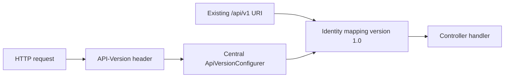

# Spring MVC Endpoint Versioning Verification

| Field | Value |
|---|---|
| Scope | Service MVC boundary |
| Date | 2026-08-02 |
| Status | Verified |

## Decision

The service uses one centralized Spring MVC API-version strategy:

- source: `API-Version` request header;
- default: `1.0`, preserving existing clients;
- supported version: `1.0`;
- public major URI: unchanged `/api/v1/...`;
- controller condition: Identity's `/api/v1/identity` mapping declares
  `version = "1.0"`.



The resolver is configured in Tenancy's existing global MVC configuration so
the service has one resolver rather than module-specific version policies.

## Verification

```text
./gradlew :modules:tenancy:check :modules:identity:check \
  :applications:emme-platform:test \
  --tests com.emme.ModularityTest \
  --no-daemon --no-configuration-cache
```

Result: `BUILD SUCCESSFUL`.

The output still contains known asynchronous Modulith/Testcontainers shutdown
noise; it did not fail the build and is tracked for the final lifecycle gate.
