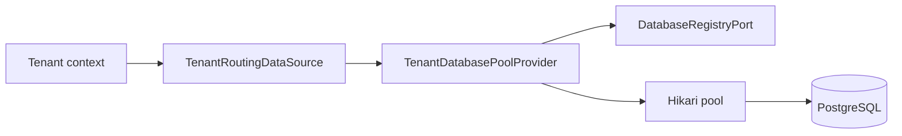

# Tenancy Operational Boundary Verification

| Area | Status | Evidence |
|---|---|---|
| Tenant domain/persistence ownership | Complete | Framework-free `Tenant`, adapter-owned entities/mappers/repositories, tenant-scoped application ports |
| Inbound web/context boundary | Complete | Controllers, context filter/aspect, trusted resolver, and rate-limit interceptor are adapter-owned |
| Provisioning orchestration | Complete structurally | Focused services/process manager use registry and schema-migration ports |
| Pool/routing ownership | Complete structurally | Routing selects a database; pool provider owns creation, caching, eviction, and shutdown |
| Typed configuration | Complete | Database credentials, pool, rate-limit, and provisioning settings use typed properties |
| Live recovery evidence | Open | PostgreSQL/Testcontainers lifecycle, eviction/recovery, rollback, replay/idempotency, and audit correlation |

## Verification

The Tenancy-focused unit, integration, Checkstyle, Spotless, and application
Modulith checks have passed in the current migration sequence. Source-boundary
tests cover SQL identifier validation, tenant predicates, provisioning port
ownership, default-pool recovery, event-after-commit listener usage, and the
managed JDBC connection executor.

The current production connection boundary is:

Application code does not acquire or close JDBC connections directly; schema
migration uses `JdbcConnectionExecutor` and its generic throwing function/
consumer callbacks.

## Known lifecycle signal

Some full application/integration runs still report shutdown-time PostgreSQL
connection loss or H2 `event_publication` absence while Spring Modulith,
Hibernate, Hikari, and Testcontainers are closing. Gradle exits successfully,
but the warning prevents a clean operational-readiness claim. The remaining
Tenancy plan items must be closed with deterministic lifecycle and recovery
evidence rather than ignored.
