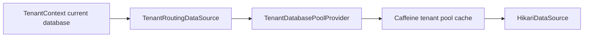

# Tenancy Routing Boundary Verification

| Field | Value |
|---|---|
| Module | Tenancy |
| Slice | Deterministic routing boundary |
| Date | 2026-08-02 |
| Status | Verified |

## Decision

`TenantRoutingDataSource` remains a thin adapter. It resolves the current
database key from `TenantContext` and delegates target DataSource creation and
reuse to `TenantDatabasePoolProvider`.



## Verified invariants

| Invariant | Evidence |
|---|---|
| No database context uses the configured default database ID. | `routesToTheConfiguredDefaultDatabaseWithoutTenantContext` |
| A resolved tenant database ID is preserved as the routing key. | `routesToTheDatabaseResolvedForTheCurrentTenant` |
| Routing does not construct or own pools. | `delegatesTargetResolutionToTheLazyPoolProvider` |
| Default-pool lookup and closed-pool replacement remain covered. | `TenantDatabasePoolProviderTest` |

## Verification

```text
./gradlew :modules:tenancy:spotlessApply \
  :modules:tenancy:test \
  --tests com.emme.tenancy.adapter.out.client.database.TenantRoutingDataSourceTest \
  --tests com.emme.tenancy.adapter.out.client.database.TenantDatabasePoolProviderTest \
  --no-daemon --no-configuration-cache
```

Result: `BUILD SUCCESSFUL`.

This is deterministic unit evidence only. Live pool eviction timing,
connection-failure recovery, replay/idempotency, and deployment rollback remain
explicit service-wide or environment-backed evidence items.
