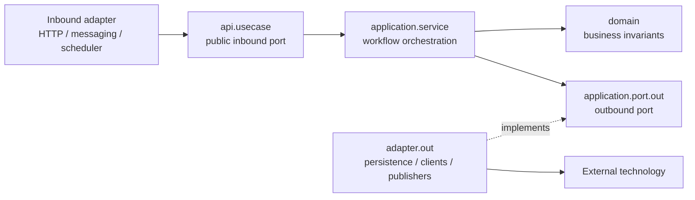
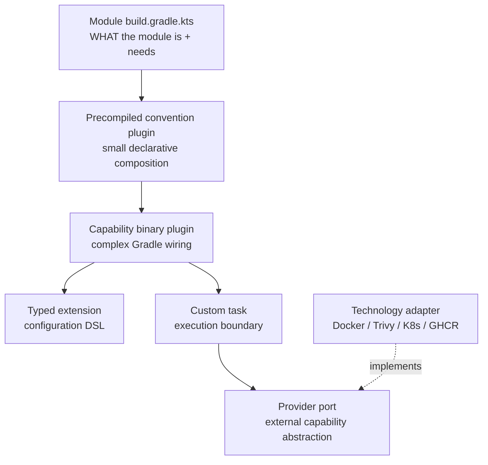
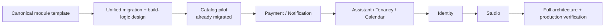

# Module Architecture and Capability-Driven Build Logic Design

| Field | Detail |
|---|---|
| Status | Draft for review |
| Date | 2026-07-30 |
| Module template | [`module-package-structure-template.md`](../../templates/module-package-structure-template.md) |
| Build-logic guidance | [`build-logic.md`](../../architecture/00-project/build-logic.md) |
| Scope | Backend module migrations and the final build-logic organization |

## 1. Decision summary

The repository uses two complementary architectural models:

```text
Business modules
    DDD + Hexagonal Architecture
    bounded business capability + public API + inward dependency direction

Build logic
    Capability-Driven Design
    reusable build capability + convention plugin + task/provider boundary
```

The new module template is the canonical source for every future backend module and
for every active module migration plan. The earlier migration plans are working
plans, not competing architecture specifications; their package trees and exceptions
must be reconciled with the template before implementation continues.

These models must not be collapsed into one universal folder template. A business
module is organized around business behavior and inward dependencies. Gradle
build-logic is organized around reusable build capabilities and Gradle execution
boundaries. The names `application`, `domain`, `adapter`, and `configuration` belong
to the backend module model; `plugin`, `extension`, `task`, `provider`, and
`ValueSource` belong to the build-logic model and are organized under their owning
capability.

## 2. Non-negotiable source of truth

The canonical module shape is defined by:

```text
api/
application/
domain/
adapter/in/
adapter/out/
configuration/
```

The complete tree, package responsibilities, `package-info.java` contracts, file
naming matrix, dependency rules, architecture tests, and production-readiness
controls live in:

[`docs/templates/module-package-structure-template.md`](../../templates/module-package-structure-template.md)

Migration plans must reference that template rather than repeat or redefine a
different package architecture. A plan may add a capability-specific child package,
but it must explain the responsibility and preserve the template's dependency
direction.

## 3. Module architecture

### 3.1 Public contract

```text
<module>/api/
├── command/       state-changing intentions
├── query/         read intentions
├── result/        public read models
├── usecase/       inbound use-case ports
├── event/         completed facts published by the module
├── exception/     expected failures visible to callers
└── type/          stable public vocabulary
```

Only these intentionally public contracts may be consumed by another module. A
consumer must not import another module's domain model, persistence entity,
repository implementation, controller, provider, or configuration.

### 3.2 Inward dependency direction



The domain is framework-independent. Application services coordinate use cases;
they do not become a second domain model. Adapters translate transport or
technology-specific representations at the boundary.

### 3.3 Exact-template migration rule

The active migration plans must be rewritten to conform to the new template. The
following legacy patterns are not valid target architecture:

| Legacy pattern | Canonical replacement |
|---|---|
| `entity/` | `domain/model/` for business objects, `adapter/out/persistence/entity/` for persistence-only objects |
| `application/` containing mixed services, listeners, repositories, and providers | `application/service/`, `application/port/out/`, `application/mapper/`, or the appropriate adapter branch |
| `provider/` | `application/port/out/` for the port and `adapter/out/client/<system>/` for the implementation |
| `config/` | `configuration/` |
| `web/` | `adapter/in/web/{controller,request,response,mapper,advice}` |
| flat `api/*Info`, `api/*Api`, or mixed contracts | `api/command`, `api/query`, `api/result`, `api/usecase`, `api/event`, `api/exception`, `api/type` |
| `application/listener/` | `adapter/in/messaging/consumer/` for external/event entry points, or a documented application service when it is not an adapter |
| JPA-specific domain objects | persistence entities in `adapter/out/persistence/entity/` plus explicit mappers, unless an ADR approves a temporary exception |

No migration plan may retain a legacy exception merely because it was present in an
earlier plan. A temporary exception requires a named owner, reason, test coverage,
removal task, and ADR.

## 4. Capability-Driven Build Logic

Build logic is an application with capabilities, ports, adapters, and execution
boundaries. Its organizing unit is the build capability, not the Kotlin type.

The build-logic architecture is therefore intentionally different from the module
template. It does not receive `api/`, `application/`, `domain/`, or `adapter/`
packages. Instead, each build capability owns the Gradle implementation pieces that
change together. Hexagonal ideas still apply at the provider boundary, but the
primary organizing rule is capability ownership and Gradle lifecycle behavior.



### 4.1 Final build-logic principles

The final build-logic architecture preserves the decisions already established in
the earlier Capability-Driven Build Logic discussion:

1. `build-logic` remains an included build.
2. Precompiled `.gradle.kts` convention plugins remain the normal composition API.
3. Binary Kotlin plugins are used for complex behavior and lifecycle wiring.
4. Typed extensions are the public Gradle DSL.
5. Custom tasks are the execution boundaries.
6. Gradle `Provider`, `Property`, and `ValueSource` APIs preserve lazy configuration.
7. Gradle TestKit functional tests verify real plugin behavior.
8. `internal/` becomes `core/` and is kept deliberately small.
9. External tools are hidden behind provider ports and replaceable adapters.
10. Module-type plugins and capability plugins remain separate concepts.
11. Composition is preferred over an `emme.everything` plugin.
12. A capability owns the files that change together.

### 4.2 Target package organization

The convention plugin scripts stay at the source root because Gradle discovers them
by plugin ID. Kotlin implementation classes are grouped by capability:

```text
build-logic/
├── build.gradle.kts
├── settings.gradle.kts
├── gradle.properties
├── config/
└── src/
    ├── main/kotlin/
    │   ├── emme.java-base.gradle.kts
    │   ├── emme.java-library.gradle.kts
    │   ├── emme.spring-module.gradle.kts
    │   ├── emme.spring-application.gradle.kts
    │   ├── emme.spring-web.gradle.kts
    │   ├── emme.persistence.gradle.kts
    │   ├── emme.messaging.gradle.kts
    │   ├── emme.modulith.gradle.kts
    │   ├── emme.testing.gradle.kts
    │   ├── emme.integration-testing.gradle.kts
    │   ├── emme.test-fixtures.gradle.kts
    │   ├── emme.quality.gradle.kts
    │   ├── emme.api-compat.gradle.kts
    │   ├── emme.feature-flags.gradle.kts
    │   ├── emme.container.gradle.kts
    │   ├── emme.publishing.gradle.kts
    │   ├── emme.deployment.gradle.kts
    │   └── com/emme/buildlogic/
    │       ├── core/
    │       ├── model/
    │       ├── root/
    │       ├── container/
    │       ├── deployment/
    │       ├── publishing/
    │       ├── registry/
    │       ├── security/
    │       ├── quality/
    │       └── git/
    ├── test/kotlin/
    └── functionalTest/kotlin/
```

`core/` contains genuinely shared primitives, `model/` contains only globally
meaningful build concepts, and `root/` contains repository coordination. The
remaining packages are capability-owned. Module-type behavior remains represented
by convention-plugin IDs such as `emme.java-library`, `emme.spring-module`, and
`emme.spring-application`; it does not require a separate `module/` package. A
simple capability may consist only of its convention script; no empty plugin,
extension, task, or provider packages are required.

### 4.3 Capability ownership template

```text
<capability>/
├── Emme<Capability>Plugin.kt       # only when binary wiring is required
├── Emme<Capability>Extension.kt    # only when public DSL is required
├── <Capability>Model.kt            # capability-owned model
├── task/                           # executable Gradle operations
│   └── <Action>Task.kt
├── provider/                       # port and technology adapters
│   ├── <Capability>Provider.kt
│   ├── <Capability>Result.kt
│   └── <Technology>Provider.kt
└── <Value>ValueSource.kt            # lazy external state, when needed
```

The template is intentionally optional by branch. For example, adding Podman
support should primarily change `container/`, adding Kubernetes behavior should
primarily change `deployment/`, and adding a release metadata field should primarily
change `publishing/`.

### 4.4 Dependency direction

```text
Convention plugin
    → module type or build capability
        → extension and task wiring
            → provider port
                ← technology adapter
                    → external tool
```

Tasks must consume lazy Gradle properties and provider abstractions. They must not
construct Docker clients, invoke raw tools through hidden globals, resolve
environment variables eagerly, or expose vendor output as a public result model.

## 5. Migration documentation model

The active migration documentation is divided into three layers:

| Layer | Canonical responsibility |
|---|---|
| Architecture handbook | Explains the stable rules and vocabulary |
| Module template | Defines the copy-ready module shape and approval controls |
| Per-module migration plan | Maps current files to the template and sequences safe implementation |

The eight active module plans are implementation plans, not architecture authorities.
Each plan must include:

- a link to the module template;
- current-to-canonical mapping using the exact package names;
- public API and named-interface decisions;
- domain-purity and persistence separation decisions;
- cross-module dependency changes;
- `package-info.java` files to create or update;
- tests and architecture checks;
- production-readiness controls from the template;
- explicit migration checkpoints and rollback-safe commits.

Historical plans remain historical. They are not silently rewritten into a second
architecture. If a historical document is still referenced by an active plan, add a
short link-forward note to the canonical template or migration plan.

## 6. Migration sequence

The sequence is:



The catalog pilot is a structural reference, not an excuse to preserve differences
from the new template. Before migrating the next module, reconcile the catalog
implementation with any mandatory template controls that it does not yet satisfy.

The final verification must include compilation, module tests, persistence tests,
architecture tests, cross-module contract checks, and the production-readiness
checklist.

## 7. Typed normalization contracts

Normalization is type-specific. Java backend modules, Kotlin/Gradle build-logic, and
architecture documentation have different roles and therefore different naming
vocabularies. A rule from one type must not be applied mechanically to another.

## 8. Java backend module migration contract

Every active module migration plan must distinguish source paths from target paths:

```text
Current source path  →  canonical target path
```

Legacy names are allowed only on the left side of a mapping, in current-state
evidence, or in an explicit delete operation. They must not remain as target
packages or target type names.

### 8.1 Required target package rules

| Legacy target | Required target |
|---|---|
| `entity/` | `domain/model/` for business models, or `adapter/out/persistence/entity/` for database representations |
| `config/` | `configuration/` |
| `web/` | `adapter/in/web/{controller,request,response,mapper,advice}` |
| `application/listener/` | `adapter/in/messaging/consumer/` for event entry points |
| `application/scheduler/` | `adapter/in/scheduler/` |
| `application/support/` | `domain/service`, `application/service`, or an adapter package chosen by responsibility; never a generic support bucket |
| `provider/` | `application/port/out` for the port and `adapter/out/client/<provider>` for the implementation |
| `infrastructure/` | The appropriate `adapter/in`, `adapter/out`, or `configuration` branch |
| flat `api/` types | `api/command`, `api/query`, `api/result`, `api/usecase`, `api/event`, `api/exception`, or `api/type` |

Nested business capabilities such as `documents` or `subscriptions` must either be
declared as genuine Spring Modulith submodules with their own root metadata and
named interfaces, or be flattened into the owning module. A nested tree cannot be
used as an ungoverned second architecture.

### 8.2 Naming rules for every migration plan

Every target file must follow the module template's naming matrix:

| Role | Required pattern |
|---|---|
| Command | `<Verb><Subject>Command` |
| Query | `<ReadVerb><Subject>Query` |
| Result | `<Subject><Shape>` such as `Details`, `Summary`, `Page`, or the project-approved `Info` |
| Use case | `<Verb><Subject>UseCase` |
| Application service | `<Verb><Subject>Service`; a cohesive multi-use-case façade may use `<Subject>ApplicationService`, never `*ServiceImpl` |
| Public event | `<Subject><PastParticiple>` |
| Public exception | `<Subject><Failure>Exception` |
| Domain policy | `<BusinessConcept>Policy` |
| Inbound controller | `<Resource>Controller` |
| Web request/response | `<Verb><Resource>Request` / `<Resource><Shape>Response` |
| Event consumer | `<Fact>Consumer` |
| Scheduler | `<Action><Subject>Scheduler` |
| Persistence entity | `<Aggregate>Entity` |
| Spring Data repository | `SpringData<Aggregate>Repository` |
| Persistence adapter | `<Aggregate>PersistenceAdapter` |
| External client | `<Provider>HttpClient` |
| External adapter | `<Provider><Capability>Adapter` |

Reject new `Impl`, `Manager`, `Helper`, `Utils`, `Common`, ambiguous `Dto`, and
generic `Support` names. Existing public contracts that must be renamed require
same-commit consumer updates and compatibility evidence.

### 8.3 Framework and boundary rules

- `domain/model` contains no Spring, JPA, HTTP, messaging, JSON, or provider SDK imports.
- JPA entities are persistence representations under `adapter/out/persistence/entity`.
- `application.service` implements `api.usecase` and coordinates ports; it does not become a generic utility bucket.
- Every materialized package receives `package-info.java` with its responsibility and visibility contract.
- Public API kinds and event contracts use explicit Spring Modulith named interfaces.
- Tests use the same role vocabulary: `<Type>Test`, `<Controller>WebTest`, `<Adapter>IT`, `<Fact>PublicationTest`, and architecture tests.

## 9. Kotlin/Gradle build-logic naming contract

Build-logic names describe Gradle capabilities and execution boundaries:

| Build-logic type | Required pattern | Example |
|---|---|---|
| Precompiled convention plugin | `emme.<capability>.gradle.kts` | `emme.persistence.gradle.kts` |
| Binary plugin | `Emme<Capability>Plugin.kt` | `EmmeContainerPlugin.kt` |
| Typed extension | `Emme<Capability>Extension.kt` | `EmmeContainerExtension.kt` |
| Capability model | `<Capability><Concept>.kt` | `ContainerRuntime.kt` |
| Task | Verb-oriented operation, optionally ending in `Task` | `BuildContainerImage.kt`, `GenerateSbomTask.kt` |
| Provider port | `<Capability>Provider.kt` | `DeploymentProvider.kt` |
| Provider implementation | `<Technology>Provider.kt` | `KubernetesProvider.kt` |
| Result model | `<Capability>Result.kt` | `DeploymentResult.kt` |
| Gradle value source | `<ExternalState>ValueSource.kt` | `GitCommitValueSource.kt` |
| Unit test | `<Role>Test.kt` | `ProviderRegistrationTest.kt` |
| TestKit functional test | `<Capability><PluginKind>FunctionalTest.kt` | `ContainerPluginFunctionalTest.kt` |

Build-logic must not use Java module names such as `CreateQuoteCommand`,
`QuoteController`, or `QuotePersistenceAdapter`. It must not use global type buckets
such as `plugin/`, `task/`, `provider/`, or `extension/` when those types belong to
one capability. The capability owns the implementation files that change together.

The build-logic dependency direction is:

```text
convention plugin
    → binary capability plugin
    → extension and task wiring
    → provider port
    → technology adapter
    → external tool
```

## 10. Architecture-document naming contract

Architecture documents use descriptive lowercase kebab-case filenames:

```text
docs/architecture/<area>/<boundary>.md
docs/templates/<artifact>-template.md
docs/superpowers/specs/YYYY-MM-DD-<topic>-design.md
docs/superpowers/plans/YYYY-MM-DD-<topic>-migration.md
```

Headings name the architectural boundary, not an implementation class. Architecture
pages link to the canonical template instead of copying a competing version of its
rules. Migration plans identify the module and migration intent in the filename and
keep current-state paths separate from target-state paths.

## 11. Completion criteria for this documentation phase

- [ ] The module template is the only canonical package-structure authority.
- [ ] The architecture handbook links to the template instead of duplicating rules.
- [ ] The build-logic README and handbook use Capability-Driven Design consistently.
- [ ] The build-logic source tree is mapped from type-first packages to capability ownership.
- [ ] All eight active migration plans reference the template and use its exact target paths.
- [ ] Legacy exceptions are either removed or recorded as explicit ADR-backed temporary exceptions.
- [ ] Every plan identifies package-info, architecture-test, API, persistence, security, reliability, observability, and delivery work.
- [ ] Historical documents are clearly separated from active architecture guidance.
- [ ] Links, anchors, Markdown fences, and architecture vocabulary pass documentation validation.

## 12. Open review point

This design intentionally treats the module template and the earlier Capability-Driven
Build Logic model as approved architectural inputs. The remaining review is whether
the active migration plans should be updated in one documentation change or in
module-sized batches. The recommended implementation is one documentation
normalization change followed by module-sized code migrations.
