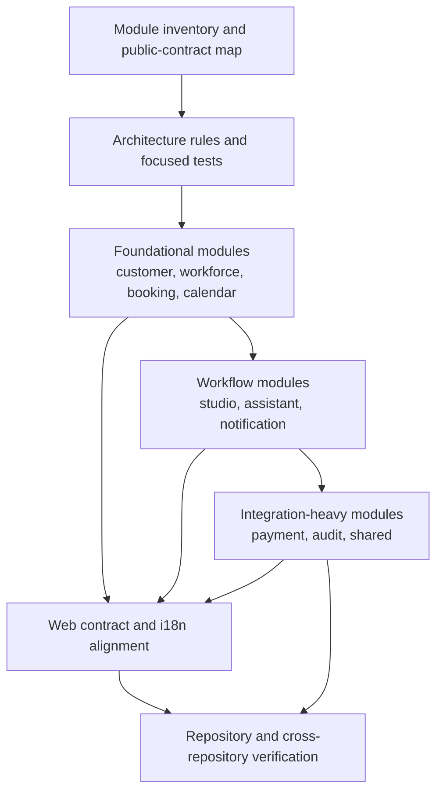
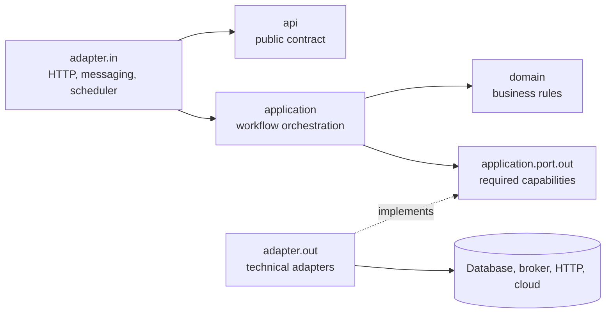

# Service and Web Architecture Migration Design

| Field | Value |
|---|---|
| Status | Approved for implementation |
| Scope | `emme-service` backend module migration with coordinated `emme-web` contract changes |
| Architecture | DDD + Hexagonal Architecture for business modules; Capability-Driven Design for Gradle build logic |
| Canonical references | [`module-package-structure-template.md`](../../templates/module-package-structure-template.md), [`build-logic.md`](../../architecture/00-project/build-logic.md) |
| Date | 2026-07-31 |

## 1. Objective

Complete the migration of the separated service repository toward the canonical
module template already established by the Modulith handbook, while keeping the
web repository aligned with stable backend contracts.

The migration must preserve runtime behavior and avoid coupling the business
module model to the build-logic model:

- service modules use DDD + Hexagonal Architecture;
- Gradle build logic uses Capability-Driven Design (CDD);
- web code consumes stable API contracts and owns translated user-facing copy;
- service responses expose stable machine-readable error codes rather than UI
  locale concerns;
- every migrated boundary is enforced by executable tests.

## 2. Approved approach

Use incremental vertical slices in dependency and risk order. Each module is
migrated as a cohesive change, tested, and committed before the next module is
started.



The already migrated catalog, identity, and tenancy work remains the baseline.
No wholesale rename or compatibility-breaking public contract change is part of
this design.

## 3. Repository responsibilities

### `emme-service`

The service repository owns:

- module boundaries and public API packages;
- domain invariants and application workflows;
- persistence, external clients, messaging, and observability adapters;
- stable problem details and error codes;
- Modulith and layer architecture verification;
- CDD Gradle conventions and delivery capabilities.

### `emme-web`

The web repository owns:

- transport/client mapping;
- UI-facing view models and feature behavior;
- locale preference and translated messages;
- mapping service error codes to localized copy;
- frontend build, lint, typecheck, and browser-facing tests.

The web repository must not import service implementation packages or duplicate
backend domain rules.

## 4. Canonical service module shape

Each module is migrated only to the packages it genuinely needs. Empty layers
are not created merely to satisfy the template.

```text
<module>/
├── api/
│   ├── command/
│   ├── query/
│   ├── result/
│   ├── usecase/
│   ├── event/
│   ├── exception/
│   └── type/
├── application/
│   ├── service/
│   ├── port/out/
│   └── mapper/
├── domain/
│   ├── model/
│   ├── service/
│   ├── event/
│   ├── exception/
│   └── specification/
├── adapter/
│   ├── in/
│   │   ├── web/
│   │   ├── messaging/
│   │   └── scheduler/
│   └── out/
│       ├── persistence/
│       ├── messaging/
│       ├── client/
│       └── observability/
└── configuration/
```

Naming is normalized by responsibility:

| Responsibility | File/type rule |
|---|---|
| Command | `<Verb><Noun>Command` |
| Query | `<Verb><Noun>Query` |
| Result | `<Noun><Shape>` or `<Noun>Details`/`<Noun>Summary` |
| Use case | `<Verb><Noun>UseCase` |
| Application service | `<Verb><Noun>Service` |
| Public event | `<Noun><PastTenseVerb>` |
| Outbound port | `<Capability>Port` or `<Noun>Repository` |
| Persistence adapter | `<Noun>PersistenceAdapter` |
| External provider adapter | `<Provider><Capability>Adapter` |
| Framework client | `<Provider><Transport>Client` |
| Domain aggregate | `<Noun>.java` |
| Persistence entity | `<Noun>Entity.java` |
| Web request | `<Verb><Noun>Request` |
| Web response | `<Noun>Response` or `<Noun><Shape>Response` |

Every materialized package receives a concise `package-info.java` describing
its responsibility and allowed dependencies.

## 5. Boundary rules



The following rules are non-negotiable:

1. Other modules may depend only on named API interfaces/types and public events.
2. Domain packages must not depend on Spring, JPA, HTTP, JSON, brokers, or cloud SDKs.
3. Inbound adapters invoke use-case contracts; they do not access repositories.
4. Application services coordinate; domain objects enforce business invariants.
5. Outbound adapters implement application-owned ports.
6. Persistence entities and external provider DTOs never cross module boundaries.
7. Public events describe facts in past tense and contain stable contract data.
8. Build logic remains capability-first and is not copied into business modules.

## 6. Migration sequence

### Phase A — foundational modules

Migrate `customer`, `workforce`, `booking`, and `calendar` in separate vertical
slices. These modules establish API contracts used by larger workflows.

For each module:

- map current public consumers before moving files;
- create or normalize public API packages;
- separate domain state from persistence entities;
- move controllers and external integrations behind adapters;
- update project dependencies only when the package boundary requires it;
- add focused tests and architecture rules;
- verify the full service quality gate.

### Phase B — workflow modules

Migrate `studio`, `assistant`, and `notification`. Preserve existing public
events and translate legacy event packages into `api.event` only when those
events are consumed outside the owning module.

### Phase C — integration-heavy modules

Migrate `payment`, `audit`, and `shared` with extra care. `shared` is not treated
as a dumping ground: only genuinely cross-cutting technical primitives remain
there. Business concepts must move to their owning module.

### Phase D — coordinated web alignment

For every backend contract changed during the migration:

- update the web client protocol and response mapping;
- preserve stable error codes;
- update localized messages in all supported catalogs;
- retain the explicit locale-preference → browser-locale → fallback precedence;
- run web typecheck, lint, i18n validation, tests, and production build.

## 7. Verification strategy

Each slice must pass before the next one begins:

| Layer | Verification |
|---|---|
| Domain | Pure unit tests with no framework bootstrapping |
| Application | Use-case tests with fake outbound ports |
| Adapter | Focused persistence/client/web integration tests |
| Module boundary | Spring Modulith `ApplicationModules.verify()` |
| Layer boundary | ArchUnit or equivalent package rules |
| Service | Gradle quality, test, integration, infrastructure, and boot-JAR gates |
| Web | Formatting, typecheck, lint, i18n/catalog tests, production build |
| Cross-repository | Contract compatibility and error-code catalog checks |

Completion evidence is recorded in `tasks/todo.md`, with recurring failure
modes added to `tasks/lessons.md`.

## 8. Risks and mitigations

| Risk | Mitigation |
|---|---|
| Cross-module imports break during moves | Inventory consumers first and migrate one public contract at a time |
| Persistence entities leak into API | Add architectural rules and explicit result mapping |
| Large module diffs hide behavior changes | Use vertical slices and focused tests per module |
| Web breaks after backend package changes | Keep transport contracts stable and verify both repositories |
| `shared` grows without ownership | Require an ownership decision before adding shared types |
| Build logic and business architecture get conflated | Keep CDD documentation and plugin packages separate from Java modules |

## 9. Definition of done

- All selected modules use the canonical package shape where applicable.
- File, class, package, event, and adapter names follow the normalized catalog.
- Public APIs are the only cross-module implementation boundary.
- Architecture tests reject forbidden dependencies and implementation leakage.
- Service and web verification gates pass.
- Changes are committed in logical commits and pushed to their respective
  feature branches.
- No production deployment or external cloud mutation is performed as part of
  the migration.
