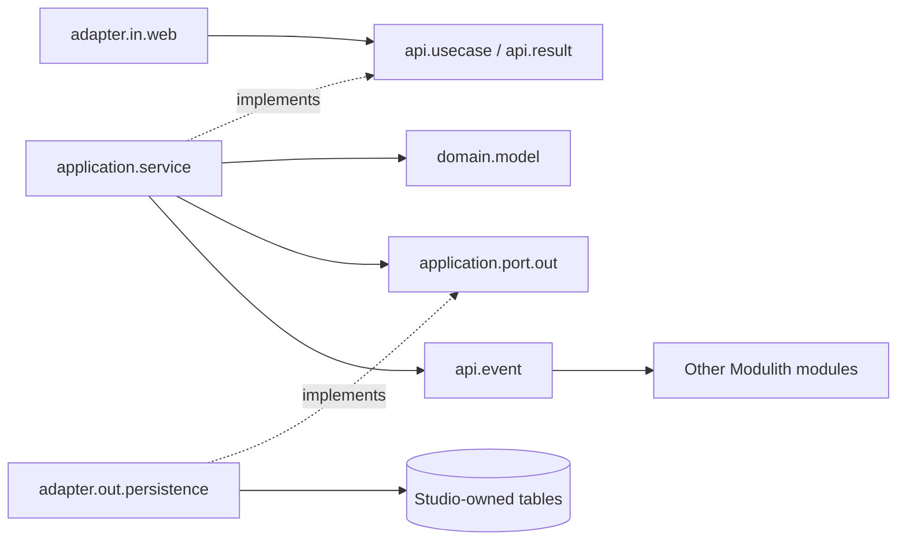

# Studio Module Migration Design

| Field | Value |
|---|---|
| Status | Approved implementation baseline |
| Scope | Core `com.emme.studio` capability migration |
| Architecture | DDD + Hexagonal Architecture; CDD remains limited to Gradle build logic |
| Canonical reference | [`module-package-structure-template.md`](../../templates/module-package-structure-template.md) |
| Date | 2026-07-31 |

## Objective

Move the core Studio business capability from flat `api`, `application`,
`entity`, `event`, and `web` packages into the approved module structure while
preserving HTTP routes, public API contracts, tenant behavior, persistence
schemas, and published events.

The core slice includes appointments, artists, customers, business profile,
service catalog, operating hours, booking policy, notification preferences, and
dashboard events. The existing `documents` and `subscriptions` sub-capabilities
remain inside Studio but are not expanded into empty or partially migrated
layers; they receive dedicated follow-up slices after the core boundary is
stable.

## Architectural decisions

1. Studio remains one Spring Modulith application module for this migration. A
   future split into `booking`, `customer`, `workforce`, or `catalog` is a
   separate bounded-context decision, not an accidental result of package moves.
2. Public root contracts move to `api/result`, `api/usecase`, and `api/event`.
   `SalonApi` becomes `api.usecase.SalonApi`; `*Info` records remain public
   result models; dashboard and appointment events remain past-tense public
   facts.
3. Business state is framework-independent under `domain/model`. JPA classes
   are renamed with the `Entity` suffix and live under
   `adapter/out/persistence/entity`.
4. Application services depend on application-owned repository and publisher
   ports. Controllers depend on public use-case contracts and never access
   repositories directly.
5. Persistence adapters mutate existing managed entities in place when an
   identifier already exists, preventing duplicate managed-identity failures.
6. Existing database table and column names remain unchanged. Package and Java
   type names are normalized without changing the storage contract.

## Target core tree

```text
com.emme.studio/
├── api/
│   ├── result/
│   │   ├── AppointmentInfo.java
│   │   ├── BusinessProfileInfo.java
│   │   └── CustomerInfo.java
│   ├── usecase/
│   │   └── SalonApi.java
│   ├── event/
│   │   ├── AppointmentCancelledEvent.java
│   │   ├── AppointmentCreatedEvent.java
│   │   ├── AppointmentRescheduledEvent.java
│   │   └── DashboardEvent.java
│   └── package-info.java
├── application/
│   ├── service/
│   │   ├── AppointmentService.java
│   │   ├── ArtistService.java
│   │   ├── BusinessConfigService.java
│   │   ├── CustomerService.java
│   │   ├── ServiceCatalogService.java
│   │   └── SlotSearchService.java
│   ├── port/out/
│   │   ├── AppointmentRepository.java
│   │   ├── ArtistRepository.java
│   │   ├── BusinessProfileRepository.java
│   │   ├── CustomerRepository.java
│   │   ├── ServiceRepository.java
│   │   └── DashboardEventPublisher.java
│   └── package-info.java
├── domain/model/
│   ├── Appointment.java
│   ├── Artist.java
│   ├── ArtistCapability.java
│   ├── BookingPolicy.java
│   ├── BusinessProfile.java
│   ├── Customer.java
│   ├── OperatingHours.java
│   ├── Service.java
│   └── package-info.java
├── adapter/in/web/
│   ├── AppointmentController.java
│   ├── ArtistController.java
│   ├── BusinessConfigController.java
│   ├── CustomerController.java
│   ├── DashboardController.java
│   ├── ServiceController.java
│   └── package-info.java
├── adapter/out/persistence/
│   ├── entity/
│   ├── repository/
│   ├── adapter/
│   ├── mapper/
│   └── package-info.java
├── configuration/
│   └── package-info.java
├── documents/        # deferred nested capability; no empty-layer expansion
├── subscriptions/    # deferred nested capability; no empty-layer expansion
└── package-info.java
```

## Dependency direction



## Compatibility contract

- Preserve `/api/appointments`, `/api/artists`, `/api/customers`,
  `/api/services`, `/api/business`, and dashboard routes.
- Preserve `SalonApi` method signatures unless a grouped-package move requires
  only an import change.
- Preserve event names and payload fields.
- Preserve tenancy and authorization behavior.
- Preserve table names, schemas, columns, and migration ownership.

## Verification contract

- Add a Studio package-convention test before moving production classes.
- Add pure domain tests for state transitions and validation rules.
- Add persistence adapter tests for mapping and managed-entity updates.
- Keep existing module/web/repository tests green.
- Verify Spring Modulith and shared layer rules.
- Run service CI and Calendar regression tests after the Studio slice.

## Deferred work

- Migrate `documents` into its own complete nested DDD/Hexagonal capability.
- Migrate `subscriptions` into its own complete nested DDD/Hexagonal capability.
- Decide whether `customer`, `workforce`, `booking`, and `catalog` become
  independent Modulith modules after their public contracts are populated.
