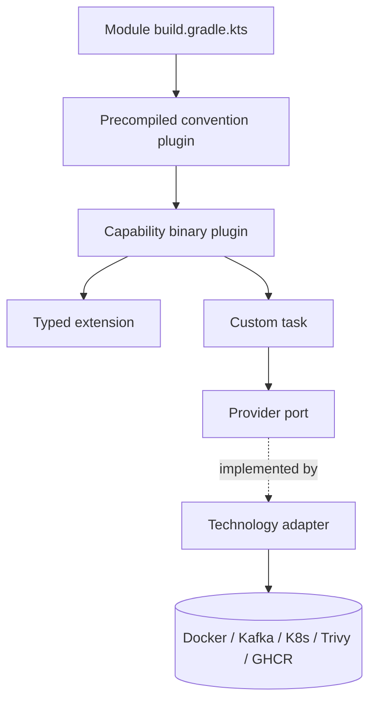
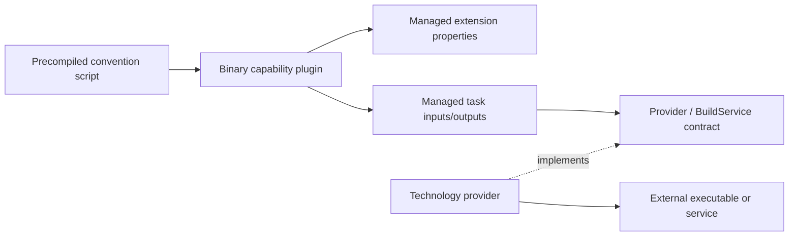

# Build-Logic Capability-Driven Design Migration Specification

| Field | Detail |
|---|---|
| Status | Draft for implementation approval |
| Date | 2026-08-02 |
| Repository | `emme-service` |
| Scope | Complete `build-logic` source, tests, plugin contracts, and verification |
| Execution plan | [`2026-08-02-build-logic-cdd-migration.md`](../plans/2026-08-02-build-logic-cdd-migration.md) |
| Related architecture | [`build-logic.md`](../../architecture/00-project/build-logic.md) |
| Related design | [`module-architecture-and-capability-build-logic-design.md`](2026-07-30-module-architecture-and-capability-build-logic-design.md) |

## 1. Decision summary

`build-logic` will be normalized as a complete Capability-Driven Design (CDD)
implementation. The unit of organization is a reusable Gradle capability such as
`testing`, `messaging`, `container`, `deployment`, `publishing`, `security`, or
`quality`; the unit is not a Kotlin type such as `Plugin`, `Task`, or `Provider`.

The migration changes all build-logic implementation code and tests under
`build-logic/`. Public convention-plugin IDs and user-facing Gradle task names stay
stable unless a dedicated compatibility decision is recorded. Internal Kotlin
class names, package locations, provider models, task classes, and test names may be
normalized freely because this repository is unreleased.

The result must make a module build script declarative:

```kotlin
plugins {
  id("emme.spring-module")
  id("emme.persistence")
  id("emme.messaging")
}
```

The module declares its type and capabilities. `build-logic` owns how those
capabilities are implemented.

## 2. Architectural boundary

Business modules and build logic use related but different models:

| Boundary | Model | Organizing unit |
|---|---|---|
| Backend modules | DDD + Hexagonal Architecture | Business capability / bounded context |
| Gradle build logic | Capability-Driven Design | Reusable build capability |



The following backend package names must not be introduced into build logic:
`api/`, `application/`, `domain/`, `adapter/`, and `configuration/`. Build logic
uses capability packages with local `provider/`, `task/`, and `model` children only
when those responsibilities actually exist.

## 3. Global constraints

1. Keep `build-logic` as an included build through root `pluginManagement`.
2. Keep precompiled `.gradle.kts` files as the normal convention-plugin API.
3. Use binary Kotlin plugins only for complex wiring, extensions, tasks, provider
   selection, or lifecycle coordination.
4. Preserve these public convention IDs:
   `emme.java-base`, `emme.java-library`, `emme.spring-module`,
   `emme.spring-application`, `emme.spring-web`, `emme.persistence`,
   `emme.messaging`, `emme.modulith`, `emme.testing`, `emme.integration-testing`,
   `emme.test-fixtures`, `emme.quality`, `emme.api-compat`,
   `emme.feature-flags`, `emme.container`, `emme.publishing`,
   `emme.deployment`, and `emme.security`.
5. Preserve stable lifecycle task names exposed to application builds, including
   `containerBuild`, `containerPush`, `containerVerify`, `containerMultiArch`,
   `deployUp`, `deployDown`, `deployApply`, `deployStatus`, `deployLogs`,
   `publishBuildInfo`, `publishManifest`, `publishVerifyVersion`,
   `publishSign`, `publishSbom`, and `securityScan`.
6. Do not add compatibility wrappers for unreleased internal classes or packages.
7. Use Gradle lazy APIs for configuration, task inputs/outputs, and external values.
   Gradle documents that `Provider`/`Property` delay value resolution and preserve
   automatic task dependency wiring ([lazy configuration](https://docs.gradle.org/current/userguide/lazy_configuration.html)).
8. Use Gradle shared services for reusable external-tool state and bounded
   concurrency; shared services are configuration-cache compatible when modeled
   correctly ([shared build services](https://docs.gradle.org/current/userguide/build_services.html)).
9. Use Gradle TestKit and `GradleRunner` for real plugin behavior rather than only
   `ProjectBuilder` tests ([testing Gradle plugins](https://docs.gradle.org/current/userguide/testing_gradle_plugins.html)).
10. Keep external credentials out of source, extension defaults, logs, and test
    fixtures.

## 4. Current source inventory

### 4.1 Convention plugin scripts

These files remain at `build-logic/src/main/kotlin/` because Gradle discovers
precompiled scripts from that location:

```text
emme.api-compat.gradle.kts
emme.container.gradle.kts
emme.deployment.gradle.kts
emme.feature-flags.gradle.kts
emme.integration-testing.gradle.kts
emme.java-base.gradle.kts
emme.java-library.gradle.kts
emme.messaging.gradle.kts
emme.modulith.gradle.kts
emme.persistence.gradle.kts
emme.publishing.gradle.kts
emme.quality.gradle.kts
emme.security.gradle.kts
emme.spring-application.gradle.kts
emme.spring-module.gradle.kts
emme.spring-web.gradle.kts
emme.test-fixtures.gradle.kts
emme.testing.gradle.kts
```

Each script must only compose plugins and declare capability dependencies. Complex
behavior moves to the owning binary plugin or a capability-owned helper.

### 4.2 Shared build primitives

```text
com/emme/buildlogic/core/
├── DependencyConfiguration.kt
├── JavaConfiguration.kt
├── PluginIds.kt
├── ProviderRegistry.kt
├── TaskNames.kt
├── TestConfiguration.kt
└── dependency/EmmeDependencies.kt
```

`core/` remains deliberately small. A type with one capability consumer must move
out of `core/` into that capability.

### 4.3 Capability implementations

```text
container/
├── ContainerRuntime.kt
├── EmmeContainerExtension.kt
├── EmmeContainerPlugin.kt
├── provider/ContainerResult.kt
├── provider/ContainerRuntimeProvider.kt
├── provider/DockerProvider.kt
└── task/{BuildContainerImage,PushContainerImage,VerifyContainerImage}.kt

deployment/
├── DeploymentTarget.kt
├── EmmeDeploymentExtension.kt
├── EmmeDeploymentPlugin.kt
├── provider/{ComposeProvider,DeploymentProvider,DeploymentResult,KubernetesProvider}.kt
└── task/{DeployTask,DeploymentStatusTask}.kt

publishing/
├── EmmePublishingExtension.kt
├── EmmePublishingPlugin.kt
├── provider/{GhcrPublisherProvider,PublishResult,PublisherProvider}.kt
└── task/{GenerateBuildInfo,GenerateReleaseManifest,GenerateSbomTask,SignArtifactsTask,VerifyReleaseVersion}.kt

security/
├── EmmeSecurityExtension.kt
├── EmmeSecurityPlugin.kt
├── SecurityScanner.kt
├── provider/{SecurityScanResult,SecurityScannerProvider,TrivyProvider}.kt
└── task/SecurityScanTask.kt

registry/
└── {RegistryProvider,RegistryResult,RegistryTarget}.kt

quality/
└── {EmmeQualityExtension,QualityGateMode}.kt

root/
└── {EmmeBuildExtension,EmmeRootPlugin}.kt

model/
└── {EmmeModuleType,ReleaseChannel}.kt

git/
└── {GitBranchValueSource,GitCommitValueSource,GitTagValueSource}.kt
```

The migration must audit every file in this inventory. It may move or split files,
but it must not leave a capability-specific implementation in `core/`, `model/`, or
an unrelated capability.

### 4.4 Existing tests

```text
src/test/kotlin/com/emme/buildlogic/
├── ModelEnumTest.kt
├── PluginRegistrationTest.kt
└── ProviderRegistrationTest.kt

src/functionalTest/kotlin/com/emme/buildlogic/
├── ContainerPluginFunctionalTest.kt
├── FunctionalTestHelpers.kt
├── IntegrationTestingConventionFunctionalTest.kt
├── JavaBaseConventionFunctionalTest.kt
├── SpringApplicationConventionFunctionalTest.kt
└── SpringModuleConventionFunctionalTest.kt
```

The final test set must add coverage for every binary capability and every
provider-selection branch, not only the current container and convention samples.

## 5. Normalized naming contract

| Artifact | Canonical form | Examples |
|---|---|---|
| Convention script | `emme.<capability>.gradle.kts` | `emme.messaging.gradle.kts` |
| Binary plugin | `Emme<Capability>Plugin` | `EmmeContainerPlugin` |
| Extension | `Emme<Capability>Extension` | `EmmeContainerExtension` |
| Capability enum/model | `<Capability><Concept>` or `<Concept>` when unambiguous | `ContainerRuntime`, `DeploymentTarget` |
| Gradle task class | `<Verb><Object>Task` | `BuildContainerImageTask`, `DeployTask` |
| Gradle task name | stable lower camel case | `containerBuild`, `deployApply` |
| Provider port | `<Capability>Provider` | `DeploymentProvider` |
| Provider implementation | `<Technology>Provider` | `DockerProvider`, `KubernetesProvider` |
| Provider result | `<Capability><Operation>Result` | `ContainerBuildResult`, `DeploymentResult` |
| Value source | `<ExternalValue>ValueSource` | `GitCommitValueSource` |
| Unit test | `<Subject>Test` | `ProviderSelectionTest` |
| TestKit test | `<PluginOrConvention>FunctionalTest` | `DeploymentPluginFunctionalTest` |
| Test helper | `<Concern>TestSupport` or `<Concern>FunctionalTestSupport` | `FunctionalTestSupport` |

The task class suffix is normalized even when the registered Gradle task name is
unchanged. Generic names such as `DefaultProvider`, `Manager`, `Impl`,
`EverythingPlugin`, or `Utils` are not permitted.

## 6. Capability contracts

### 6.1 Foundation and module types

| Plugin | Role | Required outcome |
|---|---|---|
| `emme.java-base` | foundation | toolchain, compiler, encoding, common Java conventions |
| `emme.java-library` | module type | library conventions and test defaults |
| `emme.spring-module` | module type | Spring module baseline and Modulith core composition |
| `emme.spring-application` | module type | Boot packaging, runtime dependencies, application defaults |
| `emme.spring-web` | capability | web, validation, and API dependencies |
| `emme.persistence` | capability | JPA, migrations, database test dependencies |
| `emme.messaging` | capability | Spring Kafka and Modulith Kafka integration dependencies |
| `emme.modulith` | capability | module verification, docs, and Modulith test dependencies |

Module-type plugins may compose foundation plugins. Optional capabilities must not
be silently applied to every module.

### 6.2 Testing and quality

| Plugin | Role | Required outcome |
|---|---|---|
| `emme.testing` | capability | unit test conventions and shared test configuration |
| `emme.integration-testing` | capability | dedicated `integrationTest` suite and lazy infrastructure dependencies |
| `emme.test-fixtures` | capability | reusable fixture publication and dependency wiring |
| `emme.quality` | capability | Spotless, Checkstyle, Detekt, coverage, dependency and quality gates |
| `emme.api-compat` | capability | explicit API compatibility task and baseline handling |
| `emme.feature-flags` | capability | typed/validated build feature switches |

### 6.3 Delivery capabilities

| Plugin | Role | Required outcome |
|---|---|---|
| `emme.container` | capability | container extension, lazy tasks, runtime provider selection |
| `emme.deployment` | capability | deployment target model, provider selection, lifecycle tasks |
| `emme.publishing` | capability | build metadata, release manifest, SBOM, signing, version gate |
| `emme.security` | capability | scanner selection, scan task, normalized security result |
| registry package | shared delivery port | registry address, authentication boundary, immutable result |

Delivery providers must not be instantiated directly in task actions. They are
registered as shared services with explicit parameters and maximum parallel usage.

## 7. Required implementation corrections

The migration must address these known classes of drift:

1. Replace plugin-configuration `.get()` calls used to select runtime, deployment,
   scanner, or other external behavior with lazy provider mapping or validated
   execution-time selection.
2. Replace free-form selector strings with capability enums where the selector is
   a closed set (`DeploymentTarget`, `SecurityScanner`, and equivalent models).
3. Ensure every declared provider branch selects a real implementation. Unsupported
   values fail with an actionable message instead of silently falling back to a
   different technology.
4. Move technology-specific process invocation into provider implementations and
   keep tasks dependent on provider abstractions.
5. Normalize task class suffixes and result names without changing registered task
   names.
6. Declare all task inputs, outputs, services, and execution-time values using
   Gradle annotations and managed properties.
7. Make provider services configuration-cache safe: no project references, mutable
   global state, or configuration-time environment reads.
8. Make convention scripts declarative and remove duplicated dependency/configuration
   blocks that belong to shared helpers or capability plugins.
9. Add validation for required values and tool availability at task execution with
   stable error messages.
10. Keep `EmmeDependencies`, `PluginIds`, and `TaskNames` centralized only where
    they are consumed across capabilities.

## 8. Dependency direction



Forbidden dependencies:

- convention scripts directly invoking external commands;
- task classes importing a technology-specific provider implementation;
- provider implementations importing project configuration objects;
- `core/` importing a delivery capability;
- one capability reaching into another capability's implementation package;
- configuration-time reads of mutable environment state or filesystem contents;
- raw external-tool output crossing a task/provider result boundary.

## 9. Testing and verification contract

### Unit tests

Unit tests remain fast and cover pure models, selector validation, provider result
mapping, task input conventions, and plugin registration. They use Gradle `Project`
test doubles only where a real Gradle model is required.

### Functional tests

Every binary plugin receives a TestKit test that:

1. creates a temporary Gradle project;
2. applies the public plugin ID;
3. configures the public extension using the normalized DSL;
4. runs the stable task name through `GradleRunner`;
5. asserts task outcome, generated files, provider selection, and failure output;
6. repeats the build with configuration cache enabled where supported.

Required functional coverage:

```text
ContainerPluginFunctionalTest
DeploymentPluginFunctionalTest
PublishingPluginFunctionalTest
SecurityPluginFunctionalTest
RootPluginFunctionalTest
JavaBaseConventionFunctionalTest
JavaLibraryConventionFunctionalTest
SpringModuleConventionFunctionalTest
SpringApplicationConventionFunctionalTest
SpringWebConventionFunctionalTest
PersistenceConventionFunctionalTest
MessagingConventionFunctionalTest
ModulithConventionFunctionalTest
TestingConventionFunctionalTest
IntegrationTestingConventionFunctionalTest
TestFixturesConventionFunctionalTest
QualityConventionFunctionalTest
ApiCompatibilityConventionFunctionalTest
```

### Required gates

```text
./gradlew :build-logic:check --no-daemon --no-configuration-cache --console=plain
./gradlew check --no-daemon --no-configuration-cache --console=plain
./gradlew ci -x integrationTest -x e2eTest --no-daemon --no-configuration-cache --console=plain
./gradlew :build-logic:functionalTest --no-daemon --no-configuration-cache --console=plain
./gradlew :build-logic:functionalTest --configuration-cache --no-daemon --console=plain
node scripts/validate-markdown.mjs
```

The migration is complete only when all gates pass with zero failed or skipped
build-logic tests, all public plugin IDs are exercised, and the final report records
any non-failing warnings separately from failures.

## 10. Rollback and compatibility

The migration is internal and the system is unreleased. Rollback is therefore a
Git commit/revert operation, not a compatibility-wrapper strategy. Each capability
phase must be committed independently. Public plugin IDs and registered task names
remain stable so application build scripts do not need unrelated edits during the
refactor.

If a plugin ID or task name must change, the same commit must include all in-repo
consumers, functional-test updates, documentation, and an ADR explaining the
decision.

## 11. Acceptance criteria

- [ ] Every source file under `build-logic/src/main/kotlin` is assigned to a
      capability or approved shared area.
- [ ] Every convention script is declarative and has no duplicated capability
      implementation logic.
- [ ] Every binary plugin uses lazy managed properties and capability-owned
      provider/task boundaries.
- [ ] All selector branches are typed, validated, and mapped to real providers.
- [ ] All task classes and provider result types follow the naming contract.
- [ ] Every binary plugin has unit and TestKit functional coverage.
- [ ] Configuration-cache and build-cache behavior is verified for build logic.
- [ ] Public plugin IDs and stable task names remain available to applications.
- [ ] Build-logic documentation, plan status, and verification evidence are updated.
- [ ] The full implementation is committed and pushed in logical capability commits.
