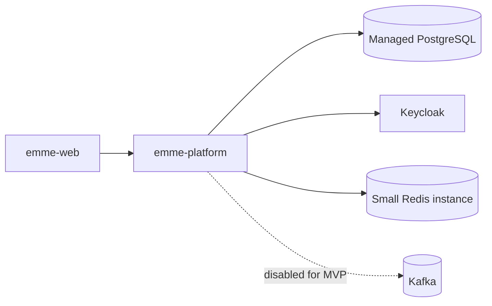

# MVP Low-Cost Runtime and Native Image Design

| Field | Detail |
|---|---|
| Status | Draft for user review |
| Date | 2026-08-02 |
| Repository | `emme-service` |
| Product shape | Low-cost salon operations MVP |
| Canonical runtime | `emme-platform` |
| Next implementation phase | MVP vertical slice, followed by build-logic CDD refactor |

## 1. Decision summary

The MVP will optimize for one deployable backend, one core customer journey, and
the smallest useful production footprint. It will not attempt to close every
module migration before proving product value.

The sole deployable application is `emme-platform`. The repository has one
composition root, one application build, and one backend image contract.

The MVP keeps DDD + Hexagonal module boundaries, but limits implementation to
the capabilities required by the first salon workday journey:

```text
authenticate
    ↓
resolve tenant and permissions
    ↓
manage customers and service catalog
    ↓
create and operate appointments
    ↓
verify health, persistence, and tenant isolation
```

GraalVM Native Image is an MVP delivery optimization track, not a prerequisite
for domain work. The JVM image remains the fallback until the native image passes
the same smoke and critical-path tests.

## 2. In-scope capabilities

| Area | MVP decision | Required evidence |
|---|---|---|
| Identity | Authentication, authorization, membership, role/permission evaluation, login protection | JWT/security tests, unauthorized/forbidden tests, rate-limit behavior |
| Tenancy | Trusted tenant resolution, tenant provisioning, tenant lifecycle, database tenant predicates | Cross-tenant rejection, provisioning transaction, routing and migration tests |
| Customer | Customer creation, listing, and tenant-scoped access | Module tests and end-to-end customer journey |
| Catalog | Service/catalog creation and listing | Module tests, tenant isolation, end-to-end catalog journey |
| Studio | Local appointment creation, listing, confirmation, cancellation, and lifecycle transitions | Collision, tenant, state-transition, and end-to-end workday tests |
| Calendar | Local scheduling behavior only | Calendar tests; Google synchronization is optional and disabled by default |
| Persistence | PostgreSQL and Liquibase | Clean install, upgrade, backup/restore, and rollback evidence |
| Runtime | One `emme-platform` container and one low-cost deployment environment | JVM container smoke test and health/readiness checks |
| Native image | Optional native `emme-platform` image with JVM fallback | Native build, startup, health, authentication, tenant, and core-flow smoke tests |

## 3. Explicitly deferred capabilities

The following plans remain valid, but are not MVP blockers:

- Payment provider integrations and production billing callbacks.
- Subscription billing and entitlement automation. MVP entitlement is created by
  controlled tenant setup or seed data; it is not purchased through the product.
- Notification provider delivery, retry orchestration, and provider contracts.
- Assistant, WhatsApp, document ingestion, embeddings, and RAG.
- Google Calendar/Sheets synchronization and OAuth production operation.
- Kafka externalization and cross-process event-streaming operations. In-process
  Spring Modulith events may remain available; Kafka stays disabled for MVP.
- Multi-region deployment, Kubernetes complexity, autoscaling, and service
  extraction.

Deferral means no new implementation is added for these capabilities in the MVP
branch. Existing code must still compile and must not violate module boundaries.

## 4. Low-cost deployment topology



The initial deployment uses one backend replica and one region. PostgreSQL is
the system of record. Redis remains required by the current runtime for login
rate limiting, tenant throttling, and OAuth state; it should be the smallest
managed instance or a co-located protected instance acceptable for the selected
environment. Kafka is not provisioned for MVP.

The deployment must define:

- one public HTTPS endpoint;
- private database, Redis, and Keycloak connectivity;
- separate development, staging, and production credentials;
- health/readiness probes;
- database backup and restore procedure;
- graceful shutdown and migration ordering;
- one-replica assumption until distributed rate-limit and pool evidence is
  complete.

## 5. MVP implementation order

### Phase A: P0 safety closure

Close only the Identity and Tenancy gaps that protect the MVP path:

- tenant context cannot be established from arbitrary request data;
- unauthorized and cross-tenant reads/mutations fail consistently;
- provisioning is transactional and after-commit event behavior is explicit;
- login and tenant rate limits have a tested Redis-backed production path and a
  safe local fallback;
- architecture tests prevent application/domain imports of adapters and pool
  internals;
- migrations and recovery behavior are documented.

Distributed scale-out is explicitly outside the first deployment assumption, but
the rate-limit port and adapter must not block adding replicas later.

### Phase B: Core vertical slice

Implement and verify one end-to-end path across:

1. authenticated user;
2. active tenant and permission;
3. customer creation/listing;
4. service catalog creation/listing;
5. appointment creation/listing and lifecycle transition;
6. health/readiness and OpenAPI availability.

Each use case keeps one application service and uses only public module contracts
for cross-module calls.

### Phase C: JVM production baseline

- Build the ordinary JVM container image.
- Run unit, module, integration, architecture, Modulith, and critical E2E tests.
- Verify PostgreSQL migrations and tenant isolation in the deployed-like profile.
- Record startup time, steady-state memory, image size, and request smoke results
  as the baseline for native comparison.

### Phase D: GraalVM native image

Build native `emme-platform` for Linux `amd64` first. Keep the JVM image as the
rollback artifact. Native image generation is performed in CI or a reproducible
builder container, not on the production host.

Preferred build paths, in order:

1. Spring Boot AOT plus `bootBuildImage`/Cloud Native Buildpacks for the first
   reproducible image experiment.
2. Gradle Native Image plugin and `nativeCompile` when the image needs explicit
   build/test control.
3. Custom reachability metadata or `RuntimeHintsRegistrar` only where automatic
   Spring hints do not cover JPA, Jackson, OAuth/Keycloak, Liquibase, or other
   dynamic behavior.

Native adoption requires:

- native compilation succeeds on the target architecture;
- the native image starts and passes health/readiness checks;
- authentication and tenant resolution work;
- customer, catalog, and appointment smoke tests pass;
- migrations and shutdown work;
- measured memory is lower than the JVM baseline under the same limits;
- JVM image remains available for rollback.

Native builds are architecture-specific because Native Image does not support
cross-compilation. Spring Boot's current documentation also requires JDK 25 for
the Buildpacks native-image flow, which matches this repository's Java 25
toolchain.

## 6. Build-logic sequencing

The full build-logic CDD refactor starts after Phase C and the first native-image
spike. Its first relevant MVP responsibility is to provide an explicit native
image/container capability without leaking native-specific wiring into module
build files:

```kotlin
plugins {
    id("emme.spring-application")
    id("emme.container")
    id("emme.native-image") // introduced by the later CDD refactor
}
```

The native capability must remain optional. `emme.spring-application` must not
implicitly enable native compilation, Kafka, payment, or any other deferred
capability.

## 7. Testing strategy

| Level | MVP coverage |
|---|---|
| Unit | Domain transitions, authorization, tenant rules, application services, mappers |
| Module | Spring Modulith boundaries and public named interfaces |
| Integration | PostgreSQL, Liquibase, Redis-backed rate limits, tenant isolation |
| E2E | Login/session, customer, catalog, appointment, health, OpenAPI |
| Native | Native build plus the critical smoke suite; no requirement to run every test natively initially |
| Recovery | Database restore, migration rollback procedure, JVM image rollback from native image |

## 8. Acceptance criteria

- One `emme-platform` deployment serves the MVP backend.
- The core authenticated tenant workday journey passes end to end.
- No cross-tenant access is accepted by API or persistence paths.
- PostgreSQL migrations, backups, health checks, and rollback evidence exist.
- Kafka, payment, notifications, AI, documents, and external calendar sync are
  not MVP runtime dependencies.
- JVM container deployment is reproducible before native optimization begins.
- Native image is adopted only if it passes critical smoke tests and demonstrates
  lower measured memory under the same workload and resource limits.
- The full build-logic CDD refactor begins only after the MVP JVM baseline and
  native-image spike are documented.

## 9. Technical references

- [Spring Boot Native Images](https://docs.spring.io/spring-boot/reference/packaging/native-image/index.html)
- [Spring Boot advanced native-image topics](https://docs.spring.io/spring-boot/reference/packaging/native-image/advanced-topics.html)
- [GraalVM Native Image](https://www.graalvm.org/jdk25.1/reference-manual/native-image/)
