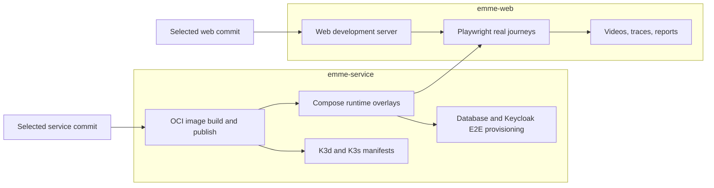
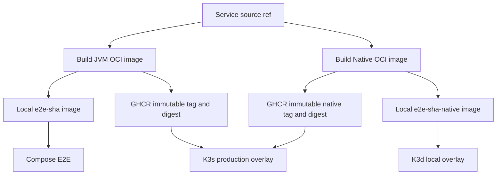
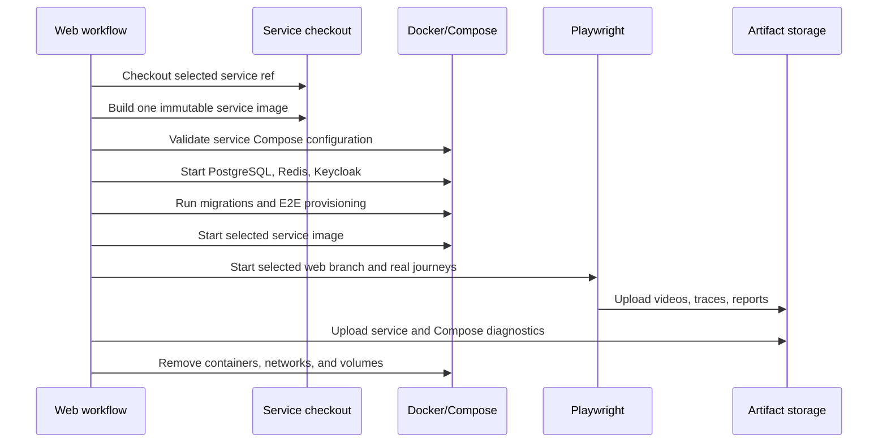

# Cross-Repository Deployment and Real E2E Runtime Design

| Field | Value |
|---|---|
| Status | Approved design |
| Date | 2026-08-03 |
| Repositories | `emme-service`, `emme-web` |
| Primary owner | `emme-service` for runtime and deployment; `emme-web` for browser journeys |
| Reference implementation | Clara full-stack challenge deployment and recording workflows |

## Goal

Provide one production-grade runtime model for JVM and GraalVM Native images that works consistently in local Docker Compose, K3d, production K3s, and GitHub Actions real-browser recordings without duplicating infrastructure between repositories.

The service repository owns backend runtime concerns. The web repository owns Playwright journeys, the web development server, and recording artifacts. The web workflow checks out the selected service ref and consumes its deployment contract rather than copying backend Compose or Kubernetes configuration.

## Architecture Decision

Use service-owned runtime manifests with web-owned E2E orchestration.



This preserves one source of truth for infrastructure while allowing a full-stack workflow to test arbitrary service and web branches together.

## Repository Ownership

| Capability | `emme-service` | `emme-web` |
|---|---:|---:|
| Spring Boot image creation | Owns | Consumes |
| JVM and Native runtime variants | Owns | Consumes |
| PostgreSQL, Redis, and Keycloak | Owns | Consumes through service Compose |
| Liquibase migrations and seed data | Owns | Does not duplicate |
| Backend Compose overlays | Owns | References selected service checkout |
| Backend K3d/K3s manifests | Owns | Does not duplicate |
| Frontend image creation | Does not own | Owns |
| Web development server | Does not own | Owns |
| Playwright tests and fixtures | Does not own | Owns |
| Real browser recordings | Does not own | Owns |
| Full-stack workflow orchestration | Provides runtime contract | Owns workflow |

The web repository may contain an optional web-only container smoke Compose file, but it must not redefine service dependencies or backend runtime configuration.

## Normalized Deployment Layout

### Service repository

```text
deployment/
├── compose/
│   ├── compose.yaml
│   ├── compose.runtime-jvm.yaml
│   ├── compose.runtime-native.yaml
│   ├── compose.environment-local.yaml
│   ├── compose.environment-ci.yaml
│   ├── compose.environment-e2e.yaml
│   └── compose.observability.yaml
│
├── docker/
│   ├── Dockerfile.jvm
│   └── Dockerfile.native
│
├── kubernetes/
│   ├── base/
│   └── overlays/
│       ├── k3d-jvm/
│       ├── k3d-native/
│       ├── k3s-staging-jvm/
│       ├── k3s-staging-native/
│       ├── k3s-production-jvm/
│       └── k3s-production-native/
│
└── scripts/
    ├── build-image.sh
    ├── deploy-k3d.sh
    ├── provision-e2e-keycloak-realm.sh
    └── seed-e2e-tenant.sh
```

`compose.yaml` is the shared base. Runtime overlays select JVM or Native images. Environment overlays select local, CI, or E2E behavior. Observability remains orthogonal and can be added independently.

`k3d-*` identifies local clusters. `k3s-staging-*` and `k3s-production-*` identify cluster target and runtime variant explicitly. `prod` and `dev` are avoided because they do not describe whether the target is a local K3d cluster, staging K3s cluster, or production K3s cluster.

### Web repository

```text
e2e/
├── src/
│   ├── playwright.config.ts
│   ├── fixtures/
│   ├── providers/
│   └── specs/
│       └── demo/
│           └── real-demo-recordings.spec.ts
└── scripts/
    └── validate-full-stack-contract.sh

.github/workflows/
├── ci-web.yml
├── real-full-stack-e2e.yml
└── container-smoke.yml
```

The workflow name describes the behavior being verified. The file name uses the same `real-full-stack-e2e` terminology to make workflow discovery and local documentation consistent.

## Compose Contract

The full-stack recording workflow runs the following service-owned files:

```text
compose.yaml
compose.runtime-jvm.yaml
compose.environment-e2e.yaml
```

Optional files are added only when required:

```text
compose.observability.yaml
compose.runtime-native.yaml
```

The service image is built once from the selected service ref and passed as an immutable local image name, for example:

```text
EMME_SERVICE_IMAGE=emme-service:e2e-sha-<commit>
```

The web process is started by the web repository’s Playwright configuration or workflow. It is not copied into the service’s base Compose file.

## Image Lifecycle

The canonical service image identity is:

```text
ghcr.io/migangdelzar/emme-service:sha-<git-sha>
ghcr.io/migangdelzar/emme-service:sha-<git-sha>-native
```

Rules:

1. `latest` is local-development convenience only.
2. CI and production deployments use immutable commit tags.
3. Production K3s deployments resolve and pin the resulting image digest.
4. The cluster never builds images.
5. K3d imports local images or pulls from a developer registry.
6. JVM is the default MVP runtime; Native is an explicit variant with its own build and verification gates.
7. Build-logic owns Gradle image configuration and task wiring; workflows invoke the Gradle capability instead of duplicating image logic.



## Environment and Secrets

Committed files contain non-secret examples only:

```text
.env.example
.env.e2e.example
```

Local secrets remain in ignored `.env` files. GitHub Actions secrets provide E2E credentials. Production K3s secrets are supplied by the cluster secret manager or sealed-secret workflow, never by committed Compose or Kustomize values.

The E2E contract uses explicit names:

| Variable | Owner | Purpose |
|---|---|---|
| `EMME_SERVICE_IMAGE` | Service runtime | Exact service image to run |
| `E2E_BASE_URL` | Web workflow | Browser URL |
| `E2E_API_URL` | Web workflow | API URL used by real fixtures |
| `E2E_KEYCLOAK_USERNAME` | Web workflow secret | Tenant-owner login |
| `E2E_KEYCLOAK_PASSWORD` | Web workflow secret | Tenant-owner password |
| `EMME_E2E_KEYCLOAK_ADMIN_PASSWORD` | Service Compose | Disposable Keycloak administrator password |
| `E2E_TENANT_SLUG` | Shared test contract | Deterministic E2E tenant |

## GitHub Actions Flow



The recording workflow is intentionally separate from normal quality CI because real browser recordings are slower, require credentials, consume more runner resources, and produce large artifacts. Normal PR CI remains fast; the recording workflow is manually dispatchable and can later run on merge to `main`.

## K3d and K3s Deployment Flow

### K3d local

1. Build or load a local image named `emme-service:dev-jvm` or `emme-service:dev-native`.
2. Import it into the named K3d cluster or push it to the local registry.
3. Render the matching `k3d-jvm` or `k3d-native` overlay.
4. Apply with `kubectl apply -k`.

### K3s staging and production

1. CI builds and scans the image.
2. CI publishes the image to GHCR.
3. CI records the immutable digest.
4. Deployment updates only the image digest in the target overlay.
5. K3s performs a rolling update.
6. Readiness, smoke, and rollback checks run against the deployed digest.

Building inside K3s is explicitly prohibited because it makes deployments non-reproducible and increases cluster privileges.

## Verification Requirements

The implementation is complete only when:

- every Compose overlay renders with `docker compose config`;
- JVM image creation succeeds from the service branch;
- Native image creation remains an explicit, separately verified path;
- K3d and K3s overlays render with `kubectl kustomize`;
- shell scripts pass syntax and strict-mode checks;
- the web workflow can select both repository refs;
- real E2E uses the service image rather than a separately started host process;
- videos, traces, Playwright reports, service logs, and Compose logs are archived;
- teardown runs on success and failure;
- no backend Compose or Kubernetes definitions are duplicated in `emme-web`.
