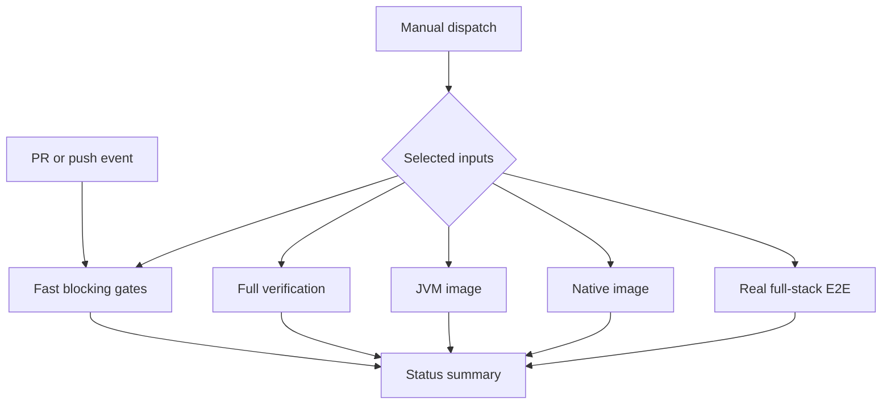
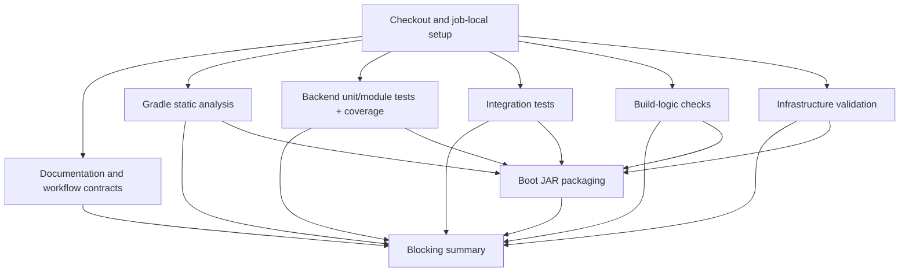
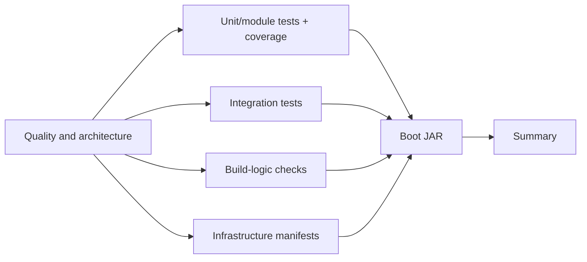
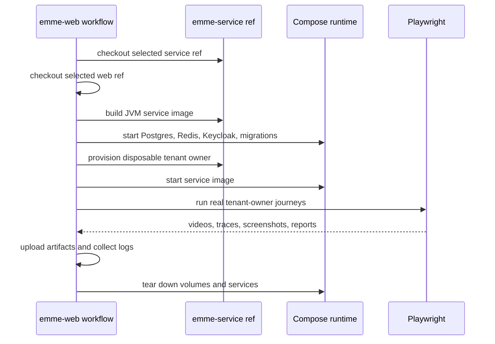

# CI Pipeline Performance and Selectable Execution Design

| Field | Detail |
|---|---|
| Scope | `emme-service` and `emme-web` |
| Date | 2026-08-04 |
| Status | Approved design baseline |
| Primary goal | Reduce CI cost and feedback time while preserving blocking quality gates |
| Related branches | `feat/enterprise-module-template-conformance`, `feat/api-version-contract` |

## 1. Decision summary

The repositories will use selectable pipeline modes instead of executing every
expensive task for every event.

The default pull-request path remains fast and blocking. Full integration,
container, native-image, and real full-stack recording work remains available
through explicit workflow inputs. Jobs that are independent remain parallel so
the wall-clock time stays low; duplicate work inside the dependency graph is
removed so runner time and cache pressure stay bounded.

## 2. Execution modes

### 2.1 Pull request mode

Runs automatically and blocks review on:

- documentation and workflow-contract validation;
- formatting, static analysis, and architecture rules;
- backend unit/module tests;
- frontend typecheck, lint, unit tests, coverage, build, and mock E2E;
- dependency and secret checks already configured for the event.

It does not build a container image, compile a native image, run real
full-stack E2E, publish packages, or deploy infrastructure.

### 2.2 Main push mode

Runs the PR gates plus:

- integration tests;
- application coverage verification;
- boot-JAR packaging;
- JVM container build and vulnerability scan;
- publication only when the release/publish condition is explicitly true.

Native image creation remains opt-in because it is materially slower and has a
different compiler/runtime risk profile.

### 2.3 Manual dispatch mode

Manual workflows expose check-box inputs for expensive or environment-specific
operations:

| Input | Default | Meaning |
|---|---:|---|
| `run_integration` | `true` | Execute Testcontainers integration tests |
| `run_container` | `true` | Build and scan the JVM image |
| `run_native` | `false` | Build and scan the GraalVM native image |
| `run_real_e2e` | `false` | Delegate to the web real-recording workflow |
| `publish` | `false` | Push an image after a successful scan |
| `deploy` | `false` | Reserved for an explicitly selected deployment workflow |

Inputs are used only to select jobs. They do not weaken the checks inside a
selected job. `publish` and `deploy` remain independently guarded by branch,
environment, and permission conditions.

The container workflow keeps a smaller input surface because it owns only
image work:

| Input | Default | Meaning |
|---|---:|---|
| `native` | `false` | Also build and scan the native image |
| `publish` | `false` | Push the selected image(s) to GHCR |

## 3. Parallel execution strategy

Parallelism is a design requirement, not an incidental GitHub Actions feature.
Every mutually exclusive verification family starts as soon as its own setup
is complete. A job may depend on another job only when it consumes an artifact,
requires a validated prerequisite, or must be intentionally fail-fast to avoid
expensive work.

For this design, tasks are safe to run in parallel only when they are
independent across all of these dimensions:

- no shared mutable workspace or generated output;
- no shared database, Docker Compose stack, port, or external test fixture;
- no artifact or result dependency;
- no required ordering relationship;
- no conflicting publication or deployment side effect.

Mutually exclusive means that executing one task cannot change the inputs,
environment, or observable result of another task. Tasks that share a runtime
or mutate the same state remain sequential even when they are technically
different commands.

The preferred graph starts mutually exclusive jobs together rather than making
all jobs wait behind one large quality job. This gives faster feedback and
exposes failures from different layers concurrently. The trade-off is additional
runner consumption, which is controlled through concurrency cancellation and
by excluding image/native/real-E2E jobs from ordinary pull requests.

Within a job, steps remain sequential when they share the same checkout,
toolchain, dependency installation, or process state. Splitting those steps
would require repeating setup on another isolated runner and usually increases
cost without improving wall-clock time.

## 4. Backend workflow design

### 4.1 Job graph

The following changes reduce duplicate work:

1. Keep quality, unit tests, integration tests, build-logic, and infrastructure
   as independent jobs so they can run in parallel after quality.
2. Move `coverageCheck` into the unit/module test job. The same Gradle process
   can reuse test outputs and avoid a second runner and a second application
   test execution.
3. Keep boot-JAR packaging as the final artifact job because it depends on all
   blocking verification jobs.
4. Keep the summary job unconditional and fail it when any selected required
   job is not successful.

### 4.2 Reusable setup

`.github/actions/setup-gradle` remains the service-local composite action. It
owns the pinned JDK and Gradle cache configuration. Every GitHub job still
needs its own setup because jobs run on isolated virtual machines; reusing the
action removes configuration drift but cannot share an installed JVM between
jobs.

Gradle build outputs will not be uploaded and downloaded between jobs by
default. For this project, the artifact transfer overhead is higher than the
benefit for the short quality jobs, and Gradle's dependency/build cache is the
more appropriate cross-run reuse mechanism.

### 4.3 Reusable action library policy

GitHub composite actions are the equivalent of focused Jenkins shared-library
steps. The current repositories keep their actions local while their contracts
are evolving:

- `emme-service` owns `setup-gradle`;
- `emme-web` owns `setup-bun`;
- each action pins its runtime, cache behavior, and lockfile installation.

Once these contracts are stable, organization-wide, stack-neutral actions may
move into a versioned private `emme-actions` repository. Consumers must pin a
release tag or immutable commit SHA. A reusable workflow using `workflow_call`
is reserved for a complete stable job graph; it should not be used merely to
hide one or two setup steps. This preserves branch-local evolution now and
gives the platform a controlled shared-library path later.

### 4.4 Conditional heavy jobs

- `ci-backend.yml` runs the normal blocking graph for pull requests and main.
- Integration work is selected by event defaults and can be disabled only on a
  manual run intended for fast diagnostics.
- `container-image.yml` is removed from the pull-request trigger. The backend
  quality job continues to validate its workflow contract; actual image
  building and scanning run on main or manual dispatch.
- The native job remains gated by `workflow_dispatch && inputs.native == true`.
- The real full-stack recording workflow remains owned by `emme-web` and is
  manually dispatched with explicit service and web refs.

## 5. Frontend workflow design

The frontend quality workflow already has the correct low-overhead shape: one
job installs Bun and dependencies once, then runs documentation, i18n,
formatting, typecheck, lint, tests, coverage, build, mock E2E, and audit.

The changes are limited to explicit optional workflows:

- mock E2E stays in normal frontend CI;
- real E2E recordings remain manual-only;
- demo/mock recordings remain manual-only;
- Chromium installation occurs only in workflows that execute browser tests;
- Bun dependency caching is added through the web setup action/workflow without
  changing lockfile determinism;
- real E2E retains one job because service boot, Compose dependencies, browser
  execution, diagnostics, and artifact collection share one disposable runtime.

## 6. Cross-repository real E2E flow

The web repository remains the orchestration root because the test artifacts,
Playwright configuration, and recording contract belong to the web project.
The workflow checks out both repositories at explicit refs:

Native full-stack E2E is not part of the default recording path. It can be
added later as a separate manual input after the native image has a stable
published reference; this prevents a 13-minute compiler step from being hidden
inside an ordinary browser test run.

## 7. Security and publication rules

- Trivy scans explicitly use `scanners: vuln` and enforce HIGH/CRITICAL
  vulnerabilities with fixed-version policy.
- SARIF output is limited to the severities enforced by the gate.
- Scan reports remain artifacts and, where supported, code-scanning uploads.
- Images are pushed only after a successful scan and only when `publish` is
  true on an authorized branch/event.
- Native publication is never implied by selecting `native`.
- Secrets, dependency audits, and architecture checks remain blocking and are
  not bypassed by performance inputs.

## 8. Acceptance criteria

- Pull-request workflows do not build JVM or native images by default.
- Independent verification jobs start in parallel whenever they do not consume
  another job's output.
- Native-image compilation is conditional and never runs unless selected.
- A manual run exposes explicit boolean inputs for expensive behavior.
- Backend unit tests and coverage execute without a separate duplicate runner.
- Setup logic is centralized in repository-local composite actions.
- Frontend dependencies and browser binaries are installed only by workflows
  that need them.
- Real E2E recordings remain selectable, ref-pinned, and artifact-producing.
- Selected jobs still fail the final summary when their checks fail.
- Workflow syntax, local validators, and repository CI pass after the change.

## 9. Trade-offs

| Choice | Benefit | Cost |
|---|---|---|
| Parallel backend jobs | Shorter wall-clock feedback | More concurrent runner minutes |
| Coverage inside test job | Removes duplicate setup and tests | Test job owns more responsibilities |
| No image build on PR | Lower cost and faster review | Image regressions are detected on main/manual instead of every PR |
| Native manual-only | Predictable cost and isolated compiler failures | Native regressions are not detected in every PR |
| One real E2E job | Shared disposable runtime and simpler cleanup | Less parallelism inside the recording workflow |
| Local composite actions | Consistent setup and easy branch-local evolution | Cross-repository sharing is not automatic |

The recommended choices optimize for the current unreleased MVP while keeping
all expensive verification one explicit checkbox away.
