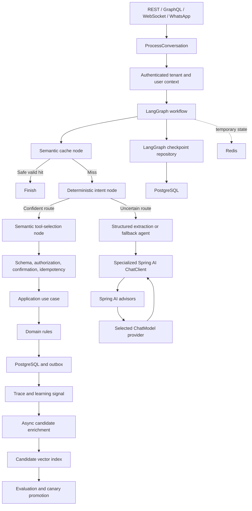
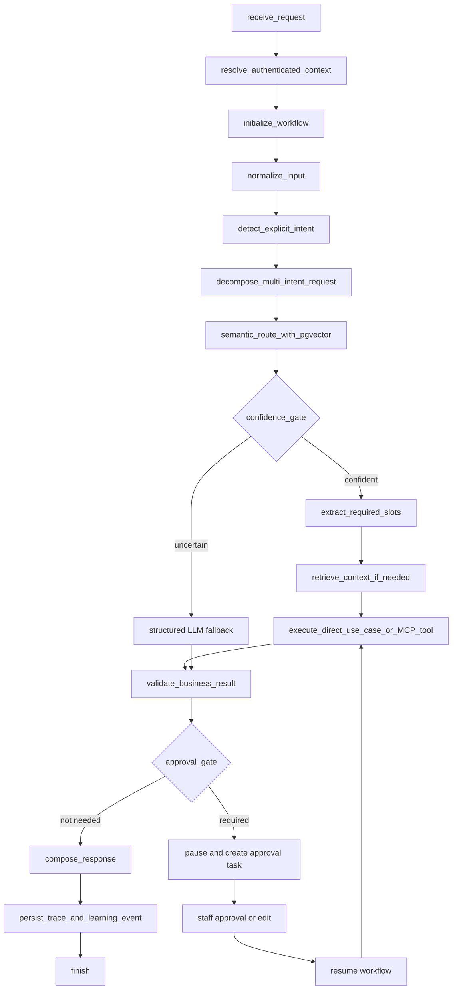
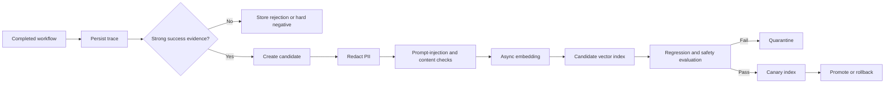

# Emme AI Platform: Semantic Architecture and Concurrency Design

| Field | Value |
|---|---|
| Product | Emme Nails |
| Repository | `emme-service` |
| Date | 2026-08-27 |
| Status | Draft for user review |
| Scope | Java 25 baseline, structured concurrency, Spring AI, LangGraph4j, semantic classification, semantic tool calling, semantic caching, and governed online enrichment |
| Runtime boundary | One Spring Boot/Spring Modulith deployable application |
| Durable source of truth | PostgreSQL, including pgvector |
| Temporary operational state | Redis |

## 1. Decision summary

Emme will keep the AI platform inside `emme-service` as a set of modular
capabilities. It will not become a separate deployable `emme-ai` service yet.

The platform will use:

- Java 25 across the complete repository build and runtime baseline.
- `ScopedValue` for immutable authenticated AI execution context.
- `StructuredTaskScope` and Java 25 `Joiner` policies for bounded parallel
  read-only work, isolated behind an Emme interface because the API is still a
  preview feature in Java 25.
- Explicitly injected named executors for work that is not structurally
  forked.
- Spring AI for model providers, embeddings, structured output, vector stores,
  advisors, tool callbacks, MCP integration, and model observability.
- LangGraph4j for persisted workflow orchestration, conditional routing,
  retries, pause/resume, and human approval.
- PostgreSQL/pgvector for durable intent, tool-reference, design, knowledge,
  and semantic-cache indexes.
- Redis for locks, rate limits, temporary state, live events, and exact hot
  cache acceleration.
- Java agents for observability and diagnostics, not for globally replacing
  `ForkJoinPool.commonPool()` or silently rewriting application concurrency.

The three vector capabilities share one embedding contract but use separate
indexes:

```text
EmbeddingGateway
  ├── intent reference index
  ├── approved tool reference index
  └── semantic cache index
```

Online requests may create safe cache entries and learning candidates. They do
not immediately change production routing, tool permissions, pricing, or
appointment behavior. Candidate records are redacted, embedded asynchronously,
evaluated, canaried, versioned, and then promoted or rejected.

## 2. Repository baseline

The current repository is a Java 25 Spring Modulith modular monolith. The
Gradle convention plugins already declare Java 25 compilation and preview
flags. CI, container configuration, and Mise also declare Java 25. Spring Boot
virtual threads are enabled in the application configuration.

The following capabilities already exist and will be reused:

- Tenant resolution from the authenticated backend context.
- Spring Security principal and permission lookup.
- PostgreSQL tenant isolation and row-level security patterns.
- PostgreSQL/pgvector hybrid search for documents and catalog data.
- Conversation and conversation-event persistence.
- Pending actions for customer confirmations.
- Spring Modulith durable event publication and Kafka externalization design.
- Redis for rate limits, login attempts, and short-lived OAuth state.
- Actuator, Micrometer, OpenTelemetry, Prometheus, and structured audit
  conventions.
- Local Ollama, Groq, and mock AI provider implementations.

The following capabilities are not implemented yet:

- `StructuredTaskScope` usage.
- `ScopedValue` usage.
- AI-specific context propagation and executor policies.
- Vector-based semantic intent classification.
- Vector-based proactive tool selection.
- Semantic cache lookup and eligibility policy.
- LangGraph4j workflow orchestration and durable checkpoints.
- Spring AI model, embedding, advisor, and MCP integration.
- Quote extraction and human approval workflow.
- AI execution trace and candidate-learning pipeline.

The existing `ModelProvider` is broader than the desired architecture. It will
be decomposed behind provider-neutral ports instead of being imported into
domain code.

The current `catalog` module depends on assistant AI contracts for image
matching. The shared embedding and vision contracts must move to a neutral AI
foundation capability before assistant orchestration is expanded, otherwise a
future assistant-to-catalog dependency would create a module cycle.

## 3. Goals

### 3.1 Product and platform goals

- Reduce model calls and token cost for repetitive classification, tool
  selection, and safe knowledge responses.
- Preserve deterministic authority for prices, availability, appointments,
  permissions, tenant access, and policies used for transactions.
- Support local models on the Apple Silicon development/worker environment and
  optional cloud fallback without coupling the domain to a provider.
- Support web, WhatsApp, and future channels through one durable workflow.
- Provide resumable human-in-the-loop workflows.
- Support tenant-level and user-level isolation for memory, cache, traces, and
  learning candidates.
- Make agent behavior observable, testable, versioned, and reversible.

### 3.2 Engineering goals

- Use Java 25 as the only supported JVM build baseline.
- Use structured concurrency for independent bounded operations.
- Use explicit executor ownership rather than global thread-pool mutation.
- Keep business rules framework-independent.
- Keep complete durable history in PostgreSQL.
- Use one embedding model/version/dimension contract per active vector index.
- Use a single workflow orchestrator: LangGraph4j for AI workflows.
- Reuse Spring Modulith for internal durable event publication and outbox
  behavior.

## 4. Non-goals

- Creating a separate AI deployable service in the first implementation.
- Replacing PostgreSQL transactional data with Redis, a graph database, or a
  vector database.
- Letting an LLM select arbitrary tenants, roles, SQL, Cypher, prices, or
  appointment mutations.
- Training or fine-tuning a model online from one customer interaction.
- Letting production routing mutate immediately after one successful request.
- Globally overriding `ForkJoinPool.commonPool()` through bytecode rewriting.
- Using Java agents as a substitute for explicit authorization or context
  propagation.
- Calling Ragas synchronously during customer requests.

## 5. High-level architecture



### 5.1 Framework responsibility

| Technology | Responsibility | Must not own |
|---|---|---|
| Spring AI | Models, embeddings, structured output, vector stores, advisors, tool callbacks, MCP | Tenant authority, pricing, appointment rules |
| LangGraph4j | Workflow state, conditional edges, retries, checkpoints, pause/resume | Domain rules, direct repository access |
| Spring Modulith | In-process module events and durable outbox publication | AI reasoning or tool authorization |
| PostgreSQL | Transactions, history, workflow state, audit, traces, pgvector | Ephemeral locks and live stream fan-out |
| Redis | Locks, temporary state, exact cache, rate limits, live events | Final quotes, appointments, approvals, complete history |
| Java agent | JVM instrumentation, telemetry, diagnostics | Global replacement of executors or authorization |

## 6. Module architecture

The recommended neutral module is `modules/ai-foundation`. It contains stable
ports and provider-neutral types, not Spring AI implementation details where
possible.

```text
modules/ai-foundation/
└── src/main/java/com/emme/ai/
    ├── api/
    │   ├── command/
    │   ├── query/
    │   ├── result/
    │   ├── usecase/
    │   ├── event/
    │   ├── exception/
    │   └── type/
    ├── application/
    │   ├── port/in/
    │   └── port/out/
    └── domain/
        ├── embedding/
        ├── semantic/
        ├── tool/
        └── execution/
```

The deployable application wires the infrastructure adapters:

```text
modules/ai-foundation
  ← modules/assistant
  ← modules/catalog
  ← modules/documents

modules/assistant
  → ai-foundation
  → catalog-api
  → documents-api
  → appointments-api
  → tenancy-api
  → audit-api
```

The AI foundation must not depend on `assistant`, `catalog`, or
`appointments`. Domain and application ports remain framework-independent.

## 7. Java 25 baseline

Java 25 is the repository-wide baseline for:

- Gradle toolchains and compiler release.
- Gradle build logic.
- Local Mise execution.
- CI setup actions.
- JVM container images.
- Kubernetes and Helm runtime images.
- Testcontainers and integration-test execution.
- Buildpacks and JVM launchers.
- JVM test and JavaExec preview flags.
- Developer documentation and release validation.

The migration must distinguish between:

```text
Temurin Java 25
  → normal JVM development, tests, and production

GraalVM Community 25
  → explicit native-image lane
```

The current local shell uses Java 17 even though the project toolchain is Java
25. A validation task must fail with an actionable message when the Gradle
runtime is below Java 25.

### 7.1 Java 25 acceptance checks

- `java --version` reports 25 in local developer instructions.
- `./gradlew --version` reports JVM 25.
- Every Java compilation task uses release 25.
- Every preview-dependent test and JavaExec task enables preview.
- CI uses Temurin 25.
- JVM containers use Java 25.
- Native builds use GraalVM 25 explicitly.
- No active source or runtime configuration selects Java 17 or Java 21.
- Existing historical documentation may mention older versions but must be
  clearly marked historical.

## 8. Context propagation and structured concurrency

### 8.1 Execution context

Every synchronous and asynchronous AI operation receives an immutable backend
context:

```java
public record AiExecutionContext(
    UUID tenantId,
    UUID principalId,
    Set<String> roles,
    UUID conversationId,
    UUID workflowId,
    String traceId,
    String idempotencyKey
) {}
```

The context is resolved from the authenticated request or trusted worker
message. The tenant and principal values are never accepted from an LLM.

`ScopedValue<AiExecutionContext>` is bound at the HTTP or worker boundary and
is inherited by structured subtasks. The context must be immutable. Ordinary
executor submissions use an explicit context-capturing wrapper rather than
assuming that scoped values propagate through every executor implementation.

The existing `ThreadLocal` tenant and correlation values remain compatibility
bridges during migration. New AI code must not use them as its only source of
authorization or tenant identity.

### 8.2 Structured task runner

The application receives a stable port:

```text
ParallelTaskRunner
  runRequired(tasks, deadline)
  runOptional(tasks, deadline)
  runFirstSuccessful(tasks, deadline)
```

The Java 25 implementation uses `StructuredTaskScope` and a new Joiner for
each scope. Joiners are responsible for completion, cancellation, and generic
result collection. Domain business logic remains outside the Joiner.

Recommended policies:

```text
allSuccessfulOrThrow
  → required vector or availability reads

awaitAll
  → optional recommendations or telemetry side work

first-success / short-circuit policy
  → provider fallback or redundant read-only lookup
```

Structured scopes are appropriate for independent reads:

```text
vector search
availability query
catalog search
RAG retrieval
salon policy retrieval
```

Mutations remain sequential:

```text
hold slot
→ obtain confirmation
→ create appointment
```

`StructuredTaskScope` and `Joiner` are preview APIs in Java 25. The repository
already enables preview compilation and test execution. The abstraction allows
an executor-based implementation to replace it if the preview API changes.

### 8.3 Named executors

Use dependency-injected executors:

```text
applicationTaskExecutor
  → Spring MVC asynchronous handling

aiIoExecutor
  → model, MCP, HTTP, and vector-store calls not owned by a scope

aiBackgroundExecutor
  → embeddings, candidate enrichment, evaluation jobs

aiCpuExecutor
  → CPU-heavy image preprocessing and transformations

aiScheduler
  → retries, expiry, cleanup, and maintenance
```

Virtual threads are appropriate for blocking model and HTTP calls. CPU-bound
work uses a bounded platform-thread executor. Database concurrency remains
bounded by the database connection pool and tenant/provider semaphores.

No AI code may use an implicit `CompletableFuture` common-pool execution for
tenant-sensitive work.

## 9. Java agent strategy

Java agents are included, but their responsibility is limited to instrumentation
and diagnostics.

### 9.1 Production JVM agent

Use an OpenTelemetry Java agent at JVM startup for standard HTTP, JDBC, JVM,
and executor telemetry. Configure it in the JVM container and Kubernetes
deployment, not in domain code.

### 9.2 Optional Emme diagnostic agent

An optional custom agent may report:

- Executor submissions that omit an explicit executor.
- Unexpected common-pool usage.
- Context propagation gaps.
- Virtual-thread pinning indicators.
- AI workflow and model-call correlation.

The agent must not globally replace `ForkJoinPool.commonPool()`, mutate tenant
authorization, or change business behavior. Explicit executor injection is the
source of concurrency semantics.

Java agents are JVM-specific. The native-image deployment path must use
in-process telemetry and configuration rather than assuming `-javaagent`
support.

## 10. Spring AI architecture

Spring AI is used through specialized clients and adapters.

```text
EmbeddingModel / VectorStore adapters
  → AI foundation EmbeddingGateway and SemanticIndex ports

ChatModel beans
  → provider-specific model selection

ChatClient instances
  → task-specific prompts and advisor chains

ToolCallback / MCP adapters
  → application use cases and external integrations
```

### 10.1 Providers

Configure named provider beans:

```text
localOllamaChatModel
localMlxCompatibleChatModel
oxAlphaCloudChatModel
localEmbeddingModel
cloudEmbeddingModel (optional)
```

The provider router chooses by task, tenant policy, privacy classification,
latency budget, availability, and fallback policy. A cloud fallback must be
disabled for tenants that do not consent to cloud processing.

The model and embedding provider must be configured independently. A chat
fallback must not silently change the embedding model used by an active index.

### 10.2 Specialized clients

```text
ExtractionChatClient
  → structured slots and nail-design attributes

RagChatClient
  → unstructured salon knowledge only

FallbackAgentChatClient
  → difficult requests and controlled model tool calling

ResponseChatClient
  → explanation of validated structured results
```

Simple successful operations use deterministic response templates. An LLM may
explain a validated quote or availability result but may not recalculate it.

### 10.3 Advisors

Extraction chain:

```text
PromptVersionAdvisor
StructuredOutputValidationAdvisor
BudgetAdvisor
TraceAdvisor
```

RAG chain:

```text
TenantSecurityAdvisor
MessageChatMemoryAdvisor
RetrievalAugmentationAdvisor
PromptVersionAdvisor
TraceAdvisor
```

Fallback agent chain:

```text
TenantSecurityAdvisor
MessageChatMemoryAdvisor
RetrievalAugmentationAdvisor
PromptVersionAdvisor
BudgetAdvisor
TraceAdvisor
one ToolCallingAdvisor
```

Advisors provide prompt and execution cross-cutting behavior. They are not the
authoritative authorization boundary. Application use cases perform the final
tenant, role, input, confirmation, idempotency, and domain checks.

Only one tool-calling loop may own model-driven tool execution for a client.
LangGraph4j owns the outer workflow; Spring AI owns the fallback agent’s model
tool loop. Direct semantic tool matches bypass the LLM and invoke application
use cases directly.

## 11. LangGraph4j workflow



The graph uses PostgreSQL checkpoints. Every checkpoint is associated with a
tenant, conversation, workflow, and graph version. Resume requires a trusted
workflow/conversation reference and re-establishes the authenticated execution
context before any node executes.

Terminal states include:

```text
SUCCEEDED
CLARIFICATION_REQUIRED
REJECTED
WAITING_FOR_APPROVAL
FAILED
```

LangGraph4j must not directly access repositories. Nodes call application
ports or Spring AI adapters. The graph state is separate from Spring AI chat
memory and from complete conversation history.

## 12. Semantic classification

### 12.1 Index contract

The intent index stores labeled reference examples:

```text
intentReference
  id
  scope: GLOBAL | TENANT
  tenantId
  intentName
  exampleText
  locale
  requiredSlots
  allowedRoles
  riskLevel
  confirmationRequired
  embeddingModel
  embeddingVersion
  indexVersion
  qualityStatus
```

### 12.2 Runtime algorithm

```text
explicit UI command
→ deterministic text rules
→ query embedding
→ tenant/global filtered vector search
→ calculate top1, top2, and margin
→ validate required fields
→ validate authorization eligibility
→ execute only if calibrated policy passes
→ otherwise abstain or use structured LLM fallback
```

The route result contains:

```text
intent
top1Similarity
top2Similarity
margin
matchedReferenceIds
missingSlots
authorizationEligible
indexVersion
decisionStatus
```

Thresholds are configured per intent, locale, channel, and index version after
evaluation. A universal threshold is not assumed.

The classifier must fail closed when tenant filtering, embedding-version
matching, or authorization eligibility cannot be verified.

## 13. Semantic tool calling

### 13.1 Approved tool reference index

The tool index contains references to existing approved tools:

```text
toolReference
  toolName
  description
  exampleUtterances
  intentNames
  requiredSlots
  riskLevel
  allowedRoles
  confirmationRequired
  tenantCapability
  toolVersion
  embeddingModel
  embeddingVersion
  indexVersion
```

Vector learning may improve examples for an existing tool. It may not create a
new executable tool, grant a role, or change a tool’s risk level.

### 13.2 Runtime algorithm

```text
classified intent
→ filter approved tools by tenant capability, role, channel, and risk
→ build prompt/tool query embedding
→ vector search tool references
→ evaluate top score and margin
→ extract and validate required slots
→ apply confirmation and authorization policy
→ call application use case or approved MCP gateway
→ validate result and audit execution
```

Safe read-only operations may execute without a confirmation when all policy
conditions pass. Writes such as booking, cancellation, payment, and approval
require the existing confirmation and idempotency rules.

## 14. Semantic caching

### 14.1 Cache eligibility

Eligible responses are:

- Read-only.
- Tenant and user scoped correctly.
- Free of disallowed private or payment information.
- Based on stable knowledge or validated deterministic results.
- Version-compatible with the current prompt, model, knowledge, policy,
  service, or quote-template dependencies.
- Stored with a bounded TTL and invalidation strategy.

Do not semantically cache:

- Authorization decisions.
- Payment results.
- Appointment mutations.
- Responses whose correctness depends on current availability unless freshness
  is explicitly validated.
- Personalized responses in a tenant-wide scope.

### 14.2 Cache record

```text
semanticCacheEntry
  id
  tenantId
  userId
  scope: GLOBAL | TENANT | USER
  channel
  locale
  normalizedQuery
  responsePayload
  responseClassification
  sourceVersion
  promptVersion
  modelVersion
  knowledgeVersion
  policyVersion
  quoteTemplateVersion
  embeddingModel
  embeddingVersion
  indexVersion
  expiresAt
  qualityStatus
```

The request path first performs a bounded semantic lookup. A hit is returned
only after scope, freshness, and dependency-version checks. Redis may hold an
exact hot response or cache pointer, but PostgreSQL/pgvector remains the initial
semantic store because the current Redis deployment does not provide verified
vector search.

## 15. Embedding contract

All three semantic features use the same provider contract:

```text
EmbeddingGateway
  embed(text, modelVersion)
  embedBatch(texts, modelVersion)
  dimensions(modelVersion)
  normalize(vector, modelVersion)
```

An index query is invalid when the query and stored vectors use different
models, versions, dimensions, or normalization rules.

Model changes use dual-version indexing:

```text
active-v1
→ build active-v2 in parallel
→ evaluate v2
→ canary v2
→ switch active pointer
→ retire v1 after retention
```

## 16. Online self-improvement



Strong evidence includes:

- A valid route.
- Successful application use-case execution.
- User confirmation or accepted outcome.
- No staff correction.
- No policy violation.
- No cross-tenant retrieval.

Learning policies differ by capability:

| Capability | Immediate online effect | Promotion requirement |
|---|---|---|
| Semantic cache | Safe scoped short-lived entry | Freshness, privacy, and content checks |
| Classification | Candidate example only | Regression and route-safety evaluation |
| Tool selection | Candidate example for existing tool only | Regression, authorization, and false-route checks |
| Tool permissions | None | Code/configuration and explicit review |
| Pricing/appointments | None | Domain/application changes only |

Candidate states are:

```text
CANDIDATE
SHADOW
CANARY
ACTIVE
REJECTED
RETIRED
```

## 17. Multi-tenant and per-user memory

Tenant context is always backend-derived. Every SQL and vector query includes an
explicit tenant predicate because the application database owner may bypass
PostgreSQL RLS.

Memory layers are separated:

```text
PostgreSQL conversation history
  → complete durable record

PostgreSQL workflow checkpoints
  → resumable graph state

Spring AI ChatMemory adapter
  → selected recent messages for a prompt

Redis
  → temporary context, lock, event stream, and hot exact cache

User preference records
  → tenantId + userId scoped durable facts
```

Agents never share unbounded mutable memory directly. They use scoped memory
query ports and emit learning signals through an owned pipeline.

## 18. Persistence model

The AI capability requires durable records for:

```text
conversation
conversation_message
ai_workflow_run
ai_workflow_checkpoint
ai_extraction_result
quote_draft
quote_review_task
quote_review_decision
ai_tool_call
ai_model_execution
ai_trace
intent_reference
tool_reference
semantic_cache_entry
learning_candidate
knowledge_document
knowledge_chunk
recommendation
```

Every AI record includes, where applicable:

```text
tenantId
conversationId
workflowId
modelVersion
promptVersion
templateVersion
embeddingModelVersion
indexVersion
createdAt
updatedAt
```

PostgreSQL migrations must include tenant indexes, version columns, uniqueness
constraints, optimistic locking, and explicit audit actor fields for approval
decisions.

## 19. Messaging and backpressure

Use the existing Spring Modulith event publication and durable outbox boundary
for internal workflow and learning events. Kafka remains an optional external
event transport according to the repository’s existing deployment profile.

Required event types include:

```text
ai.message.received
ai.quote.requested
ai.quote.extracted
ai.quote.review.requested
ai.quote.reviewed
ai.semantic.candidate.created
ai.report.requested
ai.promotion.requested
ai.workflow.completed
ai.workflow.failed
```

Consumers must be idempotent and support:

- Bounded retry with backoff.
- Dead-letter handling.
- Per-tenant concurrency limits.
- Provider concurrency limits.
- Maximum in-flight jobs per worker.
- Tenant fairness.
- Queue depth and lag metrics.

Live web status uses persisted workflow events plus SSE/WebSocket recovery. It
does not publish every model token to Kafka.

## 20. Observability

Each semantic and model decision records:

```text
traceId
tenantId
principalId or privacy-safe reference
conversationId
workflowId
embeddingModelVersion
indexVersion
top1Similarity
top2Similarity
margin
selectedIntent
selectedTool
cacheHit
fallbackReason
latency
tokenUsage
finalOutcome
```

Metrics include:

- Embedding latency.
- Vector-search latency.
- Semantic classification hit and abstention rate.
- False-route rate.
- Tool candidate acceptance rate.
- Unauthorized-tool prevention count.
- Semantic cache hit and invalidation rate.
- LLM fallback frequency.
- HITL waiting time.
- Candidate promotion rate.
- Cross-tenant retrieval violations.
- Per-tenant errors, tokens, and cost.

Prompt and completion bodies remain redacted and disabled by default in
production telemetry. Detailed content is stored only under an approved data
retention and access policy.

## 21. Security requirements

- Resolve tenant only from trusted backend authentication and membership.
- Bind authenticated context before starting a graph or structured scope.
- Fail closed when tenant context is absent or inconsistent.
- Filter every tenant-scoped vector query.
- Filter tools by role, tenant capability, channel, and risk.
- Validate all structured model output before use.
- Keep domain/application authorization after every model or vector decision.
- Require idempotency for all writes.
- Protect approval endpoints with reviewer authorization and optimistic locking.
- Redact PII before traces are used for evaluation or learning.
- Treat retrieved documents and external content as untrusted data.
- Do not expose unrestricted SQL, Cypher, repositories, or tenant selectors to
  an LLM.

## 22. Required implementation phases

### Phase 0: Java 25 baseline

- Verify local, CI, container, Kubernetes, test, and native configurations.
- Add Java runtime validation.
- Remove active legacy runtime assumptions.
- Verify JVM and preview execution with Java 25.

### Phase 1: Concurrency foundation

- Add immutable `AiExecutionContext`.
- Add `ScopedValue` context binding.
- Add context wrappers for ordinary executors.
- Add named executor configuration.
- Add `ParallelTaskRunner`.
- Add `StructuredTaskScope` implementations and Joiner tests.
- Add tenant/provider backpressure policies.

### Phase 2: AI foundation and provider adapters

- Create neutral AI foundation contracts.
- Move shared embedding/vision contracts out of assistant.
- Add Spring AI BOM and selected starters.
- Add local Ollama and OpenAI-compatible provider adapters.
- Add optional Ox Alpha provider adapter.
- Add provider routing and fallback policy.

### Phase 3: Vector semantic gateway

- Add intent-reference persistence and pgvector index.
- Add tool-reference persistence and pgvector index.
- Add semantic cache persistence and lookup policy.
- Add embedding-version validation.
- Add deterministic-first routing and abstention.

### Phase 4: LangGraph workflow and quote HITL

- Add graph state and PostgreSQL checkpoints.
- Add workflow resume endpoints.
- Add quote extraction, deterministic quote engine integration, and approval
  states.
- Add optimistic review locking and audit decisions.

### Phase 5: Spring AI clients and advisors

- Add extraction client.
- Add RAG client.
- Add fallback agent client.
- Add response client.
- Add security, memory, retrieval, prompt, budget, trace, and one tool-calling
  advisor.

### Phase 6: Learning and operations

- Add trace persistence and redaction.
- Add candidate-learning pipeline.
- Add online safe cache enrichment.
- Add shadow/canary index promotion.
- Add Ragas asynchronous evaluation scaffold.
- Add dashboards, alerts, runbook, and rollback procedures.

## 23. Compatibility risks and spikes

1. Spring AI in the repository is an old milestone version. It must be upgraded
   to a stable version compatible with Spring Boot 4.1 before implementation.
2. LangGraph4j and its PostgreSQL saver must be pinned to mutually compatible
   versions. Upstream release and saver documentation currently show different
   version examples.
3. `StructuredTaskScope` and `Joiner` are preview APIs in Java 25. They must be
   isolated behind `ParallelTaskRunner` and tested with the exact JDK used in CI.
4. The current Redis image does not provide verified vector search. Redis Vector
   Search requires a deliberate infrastructure change and compatibility test.
5. Java agents apply to the JVM deployment and need a separate native-image
   observability strategy.
6. Existing catalog-to-assistant AI dependencies must be restructured before
   assistant orchestration depends on catalog APIs.
7. Existing ThreadLocal tenant and correlation state must not leak across
   executor reuse or asynchronous worker boundaries.
8. The local shell currently runs Java 17, so Java 25 verification requires an
   explicit developer runtime setup.

## 24. Acceptance criteria for this design

- The repository has one documented Java 25 baseline.
- Spring AI and LangGraph4j have non-overlapping responsibilities.
- Structured concurrency and Joiners are isolated behind a stable port.
- Java agents are scoped to telemetry and diagnostics.
- No global ForkJoinPool rewrite is required.
- Semantic classification, tool selection, and caching have separate indexes.
- All vector indexes use a pinned embedding model/version/dimension.
- All tenant and user scopes are enforced by backend context.
- LLM fallback occurs only after deterministic and vector routes abstain.
- Tool execution always reaches an application use case.
- Durable workflow state and AI traces are stored in PostgreSQL.
- Redis is never the only source of truth.
- Online enrichment cannot directly change production business behavior.
- The remaining compatibility risks are represented as explicit implementation
  spikes.

## 25. Open questions for the next specification pass

- Confirm whether “FCR” means Feature Change Request in Emme’s documentation
  process.
- Confirm whether Redis Vector Search should be a future optional adapter or a
  required production dependency after a Redis Stack spike.
- Confirm the initial JVM-only versus JVM-plus-native AI deployment target for
  Java-agent rollout.
- Confirm the exact LangGraph4j/PostgreSQL saver version after dependency
  resolution against the repository’s Gradle lockfile.
