# Emme AI Platform: Consistency, RAG, GraphRAG, and Java 25 Design

| Field | Value |
|---|---|
| Product | Emme Nails |
| Repository | `emme-service` |
| Date | 2026-08-28 |
| Status | Approved for implementation with Redis Stack/EmbeddingGemma and hardware-independent regression |
| Scope | AI naming, tenant context, Java 25 concurrency, Spring AI, LangGraph4j, pgvector RAG, optional Apache AGE GraphRAG, observability, and governed self-improvement |
| Deployment | One Spring Boot/Spring Modulith deployable; no separate `emme-ai` service in this phase |

## 1. Executive decision

Keep the AI platform inside `emme-service` as modular capabilities. Introduce a
small framework-neutral `libraries:ai-contracts` library for provider-neutral AI
contracts and a `modules:ai-platform` module for the shared AI runtime. The
existing `assistant` module owns conversations, Emme-specific workflow
definitions, tools, quotes, HITL, and channel workflows. Keep document
ownership and ingestion in `documents`. Move catalog's generic image and
embedding contracts out of assistant.

PostgreSQL remains authoritative for tenants, memberships, services, prices,
appointments, conversations, workflows, quotes, approvals, traces, audits, and
outbox events. PostgreSQL/pgvector is the primary durable vector store. Redis
Stack is the low-latency hot vector/cache layer for small, versioned semantic
indexes and short-lived semantic responses; it is rebuildable and never
authoritative. Apache AGE is an optional asynchronous derived graph read model
for relationship recommendations, hosted in PostgreSQL.

The local model host uses Gemma 4 MLX variants for chat, vision, structured
extraction, and reasoning. It uses Ollama's `embeddinggemma` for text
embeddings used by semantic classification, semantic tool selection, semantic
caching, RAG, and normalized design descriptions. Gemma 4 and EmbeddingGemma
are separate capabilities; Gemma 4 is not used as a text embedding model. The
same embedding model version, dimension, normalization, distance metric, and
query-instruction version must be used for every index and query namespace. A
different provider/model never shares an existing vector index.

The Mac Studio is an optional model-inference host, not a CI dependency or a
durable data store. One Ollama service may serve multiple logical conversations
through bounded request scheduling. The service does not start one model
process per chat and does not rely on GPU auto-detection for admission. The
Mac Studio M5 Max baseline uses `gemma4:e4b-mlx` as the default generation/vision
profile; `gemma4:e2b-mlx` remains the compatibility profile for lower-memory
developer machines. The initial local profile is conservative: one concurrent
generation/vision call, small bounded embedding concurrency, a global in-flight
limit, and explicit per-tenant/per-user queue limits. These values are
benchmarked and configured, not inferred from the number of conversations.

Java 25 preview APIs are isolated behind stable Emme interfaces:

```text
Stable Emme ports
    -> Java 25 StructuredTaskScope/Joiner adapter
    -> Spring AI model/retrieval/tool adapters
    -> LangGraph4j workflow adapter
    -> PostgreSQL/pgvector, Apache AGE, and Redis adapters
```

This document is the approved design baseline for implementation. Implementation
must still be delivered in small TDD slices and must not expand into an
unrelated rewrite.

## 2. Repository baseline and gaps

### 2.1 Current structure

```text
applications/emme-platform
  -> modules/assistant
  -> modules/documents
  -> modules/catalog
  -> modules/appointments and other business modules
  -> libraries/kernel

libraries/kernel
  -> TenantContext/ThreadLocal compatibility
  -> AiExecutionContext and ScopedValue scope
  -> structured-concurrency adapter

modules/assistant
  -> conversation use cases and channel adapters
  -> semantic routing, tools, quote/HITL, Spring AI, LangGraph4j, Redis, traces

libraries/ai-contracts
  -> framework-neutral AI ports and value types

modules/ai-platform
  -> Spring AI, LangGraph4j runtime, providers, retrieval, graph, cache, traces
```

### 2.2 Existing implementation

- Java 25 toolchain and preview compilation flags.
- Immutable `AiExecutionContext`.
- `AiExecutionContextScope` using `ScopedValue`.
- `AiExecutionContextBridge` for legacy ThreadLocal and MDC state.
- `StructuredParallelTaskRunner` using `StructuredTaskScope` and Joiners.
- Tenant-aware pgvector semantic intent/tool references and semantic cache.
- Spring AI Ollama chat/embedding adapters and provider failover.
- Authorized tool gateway and `getSalonServices` application-tool registration.
- Quote extraction, deterministic quote calculation, approval persistence, and
  tenant-aware LangGraph4j quote checkpointing.
- Redis locks/status/events and durable model/tool/extraction/embedding traces.

### 2.3 Missing or inconsistent

| Area | Finding | Target |
|---|---|---|
| Documentation | Existing AI design/plan status is stale compared with current code | Maintain one capability matrix and update ADRs |
| Naming | `ModelProvider`, `ChatCompletionPort`, `RagQueryService`, and semantic names coexist | Apply one capability-first vocabulary |
| Module boundary | `catalog` depends on assistant for generic AI contracts | Extract contracts to `libraries:ai-contracts` and move shared runtime to `modules:ai-platform` |
| Conversation | Direct chat creates synthetic IDs and may not persist a conversation row | Load/create durable conversation before AI execution |
| Traces | Model trace persistence can fail when its conversation FK is absent | Make conversation lifecycle a prerequisite |
| RAG | `RagQueryService` directly combines legacy embedding/search/model calls | Use Spring AI VectorStore and retrieval advisors behind ports |
| Advisors | Tenant/prompt advisors exist; memory, retrieval, budget, validation, and complete trace composition are incomplete | Use specialized client configurations |
| Workflow | LangGraph4j is centered on the quote graph | Add a durable bounded conversation workflow |
| Quote | Production `QuoteTemplateRepository` wiring is incomplete | Complete tenant-scoped adapter before enabling production quote flow |
| Graph | No Apache AGE extension bootstrap, graph projection, schema, or curated traversal exists | Add disabled-by-default optional GraphRAG after pgvector RAG |
| Redis | Operational adapters exist but are not uniformly integrated into chat lifecycle | Use only for defined temporary responsibilities |
| Learning | Trace foundation exists; governed candidate promotion is incomplete | Add redaction, evaluation, shadow, canary, and rollback |

## 3. Structural alternatives

### Option A — AI contracts library plus AI platform module (recommended)

```text
kernel
  -> context and concurrency primitives
ai-contracts
  -> provider-neutral AI types and ports
ai-platform
  -> Spring AI, LangGraph4j runtime, providers, retrieval, graph, cache, traces
assistant
  -> conversations, workflow definitions, tools, quotes, HITL, channels
documents
  -> knowledge documents, chunks, ingestion, source lifecycle
catalog
  -> ai-contracts contracts only
```

This removes the current catalog-to-assistant dependency without creating a
network boundary. `ai-contracts` stays framework-neutral; `ai-platform` owns
Spring AI, LangGraph4j, provider routing, retrieval, and operational adapters.
Assistant-specific graph definitions and business nodes remain in `assistant`.
The cost is a controlled contract-extraction migration.

### Option B — Keep all AI inside assistant

This minimizes immediate file movement, but leaves catalog coupled to a
conversation module and keeps provider, workflow, and product contracts mixed.
It may be used temporarily during migration, not as the target architecture.

### Option C — Separate `emme-ai` service

Rejected for this phase because it duplicates or remotely coordinates JWT
authentication, tenant resolution, application transactions, conversation
ownership, audit, quotes, and appointment decisions.

## 4. Canonical naming

### 4.1 Tenant and AI context

`AiExecutionContextScope` is the correct name for the AI `ScopedValue` API. It
describes a lexical lifetime and is broader than a tenant-only holder.
`TenantContextHolder` remains useful as a compatibility facade for existing
multitenant code, but it must not be treated as the security authority.

```java
TenantExecutionContext       // immutable tenant/database/correlation record
TenantExecutionContextScope  // canonical tenant ScopedValue binding
TenantContextBridge          // explicit ScopedValue -> ThreadLocal/MDC bridge
TenantContextHolder          // legacy ThreadLocal/MDC access facade
AiExecutionContext           // tenant + actor + workflow execution record
AiExecutionContextScope      // nested AI ScopedValue binding
AiExecutionContextBridge     // explicit bridge to legacy state
```

`AiExecutionContext` distinguishes the authenticated actor from the workflow
owner, which is required when staff resolves a client-owned quote:

```text
tenantId       -> backend-resolved tenant boundary
principalId    -> authenticated actor
roles          -> backend-resolved authorization snapshot
conversationId -> durable conversation
workflowId     -> durable workflow run
traceId        -> distributed correlation
idempotencyKey -> retry/mutation identity
```

Rejected alternatives:

| Name | Reason |
|---|---|
| `AiExecutionContextHolder` | Implies mutable/thread-local ownership |
| `TenantScope` | Omits actor, workflow, trace, and idempotency concerns |
| `RequestContext` | Mixes transport lifetime with durable workflow identity |
| `ExecutionContext` | Too generic until the context is shared by all platform capabilities |

### 4.2 AI and application types

Follow the repository `Port` naming rule for application boundaries and keep
technology names in adapters.

| Current | Target | Rationale |
|---|---|---|
| `ModelProvider` | `ChatModelPort`, `EmbeddingModelPort`, `VisionModelPort` | Separate capabilities |
| `ChatProviderChain` | `FailoverChatModelAdapter` | Policy/adapter, not domain provider |
| `EmbeddingProviderChain` | `FailoverEmbeddingModelAdapter` | Same vocabulary as chat |
| `RagQueryUseCase` | `AnswerKnowledgeQuestionUseCase` | RAG is an implementation technique |
| `RagQueryService` | `AnswerKnowledgeQuestionService` | User capability and one-use-case service |
| `SemanticIntentRouter` | `SemanticIntentClassifier` | Classifier decides a match; workflow routes |
| `SemanticProactiveToolRouter` | `SemanticToolSelectionService` | Selection is separate from execution |
| `AiToolGateway` | `AuthorizedToolGateway` | Authorization is a gateway responsibility |
| `QuoteWorkflowGraph` | `QuoteWorkflowDefinition` | Definition is distinct from execution |
| `SpringAiNailDesignExtractor` | `SpringAiNailDesignExtractionAdapter` | Explicit infrastructure role |

Avoid `Impl`, `Manager`, `Helper`, `Utils`, `Default`, and `Dto`. Use the same
verb and subject across request, command, use case, service, result, and event.

## 5. Enterprise tenant context boundary

### 5.1 Filter architecture

There must be one canonical `TenantContextFilter`, not several competing
“tenant-aware” filters. It runs after Spring Security has authenticated the JWT
and before application authorization/use cases. It resolves tenant identity from
trusted backend data and binds both the canonical scoped value and the legacy
bridge.

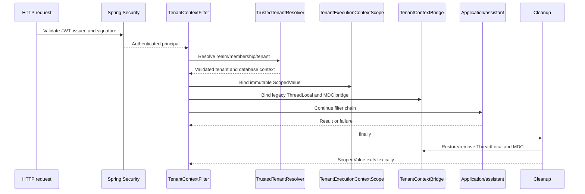

Filter rules:

1. A tenant-bound JWT realm or membership always outranks headers, query
   parameters, hostname, or frontend state.
2. Unknown or invalid tenant-bound authentication fails closed and cannot fall
   back to `X-Tenant-Slug`, `tenant`, or hostname selection.
3. A platform principal without a tenant binding may use an explicit tenant
   selection flow only after membership and permission validation.
4. Tenant-owned routes reject missing tenant context; there is no default tenant.
5. The filter does not create an AI workflow or fabricate a conversation ID.
6. ScopedValue cleanup is lexical. ThreadLocal/MDC cleanup is explicit in
   `finally` and must happen before a container thread is reused.

### 5.2 Virtual threads, workers, and async boundaries

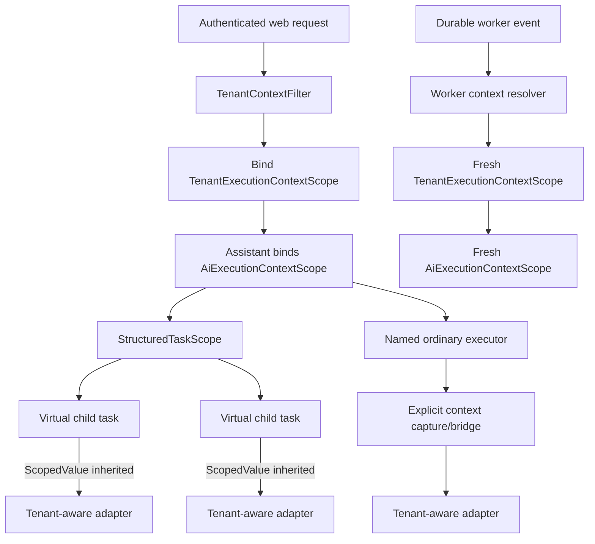

- `ScopedValue` is inherited by `StructuredTaskScope` forked children.
- Do not use `InheritableThreadLocal` for tenant or authorization state.
- Do not assume servlet ThreadLocal, Spring Security context, or MDC state is
  present on a worker.
- Structured tasks use `StructuredParallelTaskRunner`, which captures the
  legacy bridge when needed.
- Ordinary executors require an explicit context-capturing wrapper or approved
  task decorator. Only named injected executors are allowed.
- Queue consumers, schedulers, and batch jobs bind a fresh context from a
  trusted event envelope plus backend validation.
- Async servlet redispatches re-resolve and rebind context; no request context
  is left attached to a reused container thread.

### 5.3 Persistence defense in depth

```text
trusted authentication
  -> TenantContextFilter
  -> TenantExecutionContextScope
  -> TenantContextBridge / TenantContextHolder compatibility boundary
  -> TenantScopedDataSource / RLS / explicit tenant predicates
  -> application use case
```

The data source resets schema/search-path state before pooled connections are
reused. Repositories and vector/graph adapters also enforce tenant predicates.
Model arguments cannot override tenant, principal, role, or database identity.

## 6. High-level AI architecture

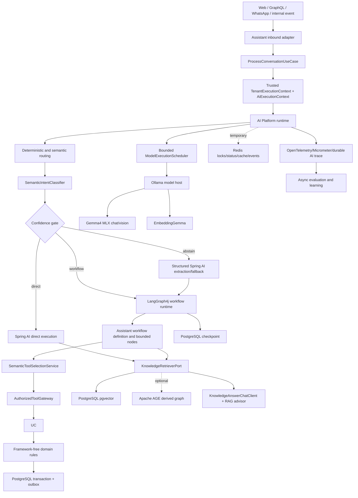

## 7. End-to-end workflow and framework ownership

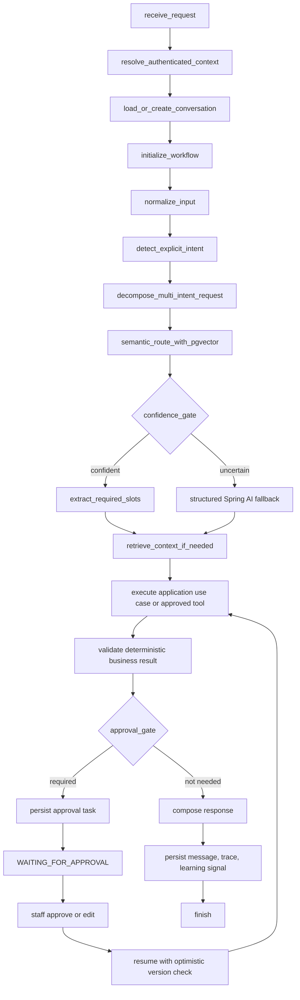

| Technology | Owns | Does not own |
|---|---|---|
| Java 25 | Context and structured concurrency adapter | Business authorization |
| `libraries:ai-contracts` | Stable AI ports, workflow contracts, and immutable value types | Framework configuration or business rules |
| `modules:ai-platform` | Shared AI runtime, provider routing, Spring AI clients/advisors, LangGraph4j adapter, retrieval, cache, graph, and AI operations | Salon prices, appointment rules, tenant authority, workflow meaning |
| Spring AI | Models, embeddings, structured output, VectorStore, advisors, tool callbacks, MCP clients | Prices, availability, tenant authority |
| LangGraph4j | Workflow state, branches, retries, checkpoints, pause/resume | Repositories and domain rules |
| Spring Modulith | Internal events and outbox publication | AI reasoning |
| PostgreSQL | Transactions, history, workflow, approvals, traces, pgvector | Ephemeral locks/live fan-out |
| Redis Stack | Rebuildable hot semantic indexes, temporary state, locks, short-lived cache, rate limits, live events | Durable business records or authorization |
| Apache AGE | Optional derived relationships/recommendations inside PostgreSQL | Transactional authority; vector similarity |
| Java agent | Telemetry and diagnostics | Executor replacement or authorization |

## 8. Structured concurrency and Joiners

Joiners are explicit completion policies, not business logic.

| Joiner | Use | Policy |
|---|---|---|
| `allSuccessfulOrThrow` | Required independent reads | Fail the scope if one task fails; cancel siblings |
| `awaitAll` | Optional pgvector/graph/preferences retrieval | Wait and inspect each outcome; degrade safely |
| `anySuccessfulResultOrThrow` | Deliberate read/provider race | Return first valid result and cancel remaining tasks |
| Custom Joiner | Generic aggregation only | Thread-safe; no pricing, authorization, or routing rules |

Recommended behavior:

```text
Quote extraction -> deterministic calculation -> sequential workflow steps
FAQ retrieval + optional graph retrieval -> awaitAll
Provider failover -> sequential by default; do not race paid providers implicitly
```

`StructuredParallelTaskRunner` remains the stable application interface. The
Java 25 preview `StructuredTaskScope` and `Joiner` APIs stay inside its adapter.
All preview compile, test, Java execution, and release lanes use the exact Java
25 toolchain and `--enable-preview`.

No AI code may mutate `ForkJoinPool.commonPool()` or call
`CompletableFuture.supplyAsync` without an injected executor.

## 9. Spring AI and LangGraph4j

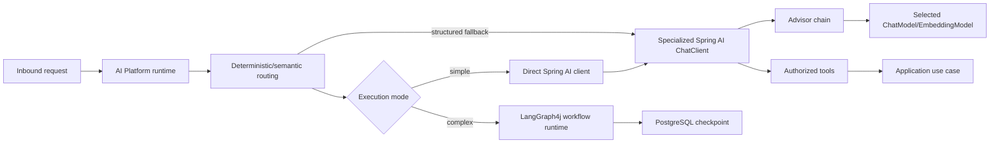

`modules:ai-platform` owns the runtime boundary. Spring AI owns model-facing
execution. LangGraph4j owns durable orchestration. `modules:assistant` supplies
Emme-specific workflow definitions and business node handlers through
`libraries:ai-contracts`; it does not expose raw LangGraph4j state to other
modules.

There is one model-driven tool loop: the fallback agent may use one
`ToolCallingAdvisor`; LangGraph4j remains the outer workflow. Direct semantic
tool matches bypass that loop. Workflow transitions are predefined and bounded;
the model cannot create arbitrary nodes or edges.

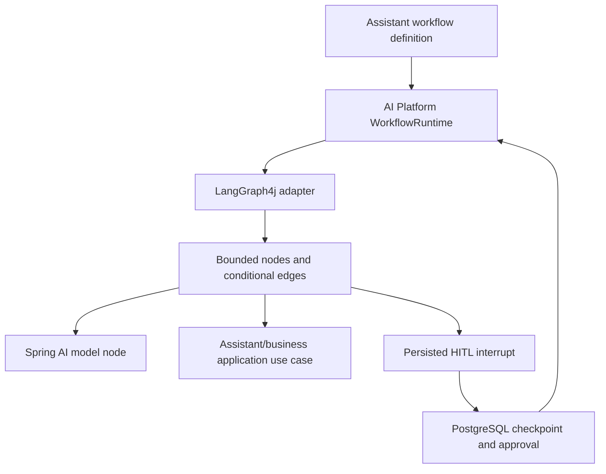

Each workflow declares maximum steps, model calls, tool calls, retries, wall
clock duration, and token budget. The platform rejects an execution that
exceeds any bound. Workflow state is durable in PostgreSQL; Redis only carries
locks, temporary status, and live events.

Specialized clients:

```text
ExtractionChatClient
  -> prompt version, native structured output, schema validation, budget, trace

KnowledgeAnswerChatClient
  -> tenant security, chat-memory prompt adapter, retrieval, prompt version, trace

FallbackAgentChatClient
  -> tenant security, memory, retrieval when needed, budget, one tool loop, trace

ResponseChatClient
  -> receives validated results and cannot recalculate transactions
```

Native structured output is an optimization; application validation remains
mandatory, particularly for local models without provider-native guarantees.

## 9.1 Six-stage production lifecycle

The lifecycle is implemented as ordered platform gates around direct Spring AI
calls and LangGraph4j workflows. It is not six deployable services.

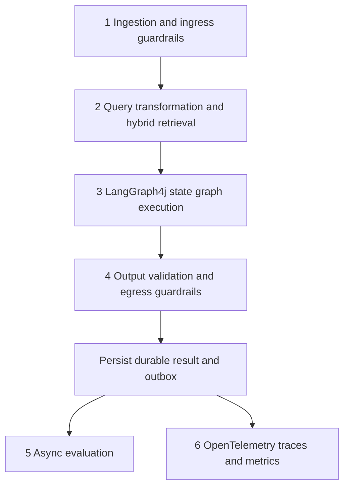

Stage 1 resolves trusted authentication, normalizes input, redacts PII before
external model calls, and applies deterministic safety checks. A local safety
classifier such as Llama Guard may be enabled behind a port; NeMo Guardrails is
an optional policy adapter, not a second workflow engine. Stage 2 performs
deterministic slot/query transformation, Redis hot semantic lookup, and
tenant-filtered dense/sparse retrieval. Stage 3 executes bounded graph nodes
and governed tools. Stage 4 validates typed output, reconciles factual fields
against application results, checks data leakage, and rejects raw model output.
Stage 5 reads anonymized traces asynchronously for Ragas and regression
evaluation. Stage 6 instruments every stage without exposing raw prompts,
secrets, hidden reasoning, or unredacted PII.

## 9.2 Local model host, logical chats, and backpressure

The Mac Studio is a bounded inference appliance. It is not a collection of
independent GPU-backed chat processes. A single Ollama service keeps a selected
model loaded when possible and multiplexes requests from many logical
conversations. Conversation identity, history, memory scope, tenant scope, and
workflow state remain application concerns persisted by Emme; they are not
stored as GPU-local chat sessions.

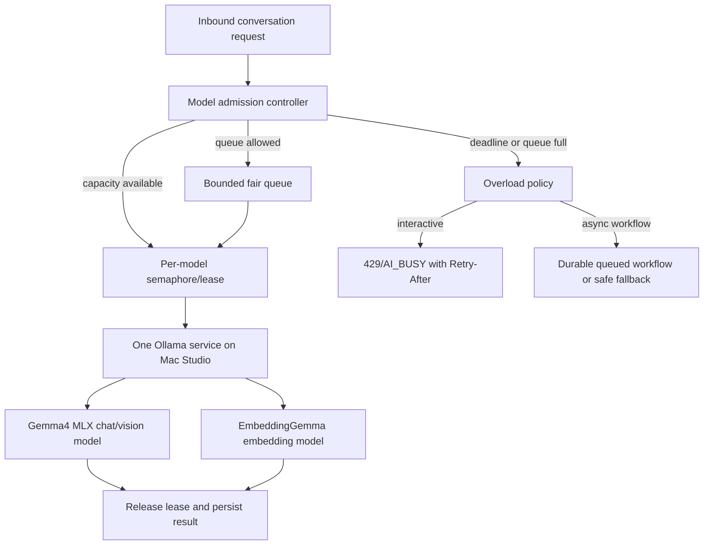

The first implementation uses explicit capacity profiles rather than guessing
from GPU utilization:

```text
ModelCapacityProfile
  providerKey
  modelKey
  maxInFlight
  maxQueueDepth
  maxWait
  requestTimeout
  maximumInputTokens
  maximumOutputTokens
  maximumImageBytes
  priorityClass
```

The initial Mac profile starts conservatively with one concurrent Gemma 4
generation/vision request and a small, independently configurable embedding
limit. A global inference limit remains above both model limits so embedding
work cannot starve interactive generation. The exact values are benchmarked on
the purchased configuration and changed through configuration, not code.

Admission and scheduling rules:

1. Every model call passes through `ModelExecutionScheduler`; no direct
   controller, LangGraph node, advisor, or tool calls Ollama directly.
2. The scheduler enforces global, provider/model, tenant, and authenticated-user
   in-flight limits. The tenant and user identifiers come from the trusted
   `AiExecutionContext`, never from model arguments.
3. Queues are bounded. There is no unbounded `BlockingQueue`, common-pool
   submission, or fire-and-forget model task.
4. Interactive requests use a deadline-aware weighted fair queue. A tenant with
   a large backlog cannot monopolize the Mac, and a low-volume tenant cannot be
   permanently starved by background ingestion or evaluation.
5. Background embedding, reindexing, Ragas, and learning jobs use a lower
   priority lane with a separate budget. They yield to interactive requests and
   are paused when the host is unhealthy or the queue crosses the high-water
   mark.
6. A request that cannot be admitted before its deadline is rejected or routed
   to an explicitly allowed provider fallback. It is never silently dropped.
7. Cancellation, timeout, client disconnect, provider failure, and workflow
   interruption release the model lease in `finally` and emit a trace event.
8. Async work is accepted only after its durable workflow/outbox record exists;
   Redis Streams may transport the work, but PostgreSQL remains the recovery
   source after Redis or the Mac restarts.

The scheduler exposes a stable platform port, for example:

```java
interface ModelExecutionScheduler {
  CompletionStage<ModelExecutionResult> submit(
      ModelExecutionRequest request, AiExecutionContext context);
}
```

The request contains model capability, priority, deadline, idempotency key, and
estimated resource bounds. It does not contain an authority override. The
implementation may use virtual threads to wait for bounded permits, but the
capacity policy is independent of thread count. `StructuredTaskScope` and
Joiners coordinate independent read-only work around a model call; they are not
a replacement for the model admission controller.

Overload behavior is channel-specific:

| Channel | Queue full or model busy | Required behavior |
|---|---|---|
| Web/SSE | Immediate admission failure | Return a safe busy response with retry metadata; do not hold an unbounded HTTP request |
| WhatsApp | Accepted async work | Send acknowledgment only after durable acceptance; send one final response after completion |
| Staff UI | Bounded wait | Show queued status and allow cancellation or refresh from durable workflow state |
| Background job | Defer/retry | Exponential backoff, tenant fairness, and dead-letter after bounded attempts |

The local host has no special relationship with a conversation. Ten users can
have ten conversations while sharing the same loaded model, subject to the
capacity policy. This is the safe equivalent of “multiple chats”; it is not one
GPU allocation per chat. Chat memory is keyed by
`tenantId/conversationId/principalScope`, while model capacity is keyed by
`providerKey/modelKey`.

## 10. Semantic classification, tool selection, and caching

```text
EmbeddingModelPort
  ├── Redis Stack hot intent reference index
  ├── Redis Stack hot approved-tool reference index
  ├── Redis Stack short-lived semantic response cache
  └── PostgreSQL/pgvector durable knowledge/design index
```

### 10.1 Embedding model and vector-store policy

`embeddinggemma` is the initial local text embedding model. EmbeddingGemma is a
small multilingual text embedding model intended for retrieval, semantic
similarity, classification, and clustering on everyday devices. It supports
flexible output dimensions; Emme starts at 768 dimensions and keeps the output
L2-normalized for cosine similarity. The production configuration pins the
exact Ollama model tag and records its resolved model version or digest.

`gemma4:e4b-mlx` is the default local generation/vision profile for the Mac
Studio M5 Max baseline. `gemma4:e2b-mlx` is the lower-memory compatibility
profile. The first local integration uses Ollama to serve these MLX variants; a
direct MLX runtime is not introduced unless measurements demonstrate a material
benefit over the single Ollama boundary.

EmbeddingGemma is not the same model as Gemma 4 and must be versioned separately
from the generation model. When the embedding model, dimension, normalization,
distance metric, or instruction template changes, Emme creates a new index
namespace, regenerates reference vectors, runs the semantic regression suite,
and promotes the new namespace only after evaluation.

RedisVL is not an embedding model. It is a Python client/library for Redis
vector search. The Java service uses Spring AI's Redis `VectorStore` integration
and Spring Data Redis/Lettuce where native Redis commands are needed. Redis
vector search requires Redis Stack/Redis Query Engine, so the current plain
`redis:7-alpine` image must be replaced or supplemented by a pinned
Redis-Stack profile before Redis KNN is enabled.

Use separate versioned indexes:

| Index | Store | Initial algorithm | Contents | Authority |
|---|---|---|---|---|
| `ai:intent:{embeddingVersion}` | Redis Stack | `FLAT` | Small intent examples and route metadata | PostgreSQL catalog/examples |
| `ai:tool:{embeddingVersion}` | Redis Stack | `FLAT` | Approved tool descriptions and candidate metadata | PostgreSQL tool registry/policies |
| `ai:response:{embeddingVersion}` | Redis Stack | `FLAT`, then measured HNSW | Eligible read-only cached responses | PostgreSQL traces and source results |
| `ai:knowledge:{embeddingVersion}` | PostgreSQL/pgvector | HNSW/appropriate pgvector index | Durable FAQs, policies, aftercare, and design descriptions | PostgreSQL documents |
| `ai:design:{embeddingVersion}` | PostgreSQL/pgvector | HNSW/appropriate pgvector index | Normalized design descriptions and future image embeddings | PostgreSQL design artifacts |

For the initial 20–30-salon target, `FLAT` is preferred for the small Redis
intent/tool indexes because exact nearest-neighbor search is more deterministic
and avoids unnecessary HNSW approximation. HNSW becomes an evaluated option
for larger response or design working sets. Every vector record stores tenant
scope where applicable, model/version, instruction version, dimension,
normalization, metric, index version, and source version.

The semantic cache is split into two concepts:

1. `ToolSelectionCache` stores candidate tool IDs, scores, and catalog version.
   It never stores authorization decisions. Authorization, role, risk, slot,
   confirmation, and idempotency checks run again before execution.
2. `SemanticResponseCache` stores only validated read-only responses with
   provenance, policy/model versions, scope, and TTL. Booking, cancellation,
   payment, personalized customer data, and staff decisions are ineligible by
   default.

Redis is the first lookup and is allowed to fail closed to a normal workflow.
PostgreSQL/pgvector is the durable fallback for reference and knowledge data,
not the first semantic response-cache implementation. A cold semantic cache in
pgvector is a later optimization only if hit rate, Redis memory, and freshness
metrics justify it.

### Classification

```text
explicit UI action
  -> deterministic rule
  -> Redis Stack hot similarity
  -> PostgreSQL/pgvector fallback or rebuild source
  -> top1/top2 margin + required-slot + authorization gate
  -> structured extraction if needed
  -> fallback agent only after abstention
```

### Proactive tool selection

```text
message
  -> approved tool-reference vector search
  -> Redis Stack hot index
  -> PostgreSQL registry fallback
  -> backend role/tenant/risk filtering
  -> score and margin gate
  -> typed argument validation
  -> application use case
```

Only read-only, no-confirmation tools are eligible for proactive execution.
Mutations require workflow confirmation, authorization, idempotency, and audit.

### Semantic cache

```text
message
  -> deterministic eligibility policy
  -> tenant/principal/version scoped Redis Stack lookup
  -> TTL/freshness/provenance validation
  -> cached answer or normal workflow
```

Transactional and personalized requests bypass the cache unless an explicit
policy proves safe reuse. Redis owns the short-lived hot response cache and
selection cache; PostgreSQL owns durable source data, traces, cache eligibility
evidence, and rebuild metadata. Cache hits and misses are recorded in the
durable trace without persisting hidden reasoning.

## 11. Spring AI RAG

Structured business data comes from application use cases. RAG is for FAQs,
aftercare, service descriptions, unstructured policies, manuals, brand tone,
and approved examples.

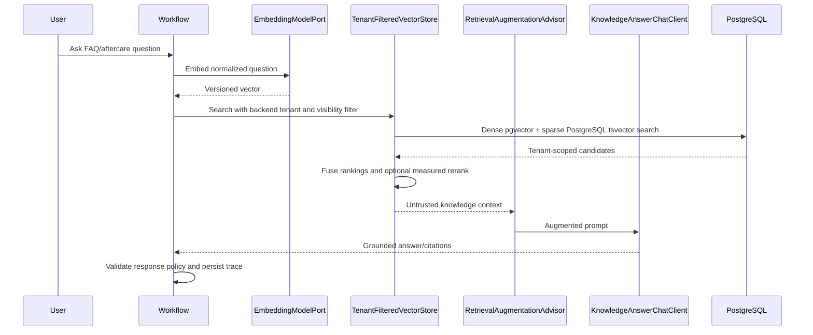

Query transformation is deterministic first: normalize locale, extract known
slots, and construct tenant/visibility/effective-date filters in the backend.
An LLM rewrite or multi-query expansion is allowed only for a configured
knowledge intent after the original query has been preserved and bounded. The
dense and sparse searches may run in one Java 25 structured scope and join with
an optional-result policy; a failed optional retriever must not bypass tenant
filters or cause an ungrounded answer.

The initial sparse implementation is PostgreSQL `tsvector`/full-text search,
not a second search product. Candidate fusion is deterministic reciprocal-rank
fusion. Cross-encoder reranking is disabled initially and becomes a measured
feature-flagged phase using a local model where possible. It must not be used to
override application results or authorization.

The VectorStore adapter creates the tenant filter from
`AiExecutionContextScope`, rejects model-supplied tenant filters, enforces
visibility/effective dates, bounds context size, and treats retrieved content as
untrusted data. Prices and transaction policy are never authoritative because
they appeared in RAG.

Chunk metadata:

```text
tenantId, documentType, sourceId, section, locale, effectiveAt,
version, embeddingModel, embeddingVersion, visibility
```

Chunk size, overlap, embedding model, and retrieval thresholds are evaluated
parameters, not permanent assumptions.

## 12. Optional Apache AGE GraphRAG

Apache AGE is the selected graph option for this phase. It is a PostgreSQL
extension that provides openCypher-style graph queries while retaining the
same database and transaction boundary as the relational system. AGE is a
derived read model populated asynchronously from approved PostgreSQL outbox
events; it is disabled by default until the extension/image compatibility
spike passes.

The current runtime is PostgreSQL 17 with the `pgvector/pgvector:pg17` image.
The stable baseline for this design is Apache AGE 1.6.0 for PostgreSQL 17.
AGE is not included in the current pgvector image, so implementation requires
a pinned custom image and database bootstrap that installs/enables `age`; it
must not be added as an unpinned production-side package step.

Use one backend-maintained AGE graph namespace per tenant, registered in the
authoritative PostgreSQL control tables. The authenticated backend tenant ID
resolves that graph name; neither the frontend nor the model may supply a
graph name. Every vertex and edge also carries `tenant_id` as defense in
depth. The stable AGE baseline must not rely on newer release-only graph RLS
behavior; isolation is enforced through graph selection, fixed tenant
predicates, database roles, and negative tests.

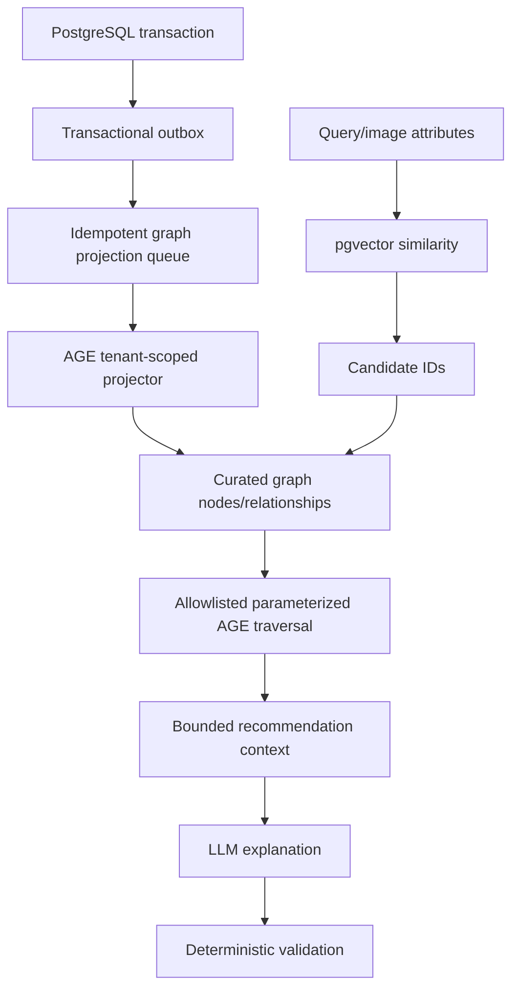

Initial relationships:

```text
(:Design)-[:COMPATIBLE_WITH]->(:Service)
(:Design)-[:REQUIRES_SKILL]->(:Skill)
(:Service)-[:REQUIRES_PRODUCT]->(:Product)
(:Skill)-[:QUALIFIED_ARTIST]->(:StaffMember)
(:Service)-[:SUBJECT_TO]->(:SalonPolicy)
(:Client)-[:PREFERS_STYLE]->(:DesignStyle)
(:Client)-[:BOOKED_SERVICE]->(:Service)
(:Promotion)-[:APPLIES_TO]->(:Service)
```

Graph rules:

- `GraphRetrieverPort` is the stable application boundary; its first adapter
  uses PostgreSQL JDBC and Apache AGE rather than a separate graph server.
- Every node and relationship is tenant-scoped or proven globally safe, and
  graph names come only from the trusted backend tenant registry.
- Graph writes are idempotent, replayable, versioned, and asynchronous through
  the transactional outbox; PostgreSQL relational records remain authoritative.
- AGE queries are parameterized and selected from predefined query templates.
  The exact JDBC/agtype mapping and extension bootstrap are integration-spike
  items, not reasons to expose raw SQL or Cypher to the model.
- The LLM cannot choose a database, graph namespace, tenant, or generate
  unrestricted Cypher.
- Graph output may recommend; it cannot price, book, cancel, authorize, or grant
  permissions.
- Graph staleness/outage falls back to pgvector or abstains safely. AGE graph
  projection is eventually consistent and must expose projection version/time
  in retrieval traces.

## 13. Persistence, observability, and learning

Durable records include:

```text
conversation, conversation_message, ai_workflow_run,
ai_workflow_checkpoint, ai_extraction_result, quote_draft,
quote_review_task, quote_review_decision, ai_tool_call,
ai_model_execution, knowledge_document, knowledge_chunk,
knowledge_entity, semantic_intent_reference, semantic_tool_reference,
semantic_response_cache, recommendation, evaluation_trace, learning_candidate
```

Each AI record carries tenant and correlation/version data as applicable:

```text
tenantId, conversationId, workflowId, modelVersion, promptVersion,
templateVersion, createdAt, updatedAt
```

Redis keys remain temporary:

```text
session:{userId}
ai:thread:{tenantId}:{conversationId}
ai:lock:{tenantId}:{conversationId}
ai:vector:intent:{embeddingVersion}:{indexVersion}:{referenceId}
ai:vector:tool:{embeddingVersion}:{indexVersion}:{referenceId}
ai:vector:response:{tenantId}:{embeddingVersion}:{cacheId}
ai:semantic:selection:{tenantId}:{embeddingVersion}:{inputHash}
quote:cache:{tenantId}:{inputHash}:{templateVersion}
rate:{tenantId}:{userId}
review:{tenantId}:{reviewTaskId}
stream:{tenantId}:{conversationId}:events
```

Redis vector indexes are created with explicit prefixes and metadata filters;
the tenant filter is mandatory for tenant-owned records. The index name is
versioned by embedding and schema/index version so model changes create a new
namespace rather than silently mixing vector spaces. Redis TTL, eviction, and
memory alarms are operational controls. Rebuilding the hot indexes reads from
PostgreSQL and does not require conversation history or business records to be
recovered from Redis.

Capture model latency, tokens, cost, fallbacks, queue depth, consumer lag,
HITL wait time, confidence, correction rate, tool failures, tenant errors,
wrong-tenant attempts, and duplicate mutation blocks. Redact PII before logs,
evaluation, or learning; never persist image bytes or secrets in traces.

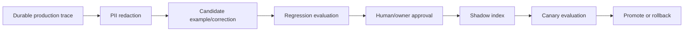

Ragas runs asynchronously or in CI. Deterministic Java tests remain the
authority for prices, tenant isolation, authorization, idempotency, and
appointment rules.

## 14. Reliability and security rules

1. Resolve and validate tenant from trusted authentication/backend membership.
2. Bind tenant scope before AI workflow or structured tasks start.
3. Reject unknown tenant-bound realms; do not use request selector fallback.
4. Require tenant context for tenant-scoped persistence, vector, and graph access.
5. Validate every structured model result against a closed schema.
6. Apply application authorization after vector/model routing.
7. Require idempotency for every write, approval, booking, cancellation, and
   payment command.
8. Use optimistic locking for review and checkpoint resume.
9. Retry only safe/idempotent operations; bound all model, database, vector,
   graph, and MCP calls with timeouts/circuit breakers.
10. Route every model call through bounded global/model/tenant/user admission
    limits; never use an unbounded queue or fire-and-forget model task.
11. Use transactional outbox for notifications and graph projections.
12. Treat documents, graph text, external content, and messages as untrusted
    prompt-injection inputs.
13. Redis/AGE failures may remove acceleration or recommendations, never
    authorization or transactional safety.

## 15. Incremental rollout

### Phase 0 — Reconciliation

- Update AI documents, ADRs, capability status, and architecture rules.
- Add structural tests for forbidden dependencies and obsolete names.

### Phase 1 — Foundation extraction

- Create `libraries:ai-contracts` for framework-neutral ports and value types.
- Create `modules:ai-platform` for the shared Spring AI and LangGraph4j runtime.
- Move generic image/embedding/provider contracts from assistant into
  `ai-contracts`.
- Update catalog consumers and Modulith metadata without behavior changes.

### Phase 2 — Context and lifecycle closure

- Add `TenantExecutionContextScope` and bind it in `TenantContextFilter`.
- Add `TenantContextBridge`; keep `TenantContextHolder` as the legacy access
  and override facade.
- Make durable conversation load/create mandatory before model execution.
- Complete trace FK lifecycle and worker context binding.

### Phase 3 — Naming migration

- Apply canonical names across source, tests, metrics, configuration, and docs.
- Remove obsolete aliases because the service is unreleased.

### Phase 4 — Spring AI RAG

- Add tenant-filtered pgvector `VectorStore` and ingestion metadata.
- Add specialized knowledge client and retrieval advisor.
- Add grounding/citation and prompt-injection tests.

### Phase 5 — General LangGraph workflow

- Generalize quote workflow boundaries into a conversation workflow.
- Add clarification, confirmation, approval, failure, checkpoint, and resume
  states while preserving one model tool loop.

### Phase 6 — Optional Apache AGE GraphRAG

- Add disabled-by-default local/production configuration.
- Add the pinned PostgreSQL image/AGE extension bootstrap, graph registry,
  JDBC/AGE adapter, outbox projector, replay, curated traversal, tenant
  isolation, and pgvector fallback.

### Phase 7 — Operations and learning

- Add dashboards, alerts, Ragas worker, candidate pipeline, shadow/canary index,
  rollback procedures, SSE recovery, and asynchronous WhatsApp completion.

## 16. Test strategy

Regression is deliberately split from live-model evaluation. A powered Mac
Studio is never required for a pull request, restart test, tenant-isolation
test, or business-rule regression.

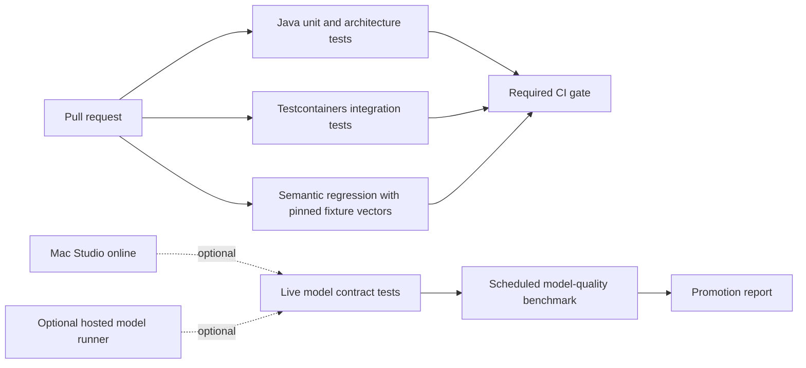

### Required hardware-independent regression

- Unit tests use deterministic embedding vectors and model fakes. They verify
  top-1/top-2 margins, threshold abstention, tool authorization, cache
  eligibility, tenant scoping, idempotency, workflow transitions, and
  backpressure without starting Ollama.
- Integration tests use Testcontainers for PostgreSQL/pgvector and Redis Stack.
  They verify real metadata filters, vector index contracts, Redis TTLs/locks,
  durable workflow recovery, and outbox behavior.
- The semantic regression corpus stores anonymized input, expected intent,
  required slots, allowed tool, risk policy, tenant outcome, and versioned
  fixture vectors. The fixture manifest records embedding model/version,
  dimension, normalization, distance, and index version.
- Tests assert ranking, expected labels, and bounded numeric tolerances. They
  do not require exact floating-point equality across quantization or runtime
  changes.
- Fixture generation is an explicit reviewed command. CI never writes to a
  production index or silently regenerates fixtures.

### Optional live-model evaluation

- A model contract job runs `Gemma4` and `EmbeddingGemma` against a small
  anonymized corpus when the Mac Studio is online or an approved hosted runner
  is available.
- The job verifies model availability, resolved model identity, embedding
  dimensions, normalization, latency, structured-output compatibility, and
  representative ranking quality.
- Nightly/weekly evaluation measures intent accuracy, abstention and false-route
  rate, slot accuracy, retrieval metrics, extraction quality, model latency,
  token usage, and cost. Ragas remains asynchronous/offline and never replaces
  deterministic business tests.
- A model or embedding change creates a new manifest/index namespace. No single
  successful interaction automatically changes production routing.

### Backpressure and local-host tests

- No request starts after the global or model-specific in-flight limit is full.
- Queue depth never exceeds configured global or tenant limits.
- Weighted fairness prevents one tenant from monopolizing the local model and
  prevents background ingestion from starving interactive requests.
- Deadline expiry returns the configured overload result and does not leak a
  permit.
- Cancellation, timeout, provider failure, and client disconnect release the
  permit exactly once.
- Async acceptance persists the workflow/outbox record before transport to
  Redis Streams; restart recovery does not duplicate a mutation.
- Model-host unavailability routes only through explicit tenant-approved
  fallback policy or a safe unavailable response.

### Unit

- Context immutability, lexical binding, nesting, bridge cleanup, and reused
  executor behavior.
- Joiner behavior for required, optional, first-success, timeout, interruption,
  cancellation, and failure mapping.
- Model admission limits, tenant fairness, bounded queues, deadlines,
  cancellation, lease release, and overload policy.
- Semantic scores/margins, cache eligibility/expiry, tool authorization, and
  idempotency.
- RAG filter construction, graph query allowlist, and prompt-injection defense.
- Quote rules, slot validation, HITL transitions, and optimistic locking.

### Integration

- PostgreSQL/pgvector tenant filtering and durable conversation/trace FKs.
- Spring AI structured output and retrieval advisor with test doubles.
- Redis locks, TTL state, idempotency, and live events.
- LangGraph4j checkpoint restart/resume.
- Optional AGE projection, curated traversal, tenant filtering, replay, and
  outage fallback.
- Transactional outbox and idempotent consumers.

### End to end

```text
tenant-scoped FAQ/RAG
availability and confirmation booking
ambiguous multi-intent request
high-confidence image quote
HITL quote approval/edit/resume
wrong-tenant access attempt
duplicate mutation
LLM timeout/provider fallback
tool/MCP failure
workflow resume after restart
AGE unavailable with pgvector fallback
```

Paid model APIs are not used in normal tests. Local Ollama tests are opt-in;
deterministic fakes and contract tests are the default.

## 17. Files and boundaries

```text
libraries/ai-contracts/
  src/main/java/com/emme/ai/contracts/
    api/

modules/ai-platform/
  src/main/java/com/emme/ai/platform/
    application/
    adapter/out/provider/springai/
    adapter/out/workflow/langgraph/
    adapter/out/knowledge/pgvector/
    adapter/out/graph/age/
    adapter/out/redis/
    configuration/

modules/assistant/
  src/main/java/com/emme/assistant/
    application/service/
    application/port/out/
    adapter/out/provider/springai/
    adapter/out/knowledge/
    adapter/out/graph/
    adapter/out/workflow/
    configuration/

modules/documents/
  existing document ownership plus vector ingestion integration

database/
  conversation, AI trace, pgvector, and graph projection migrations
```

Do not modify unrelated dirty tenancy files during these phases. Do not change
global executor behavior outside the AI/concurrency boundary.

## 18. Risks and verification gates

| Risk | Gate |
|---|---|
| Java preview API changes | Stable runner port and exact Java 25 preview lane |
| Spring AI API drift | Verify pinned BOM APIs before each slice |
| LangGraph checkpoint cache behavior | Restart/resume and tenant isolation tests |
| RAG filter bypass | Centralized backend filter and negative tests |
| Graph projection lag | Version/timestamp and safe fallback |
| Graph operational cost | Disabled-by-default feature flag and measured use case |
| Context leakage | Thread reuse, async dispatch, worker, and cross-tenant tests |
| Trace FK failure | Durable conversation prerequisite test |
| Provider cost | Sequential failover default and budget tests |
| Mac model overload | Bounded model scheduler, tenant fairness, deadline and permit-release tests |
| Mac powered off during CI | Required regression uses fakes/fixture vectors; live model tests are optional scheduled jobs |
| Embedding model drift | Pinned model manifest, versioned index namespace, ranking regression, and explicit promotion |

## 19. References

- [Java 25 `StructuredTaskScope`](https://docs.oracle.com/en/java/javase/25/docs/api/java.base/java/util/concurrent/StructuredTaskScope.html)
- [Java 25 `Joiner`](https://docs.oracle.com/en/java/javase/25/docs/api/java.base/java/util/concurrent/StructuredTaskScope.Joiner.html)
- [Java 25 `ScopedValue`](https://docs.oracle.com/en/java/javase/25/docs/api/java.base/java/lang/ScopedValue.html)
- [Spring AI RAG](https://docs.spring.io/spring-ai/reference/api/retrieval-augmented-generation.html)
- [Spring AI Redis VectorStore and semantic cache](https://docs.spring.io/spring-ai/reference/2.0/api/vectordbs/redis.html)
- [Spring AI Ollama embeddings](https://docs.spring.io/spring-ai/reference/api/embeddings/ollama-embeddings.html)
- [Redis vector search](https://redis.io/docs/latest/develop/ai/search-and-query/vectors/)
- [RedisVL](https://redis.io/docs/latest/develop/ai/redisvl/)
- [Google EmbeddingGemma](https://ai.google.dev/gemma/docs/embeddinggemma)
- [Ollama EmbeddingGemma](https://ollama.com/library/embeddinggemma)
- [Ollama embeddings API](https://docs.ollama.com/capabilities/embeddings)
- [Ollama Gemma 4](https://ollama.com/library/gemma4)
- [Ollama MLX performance on Apple Silicon](https://ollama.com/blog/mlx-performance)
- [Apple Mac Studio technical specifications](https://images.apple.com/mac-studio/specs/)
- [Spring AI structured-output validation](https://docs.spring.io/spring-ai/reference/api/structured-output/validation.html)
- [Apache AGE downloads and supported releases](https://age.apache.org/download/)
- [Apache AGE overview](https://age.apache.org/overview/)
- [Apache AGE releases](https://github.com/apache/age/releases)

## 20. Approval gate

Approval authorizes creation of the detailed implementation plan. It does not
authorize a broad rewrite. Implementation must proceed in small TDD slices,
preserve unrelated worktree changes, and verify each module after each phase.
