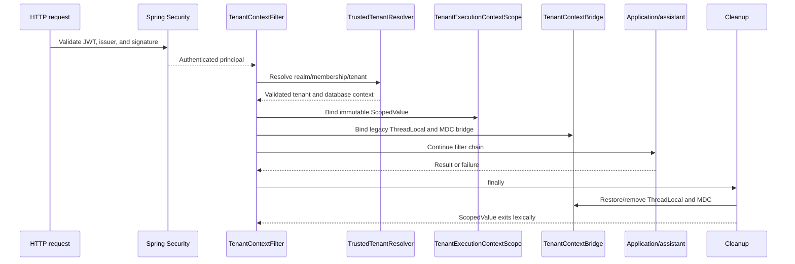
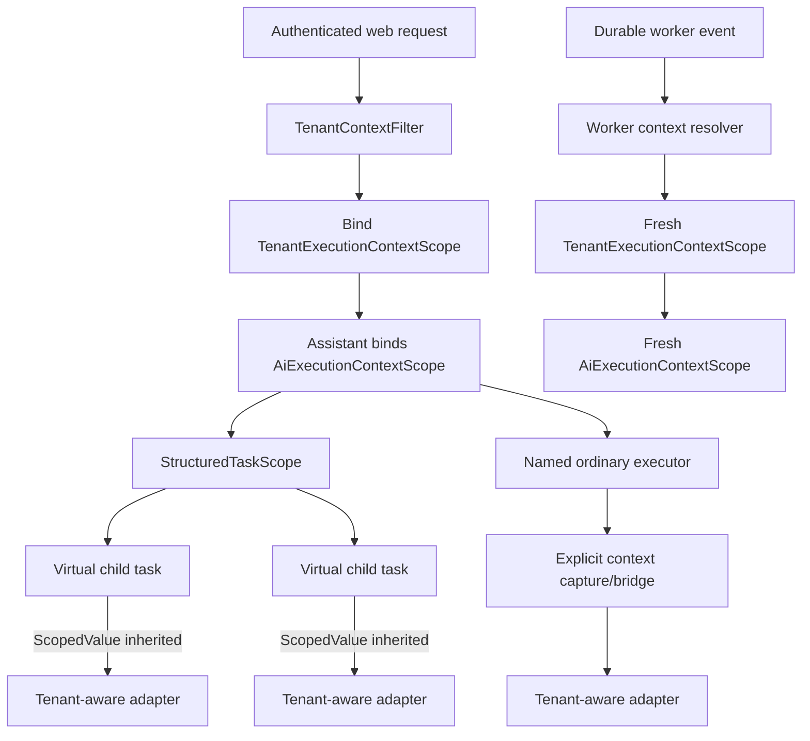
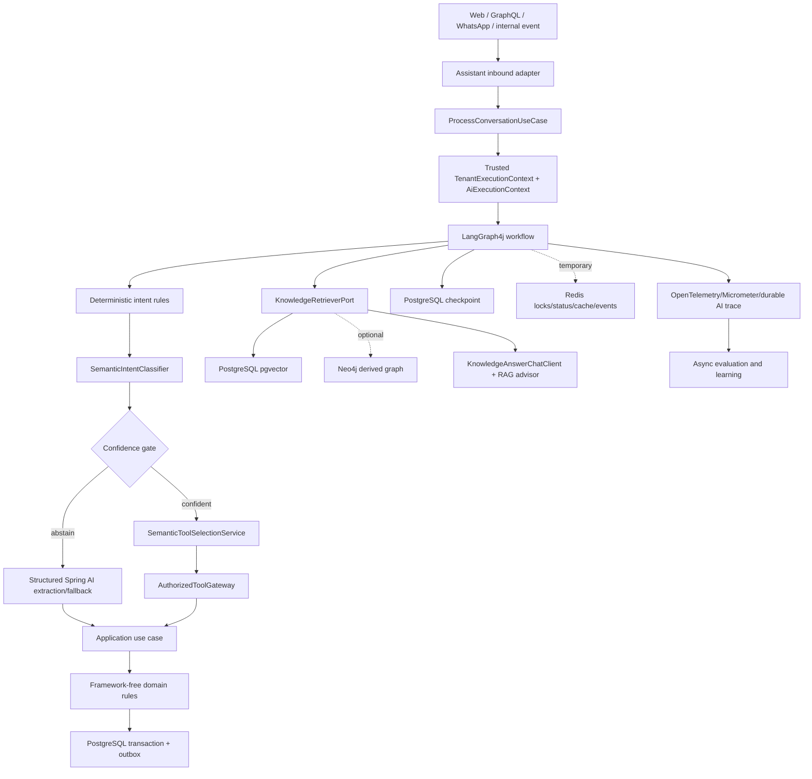
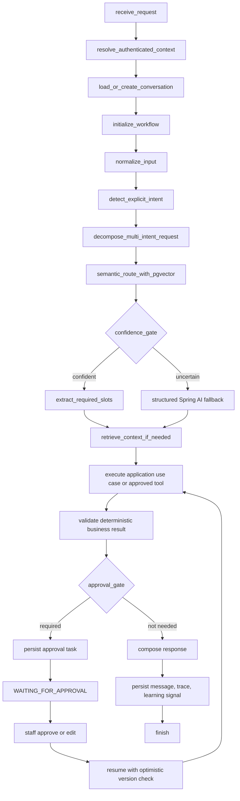
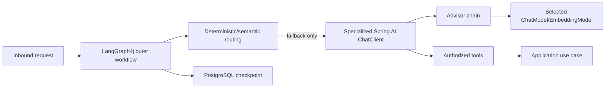
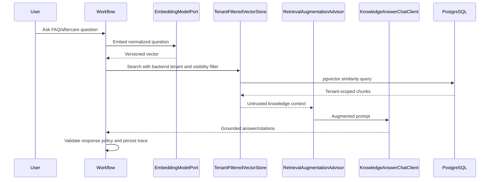
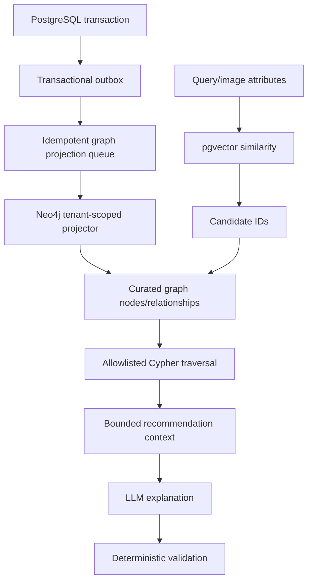
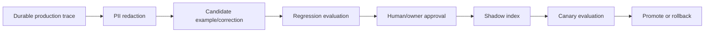

# Emme AI Platform: Consistency, RAG, GraphRAG, and Java 25 Design

| Field | Value |
|---|---|
| Product | Emme Nails |
| Repository | `emme-service` |
| Date | 2026-08-28 |
| Status | Draft for user review |
| Scope | AI naming, tenant context, Java 25 concurrency, Spring AI, LangGraph4j, pgvector RAG, optional Neo4j GraphRAG, observability, and governed self-improvement |
| Deployment | One Spring Boot/Spring Modulith deployable; no separate `emme-ai` service in this phase |

## 1. Executive decision

Keep the AI platform inside `emme-service` as modular capabilities. Introduce a
small neutral `ai-foundation` module for provider-neutral AI contracts, while
the existing `assistant` module owns conversations, tools, quotes, HITL, and
channel workflows. Keep document ownership and ingestion in `documents`. Move
catalog's generic image and embedding contracts out of assistant.

PostgreSQL remains authoritative for tenants, memberships, services, prices,
appointments, conversations, workflows, quotes, approvals, traces, audits, and
outbox events. PostgreSQL/pgvector is the primary durable vector store. Redis is
temporary operational infrastructure. Neo4j is an optional asynchronous derived
read model for relationship recommendations.

Java 25 preview APIs are isolated behind stable Emme interfaces:

```text
Stable Emme ports
    -> Java 25 StructuredTaskScope/Joiner adapter
    -> Spring AI model/retrieval/tool adapters
    -> LangGraph4j workflow adapter
    -> PostgreSQL, Redis, and optional Neo4j adapters
```

This document is a design proposal. It does not authorize implementation until
the user approves the complete design. Implementation must be delivered as
small TDD slices.

## 2. Repository baseline and gaps

### 2.1 Current structure

```text
applications/emme-platform
  -> modules/assistant
  -> modules/documents
  -> modules/catalog
  -> modules/appointments and other business modules
  -> libraries/kernel

libraries/kernel
  -> TenantContext/ThreadLocal compatibility
  -> AiExecutionContext and ScopedValue scope
  -> structured-concurrency adapter

modules/assistant
  -> conversation use cases and channel adapters
  -> semantic routing, tools, quote/HITL, Spring AI, LangGraph4j, Redis, traces
```

### 2.2 Existing implementation

- Java 25 toolchain and preview compilation flags.
- Immutable `AiExecutionContext`.
- `AiExecutionContextScope` using `ScopedValue`.
- `AiExecutionContextBridge` for legacy ThreadLocal and MDC state.
- `StructuredParallelTaskRunner` using `StructuredTaskScope` and Joiners.
- Tenant-aware pgvector semantic intent/tool references and semantic cache.
- Spring AI Ollama chat/embedding adapters and provider failover.
- Authorized tool gateway and `getSalonServices` application-tool registration.
- Quote extraction, deterministic quote calculation, approval persistence, and
  tenant-aware LangGraph4j quote checkpointing.
- Redis locks/status/events and durable model/tool/extraction/embedding traces.

### 2.3 Missing or inconsistent

| Area | Finding | Target |
|---|---|---|
| Documentation | Existing AI design/plan status is stale compared with current code | Maintain one capability matrix and update ADRs |
| Naming | `ModelProvider`, `ChatCompletionPort`, `RagQueryService`, and semantic names coexist | Apply one capability-first vocabulary |
| Module boundary | `catalog` depends on assistant for generic AI contracts | Extract contracts to `ai-foundation` |
| Conversation | Direct chat creates synthetic IDs and may not persist a conversation row | Load/create durable conversation before AI execution |
| Traces | Model trace persistence can fail when its conversation FK is absent | Make conversation lifecycle a prerequisite |
| RAG | `RagQueryService` directly combines legacy embedding/search/model calls | Use Spring AI VectorStore and retrieval advisors behind ports |
| Advisors | Tenant/prompt advisors exist; memory, retrieval, budget, validation, and complete trace composition are incomplete | Use specialized client configurations |
| Workflow | LangGraph4j is centered on the quote graph | Add a durable bounded conversation workflow |
| Quote | Production `QuoteTemplateRepository` wiring is incomplete | Complete tenant-scoped adapter before enabling production quote flow |
| Graph | No Neo4j driver, graph projection, schema, or curated traversal exists | Add disabled-by-default optional GraphRAG after pgvector RAG |
| Redis | Operational adapters exist but are not uniformly integrated into chat lifecycle | Use only for defined temporary responsibilities |
| Learning | Trace foundation exists; governed candidate promotion is incomplete | Add redaction, evaluation, shadow, canary, and rollback |

## 3. Structural alternatives

### Option A — Neutral foundation plus staged capabilities (recommended)

```text
kernel
  -> context and concurrency primitives
ai-foundation
  -> provider-neutral AI types and ports
assistant
  -> conversations, workflows, tools, quotes, HITL, channels
documents
  -> knowledge documents, chunks, ingestion, source lifecycle
catalog
  -> ai-foundation contracts only
```

This removes the current catalog-to-assistant dependency without creating a
network boundary. Spring AI, LangGraph4j, and Neo4j remain infrastructure
details. The cost is a controlled contract-extraction migration.

### Option B — Keep all AI inside assistant

This minimizes immediate file movement, but leaves catalog coupled to a
conversation module and keeps provider, workflow, and product contracts mixed.
It may be used temporarily during migration, not as the target architecture.

### Option C — Separate `emme-ai` service

Rejected for this phase because it duplicates or remotely coordinates JWT
authentication, tenant resolution, application transactions, conversation
ownership, audit, quotes, and appointment decisions.

## 4. Canonical naming

### 4.1 Tenant and AI context

`AiExecutionContextScope` is the correct name for the AI `ScopedValue` API. It
describes a lexical lifetime and is broader than a tenant-only holder.
`TenantContextHolder` remains useful as a compatibility facade for existing
multitenant code, but it must not be treated as the security authority.

```java
TenantExecutionContext       // immutable tenant/database/correlation record
TenantExecutionContextScope  // canonical tenant ScopedValue binding
TenantContextBridge          // explicit ScopedValue -> ThreadLocal/MDC bridge
TenantContextHolder          // legacy ThreadLocal/MDC access facade
AiExecutionContext           // tenant + actor + workflow execution record
AiExecutionContextScope      // nested AI ScopedValue binding
AiExecutionContextBridge     // explicit bridge to legacy state
```

`AiExecutionContext` distinguishes the authenticated actor from the workflow
owner, which is required when staff resolves a client-owned quote:

```text
tenantId       -> backend-resolved tenant boundary
principalId    -> authenticated actor
roles          -> backend-resolved authorization snapshot
conversationId -> durable conversation
workflowId     -> durable workflow run
traceId        -> distributed correlation
idempotencyKey -> retry/mutation identity
```

Rejected alternatives:

| Name | Reason |
|---|---|
| `AiExecutionContextHolder` | Implies mutable/thread-local ownership |
| `TenantScope` | Omits actor, workflow, trace, and idempotency concerns |
| `RequestContext` | Mixes transport lifetime with durable workflow identity |
| `ExecutionContext` | Too generic until the context is shared by all platform capabilities |

### 4.2 AI and application types

Follow the repository `Port` naming rule for application boundaries and keep
technology names in adapters.

| Current | Target | Rationale |
|---|---|---|
| `ModelProvider` | `ChatModelPort`, `EmbeddingModelPort`, `VisionModelPort` | Separate capabilities |
| `ChatProviderChain` | `FailoverChatModelAdapter` | Policy/adapter, not domain provider |
| `EmbeddingProviderChain` | `FailoverEmbeddingModelAdapter` | Same vocabulary as chat |
| `RagQueryUseCase` | `AnswerKnowledgeQuestionUseCase` | RAG is an implementation technique |
| `RagQueryService` | `AnswerKnowledgeQuestionService` | User capability and one-use-case service |
| `SemanticIntentRouter` | `SemanticIntentClassifier` | Classifier decides a match; workflow routes |
| `SemanticProactiveToolRouter` | `SemanticToolSelectionService` | Selection is separate from execution |
| `AiToolGateway` | `AuthorizedToolGateway` | Authorization is a gateway responsibility |
| `QuoteWorkflowGraph` | `QuoteWorkflowDefinition` | Definition is distinct from execution |
| `SpringAiNailDesignExtractor` | `SpringAiNailDesignExtractionAdapter` | Explicit infrastructure role |

Avoid `Impl`, `Manager`, `Helper`, `Utils`, `Default`, and `Dto`. Use the same
verb and subject across request, command, use case, service, result, and event.

## 5. Enterprise tenant context boundary

### 5.1 Filter architecture

There must be one canonical `TenantContextFilter`, not several competing
“tenant-aware” filters. It runs after Spring Security has authenticated the JWT
and before application authorization/use cases. It resolves tenant identity from
trusted backend data and binds both the canonical scoped value and the legacy
bridge.



Filter rules:

1. A tenant-bound JWT realm or membership always outranks headers, query
   parameters, hostname, or frontend state.
2. Unknown or invalid tenant-bound authentication fails closed and cannot fall
   back to `X-Tenant-Slug`, `tenant`, or hostname selection.
3. A platform principal without a tenant binding may use an explicit tenant
   selection flow only after membership and permission validation.
4. Tenant-owned routes reject missing tenant context; there is no default tenant.
5. The filter does not create an AI workflow or fabricate a conversation ID.
6. ScopedValue cleanup is lexical. ThreadLocal/MDC cleanup is explicit in
   `finally` and must happen before a container thread is reused.

### 5.2 Virtual threads, workers, and async boundaries



- `ScopedValue` is inherited by `StructuredTaskScope` forked children.
- Do not use `InheritableThreadLocal` for tenant or authorization state.
- Do not assume servlet ThreadLocal, Spring Security context, or MDC state is
  present on a worker.
- Structured tasks use `StructuredParallelTaskRunner`, which captures the
  legacy bridge when needed.
- Ordinary executors require an explicit context-capturing wrapper or approved
  task decorator. Only named injected executors are allowed.
- Queue consumers, schedulers, and batch jobs bind a fresh context from a
  trusted event envelope plus backend validation.
- Async servlet redispatches re-resolve and rebind context; no request context
  is left attached to a reused container thread.

### 5.3 Persistence defense in depth

```text
trusted authentication
  -> TenantContextFilter
  -> TenantExecutionContextScope
  -> TenantContextBridge / TenantContextHolder compatibility boundary
  -> TenantScopedDataSource / RLS / explicit tenant predicates
  -> application use case
```

The data source resets schema/search-path state before pooled connections are
reused. Repositories and vector/graph adapters also enforce tenant predicates.
Model arguments cannot override tenant, principal, role, or database identity.

## 6. High-level AI architecture



## 7. End-to-end workflow and framework ownership



| Technology | Owns | Does not own |
|---|---|---|
| Java 25 | Context and structured concurrency adapter | Business authorization |
| Spring AI | Models, embeddings, structured output, VectorStore, advisors, tool callbacks, MCP clients | Prices, availability, tenant authority |
| LangGraph4j | Workflow state, branches, retries, checkpoints, pause/resume | Repositories and domain rules |
| Spring Modulith | Internal events and outbox publication | AI reasoning |
| PostgreSQL | Transactions, history, workflow, approvals, traces, pgvector | Ephemeral locks/live fan-out |
| Redis | Temporary state, locks, exact cache, rate limits, live events | Durable business records |
| Neo4j | Optional derived relationships/recommendations | Transactional authority |
| Java agent | Telemetry and diagnostics | Executor replacement or authorization |

## 8. Structured concurrency and Joiners

Joiners are explicit completion policies, not business logic.

| Joiner | Use | Policy |
|---|---|---|
| `allSuccessfulOrThrow` | Required independent reads | Fail the scope if one task fails; cancel siblings |
| `awaitAll` | Optional pgvector/graph/preferences retrieval | Wait and inspect each outcome; degrade safely |
| `anySuccessfulResultOrThrow` | Deliberate read/provider race | Return first valid result and cancel remaining tasks |
| Custom Joiner | Generic aggregation only | Thread-safe; no pricing, authorization, or routing rules |

Recommended behavior:

```text
Quote extraction -> deterministic calculation -> sequential workflow steps
FAQ retrieval + optional graph retrieval -> awaitAll
Provider failover -> sequential by default; do not race paid providers implicitly
```

`StructuredParallelTaskRunner` remains the stable application interface. The
Java 25 preview `StructuredTaskScope` and `Joiner` APIs stay inside its adapter.
All preview compile, test, Java execution, and release lanes use the exact Java
25 toolchain and `--enable-preview`.

No AI code may mutate `ForkJoinPool.commonPool()` or call
`CompletableFuture.supplyAsync` without an injected executor.

## 9. Spring AI and LangGraph4j



Spring AI owns model-facing execution. LangGraph4j owns durable orchestration.
There is one model-driven tool loop: the fallback agent may use one
`ToolCallingAdvisor`; LangGraph4j remains the outer workflow. Direct semantic
tool matches bypass that loop.

Specialized clients:

```text
ExtractionChatClient
  -> prompt version, native structured output, schema validation, budget, trace

KnowledgeAnswerChatClient
  -> tenant security, chat-memory prompt adapter, retrieval, prompt version, trace

FallbackAgentChatClient
  -> tenant security, memory, retrieval when needed, budget, one tool loop, trace

ResponseChatClient
  -> receives validated results and cannot recalculate transactions
```

Native structured output is an optimization; application validation remains
mandatory, particularly for local models without provider-native guarantees.

## 10. Semantic classification, tool selection, and caching

```text
EmbeddingModelPort
  ├── intent reference index
  ├── approved tool reference index
  ├── semantic response cache index
  └── knowledge/design index
```

### Classification

```text
explicit UI action
  -> deterministic rule
  -> pgvector similarity
  -> top1/top2 margin + required-slot + authorization gate
  -> structured extraction if needed
  -> fallback agent only after abstention
```

### Proactive tool selection

```text
message
  -> approved tool-reference vector search
  -> backend role/tenant/risk filtering
  -> score and margin gate
  -> typed argument validation
  -> application use case
```

Only read-only, no-confirmation tools are eligible for proactive execution.
Mutations require workflow confirmation, authorization, idempotency, and audit.

### Semantic cache

```text
message
  -> deterministic eligibility policy
  -> tenant/principal/version scoped pgvector lookup
  -> durable expiry/hit confirmation
  -> cached answer or normal workflow
```

Transactional and personalized requests bypass the cache unless an explicit
policy proves safe reuse. Redis may accelerate exact hot reads; PostgreSQL owns
durable cache state and hit accounting.

## 11. Spring AI RAG

Structured business data comes from application use cases. RAG is for FAQs,
aftercare, service descriptions, unstructured policies, manuals, brand tone,
and approved examples.



The VectorStore adapter creates the tenant filter from
`AiExecutionContextScope`, rejects model-supplied tenant filters, enforces
visibility/effective dates, bounds context size, and treats retrieved content as
untrusted data. Prices and transaction policy are never authoritative because
they appeared in RAG.

Chunk metadata:

```text
tenantId, documentType, sourceId, section, locale, effectiveAt,
version, embeddingModel, embeddingVersion, visibility
```

Chunk size, overlap, embedding model, and retrieval thresholds are evaluated
parameters, not permanent assumptions.

## 12. Optional Neo4j GraphRAG

Neo4j is a derived read model populated asynchronously from approved PostgreSQL
outbox events. It is disabled by default and is not required for ordinary
tenant operation.



Initial relationships:

```text
(:Design)-[:COMPATIBLE_WITH]->(:Service)
(:Design)-[:REQUIRES_SKILL]->(:Skill)
(:Service)-[:REQUIRES_PRODUCT]->(:Product)
(:Skill)-[:QUALIFIED_ARTIST]->(:StaffMember)
(:Service)-[:SUBJECT_TO]->(:SalonPolicy)
(:Client)-[:PREFERS_STYLE]->(:DesignStyle)
(:Client)-[:BOOKED_SERVICE]->(:Service)
(:Promotion)-[:APPLIES_TO]->(:Service)
```

Graph rules:

- Every node and relationship is tenant-scoped or proven globally safe.
- Graph writes are idempotent, replayable, versioned, and asynchronous.
- Cypher is parameterized and selected from predefined queries.
- The LLM cannot choose a database or generate unrestricted Cypher.
- Graph output may recommend; it cannot price, book, cancel, authorize, or grant
  permissions.
- Graph staleness/outage falls back to pgvector or abstains safely.

## 13. Persistence, observability, and learning

Durable records include:

```text
conversation, conversation_message, ai_workflow_run,
ai_workflow_checkpoint, ai_extraction_result, quote_draft,
quote_review_task, quote_review_decision, ai_tool_call,
ai_model_execution, knowledge_document, knowledge_chunk,
knowledge_entity, semantic_intent_reference, semantic_tool_reference,
semantic_response_cache, recommendation, evaluation_trace, learning_candidate
```

Each AI record carries tenant and correlation/version data as applicable:

```text
tenantId, conversationId, workflowId, modelVersion, promptVersion,
templateVersion, createdAt, updatedAt
```

Redis keys remain temporary:

```text
session:{userId}
ai:thread:{tenantId}:{conversationId}
ai:lock:{tenantId}:{conversationId}
quote:cache:{tenantId}:{inputHash}:{templateVersion}
rate:{tenantId}:{userId}
review:{tenantId}:{reviewTaskId}
stream:{tenantId}:{conversationId}:events
```

Capture model latency, tokens, cost, fallbacks, queue depth, consumer lag,
HITL wait time, confidence, correction rate, tool failures, tenant errors,
wrong-tenant attempts, and duplicate mutation blocks. Redact PII before logs,
evaluation, or learning; never persist image bytes or secrets in traces.



Ragas runs asynchronously or in CI. Deterministic Java tests remain the
authority for prices, tenant isolation, authorization, idempotency, and
appointment rules.

## 14. Reliability and security rules

1. Resolve and validate tenant from trusted authentication/backend membership.
2. Bind tenant scope before AI workflow or structured tasks start.
3. Reject unknown tenant-bound realms; do not use request selector fallback.
4. Require tenant context for tenant-scoped persistence, vector, and graph access.
5. Validate every structured model result against a closed schema.
6. Apply application authorization after vector/model routing.
7. Require idempotency for every write, approval, booking, cancellation, and
   payment command.
8. Use optimistic locking for review and checkpoint resume.
9. Retry only safe/idempotent operations; bound all model, database, vector,
   graph, and MCP calls with timeouts/circuit breakers.
10. Use transactional outbox for notifications and graph projections.
11. Treat documents, graph text, external content, and messages as untrusted
    prompt-injection inputs.
12. Redis/Neo4j failures may remove acceleration or recommendations, never
    authorization or transactional safety.

## 15. Incremental rollout

### Phase 0 — Reconciliation

- Update AI documents, ADRs, capability status, and architecture rules.
- Add structural tests for forbidden dependencies and obsolete names.

### Phase 1 — Foundation extraction

- Create `modules/ai-foundation`.
- Move generic image/embedding/provider contracts from assistant.
- Update catalog consumers and Modulith metadata without behavior changes.

### Phase 2 — Context and lifecycle closure

- Add `TenantExecutionContextScope` and bind it in `TenantContextFilter`.
- Add `TenantContextBridge`; keep `TenantContextHolder` as the legacy access
  and override facade.
- Make durable conversation load/create mandatory before model execution.
- Complete trace FK lifecycle and worker context binding.

### Phase 3 — Naming migration

- Apply canonical names across source, tests, metrics, configuration, and docs.
- Remove obsolete aliases because the service is unreleased.

### Phase 4 — Spring AI RAG

- Add tenant-filtered pgvector `VectorStore` and ingestion metadata.
- Add specialized knowledge client and retrieval advisor.
- Add grounding/citation and prompt-injection tests.

### Phase 5 — General LangGraph workflow

- Generalize quote workflow boundaries into a conversation workflow.
- Add clarification, confirmation, approval, failure, checkpoint, and resume
  states while preserving one model tool loop.

### Phase 6 — Optional Neo4j GraphRAG

- Add disabled-by-default local/production configuration.
- Add schema/index bootstrap, driver adapter, outbox projector, replay, curated
  traversal, tenant isolation, and pgvector fallback.

### Phase 7 — Operations and learning

- Add dashboards, alerts, Ragas worker, candidate pipeline, shadow/canary index,
  rollback procedures, SSE recovery, and asynchronous WhatsApp completion.

## 16. Test strategy

### Unit

- Context immutability, lexical binding, nesting, bridge cleanup, and reused
  executor behavior.
- Joiner behavior for required, optional, first-success, timeout, interruption,
  cancellation, and failure mapping.
- Semantic scores/margins, cache eligibility/expiry, tool authorization, and
  idempotency.
- RAG filter construction, graph query allowlist, and prompt-injection defense.
- Quote rules, slot validation, HITL transitions, and optimistic locking.

### Integration

- PostgreSQL/pgvector tenant filtering and durable conversation/trace FKs.
- Spring AI structured output and retrieval advisor with test doubles.
- Redis locks, TTL state, idempotency, and live events.
- LangGraph4j checkpoint restart/resume.
- Optional Neo4j projection, curated traversal, tenant filtering, replay, and
  outage fallback.
- Transactional outbox and idempotent consumers.

### End to end

```text
tenant-scoped FAQ/RAG
availability and confirmation booking
ambiguous multi-intent request
high-confidence image quote
HITL quote approval/edit/resume
wrong-tenant access attempt
duplicate mutation
LLM timeout/provider fallback
tool/MCP failure
workflow resume after restart
Neo4j unavailable with pgvector fallback
```

Paid model APIs are not used in normal tests. Local Ollama tests are opt-in;
deterministic fakes and contract tests are the default.

## 17. Files and boundaries

```text
modules/ai-foundation/
  src/main/java/com/emme/ai/
    api/
    application/port/
    domain/

modules/assistant/
  src/main/java/com/emme/assistant/
    application/service/
    application/port/out/
    adapter/out/provider/springai/
    adapter/out/knowledge/
    adapter/out/graph/
    adapter/out/workflow/
    configuration/

modules/documents/
  existing document ownership plus vector ingestion integration

database/
  conversation, AI trace, pgvector, and graph projection migrations
```

Do not modify unrelated dirty tenancy files during these phases. Do not change
global executor behavior outside the AI/concurrency boundary.

## 18. Risks and verification gates

| Risk | Gate |
|---|---|
| Java preview API changes | Stable runner port and exact Java 25 preview lane |
| Spring AI API drift | Verify pinned BOM APIs before each slice |
| LangGraph checkpoint cache behavior | Restart/resume and tenant isolation tests |
| RAG filter bypass | Centralized backend filter and negative tests |
| Graph projection lag | Version/timestamp and safe fallback |
| Graph operational cost | Disabled-by-default feature flag and measured use case |
| Context leakage | Thread reuse, async dispatch, worker, and cross-tenant tests |
| Trace FK failure | Durable conversation prerequisite test |
| Provider cost | Sequential failover default and budget tests |

## 19. References

- [Java 25 `StructuredTaskScope`](https://docs.oracle.com/en/java/javase/25/docs/api/java.base/java/util/concurrent/StructuredTaskScope.html)
- [Java 25 `Joiner`](https://docs.oracle.com/en/java/javase/25/docs/api/java.base/java/util/concurrent/StructuredTaskScope.Joiner.html)
- [Java 25 `ScopedValue`](https://docs.oracle.com/en/java/javase/25/docs/api/java.base/java/lang/ScopedValue.html)
- [Spring AI RAG](https://docs.spring.io/spring-ai/reference/api/retrieval-augmented-generation.html)
- [Spring AI structured-output validation](https://docs.spring.io/spring-ai/reference/api/structured-output/validation.html)
- [Spring AI Neo4j](https://docs.spring.io/spring-ai/reference/api/vectordbs/neo4j.html)
- [Neo4j Java driver transactions](https://neo4j.com/docs/java-manual/current/transactions/)

## 20. Approval gate

Approval authorizes creation of the detailed implementation plan. It does not
authorize a broad rewrite. Implementation must proceed in small TDD slices,
preserve unrelated worktree changes, and verify each module after each phase.
