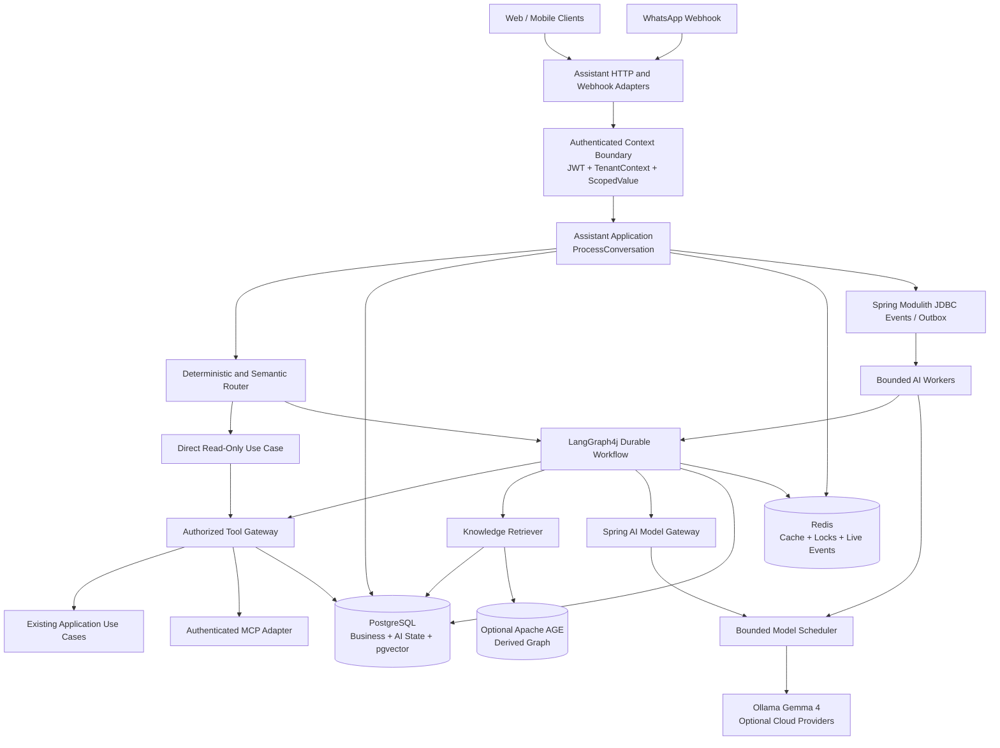
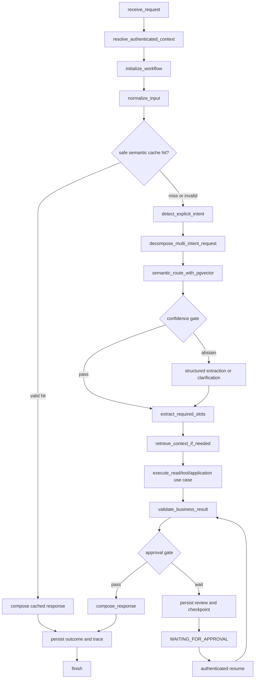
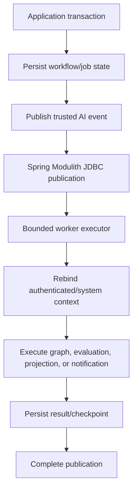
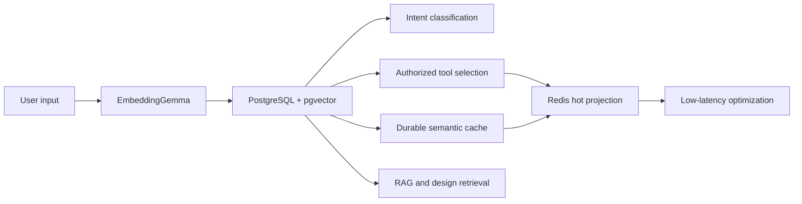
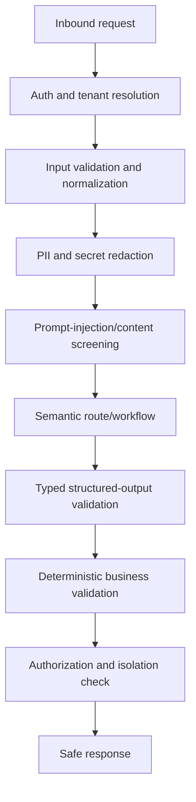
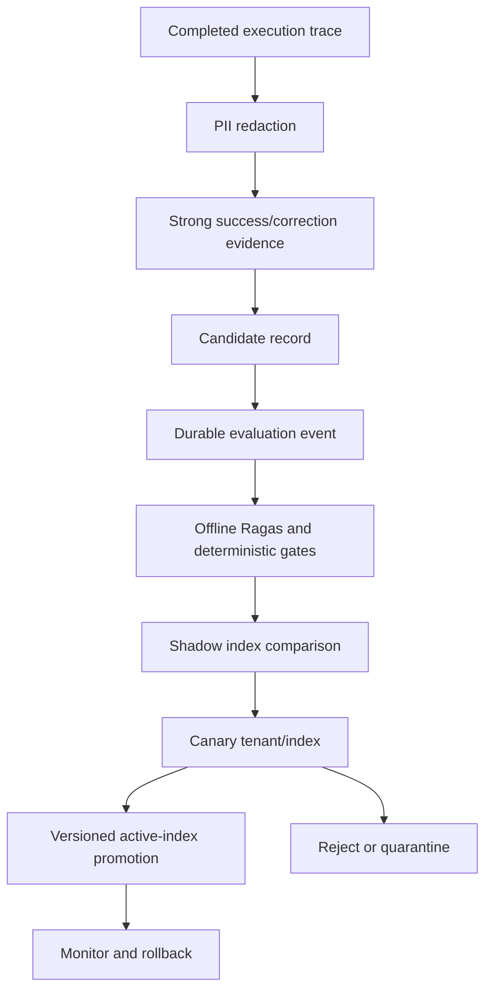

# Emme AI Platform Completion Design

| Field | Value |
|---|---|
| Date | 2026-08-29 |
| Repository | `emme-service` |
| Status | Approved for implementation planning |
| Scope | Complete the AI platform inside the existing Spring Boot modular monolith |
| Primary runtime | Java 25, Spring Boot, Spring Modulith |
| Durable store | PostgreSQL with pgvector |
| Operational store | Redis |
| Workflow engine | LangGraph4j, as the single workflow orchestrator |
| Model integration | Spring AI through provider-neutral Emme ports |

## 1. Purpose

This design closes the remaining gaps in the Emme AI foundation while keeping
the platform inside the `emme-service` deployable boundary. It turns the
existing semantic routing, provider, quote, HITL, Redis, tracing, and Apache
AGE foundations into a coherent production workflow platform without moving
business rules into prompts, graph nodes, tools, controllers, or retrieval
code.

The design uses a modular-monolith approach. Simple deterministic and
read-only requests take a low-latency direct path. Multi-step, mutating,
long-running, or human-reviewed requests use a persisted LangGraph4j
workflow. Durable asynchronous delivery uses the existing Spring Modulith
JDBC event publication boundary. Kafka remains an optional future transport,
not the initial model backpressure mechanism.

## 2. Repository findings and current baseline

The repository already contains:

- `libraries:ai-contracts` for framework-neutral AI contracts.
- `modules:ai-platform` for model-provider adapters, embedding adapters,
  bounded model admission, and learning lifecycle primitives.
- `modules:assistant` for Emme-specific AI composition, semantic routing,
  Spring AI advisors, controlled tools, quote extraction, HITL, Redis state,
  LangGraph4j quote workflow, and durable traces.
- Java 25 `ScopedValue` context propagation with a compatibility bridge for
  existing `ThreadLocal` and MDC tenant routing.
- Java 25 structured concurrency behind a stable Emme `ParallelTaskRunner`
  port with required, optional, and first-success Joiner policies.
- pgvector-backed semantic intent, tool, and response-cache adapters with
  model/version/dimension validation and tenant/principal filtering.
- An opt-in Redis Stack hot projection for semantic cache and progressive
  tool search.
- PostgreSQL quote artifacts, checkpoints, review tasks, optimistic locking,
  and secured staff review/resume behavior.
- Spring AI named provider chains, tenant-security and prompt-version
  advisors, structured nail-design extraction, and provider-neutral embedding
  and chat ports.
- Durable redacted model/tool traces, learning candidates, evaluation report
  persistence, and a Python 3.13 Ragas scaffold.
- An optional Apache AGE derived graph adapter with allowlisted graph
  contracts and curated tenant-scoped traversal.

The principal gaps are integration gaps rather than missing infrastructure:

1. The normal chat endpoint does not yet execute a generic persisted
   conversation workflow or bind requests to durable conversation history.
2. The quote use case has no complete inbound upload/start boundary and no
   assistant-owned image reader adapter wired to approved storage.
3. Appointment mutation use cases are not yet exposed through AI-safe,
   context-aware, idempotent tool handlers.
4. Long-running AI work lacks a complete durable job lifecycle, worker
   fairness policy, and live SSE/WebSocket recovery endpoint.
5. AGE projection lacks post-commit catalog/service events, replay, and
   freshness reconciliation.
6. Evaluation reports and candidate lifecycle exist, but the asynchronous
   evaluator transport, embedding/index build, shadow comparison, canary
   promotion, and rollback pointer are not complete.
7. Prompt-injection screening, output/egress guardrails, and an authenticated
   external MCP boundary are not complete.
8. OpenTelemetry agent deployment, complete AI dashboards/alerts, full-stack
   failure tests, and release evidence remain to be closed.

The active phase tracking remains in
[`docs/ai-platform/implementation-plan.md`](../../ai-platform/implementation-plan.md).

## 3. Goals

- Keep one `emme-service` deployable and preserve existing module boundaries.
- Reuse existing application use cases for prices, appointments, services,
  catalog, clients, policies, payments, and permissions.
- Use Spring AI as the model, embedding, structured-output, advisor, and tool
  integration layer.
- Use LangGraph4j as the only durable workflow orchestration layer.
- Make PostgreSQL authoritative for business, workflow, audit, and evaluation
  data.
- Use Redis only for temporary state, cache, locks, rate limiting, and live
  events.
- Make tenant and principal context backend-derived at every boundary.
- Keep model concurrency bounded for an Apple Silicon Mac Studio.
- Use semantic classification, semantic tool selection, and semantic caching
  before expensive LLM execution where policy permits.
- Support human review as a persisted workflow state, not a notification
  fallback.
- Make all production index and prompt improvement versioned, evaluated,
  canaried, observable, and reversible.
- Provide a testable path from web and WhatsApp requests to deterministic
  Emme application use cases.

## 4. Non-goals

- Creating a separate `emme-ai` deployable during this phase.
- Replacing PostgreSQL transactional data with a graph database or Redis.
- Allowing an LLM to select arbitrary tenants, permissions, SQL, or Cypher.
- Letting an LLM calculate prices, availability, payment values, or final
  business decisions.
- Replacing the existing appointment, catalog, service, or tenancy modules.
- Introducing a custom queue when Spring Modulith durable event publication
  and the existing bounded scheduler are sufficient.
- Replacing `ForkJoinPool` globally with a Java agent. Java agents are for
  JVM observability and diagnostics only.
- Calling Ragas synchronously in a customer request.

## 5. Selected architecture



### 5.1 Module responsibilities

| Boundary | Responsibility | Must not do |
|---|---|---|
| `libraries:kernel` | Context binding, tenant bridge, correlation, stable concurrency ports | Know Spring AI, LangGraph4j, or business policy |
| `libraries:ai-contracts` | Provider-neutral models, embeddings, routes, tools, workflow, RAG, graph, and learning contracts | Depend on Spring, LangGraph4j, or Emme application modules |
| `modules:ai-platform` | Provider adapters, embedding chains, model admission, reusable evaluation/lifecycle infrastructure | Depend on assistant use cases or own salon business rules |
| `modules:assistant` | Conversation orchestration, LangGraph4j graphs, advisors, semantic gateway, tools, quote/HITL, channels | Calculate business prices or bypass application use cases |
| Existing business modules | Authoritative tenant, service, catalog, appointment, client, policy, payment, and authorization use cases | Depend on prompts, LLM SDKs, or graph nodes |
| PostgreSQL | Durable source of truth, RLS, pgvector, workflow checkpoints, audit, outbox | Be bypassed for final business decisions |
| Redis | Hot projections, locks, rate limits, temporary state, live event streams | Be the only source of truth |
| Apache AGE | Optional derived relationship read model | Own transactions, prices, or unrestricted queries |

### 5.2 Direct versus graph execution

```text
simple deterministic read
    → semantic/deterministic route
    → direct application use case
    → deterministic response

simple safe semantic read
    → vector route
    → authorized read-only tool or tenant-scoped RAG
    → response

multi-step request, quote, mutation, approval, or long-running job
    → persisted LangGraph4j workflow
    → PostgreSQL checkpoint
    → confirmation/approval when required
```

All requests still pass through the authenticated context and policy boundary.
The direct path is an optimization, not a security bypass.

## 6. Context, tenancy, and concurrency

### 6.1 Context creation

The backend creates an immutable `AiExecutionContext` before any semantic,
model, graph, tool, or repository operation:

```text
validated JWT and backend tenant resolution
    → tenantId, principalId, roles
    → conversationId, workflowId, traceId, idempotencyKey
    → ScopedValue binding
    → ThreadLocal/MDC compatibility bridge
```

The following values are never accepted from an LLM:

```text
tenantId
principalId
roles
permissions
price
availability
appointment ownership
policy outcome
```

Worker events carry trusted workflow identifiers and correlation metadata. A
worker reloads durable records, verifies tenant ownership, binds
`TenantContextHolder`, `ScopedValue`, and MDC, and only then resumes work.

### 6.2 Structured concurrency

`ParallelTaskRunner` remains the stable application port. The Java 25
implementation uses `StructuredTaskScope` and explicit Joiners behind that
port. It is used for independent bounded reads such as quote context and
availability lookup. It is not a durable queue and must not be used to hold a
thread during HITL.

Virtual threads are appropriate for blocking I/O, but they do not remove the
need for capacity limits. A Java agent must not modify global executor
semantics.

### 6.3 Model admission

```text
AI job
  → bounded worker executor
  → global limit
  → provider limit
  → capability limit
  → tenant limit
  → user limit
  → bounded admission queue
  → model provider
```

The existing fair `BoundedModelExecutionScheduler` owns this policy. When
capacity is exhausted, synchronous requests fail safely or use an allowed
fallback; asynchronous work remains durably represented and retryable.

## 7. Generic workflow design

The generic graph is composed from capability subgraphs. The quote graph is
retained as the first specialized subgraph.



The graph exposes explicit terminal outcomes:

```text
SUCCESS
CLARIFICATION_REQUIRED
REJECTED
WAITING_FOR_APPROVAL
FAILED
```

Each graph node is an orchestration boundary only. It delegates business
behavior to application ports. Nodes do not query repositories, calculate
prices, authorize users, or construct unrestricted model tools.

### 7.1 Routing order

```text
explicit UI action
→ deterministic rule
→ pgvector semantic reference search
→ typed Spring AI extraction when required fields are missing
→ restricted fallback agent
→ clarification or HITL
```

The router records top-1 score, top-2 score, margin, required-slot
completeness, authorization eligibility, selected route, and index version.
Thresholds are configuration and dataset-calibrated; they are not universal
probability claims.

### 7.2 Multi-intent behavior

Deterministic decomposition handles known combinations first. A structured
Spring AI decomposer is used only when deterministic rules cannot confidently
split the request.

Each subtask contains:

```text
subtaskId
parentWorkflowId
tenantId from backend context
conversationId
intent
requiredSlots
dependencies
status
result reference
```

Independent read-only subtasks may run in parallel. Mutations are sequenced
after confirmation, authorization, and idempotency validation.

### 7.3 HITL pause/resume

```text
persist workflow transition
→ persist review task
→ publish durable notification
→ publish Redis live event
→ release worker/model capacity
→ staff approves or edits with optimistic version
→ rebind trusted context
→ resume checkpoint
```

The workflow does not keep a virtual thread, model request, or lock alive while
staff review is pending.

## 8. Quote and appointment integration

### 8.1 Quote entrypoint

Add an assistant inbound boundary that accepts an authenticated text/image
request, stores or references the image through the approved image-storage
port, creates conversation/workflow correlation, and invokes
`ProcessDesignQuoteUseCase`.

The image path is:

```text
authenticated upload
→ content-type and size validation
→ tenant-scoped object-storage key
→ image metadata persistence
→ DesignImageReader
→ structured extraction
→ deterministic quote calculator
→ quote draft or HITL review
```

The model can extract design attributes only. It cannot provide a final price.

### 8.2 Appointment mutation contracts

Existing appointment use cases remain authoritative, but AI adapters must not
call narrow methods that accept only an arbitrary appointment ID. Introduce or
adapt application commands so the application layer validates:

```text
tenant ownership
principal/customer ownership
role and permission
appointment state
policy eligibility
slot collision
confirmation token/state
idempotency key
```

The AI tool gateway invokes these application commands and records the result.
The tool layer contains no appointment rules.

Required AI tool capabilities are:

```text
findAvailability       read-only
createAppointment       mutation
rescheduleAppointment   mutation
cancelAppointment       mutation
```

Booking, cancellation, and rescheduling require confirmation and durable
idempotency. Payment operations remain outside the AI mutation scope until
their own application-safe contracts are available.

## 9. Persistence and asynchronous jobs

### 9.1 Durable records

PostgreSQL stores or extends the following records:

```text
conversation
conversation_message
ai_workflow_run
ai_workflow_checkpoint
ai_extraction_result
quote_draft
quote_review_task
quote_review_decision
ai_tool_call
ai_model_execution
knowledge_document
knowledge_chunk
knowledge_entity
recommendation
learning_candidate
learning_candidate_evaluation
```

Every AI record includes tenant and correlation data plus model, prompt,
embedding, or template versions where applicable.

### 9.2 Durable event boundary



Initial durable event types include:

```text
AiConversationRequested
AiQuoteRequested
AiQuoteReviewRequested
AiEvaluationRequested
AiGraphProjectionRequested
AiIndexPromotionRequested
```

Consumers are idempotent. Failed event handling remains retryable and is
observable through publication status and application metrics. A dead-letter
state or quarantine record is required before production enablement of each
long-running job type.

Kafka is a future external transport for the same event contracts. It is not
needed to protect the Mac Studio from model overload.

### 9.3 Redis responsibilities

```text
session:{userId}
ai:thread:{tenantId}:{conversationId}
ai:lock:{tenantId}:{conversationId}
quote:cache:{tenantId}:{inputHash}:{templateVersion}
rate:{tenantId}:{userId}
review:{tenantId}:{reviewTaskId}
stream:{tenantId}:{conversationId}:events
```

Workflow state is written to PostgreSQL before Redis live events are emitted.
Redis loss disables acceleration or live replay, not correctness.

## 10. Channels and recovery

### 10.1 Web

Add a workflow status/live-events endpoint backed by Redis Streams and
PostgreSQL recovery:

```text
POST request
→ return workflowId/conversationId
→ SSE or WebSocket subscription
→ replay from Last-Event-ID when available
→ reload PostgreSQL status when Redis events expired
```

Safe statuses include:

```text
RECEIVED
ANALYZING_INPUT
SEARCHING_KNOWLEDGE
CALCULATING_QUOTE
CHECKING_AVAILABILITY
WAITING_FOR_STAFF
WAITING_FOR_CONFIRMATION
COMPLETED
FAILED
```

Hidden model reasoning and token-level private reasoning are never streamed.

### 10.2 WhatsApp

The webhook acknowledges quickly. The durable event handler performs the
workflow asynchronously and sends one complete response only after the
workflow result is persisted. Duplicate webhook events are rejected through
the existing durable event claim/idempotency path.

## 11. Semantic search, RAG, and AGE

### 11.1 Embeddings

The initial local text embedding profile is:

```text
model: embeddinggemma:300m
dimension: 768
runtime: Ollama on Apple Silicon
```

The same model version is mandatory for index creation and query matching.
Dimension or model-version drift fails closed. `Gemma 4` is used for local
vision/chat extraction, not as a substitute for the embedding model.

### 11.2 Data-source rule

Structured transactional facts come from application use cases:

```text
prices
services
hours
availability
staff schedules
policies used in transactions
promotions
client history
```

RAG is limited to unstructured knowledge:

```text
FAQs
aftercare
service descriptions
manuals
brand tone
promotion explanations
unstructured policy guidance
```

Prices, appointments, permissions, and payment decisions never come from RAG.

### 11.3 Semantic capability storage



Redis hot hits are re-confirmed against PostgreSQL before returning a cached
response or using a tool candidate.

### 11.4 AGE

AGE is a derived relationship read model. The first curated traversal is:

```text
design
  → compatible service
  → required skill
  → qualified nail artist
  → applicable policy
```

The projection pipeline is:

```text
catalog/service transaction
→ post-commit domain event
→ tenant-scoped projector
→ AGE graph
→ fixed curated traversal
```

The graph name is derived from authenticated tenant context. Dynamic graph
names, unrestricted Cypher, and LLM-generated Cypher are forbidden. Stale or
unavailable AGE falls back to PostgreSQL and pgvector.

The implementation must add catalog/service event contracts, projection
replay, freshness metadata, and reconciliation from authoritative relational
data.

## 12. Guardrails and MCP

### 12.1 Guardrail pipeline



User input, retrieved documents, image captions, and external content are
untrusted data. They are delimited and cannot override system or policy
instructions. An optional local safety-model port may be enabled per tenant;
the baseline deterministic screening must remain available without a cloud
dependency.

### 12.2 Tool and MCP policy

Internal operations use:

```text
LangGraph node
→ AuthorizedAiToolGateway
→ application use case
→ domain rules
→ repository
```

External operations use an authenticated MCP client only when an external
system is actually required:

```text
LangGraph node
→ governed MCP client
→ authenticated MCP server
→ external system
```

Every call receives backend-created tenant, principal, role, workflow, trace,
and idempotency context. The LLM may supply validated business arguments but
cannot supply security context. Tool exposure is allowlisted by tenant,
principal, role, channel, intent, and risk policy.

## 13. Self-improvement and evaluation



Candidate content is redacted and stored in PostgreSQL. Online requests never
mutate production indexes. The missing implementation includes:

- a transport from durable candidate events to the Python evaluator
- asynchronous embedding and index-build workers
- versioned inactive/shadow indexes
- deterministic regression and safety gate ingestion
- canary tenant/index selection
- an active-index pointer and rollback pointer
- monitoring and audit records for promotion/rejection

Ragas remains advisory for retrieval and generation quality. It cannot replace
deterministic price, appointment, authorization, tenant-isolation, or duplicate
mutation tests.

## 14. Observability and security evidence

### 14.1 Traces and metrics

Trace hierarchy:

```text
request
  → workflow
    → router
    → embedding/vector search
    → model execution
    → tool execution
    → approval
    → result validation
```

Durable traces contain model/provider, prompt, embedding, route, retrieval,
tool, validation, latency, token, cost, and outcome metadata. Payloads are
redacted before persistence or evaluation.

Metrics use bounded dimensions such as workflow type, provider, model,
channel, intent, and outcome. Tenant-level billing and error views use
PostgreSQL trace data rather than unbounded tenant labels.

### 14.2 Required operational evidence

- OpenTelemetry Java agent attached in JVM deployment profiles.
- AI latency, admission, queue, workflow, HITL, cache, routing, provider,
  evaluation, and cross-tenant-violation dashboards.
- Alerts for unauthorized tools, cross-tenant retrieval, wrong-price results,
  duplicate bookings, provider fallback spikes, stuck workflows, event lag,
  dead-letter growth, index mismatch, Redis lock failures, and budget limits.
- PII-redacted logs and evaluation exports.
- Provider, vector, Redis, AGE, event publication, and checkpoint failure
  runbooks.

## 15. Testing and verification

### 15.1 Unit tests

- Quote rules and confidence gates.
- Appointment authorization and ownership.
- Tenant context and ScopedValue/ThreadLocal bridge.
- Semantic score, margin, slot, and cache policies.
- Tool authorization and idempotency.
- HITL transitions and optimistic locking.
- Scheduler limits, cancellation, deadlines, and Joiners.
- Guardrail and structured-output validation.

### 15.2 Integration tests

- PostgreSQL migrations, RLS, and workflow checkpoints.
- pgvector model/version/dimension checks and tenant filtering.
- Redis locks, TTLs, hot vector projections, and stream replay.
- AGE projection, fixed traversal, two-tenant isolation, and recovery.
- Spring AI structured output and provider fallback contracts.
- Spring Modulith durable event publication and idempotent consumers.
- MCP authentication, tool policy, and failure contracts.
- Outbox/result ordering and notification persistence.

### 15.3 End-to-end tests

```text
FAQ
availability
booking with confirmation
ambiguous booking
high-confidence design quote
HITL design quote
quote plus booking
wrong-tenant access
duplicate booking
model timeout
MCP failure
worker restart and workflow resume
Redis outage
AGE outage
```

Normal tests use mock or local providers. Paid providers run only in explicit
credentialed contract environments.

### 15.4 Release verification

```text
Java 25 preflight
→ formatting and compilation
→ unit tests
→ architecture and Modulith checks
→ PostgreSQL/Redis/AGE integration tests
→ security and tenant-isolation tests
→ workflow restart/failure tests
→ E2E tests
→ evaluation regression gates
→ deployment smoke tests
→ rollback verification
```

Known repository-wide failures must remain separately tracked from AI changes:
existing Modulith/layer-placement violations, unrelated Markdown validation
errors, and host-specific Java 17 hook behavior must not be silently attributed
to this design.

## 16. Phased implementation plan

### Phase 1 — Generic conversation and quote entrypoint

- Introduce durable conversation-aware AI request contracts.
- Add generic graph composition and terminal states.
- Connect `/api/ai/chat` to durable conversation history.
- Add authenticated quote submission/image-storage boundary.
- Preserve the existing quote subgraph and review endpoint.

### Phase 2 — Appointment mutations

- Add AI-safe application command contracts.
- Add create/reschedule/cancel tool handlers.
- Add authorization, ownership, confirmation, and idempotency tests.
- Add multi-intent quote-plus-availability-plus-booking flow.

### Phase 3 — Durable jobs and live recovery

- Add durable AI event/job contracts and bounded worker execution.
- Add retry, quarantine/dead-letter, fairness, and queue metrics.
- Add SSE/WebSocket status and Redis replay/PostgreSQL recovery.
- Complete WhatsApp graph integration.

### Phase 4 — RAG and AGE lifecycle

- Complete document ingestion/versioning and tenant-filtered retrieval.
- Add catalog/service post-commit events.
- Add AGE projector, replay, freshness, and reconciliation.
- Add deterministic hybrid retrieval evaluation.

### Phase 5 — Evaluation and promotion

- Connect durable traces to the asynchronous evaluator.
- Build versioned embedding/index artifacts.
- Add shadow, canary, active pointer, rollback, and audit workflow.
- Add regression promotion gates.

### Phase 6 — Guardrails, MCP, and production readiness

- Add input/output guardrail ports and screening.
- Add authenticated external MCP client boundary.
- Complete OpenTelemetry agent deployment, dashboards, and alerts.
- Complete E2E, security, deployment, native-image, and recovery evidence.

Each phase is feature-gated, independently tested, and reversible. No phase
removes existing functionality without a separate migration decision.

## 17. Risks and mitigations

| Risk | Mitigation |
|---|---|
| Mac Studio model overload | Existing fair bounded scheduler, bounded workers, per-tenant limits, admission timeout |
| Cross-tenant data exposure | Backend-derived context, RLS, tenant-filtered queries, two-tenant tests, no model-controlled tenant |
| Duplicate booking | Application-level idempotency, durable result replay, reconciliation before retry |
| Stale AGE graph | Derived-only design, freshness metadata, replay/reconciliation, PostgreSQL fallback |
| False semantic route/cache hit | Score/margin gates, dependency versions, durable confirmation, abstention |
| Prompt injection | Untrusted-content boundary, deterministic screening, restricted tools, output validation |
| Evaluation poisoning | Redaction, strong evidence, offline regression, shadow/canary, rollback |
| Event consumer failure | Spring Modulith durable publication, idempotent consumers, retry/quarantine, metrics |
| High-cardinality telemetry | Bounded metric dimensions; tenant details remain in durable traces |
| Preview API instability | Stable Emme concurrency ports isolate Java 25 preview APIs |
| Scope growth | Six feature-gated phases and no second deployable until scaling evidence exists |

## 18. Completion criteria

The design is considered implemented only when:

- Generic chat, quote, HITL, and appointment workflows are reachable through
  authenticated inbound boundaries.
- All mutating AI tools delegate to application use cases with authorization,
  confirmation, tenant ownership, audit, and idempotency.
- PostgreSQL is authoritative for every durable business and workflow result.
- Redis failure does not lose business, quote, approval, or workflow truth.
- Model concurrency remains bounded under tenant contention.
- Workflow pause/resume survives worker restart.
- Semantic routing and caching abstain safely on low confidence or stale data.
- AGE and RAG are tenant-scoped and never authoritative for transactions.
- Evaluation and promotion are asynchronous, versioned, canaried, and
  reversible.
- Guardrails, traces, dashboards, alerts, and security evidence are present.
- Unit, integration, E2E, architecture, formatting, compilation, and release
  verification results are recorded.
