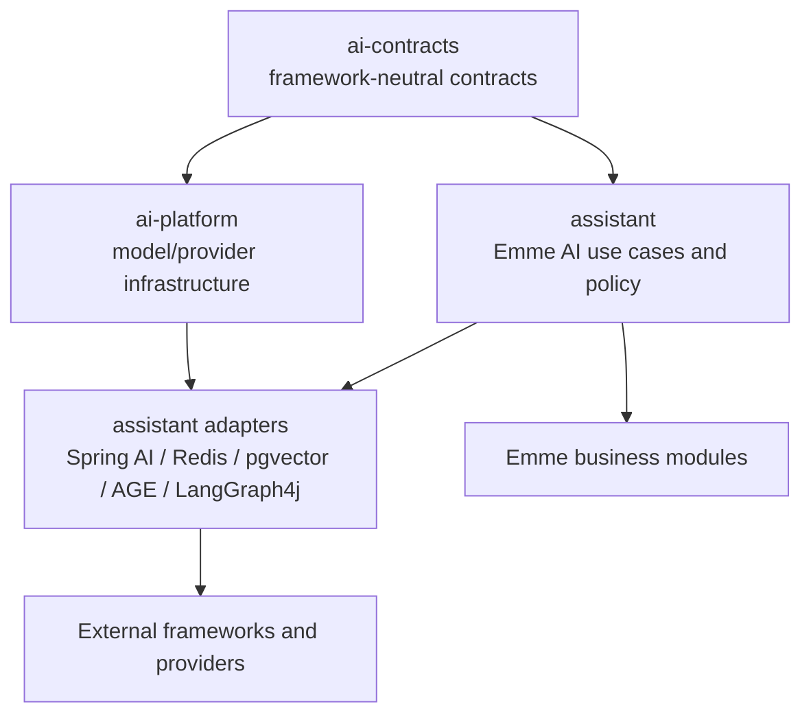

# AI Contracts Simplification Design

**Date:** 2026-09-01  
**Status:** Approved for implementation planning  
**Scope:** Consolidation of duplicate AI contracts and clearer names

## Goal

Reduce duplicate abstractions across `ai-contracts`, `ai-platform`, and `assistant` while preserving behavior, tenant isolation, authorization, and dependency inversion.

The shared contracts library remains framework-neutral. Spring AI, Redis, PostgreSQL, Apache AGE, and LangGraph4j stay behind adapters and configuration.

## Target dependency direction



## Canonical contracts

```text
ChatModel
EmbeddingModel
DesignExtractor
KnowledgeSearch
GraphSearch
GraphProjectionWriter
ToolGateway
WorkflowRuntime
SemanticCache
```

Contracts contain only stable records, enums, value objects, exceptions, and interfaces. They must not import Spring AI, Redis, JDBC, LangGraph4j, AGE, or web framework types.

## Migration matrix

### RAG

| Current | Action | Target |
|---|---|---|
| `ai-contracts.rag.KnowledgeRetriever` | Delete after caller verification | — |
| `assistant.application.port.out.KnowledgeRetrievalPort` | Move and rename | `ai-contracts.rag.KnowledgeSearch` |
| `assistant.application.port.out.KnowledgeDocument` | Merge value type | `ai-contracts.rag.RetrievedDocument` |
| `DocumentKnowledgeRetrievalAdapter` | Rename | `SpringAiKnowledgeSearch` |
| `TenantScopedDocumentRetriever` | Keep as Spring AI detail | No public contract |
| `RagAnswerProviderChain` | Simplify if only fallback composition | `RagAnswerService` or direct service composition |
| `RagQueryService` | Keep | Depends on `KnowledgeSearch` |

Target flow:

```text
RagQueryService -> KnowledgeSearch -> SpringAiKnowledgeSearch -> Spring AI VectorStore
```

### Graph

| Current | Action | Target |
|---|---|---|
| `KnowledgeGraphRetriever` | Rename | `GraphSearch` |
| `KnowledgeGraphProjector` | Rename | `GraphProjectionWriter` |
| `AgeGraphAdapter` | Rename | `ApacheAgeGraphAdapter` |
| `AgeGraphClient` | Keep package-private or inline | Infrastructure detail |
| `JdbcAgeGraphClient` | Keep | JDBC infrastructure detail |

The graph read and projection interfaces remain separate. The adapter may implement both because the adapter is infrastructure, not the application contract.

### Tools

| Current | Action | Target |
|---|---|---|
| Shared `ToolGateway` | Keep canonical | `ai-contracts.tool.ToolGateway` |
| Assistant `AiToolGateway` | Remove duplicate interface | Consumers use shared gateway |
| `AuthorizedAiToolGateway` | Rename | `AuthorizedToolGateway` |
| Assistant `AiToolDefinition` | Merge with shared definition | `ai-contracts.tool.ToolDefinition` |
| Assistant `AiToolExecutionContext` | Merge with shared context | `ai-contracts.tool.ToolExecutionContext` |
| Assistant `AiToolInvocation` | Merge with shared request | `ai-contracts.tool.ToolExecutionRequest` |
| Assistant `AiToolResult` | Merge with shared result | `ai-contracts.tool.ToolResult` |
| `SemanticProactiveToolRouter` | Rename | `SemanticToolRouter` |
| `SpringAiToolCallbackProvider` | Keep | Adapter to `ToolGateway` |

### Chat

| Current | Action | Target |
|---|---|---|
| `ai-contracts.model.ChatCompletionPort` | Rename | `ChatModel` |
| Assistant `ChatCompletionPort` | Delete duplicate | Use shared `ChatModel` |
| `IdentifiedChatCompletionPort` | Keep temporarily | Provider-selection detail |
| `ChatProviderChain` | Simplify and rename | `ChatModelSelector` |
| `TracingChatCompletionPort` | Keep only if framework tracing is insufficient | `ObservedChatModel` |
| `SpringAiChatClientAdapter` | Rename | `SpringAiChatModel` |
| `ChatService` | Keep | Depends on model or selector |

### Extraction

| Current | Action | Target |
|---|---|---|
| `NailDesignExtractionPort` | Rename | `DesignExtractor` |
| `SpringAiNailDesignExtractor` | Rename | `SpringAiDesignExtractor` |
| `NailDesignFeatures` | Keep | Stable structured contract |

## Unchanged contracts

The following remain stable during this refactoring:

```text
WorkflowRuntime
SemanticCache and semantic dependency contracts
AiJobRequest and job contracts
Tenant/context contracts
Image contracts
Learning candidate contracts
NailDesignFeatures and controlled vocabularies
```

## Migration rules

1. Add or rename the canonical contract first.
2. Migrate one capability's callers.
3. Add or update focused tests before deleting anything.
4. Run module compilation, focused tests, architecture tests, and formatting.
5. Delete the old contract only when `rg` and compilation show no callers.
6. Do not change runtime behavior, authorization, tenant resolution, cache policy, or workflow semantics.
7. Preserve compatibility adapters only for the duration of migration.

## Commit sequence

```text
1. RAG contract consolidation
2. Graph contract consolidation
3. Tool contract consolidation
4. Chat contract consolidation
5. Extraction contract rename
6. Remove unused contracts and enforce architecture rules
```

## Acceptance criteria

- Each capability has one canonical application-facing contract.
- No assistant application service depends on Spring AI, Redis, JDBC, AGE, or LangGraph4j types.
- No duplicate RAG, tool, graph, or chat gateway interfaces remain after migration.
- Internal Emme tools still delegate to application use cases.
- Tenant and authorization behavior is unchanged.
- Existing focused tests remain green.
- Architecture tests prevent reintroducing duplicate framework-specific application ports.
- All changes are committed in small logical commits and pushed.
