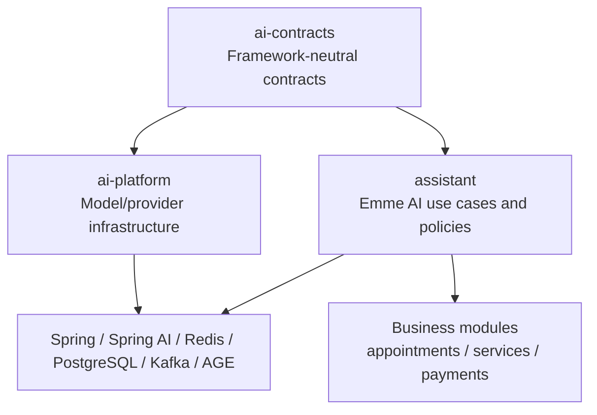
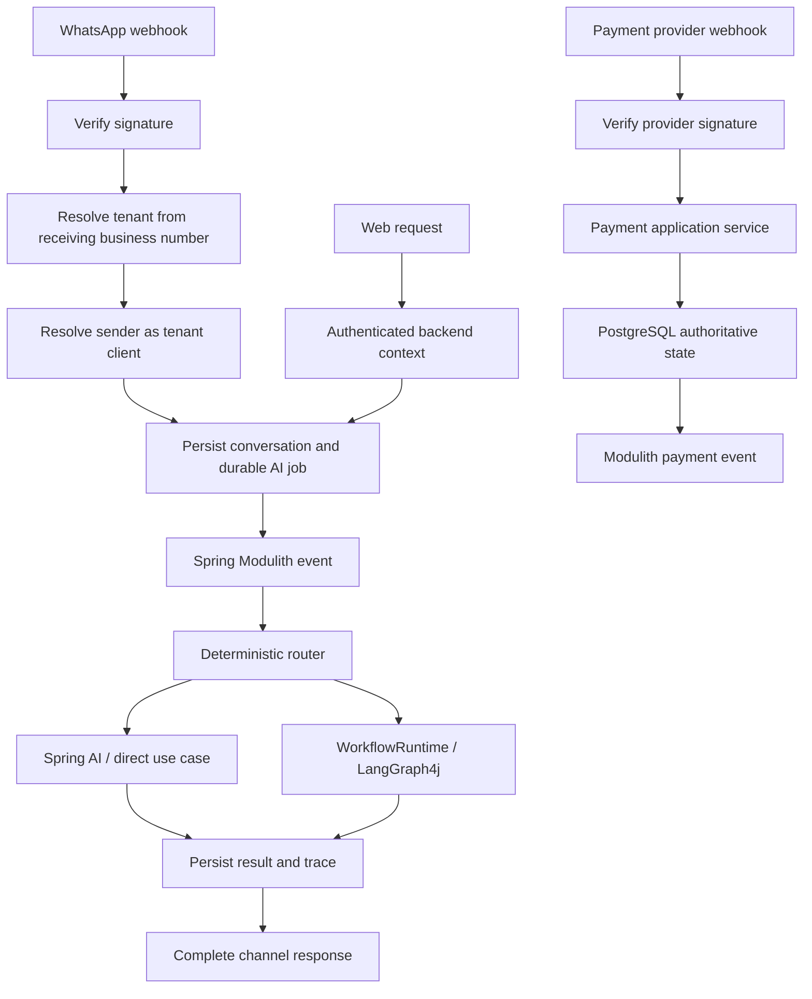
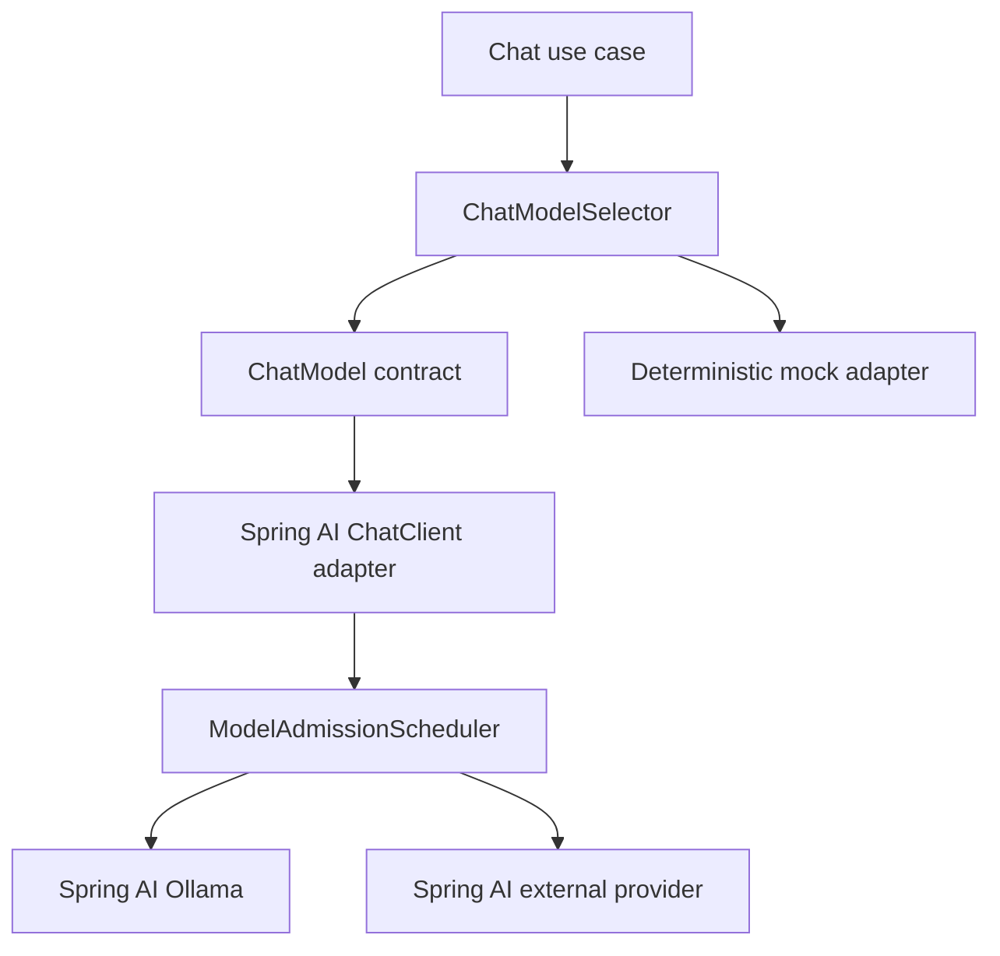

# Emme AI Platform Simplification Blueprint

**Date:** 2026-09-01  
**Status:** Complete design; approved for implementation planning

This document consolidates the assistant channel/payment design and AI contract simplification design. It is the source of truth for reducing custom code by delegating capabilities to frameworks already present in the repository.

References:

- [Assistant channels and payments](./2026-09-01-assistant-channels-and-payments-design.md)
- [AI contracts simplification](./2026-09-01-ai-contracts-simplification-design.md)
- [Spring Modulith and Kafka ADR](../../adr/0005-spring-modulith-kafka-event-streaming.md)

## Guiding rule

```text
Existing framework capability -> configure and delegate
Emme business/security policy -> keep in application/domain code
Framework translation -> keep in one adapter
Duplicate abstraction -> merge after caller migration
Unproven capability -> defer
```

## Target architecture



## Technology decisions

| Technology | Delegate to it | Keep custom | Do not duplicate |
|---|---|---|---|
| Spring Boot | DI, configuration, web, validation, actuator | Emme composition and policy | Service locators |
| Spring AI | ChatClient, structured output, embeddings, advisors, RAG, vector store, MCP client, observations | Tenant/security policy and deterministic validation | Forwarding provider wrappers |
| Spring Modulith | Internal events and AI job events | Event contracts and durable job state | Internal queue abstraction |
| Kafka | Cross-service, replayable, high-volume event boundaries | Event schemas | Every chat message or model token |
| Redis | Cache, temporary state, locks, rate limits, live events | Key conventions and safety policy | Durable conversations/workflows |
| PostgreSQL/JDBC | Durable state, RLS, jobs, checkpoints, traces, audits | Emme repositories and SQL | Redis-only truth |
| pgvector/VectorStore | Durable intent, tool, knowledge, and design search | Tenant filters and abstention policy | Additional vector database |
| Apache AGE | Optional curated relationship queries | Tenant-scoped query selection | Prices, availability, unrestricted Cypher |
| Spring Security | JWT authentication and roles | Tenant resolution and capability lookup | Client/LLM-supplied identity |
| LangGraph4j | Complex durable workflows, loops, HITL, checkpoints | Workflow policy and application decisions | Graph orchestration for simple requests |
| Micrometer/OpenTelemetry | Metrics, traces, observations | AI-specific fields and business outcomes | Duplicate tracing wrappers |
| ShedLock | Scheduled coordination | Job policy | Transactional job claiming |
| Testcontainers/ArchUnit | Integration and boundary verification | Emme scenario tests | Custom framework fakes where unnecessary |
| Ragas | Offline/asynchronous evaluation | Dataset governance | Synchronous customer evaluation |

## Messaging policy

```text
Inside emme-service -> Spring Modulith events
Durable AI job truth -> PostgreSQL
Temporary state/live updates -> Redis
Cross-service durable streaming -> Kafka
Mac Studio capacity -> model admission boundary, not Kafka
```

## Channel and payment policy



Payment webhooks do not enter the LLM pipeline to determine payment state. Assistant payment tools call payment application use cases and use persisted quote/order amounts.

## Canonical application boundaries

```text
ChatModel
EmbeddingModel
DesignExtractor
KnowledgeSearch
GraphSearch
GraphProjectionWriter
SemanticRouter
SemanticCache
ToolGateway
WorkflowRuntime
AiTraceRecorder
```

Each capability should have one application-facing contract. Spring AI, Redis, JDBC, AGE, and LangGraph4j types remain in adapters/configuration.

## Module responsibilities

### ai-contracts

Stable records, enums, exceptions, and framework-neutral ports. No Spring, Redis, database, graph, or workflow-library dependencies.

### ai-platform

Model providers, embedding providers, provider selection, model admission, shared observations, learning, and evaluation infrastructure. No salon business rules.

### assistant

Conversation processing, semantic routing, tool authorization, quotes, RAG use cases, optional graph recommendations, WhatsApp orchestration, and assistant-facing payment/appointment commands.

### Learning and evaluation boundary

Learning candidates are durable PostgreSQL records and remain `PENDING_EVALUATION`
until an offline evaluator supplies a versioned report. Submission persists the
candidate first and then emits the existing tenant-partitioned, externalized
Spring Modulith event; the customer interaction never runs evaluation or
promotion inline. The evaluation worker requires the durable evaluation store,
applies reports only under the backend AI context, and stops at `APPROVED`.
Promotion remains a separate, explicitly governed lifecycle operation with
regression, shadow, and canary gates. No learning-specific executor, queue, or
scheduler is introduced; existing durable event publication and application job
coordination remain the infrastructure boundaries.

### Business modules

Appointments, services, clients, staffing, catalog, subscriptions, payments, notifications, tenancy, identity, and audit remain authoritative.

## Simplification categories

Every existing AI class will be classified as:

```text
KEEP       required boundary or business policy
DELEGATE   use an existing framework capability
MERGE      combine duplicate contracts/services
MOVE       place in the correct module/package
RENAME     clarify one responsibility
DELETE     remove after caller and test verification
DEFER      optional capability not used by a current use case
```

## Review order

```text
1. ai-contracts
2. ai-platform
3. assistant application services
4. Spring AI clients and advisors
5. semantic routing/cache
6. RAG and pgvector
7. Apache AGE graph
8. LangGraph4j workflows
9. WhatsApp and payment adapters
10. tenant context and authorization
11. Java 25 concurrency and model admission
12. observability and evaluation
13. persistence and migrations
14. tests and architecture rules
15. safe deletion sequence
```

Each section is designed and approved before implementation work begins for that section.

## Acceptance criteria

- Framework capabilities are preferred over custom replacements.
- Modulith is the default internal event mechanism; Kafka is used only at justified boundaries.
- Redis is limited to temporary/cache/coordination/live-event responsibilities.
- PostgreSQL is authoritative for durable business and AI state.
- pgvector is the single durable vector store.
- AGE is optional and recommendation-focused.
- Spring AI owns model and RAG mechanics.
- LangGraph4j owns only complex durable workflows.
- Internal Emme tools call application use cases directly.
- MCP is reserved for external or independently deployable tools.
- Tenant isolation, authorization, idempotency, audit, and observability remain intact.

## 7. ai-platform provider simplification

The current `AiModelProvider` combines chat, embeddings, intent routing, and mock behavior. These are separate capabilities and must not be coupled in provider transport classes.

Target responsibilities:

```text
ChatModel                  chat completion only
EmbeddingModel             embedding only
IntentRouter               deterministic/semantic routing in assistant
ModelAdmissionScheduler    model capacity and bounded admission
ChatModelSelector          ordered primary/fallback policy
```

`routeIntent()` must leave provider implementations. Intent routing belongs to `assistant` and follows deterministic rules, pgvector semantic classification, structured extraction, and only then LLM fallback.

Spring AI owns supported model transport, structured output, tool calling, embeddings, and provider observations. Ollama should use the Spring AI Ollama integration. OpenAI-compatible providers such as Groq should use the Spring AI compatible integration where supported. The deterministic mock remains as a test adapter and must not emulate an HTTP provider.



Migration order:

```text
1. Separate routeIntent responsibility from provider transport.
2. Introduce canonical ChatModel and EmbeddingModel adapters.
3. Configure Spring AI Ollama.
4. Configure external fallback through Spring AI.
5. Keep the deterministic mock adapter.
6. Migrate ChatProviderChain to ChatModelSelector.
7. Migrate EmbeddingProviderChain.
8. Remove raw OkHttp provider implementations after integration tests.
9. Remove tracing wrappers only when Spring observations cover required fields.
10. Rename model admission classes last.
```

No raw provider implementation is deleted until callers, configuration, focused tests, and provider integration tests confirm that Spring AI is the active replacement.

## 8. Spring AI clients and advisors

Spring AI owns transport-level model mechanics: chat completion, structured output,
tool calling, embeddings, advisor composition, observations, and supported provider
integrations. Emme adapters translate those capabilities once into the framework-neutral
contracts in `ai-contracts`.

Application services retain prompt-version selection, tenant policy, authorization,
deadline propagation, deterministic validation, and provider fallback policy. Advisors
may enrich a request with tenant-scoped retrieval or prompt context, but may not derive
identity from user or model content. The composition root wires named providers and
qualified capability ports; no service locators or provider-specific branching is
allowed in assistant use cases.

## 9. Semantic routing and cache

Routing follows a bounded sequence: deterministic rules, authorized pgvector semantic
classification, structured extraction, then LLM fallback. Fallback is permitted only
for explicit provider-unavailable failures; authorization, invalid-vector, persistence,
and policy failures remain visible and fail closed.

Semantic cache lookup requires the authenticated tenant/principal context, matching
embedding model identity and dimension, top-1 threshold, top-1/top-2 margin, active
eligibility, and safety revalidation. PostgreSQL stores the authoritative entry and hit
accounting. Redis is an optional expiring projection for latency and live invalidation;
projection failures return a safe miss. Tenant, principal, model, prompt, and dependency
versions are part of the cache identity. Durable dependency invalidation is published
through the existing Modulith boundary and is idempotent.

## 10. RAG, pgvector, and Apache AGE

Indexing and retrieval use one explicit embedding model/version/dimension identity.
Spring AI provides document and vector mechanics through the existing typed ports, while
the assistant owns tenant filters, authorization, abstention thresholds, and grounding
requirements. Empty or failed retrieval must not silently invoke an ungrounded customer
response; the use case returns a bounded unavailable response or an explicit failure
according to the operation contract.

pgvector is the single durable vector store. Apache AGE remains optional and recommendation
focused: graph projections are tenant-scoped, curated, fixed-query operations. Prices,
availability, payment state, and other authoritative transactional facts are read from
their business application services, never inferred from graph or vector results.

## 11. LangGraph4j workflows

LangGraph4j is reserved for durable workflows that have loops, interruption, human-in-the-
loop review, or checkpointed resumption. Quote extraction and staff review are the first
such workflow. The graph state contains typed, non-sensitive references and versioned
workflow decisions; PostgreSQL checkpoints persist the next resumable node under the
authenticated backend tenant context.

Simple chat, retrieval, and read-only tool requests remain direct application service
calls. Resume operations verify workflow correlation, tenant, actor role, optimistic
version, and idempotency before mutating state. A failed resume leaves the prior durable
state intact and produces an actionable bounded error.

## 12. WhatsApp and payment adapters

Inbound WhatsApp requests first verify the provider signature, resolve the tenant from
the receiving business number, resolve the sender as a tenant client, and persist the
conversation plus durable AI job. Existing durable Modulith publication handles
asynchronous delivery and retry. The worker reconstructs trusted tenant, database,
correlation, and AI execution context before invoking assistant services; duplicate
delivery is absorbed by idempotency.

Payment webhooks independently verify provider signatures and call the payment
application service. PostgreSQL payment/order/quote state is authoritative. Assistant
payment tools invoke payment use cases with persisted amounts and never allow an LLM to
choose payment state, amount, settlement, or authorization outcomes. Webhook retries are
idempotent and auditable.

## 13. Tenant context and authorization

Every AI boundary requires a backend-derived `AiExecutionContext` containing tenant,
principal, roles/capabilities, correlation, and operation metadata. Caller-supplied
tenant IDs, model claims, and identity fields are treated as untrusted input and cannot
override the bound context.

Authorization is enforced before tool execution, retrieval, cache reuse, graph access,
workflow resume, and durable mutation. Tenant-aware JDBC boundaries apply the authenticated
tenant to RLS/session routing. Missing, conflicting, or unresolvable tenant/database
context fails closed. Audit and trace records use bounded metadata and redact secrets,
PII, image bytes, vectors, and payment credentials.

## 14. Java 25 concurrency, admission, observability, and evaluation

Model calls pass through bounded global, model, tenant, and principal admission with
deadline-aware fairness. Virtual threads are used for blocking AI I/O; structured
concurrency is used only where cancellation and failure semantics are explicit. No
unbounded executor, per-request scheduler, or Kafka-based local work queue is introduced.

Micrometer/OpenTelemetry provide bounded counters, timers, traces, provider-attempt
outcomes, token/cost fields, scores, margins, fallback reasons, and invalidation results.
Tenant and principal identifiers are excluded from metric labels. Trace persistence is
best effort for customer-facing semantics but must remain tenant-isolated and retry-safe.

Learning candidates are evidence-gated durable records in `PENDING_EVALUATION`. Offline
Python 3.13 Ragas evaluation produces versioned reports and gate evidence asynchronously.
Workers apply reports only under backend AI context and stop at `APPROVED`; promotion is
a separate governed operation requiring regression, shadow, and canary evidence.

## 15. Persistence, architecture tests, and safe deletion

PostgreSQL remains authoritative for business state, durable AI jobs, idempotency claims,
checkpoints, traces, semantic references, cache entries, and evaluation evidence.
Redis remains limited to cache, temporary state, locks, and live status. Kafka is reserved
for externalized, cross-service, replayable boundaries; internal events use Modulith.

Migrations must provide tenant isolation/RLS, idempotency keys, lifecycle constraints,
indexes matching access paths, and rollback-aware compatibility for existing rows.
Contract, integration, architecture, and focused application tests verify event schemas,
module dependencies, provider selection, tenant isolation, retries, cache invalidation,
workflow pause/resume, and webhook signatures.

Deletion is the final phase. For each duplicate provider, wrapper, queue, or abstraction:

1. identify every caller, configuration path, and test;
2. migrate callers to the canonical contract;
3. prove the replacement is active with focused and integration tests;
4. remove dead configuration and imports;
5. run architecture and full regression checks;
6. delete only after the previous steps pass.

## Implementation and validation contract

Implementation will proceed in small vertical slices with a failing test before each
behavioral change. Existing dirty changes are classified before modification and are not
discarded. Each slice must preserve the framework-neutral contract boundaries and the
authoritative-store rules above.

Final validation is intentionally consolidated after implementation: formatting and
lint checks, compilation, focused unit tests, module architecture tests, migration
contracts, Testcontainers integration tests, provider-offline behavior, startup checks,
webhook/API checks, and the complete regression suite. Known baseline failures must be
recorded separately from regressions introduced by this blueprint.
