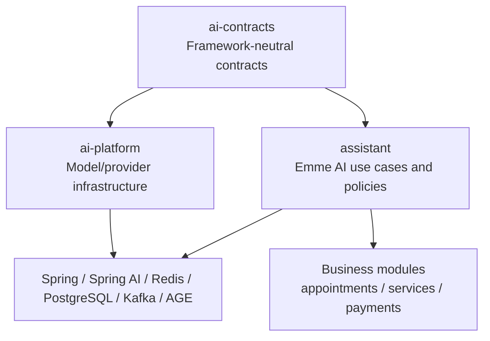
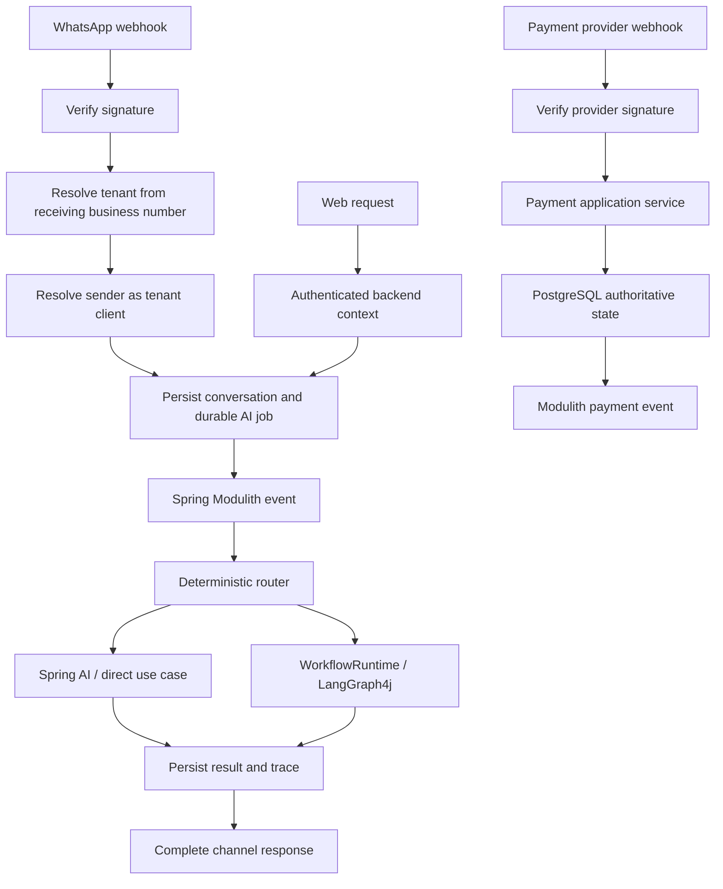
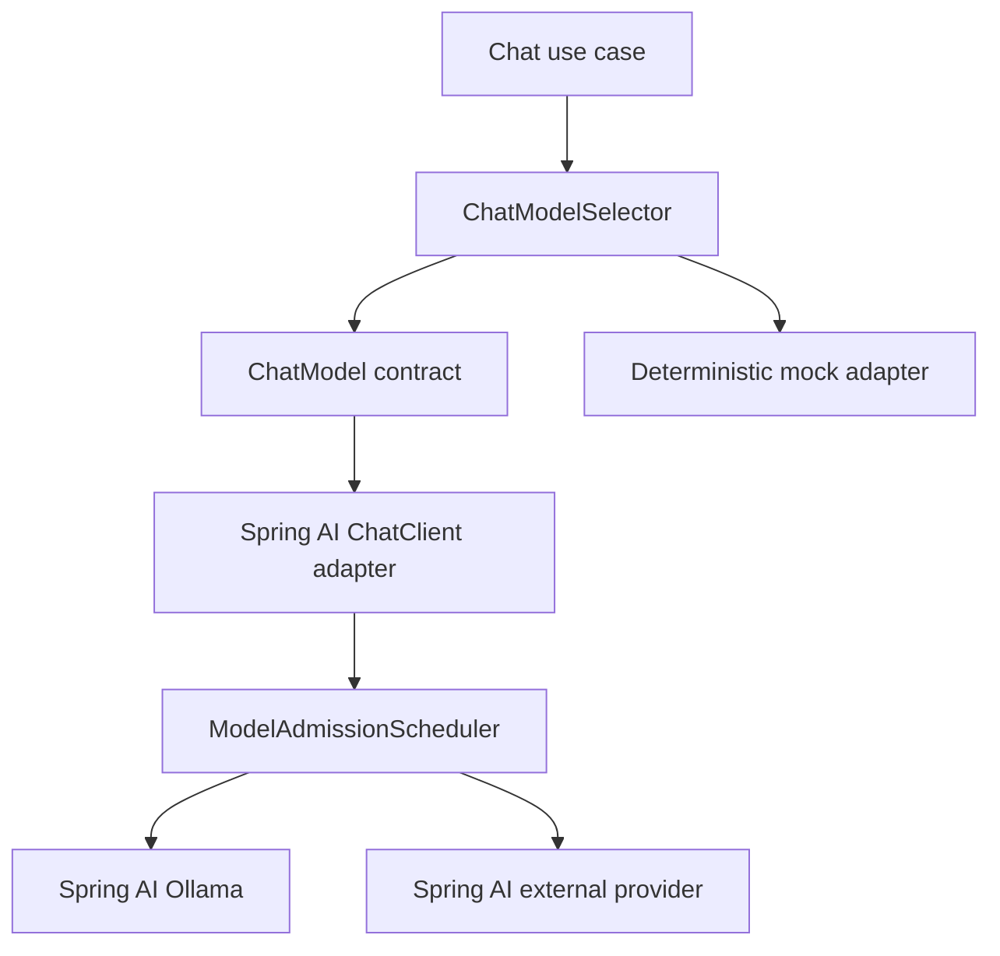

# Emme AI Platform Simplification Blueprint

**Date:** 2026-09-01  
**Status:** Approved for section-by-section review

This document consolidates the assistant channel/payment design and AI contract simplification design. It is the source of truth for reducing custom code by delegating capabilities to frameworks already present in the repository.

References:

- [Assistant channels and payments](./2026-09-01-assistant-channels-and-payments-design.md)
- [AI contracts simplification](./2026-09-01-ai-contracts-simplification-design.md)
- [Spring Modulith and Kafka ADR](../../adr/0005-spring-modulith-kafka-event-streaming.md)

## Guiding rule

```text
Existing framework capability -> configure and delegate
Emme business/security policy -> keep in application/domain code
Framework translation -> keep in one adapter
Duplicate abstraction -> merge after caller migration
Unproven capability -> defer
```

## Target architecture



## Technology decisions

| Technology | Delegate to it | Keep custom | Do not duplicate |
|---|---|---|---|
| Spring Boot | DI, configuration, web, validation, actuator | Emme composition and policy | Service locators |
| Spring AI | ChatClient, structured output, embeddings, advisors, RAG, vector store, MCP client, observations | Tenant/security policy and deterministic validation | Forwarding provider wrappers |
| Spring Modulith | Internal events and AI job events | Event contracts and durable job state | Internal queue abstraction |
| Kafka | Cross-service, replayable, high-volume event boundaries | Event schemas | Every chat message or model token |
| Redis | Cache, temporary state, locks, rate limits, live events | Key conventions and safety policy | Durable conversations/workflows |
| PostgreSQL/JDBC | Durable state, RLS, jobs, checkpoints, traces, audits | Emme repositories and SQL | Redis-only truth |
| pgvector/VectorStore | Durable intent, tool, knowledge, and design search | Tenant filters and abstention policy | Additional vector database |
| Apache AGE | Optional curated relationship queries | Tenant-scoped query selection | Prices, availability, unrestricted Cypher |
| Spring Security | JWT authentication and roles | Tenant resolution and capability lookup | Client/LLM-supplied identity |
| LangGraph4j | Complex durable workflows, loops, HITL, checkpoints | Workflow policy and application decisions | Graph orchestration for simple requests |
| Micrometer/OpenTelemetry | Metrics, traces, observations | AI-specific fields and business outcomes | Duplicate tracing wrappers |
| ShedLock | Scheduled coordination | Job policy | Transactional job claiming |
| Testcontainers/ArchUnit | Integration and boundary verification | Emme scenario tests | Custom framework fakes where unnecessary |
| Ragas | Offline/asynchronous evaluation | Dataset governance | Synchronous customer evaluation |

## Messaging policy

```text
Inside emme-service -> Spring Modulith events
Durable AI job truth -> PostgreSQL
Temporary state/live updates -> Redis
Cross-service durable streaming -> Kafka
Mac Studio capacity -> model admission boundary, not Kafka
```

## Channel and payment policy



Payment webhooks do not enter the LLM pipeline to determine payment state. Assistant payment tools call payment application use cases and use persisted quote/order amounts.

## Canonical application boundaries

```text
ChatModel
EmbeddingModel
DesignExtractor
KnowledgeSearch
GraphSearch
GraphProjectionWriter
SemanticRouter
SemanticCache
ToolGateway
WorkflowRuntime
AiTraceRecorder
```

Each capability should have one application-facing contract. Spring AI, Redis, JDBC, AGE, and LangGraph4j types remain in adapters/configuration.

## Module responsibilities

### ai-contracts

Stable records, enums, exceptions, and framework-neutral ports. No Spring, Redis, database, graph, or workflow-library dependencies.

### ai-platform

Model providers, embedding providers, provider selection, model admission, shared observations, learning, and evaluation infrastructure. No salon business rules.

### assistant

Conversation processing, semantic routing, tool authorization, quotes, RAG use cases, optional graph recommendations, WhatsApp orchestration, and assistant-facing payment/appointment commands.

### Business modules

Appointments, services, clients, staffing, catalog, subscriptions, payments, notifications, tenancy, identity, and audit remain authoritative.

## Simplification categories

Every existing AI class will be classified as:

```text
KEEP       required boundary or business policy
DELEGATE   use an existing framework capability
MERGE      combine duplicate contracts/services
MOVE       place in the correct module/package
RENAME     clarify one responsibility
DELETE     remove after caller and test verification
DEFER      optional capability not used by a current use case
```

## Review order

```text
1. ai-contracts
2. ai-platform
3. assistant application services
4. Spring AI clients and advisors
5. semantic routing/cache
6. RAG and pgvector
7. Apache AGE graph
8. LangGraph4j workflows
9. WhatsApp and payment adapters
10. tenant context and authorization
11. Java 25 concurrency and model admission
12. observability and evaluation
13. persistence and migrations
14. tests and architecture rules
15. safe deletion sequence
```

Each section is designed and approved before implementation work begins for that section.

## Acceptance criteria

- Framework capabilities are preferred over custom replacements.
- Modulith is the default internal event mechanism; Kafka is used only at justified boundaries.
- Redis is limited to temporary/cache/coordination/live-event responsibilities.
- PostgreSQL is authoritative for durable business and AI state.
- pgvector is the single durable vector store.
- AGE is optional and recommendation-focused.
- Spring AI owns model and RAG mechanics.
- LangGraph4j owns only complex durable workflows.
- Internal Emme tools call application use cases directly.
- MCP is reserved for external or independently deployable tools.
- Tenant isolation, authorization, idempotency, audit, and observability remain intact.

## 7. ai-platform provider simplification

The current `AiModelProvider` combines chat, embeddings, intent routing, and mock behavior. These are separate capabilities and must not be coupled in provider transport classes.

Target responsibilities:

```text
ChatModel                  chat completion only
EmbeddingModel             embedding only
IntentRouter               deterministic/semantic routing in assistant
ModelAdmissionScheduler    model capacity and bounded admission
ChatModelSelector          ordered primary/fallback policy
```

`routeIntent()` must leave provider implementations. Intent routing belongs to `assistant` and follows deterministic rules, pgvector semantic classification, structured extraction, and only then LLM fallback.

Spring AI owns supported model transport, structured output, tool calling, embeddings, and provider observations. Ollama should use the Spring AI Ollama integration. OpenAI-compatible providers such as Groq should use the Spring AI compatible integration where supported. The deterministic mock remains as a test adapter and must not emulate an HTTP provider.



Migration order:

```text
1. Separate routeIntent responsibility from provider transport.
2. Introduce canonical ChatModel and EmbeddingModel adapters.
3. Configure Spring AI Ollama.
4. Configure external fallback through Spring AI.
5. Keep the deterministic mock adapter.
6. Migrate ChatProviderChain to ChatModelSelector.
7. Migrate EmbeddingProviderChain.
8. Remove raw OkHttp provider implementations after integration tests.
9. Remove tracing wrappers only when Spring observations cover required fields.
10. Rename model admission classes last.
```

No raw provider implementation is deleted until callers, configuration, focused tests, and provider integration tests confirm that Spring AI is the active replacement.
