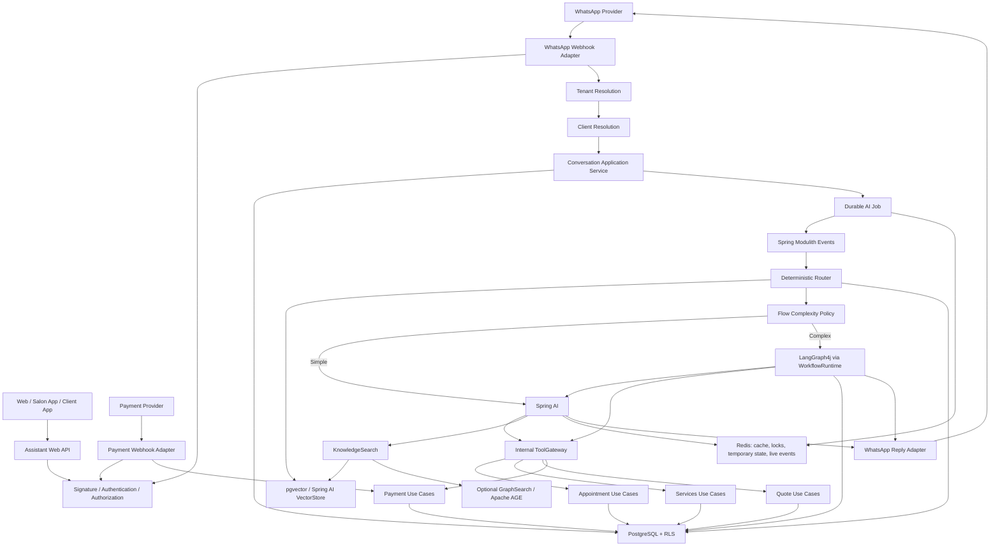
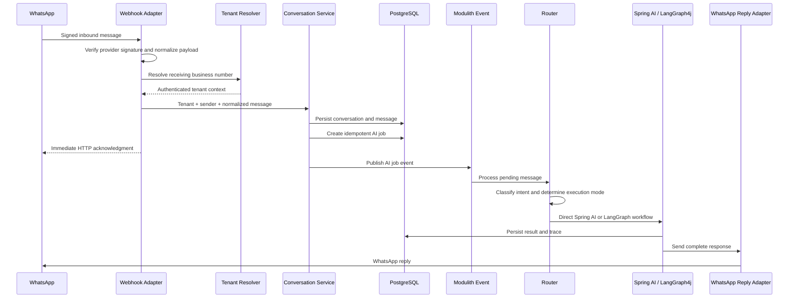
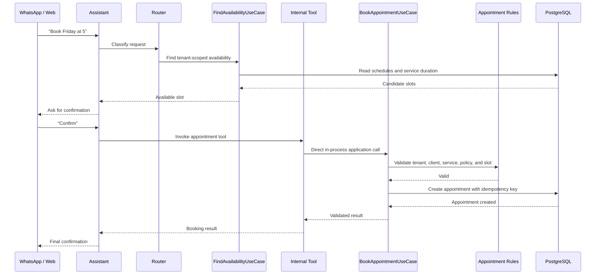
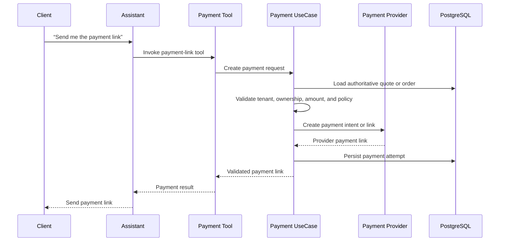
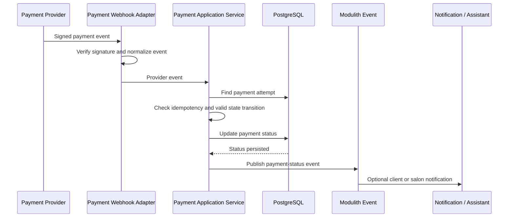

# Assistant Channels and Payments Design

**Date:** 2026-09-01  
**Status:** Approved design  
**Scope:** WhatsApp inbound messages, assistant processing, internal tools, and payment webhooks

## 1. Purpose

This document defines how web requests, WhatsApp messages, payment-provider webhooks, Spring AI, LangGraph4j, Redis, and PostgreSQL work together in the Emme assistant. The design keeps the existing modular architecture and delegates infrastructure behavior to the frameworks already present in the repository.

The assistant may interpret requests and invoke authorized tools. Emme application services and domain rules remain authoritative for tenant access, prices, availability, appointments, payment amounts, and payment state.

## 2. Core distinction: tool versus MCP tool

A tool is a capability exposed to the assistant. An MCP tool is a tool exposed through the Model Context Protocol, normally across a process or service boundary.

Emme-owned operations use in-process Spring AI tool callbacks:

```text
Spring AI tool callback
    -> Emme ToolGateway
        -> application use case
            -> domain rules
                -> PostgreSQL
```

MCP is reserved for external or independently deployable capabilities. Internal appointment, service, quote, and payment operations do not need an MCP network hop.

## 3. High-level architecture



## 4. WhatsApp inbound messages

The receiving WhatsApp business number identifies the salon tenant. The sender phone number identifies a client only after lookup inside that tenant.

```text
WhatsApp business number -> tenant/business-account mapping -> tenant context
Sender phone number      -> client profile within tenant
```

Neither tenant identity nor client identity may come from message text, request fields controlled by the client, or model output.

### Inbound flow



WhatsApp processing is asynchronous. The webhook must acknowledge quickly and must not wait for model execution. WhatsApp receives complete messages, not token-by-token streaming.

Required protections:

- Verify the provider signature and webhook verification challenge.
- Normalize provider payloads before application processing.
- Deduplicate provider message IDs.
- Resolve tenant from the verified receiving number.
- Resolve client by sender number within the tenant.
- Persist the inbound message before publishing work.
- Retry safe delivery operations with bounded backoff.
- Persist the workflow result before sending the final reply.
- Record failed delivery for retry or dead-letter handling.

## 5. Direct tools and appointment operations

Appointment and service capabilities remain assistant tools. They are simply internal tools rather than MCP tools.



The tool callback does not calculate availability or create records. It delegates to the application use case, which delegates to domain rules and repositories.

Every mutating tool requires:

```text
authenticated execution context
tenant from backend context
user/client identity from backend context
role and capability authorization
validated arguments
idempotency key
audit event
```

## 6. Payment operations

Payment-provider webhooks are authoritative events and must not be routed through the LLM. The assistant may request a payment action, but the payment module owns the transaction.

The assistant may:

- Explain payment options.
- Request a payment link through the payment use case.
- Read an authorized payment status.
- Send a validated payment link through WhatsApp or web.

The assistant may not calculate payment amounts, mark payments as paid, authorize refunds, or trust payment status stated by a client or model.

### Payment-link request



Payment-link creation is a mutation and must use the payment module's authorization and idempotency rules. The payment amount must come from the persisted quote/order, never from the tool arguments alone.

### Payment-provider webhook



The provider event is processed directly by the payment application service. Spring AI may later explain the persisted result, but it does not decide the result.

## 7. Execution-mode selection

The backend selects direct execution or LangGraph4j from intent metadata and deterministic flow rules.

```text
WORKFLOW when:
  approval or pause/resume is required
  restart recovery is required
  dependent business steps exceed one
  a multi-stage mutation sequence is required
  a loop/retry state is part of the business flow

DIRECT otherwise
```

Examples:

```text
“Do you offer gel removal?”
  -> direct Spring AI/RAG response

“What appointments are available Friday?”
  -> direct availability use case

“Analyze this image and quote it.”
  -> direct path when confidence is high

“Analyze this image, ask an artist to review it, then send the quote.”
  -> LangGraph4j workflow

“Quote this design and book Friday after I confirm.”
  -> LangGraph4j workflow
```

LangGraph4j is hidden behind the application-level `WorkflowRuntime` port. Spring AI remains responsible for model calls, structured output, retrieval, and tool callbacks.

## 8. Data ownership

```text
PostgreSQL:
  conversations, messages, AI jobs, checkpoints, quotes, appointments,
  payments, payment attempts, traces, audits, and final workflow results

Redis:
  short-lived state, locks, rate limits, semantic hot cache, and live events

pgvector:
  intent examples, tool descriptions, knowledge chunks, and design search data

Apache AGE:
  optional curated relationship queries for recommendations
```

Redis is never the only source of truth for a conversation, payment, appointment, quote, or approval.

## 9. Failure and recovery behavior

| Failure | Required behavior |
|---|---|
| Invalid WhatsApp signature | Reject request; do not create a message or job |
| Unknown receiving WhatsApp number | Reject or quarantine; never guess a tenant |
| Duplicate WhatsApp message | Return acknowledgment without creating duplicate work |
| Model timeout | Persist retryable job failure and retry within the configured limit |
| LangGraph restart | Reload checkpoint and durable workflow state from PostgreSQL |
| Tool authorization failure | Stop execution and return a safe refusal |
| Appointment conflict | Return validated conflict; never retry blindly |
| Payment provider timeout | Keep payment attempt pending or retry only when provider operation is idempotent |
| Duplicate payment webhook | Return success without repeating the state transition |
| Invalid payment state transition | Reject and audit the event |
| WhatsApp delivery failure | Persist delivery failure for bounded retry/dead-letter handling |
| Redis unavailable | Continue with durable paths where safe; do not treat Redis as authoritative |
| PostgreSQL unavailable | Fail the durable operation; do not claim success to the client |

## 10. Observability

Correlate every request and asynchronous operation with:

```text
traceId
tenantId
conversationId
workflowId
aiJobId
providerEventId
idempotencyKey
```

Record model latency, token usage, tool calls, workflow transitions, cache decisions, payment transitions, webhook delivery outcomes, and tenant-level failures. Never log raw payment credentials, access tokens, or unnecessary personal data.

## 11. Simplification rules

- Use existing Spring Modulith events for internal AI jobs.
- Use existing PostgreSQL job state and claiming rather than adding another queue abstraction.
- Use Spring AI tool callbacks for internal Emme tools.
- Use MCP only for external or independently deployable tools.
- Use Spring AI `VectorStore` for pgvector retrieval.
- Use one application `KnowledgeSearch` port and one optional `GraphSearch` port.
- Use one `WorkflowRuntime` port hiding LangGraph4j.
- Keep payment and appointment authority in their existing application modules.
- Add adapters only where they translate between a framework and an application port.
- Remove duplicate abstractions only after callers migrate and tests prove they are unused.

## 12. Design acceptance criteria

- WhatsApp tenant resolution is based on the verified receiving business number.
- WhatsApp messages are persisted and acknowledged before asynchronous AI processing.
- Payment provider webhooks update payment state without LLM involvement.
- Internal appointment, service, quote, and payment operations can be exposed as Spring AI tools.
- Internal tools delegate to application use cases rather than repositories.
- Complex workflows use LangGraph4j through `WorkflowRuntime`.
- Simple requests bypass LangGraph4j.
- PostgreSQL remains authoritative for all durable business state.
- Redis is limited to temporary/cache/coordination/live-event responsibilities.
- Every mutation has authorization, idempotency, validation, and audit behavior.
- Mermaid diagrams accurately represent the implemented boundaries and data flow.
