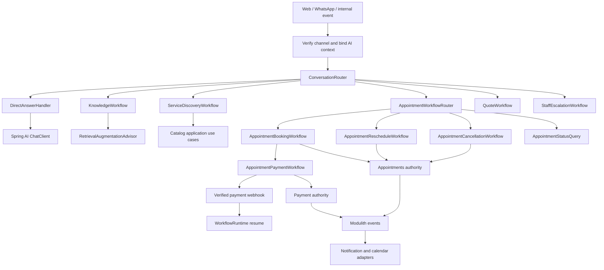

# Emme Durable Conversational Workflows Design

| Field | Detail |
|---|---|
| **Date** | 2026-09-04 |
| **Status** | Ready for user review |
| **Scope** | Durable customer conversations, appointment lifecycle, payment-dependent booking, and enterprise Spring AI/LangGraph4j boundaries |
| **Primary module** | `modules/assistant` |
| **Authoritative modules** | `appointments`, `payment`, `services`, `clients`, `notification`, `calendar`, `tenancy`, `identity` |

## 1. Decision summary

Emme will use a tiered hybrid architecture:

```text
Spring AI capabilities
  + deterministic application router
  + typed LangGraph4j workflow subgraphs
  + authoritative Emme application services
```

Spring AI owns model transport, structured extraction, bounded tool calling, RAG,
embeddings, moderation, and native observations. LangGraph4j owns durable state,
conditional workflow transitions, interruptions, checkpointed resumption, and
workflow-level recovery. Emme application services remain the only authority for
tenant policy, authorization, availability, appointments, payments, refunds, and
notifications.

The system will not use a free-form agent swarm for business mutations. Models may
classify, extract, retrieve, and compose. They may not decide that an appointment,
payment, refund, or cancellation is authorized or successful.

The default payment-dependent booking policy is hold-first:

```text
available slot -> appointment hold -> payment link -> verified payment
  -> revalidate hold -> confirmed appointment
```

The hold is a separate domain/application concept. The existing confirmed
appointment aggregate is not used as an unconfirmed payment placeholder.

## 2. Goals

- Support service discovery, price and policy questions, availability, booking,
  rescheduling, cancellation, status, payment links, payment callbacks, refunds,
  calendar synchronization, notification, design quotes, and staff escalation.
- Keep simple requests on a low-latency direct Spring AI path.
- Make consequential conversations durable across application restarts and delayed
  customer or provider responses.
- Control every graph node's model, tools, memory, timeout, and interruption policy.
- Keep tenant identity and authorization backend-derived and fail closed.
- Use typed contracts between the router, workflows, tools, and business modules.
- Preserve an implementation seam for a future workflow engine without changing
  assistant business contracts.

## 3. Non-goals

- Allowing an LLM to directly mutate appointments or payment state.
- Replacing application services with graph nodes containing business rules.
- Making LangGraph4j the source of truth for appointments, payments, or refunds.
- Persisting payment credentials, provider secrets, image bytes, or unrestricted
  conversation payloads in graph checkpoints.
- Adding Temporal, Camunda, or another external workflow engine in this phase.
- Adding `langgraph4j-spring-ai` without a concrete adapter use case and compatibility
  evidence.

## 4. Architecture alternatives

| Alternative | Benefits | Costs and risks | Decision |
|---|---|---|---|
| Spring AI direct `ChatClient` with tools | Minimal code, low latency, native RAG and tool calling | Does not provide durable confirmation, payment waiting, or workflow recovery without a second custom state machine | Use for direct and read-only paths |
| One LangGraph4j ReAct agent | Checkpoints and flexible tool selection | Model controls too much, mutation auditing is difficult, graph becomes a large opaque state machine | Use only for bounded read-only exploration, if needed |
| LLM supervisor with peer agents | Flexible delegation and natural-language specialization | Extra model calls, cost, latency, nondeterministic routes, shared-state and authorization risks | Do not use for core business flows |
| Code router with typed workflow subgraphs | Explicit routing, durable pauses, isolated testing, incremental evolution, strong security boundary | More contracts, graph-state mapping, and versioning work | **Recommended** |
| External durable workflow engine plus LangGraph4j AI nodes | Strong long-running timers, operations UI, cross-service orchestration, language-independent workflows | New infrastructure, operational cost, duplicate state and workflow concepts | Future option behind `WorkflowRuntime`; not current scope |

The recommended option keeps the direct path fast while applying durable orchestration
only where a customer interaction crosses turns, waits for staff or a payment provider,
or performs a consequential mutation.

## 5. Runtime topology



`ConversationRouter` is an application service, not an LLM supervisor. It returns a
typed route and confidence decision. A route that requires durability is then given to
the selected compiled LangGraph4j subgraph through `WorkflowRuntime`.

## 6. Routing policy

Routing follows a fail-closed sequence:

1. Explicit deterministic commands and pending-action responses.
2. Structured Spring AI intent and slot extraction.
3. Authorized pgvector semantic classification.
4. Bounded model fallback only for provider-unavailable semantic classification.
5. Clarification when confidence, authorization, or required slots are insufficient.

Candidate routes include:

```text
DIRECT_ANSWER
SERVICE_DISCOVERY
AVAILABILITY_LOOKUP
BOOK_APPOINTMENT
RESCHEDULE_APPOINTMENT
CANCEL_APPOINTMENT
APPOINTMENT_STATUS
PAYMENT_STATUS
QUOTE_DESIGN
MULTI_INTENT
STAFF_ESCALATION
UNSUPPORTED
```

Confirmation, rejection, clarification, payment callbacks, and staff decisions are
resolved from trusted workflow context before any model fallback.

## 7. Spring AI responsibilities

### 7.1 Model profiles

The logical model roles are:

| Role | Required | Responsibility |
|---|---:|---|
| `routeModel` | Yes | Intent, route, and multi-intent classification at low temperature |
| `answerModel` | Yes | Grounded response composition, proposal wording, and complex reasoning |
| `embeddingModel` | Yes | Semantic route, RAG, semantic cache, and optional tool index |
| `visionModel` | Optional | Nail-design image feature extraction |
| `transcriptionModel` | Optional | Voice-note transcription |
| `moderationModel` | Optional | Input/output safety classification |

The baseline deployment uses two chat profiles and one embedding model. The optional
vision and transcription roles may reuse a provider's multimodal services, but they do
not create additional workflow agents. A query transformer reuses `routeModel` or
`answerModel`; it does not require a third general-purpose chat model.

Spring AI's `ChatClient` supports multiple model clients and recommends preserving the
configured builder/customizer path when composing clients. The implementation will use
named model profiles behind `ChatModelSelector`, not provider-specific branching in
assistant use cases.

### 7.2 Tool control

Spring AI owns the bounded tool-call loop. Emme owns eligibility and authorization.

Tools are classified as:

```text
READ_ONLY       safe lookup; may be model-visible
CONFIRMATION    proposes a consequential operation; never mutates
MUTATION        changes business state; invoked by an authorized workflow node
STAFF_ONLY      requires staff role and durable approval
EXTERNAL        remote/MCP capability; explicit allow-list required
```

Each model-facing node receives a `NodeProfile` containing:

```text
nodeId
modelRole
allowedToolKeys
memoryPolicy
maxToolCalls
timeout
mayInterrupt
requiredApproval
```

The node receives a filtered `AuthorizedAiToolGateway`, never the complete registry.
The gateway applies tenant, principal, role, operation, and confirmation policy before
executing a tool. Mutation nodes call application use-case ports directly or use the
existing authorized mutation gateway after the graph has recorded confirmation.

`ToolSearchToolCallingAdvisor` is allowed only for read-only tool discovery when the
tool catalog becomes large. Its session key must be server-derived from tenant and
conversation context. Resolution fallback remains disabled for mutation tools.

Tool-call limits, timeout behavior, exception handling, and partial tool results are
recorded in the workflow trace. Spring AI provides configurable per-tool and total
tool-call limits that will be set explicitly rather than relying on unreviewed defaults.

### 7.3 RAG composition

Spring AI's modular RAG building blocks are used instead of custom generic names:

| Need | Component |
|---|---|
| Follow-up query compression | `CompressionQueryTransformer` |
| Query rewrite | `RewriteQueryTransformer` |
| Language normalization | `TranslationQueryTransformer` when required |
| Query expansion | `MultiQueryExpander` for complex knowledge requests |
| Retrieval | `DocumentRetriever` / tenant-scoped vector retriever |
| Aggregation | `DocumentJoiner` |
| Reranking and deduplication | `DocumentPostProcessor` |
| Context injection | `ContextualQueryAugmenter` |
| Complete flow | `RetrievalAugmentationAdvisor` |

`KnowledgeRoute` selects whether the request needs policy, FAQ, design, or other
tenant knowledge. It is application policy and may be implemented as a conditional
workflow edge; Spring AI does not become the owner of business routing.

Prices, appointment availability, payment state, refund eligibility, and permissions
are never sourced from RAG.

## 8. Node, assistant, tool, and memory control

### 8.1 State layers

```text
TurnContext
  short-lived current input, deadline, correlation, and extracted candidates

ConversationMemory
  bounded prompt history and customer-visible conversation context

WorkflowState
  durable, versioned, minimal state required to resume a business workflow

TenantKnowledge
  tenant-scoped indexed documents and derived retrieval context

NodeScratch
  private transient computation; not persisted unless explicitly promoted
```

Spring AI `ChatMemory` is a bounded prompt-context mechanism, not the authoritative
conversation history or workflow state. Complete conversation events remain in Emme's
PostgreSQL history. LangGraph4j checkpoints persist only the versioned workflow state.

### 8.2 Memory policies

Each `NodeProfile` selects one explicit memory policy:

```text
NONE                  no prior memory
TURN                  current user turn only
CONVERSATION_WINDOW   bounded relevant conversation window
WORKFLOW              selected durable workflow fields
TENANT_KNOWLEDGE      authorized retrieval context only
```

Nodes cannot request arbitrary memory at runtime. A node receives a projection containing
only the fields required by its contract. Payment credentials, provider signatures,
secrets, raw image bytes, and unrestricted PII are never model-visible or checkpointed.

### 8.3 Typed node boundary

The production abstraction is conceptually:

```text
NodeProfile
NodeContext<VisibleState>
NodeResult<StatePatch>
WorkflowNode<VisibleState, StatePatch>
```

The implementation may map these types to LangGraph4j `AgentState` and serialized state
maps at the adapter boundary, but application code does not pass unbounded maps between
business nodes. Every state patch is validated, namespaced, bounded, and JSON-safe.

## 9. Durable appointment workflows

### 9.1 Booking

```text
receive request
  → extract service, customer, date, preferred time, artist
  → validate trusted customer and service references
  → fan out availability, booking policy, and payment policy
  → join deterministic results
  → propose exact slot and price
  → interrupt for explicit customer confirmation
  → create AppointmentHold when payment is required
  → create normalized PaymentLink
  → interrupt with WAITING_FOR_PAYMENT
  → resume from verified provider webhook
  → verify payment and hold ownership
  → revalidate slot and policy
  → create confirmed appointment through appointments use case
  → publish notification and calendar events
```

Without prepayment, the payment branch is skipped, but confirmation remains mandatory.

### 9.2 Rescheduling

```text
load owned appointment
  → validate reschedule policy
  → extract and validate target slot
  → fan out availability, policy, and price-difference calculation
  → propose new schedule and financial effect
  → interrupt for confirmation
  → execute authorized reschedule
  → initiate additional payment or refund when policy requires
  → notify and update calendar
```

### 9.3 Cancellation

```text
load owned appointment
  → evaluate cancellation deadline and refund policy
  → inspect linked payment state
  → propose cancellation and refund/forfeiture result
  → interrupt for confirmation
  → execute authorized cancellation
  → initiate refund if eligible
  → await provider result when asynchronous
  → notify and unsync calendar
```

The appointment and payment modules remain authoritative. The workflow is a process
manager and recovery boundary, not a replacement aggregate.

## 10. Payment hold and saga design

The current appointment model creates confirmed appointments and the current payment
result needs a canonical checkout-link and business-correlation contract. The design
adds:

```text
AppointmentHold
PaymentLink
PaymentBusinessReference
PaymentPolicy
PaymentWorkflowEvent
```

The normalized payment result contains:

```text
paymentId
businessReference
amount
currency
checkoutUrl
status
expiresAt
```

Payment operations are idempotent by tenant, business reference, provider, and operation
key. A failed post-payment appointment confirmation triggers a deterministic recovery
path: revalidate the hold, offer an alternative slot, or initiate a governed refund.
The model does not choose among those outcomes; policy and application services do.

## 11. LangGraph4j enterprise patterns

### Subgraphs

Use compiled subgraphs with explicit input/output mappings for booking, rescheduling,
cancellation, payment, quote, and staff review. Shared-state subgraphs are restricted
to tightly coupled internal nodes because they increase key collision and migration
risk.

### Interruptions

Use dynamic interruptions for customer confirmation, staff approval, and payment waits.
Static breakpoints are reserved for tests and operational inspection. Every interruption
requires a persistent checkpoint and carries a bounded, customer-safe pending-action
projection.

### Checkpoints and threads

Every durable workflow uses a tenant-aware PostgreSQL checkpoint boundary. The thread ID
is derived from the workflow ID and optional bounded subgraph namespace. State contains
workflow version, graph version, policy version, and correlation identifiers so old
checkpoints can be migrated or rejected safely.

### Parallel fan-out/fan-in

Parallel branches are used only for independent reads:

```text
availability + booking policy + payment policy → join
knowledge retrievers → document joiner → post-process
appointment + refund policy + payment history → join
```

No payment capture, booking, cancellation, refund, or hold creation runs in parallel.
The executor is bounded, cancellation-aware, and owned by the application composition
root.

### Retry, timeout, and cancellation

Retries are classified by operation:

```text
retry: model transport, vector read, availability read, provider status read
do not retry blindly: book, cancel, reschedule, capture, refund, create hold
```

Mutation retry requires idempotency and a known previous outcome. Timeouts produce an
explicit durable failure or waiting state. Graph cancellation is propagated to active
read-only branches, but external payment effects require compensation rather than
thread interruption.

### Event-driven resume

Verified payment callbacks and staff decisions resume the workflow by workflow ID and
business correlation. The resume adapter reconstructs the trusted AI context and checks
tenant, principal, role, workflow version, pending action, and idempotency before calling
LangGraph4j.

### Observability and replay

Each workflow records route, node, model role, tool key, wait state, attempt, duration,
outcome, and redacted error category. Checkpoint history is available for support and
incident diagnosis, but replay never re-executes a non-idempotent mutation without an
explicit idempotency check.

The repository is currently pinned to LangGraph4j `1.8.25`. Any 1.9 upgrade, including
new `GraphInput`, checkpoint tag, subgraph saver, or interruption/error APIs, is a
separate compatibility task. The implementation must not depend on undocumented
version-specific behavior.

## 12. Module and class changes

| Area | Planned responsibility and clear names |
|---|---|
| `ai-contracts` | `ConversationRoute`, `WorkflowResumeEvent`, `PaymentLink`, `AppointmentHold`, and framework-neutral result contracts |
| `assistant` router | `ConversationRouter`, `RouteDecision`, `KnowledgeRoute` |
| `assistant` runtime | `WorkflowRuntime`, `WorkflowCheckpointStore`, `WorkflowResumeService` |
| `assistant` workflows | `AppointmentBookingWorkflow`, `AppointmentRescheduleWorkflow`, `AppointmentCancellationWorkflow`, `AppointmentPaymentWorkflow` |
| `assistant` node policy | `NodeProfile`, `NodeMemoryPolicy`, `NodeToolPolicy`, `NodeContext` |
| `assistant` tools | `AuthorizedAiToolGateway`, read-only tool adapters, mutation workflow adapters |
| `assistant` RAG | `KnowledgeRetriever`, `KnowledgeAnswerService`, Spring AI RAG adapter |
| `appointments` | `AppointmentHoldService`, hold repository/expiry policy, authorized lifecycle contracts |
| `payment` | `PaymentLinkService`, business-reference correlation, webhook resume event, refund/retry policy |
| `notification` | Payment-link, pending-action, booking, cancellation, and refund notifications |
| `calendar` | Confirmed-appointment sync and cancellation/reschedule reconciliation |
| `database` | Holds, workflow correlation, payment references, expiry, idempotency, and indexes |

Existing classes are renamed or removed only after caller, configuration, focused test,
and integration evidence confirms the replacement. Business module names remain the
source of truth where an existing clear name already exists, such as
`BookAppointmentService`, `CancelAuthorizedAppointmentService`, and
`RescheduleAuthorizedAppointmentService`.

## 13. Security and data rules

- Resolve tenant, principal, roles, customer identity, and database context from the
  backend; never trust model-supplied identity fields.
- Filter every tool, vector query, semantic cache lookup, checkpoint, and workflow resume
  through the current `AiExecutionContext`.
- Do not expose mutation tools to the normal Spring AI tool loop.
- Do not store card details, provider access tokens, webhook secrets, or payment
  credentials in prompts, memory, traces, or checkpoints.
- Treat payment links as short-lived, tenant-correlated, and customer-visible only.
- Use deterministic application policy for appointment ownership, cancellation windows,
  refunds, and price differences.
- Redact PII, payment metadata, image bytes, vectors, and raw tool arguments from traces
  by default.

## 14. Testing strategy

### Unit tests

- Router precedence, confidence, unsupported and ambiguous intents.
- Node profile tool allow-lists, memory projections, timeouts, and call limits.
- State serialization, version checks, and bounded state patches.
- Booking, reschedule, cancellation, and payment state transitions.
- Hold expiry, ownership, collision, and idempotency.
- Payment-link normalization and webhook correlation.
- Retry classification and compensation decisions.

### Integration tests

- PostgreSQL checkpoint pause/resume after process restart.
- Tenant-aware checkpoint and state access.
- Appointment hold collision with concurrent requests.
- Payment webhook verification and duplicate delivery.
- Payment success followed by appointment confirmation.
- Payment success followed by stale-hold recovery/refund.
- Notification and calendar event publication after committed mutations.
- Spring AI structured extraction, tool limits, dynamic tenant RAG filters, and
  observability customizers.

### End-to-end tests

- Web and WhatsApp booking without payment.
- Web and WhatsApp booking with payment link and delayed callback.
- Rescheduling with additional payment or refund.
- Cancellation with eligible and ineligible refund.
- Restart while waiting for confirmation, staff approval, and payment.
- Duplicate webhook and duplicate customer message.
- Wrong-tenant and unauthorized-resume rejection.
- Provider outage and recovery.

Focused module checks run during implementation. Phase-level integration and expensive
E2E suites run at the end of each migration phase. The final enterprise gate includes
formatting, compilation, unit tests, architecture tests, migrations, Testcontainers,
startup, webhooks, and deployed E2E checks.

## 15. Implementation phases

1. Add framework-neutral route, workflow, hold, payment-link, and resume contracts.
2. Add `ConversationRouter` and direct-path bypass for simple requests.
3. Add `NodeProfile` tool and memory policy boundaries.
4. Consolidate Spring AI multi-client composition, tool governance, observations,
   moderation, and current modular RAG.
5. Implement typed booking workflow and explicit confirmation.
6. Implement appointment holds, expiry, collision protection, and release.
7. Implement payment-link creation, provider correlation, webhook resume, and recovery.
8. Implement reschedule and cancellation workflows with refund policy.
9. Add multi-intent decomposition, fan-out/fan-in read branches, and staff escalation.
10. Integrate notifications, calendar events, operational traces, and replay safeguards.
11. Add checkpoint/state versioning and compatibility checks.
12. Remove duplicate agents, tools, wrappers, and obsolete abstractions.
13. Run phase-level integration validation and the final enterprise gate.

## 16. Acceptance criteria

- Simple read-only conversations bypass durable graph execution while retaining complete
  conversation history.
- Every durable appointment or payment flow can pause and resume after process restart.
- Every model-facing graph node has an explicit model, tools, memory, timeout, and
  interruption policy; deterministic nodes explicitly declare `modelRole=NONE`.
- The model cannot directly create, reschedule, cancel, capture, or refund an appointment
  or payment.
- Required-payment booking holds the selected slot until payment or hold expiry.
- Verified payment callbacks resume only the matching tenant/workflow and are idempotent.
- RAG is tenant-scoped and cannot answer authoritative appointment, pricing, or payment
  questions from unstructured knowledge alone.
- Parallel execution is limited to independent reads and never to business mutations.
- State, traces, tool arguments, and model prompts exclude secrets and sensitive payment
  data.
- LangGraph4j can be replaced behind `WorkflowRuntime` without changing appointment or
  payment application contracts.
- Focused, phase-level, and final enterprise verification gates are defined in the
  execution plan before implementation begins.

## 17. Sources

- [Spring AI ChatClient and multiple models](https://docs.spring.io/spring-ai/reference/api/chatclient.html)
- [Spring AI tool calling and tool limits](https://docs.spring.io/spring-ai/reference/api/tools.html)
- [Spring AI tool search](https://docs.spring.io/spring-ai/reference/api/tools/tool-search-tool.html)
- [Spring AI modular RAG](https://docs.spring.io/spring-ai/reference/api/retrieval-augmented-generation.html)
- [Spring AI chat memory](https://docs.spring.io/spring-ai/reference/api/chat-memory.html)
- [Spring AI observability](https://docs.spring.io/spring-ai/reference/observability/index.html)
- [LangGraph4j state, threads, and checkpoints](https://github.com/langgraph4j/langgraph4j/blob/main/langgraph4j-core/src/site/markdown/concepts/low_level.md)
- [LangGraph4j subgraphs](https://langgraph4j.github.io/langgraph4j/1.9/core/subgraph/)
- [LangGraph4j interruptions](https://langgraph4j.github.io/langgraph4j/1.9/core/core-library/)
- [LangGraph4j parallel branches](https://langgraph4j.github.io/langgraph4j/main/core/parallel-branch/)
- [LangGraph4j Spring AI integration](https://github.com/langgraph4j/langgraph4j/blob/main/spring-ai/README.md)
