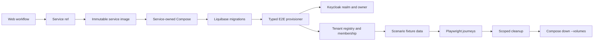

# E2E Fixture Contract

Use this template for every disposable end-to-end environment. It is the
contract between the service-owned provisioning tool and the web-owned
Playwright journeys.

The fixture is deterministic, tenant-scoped, repeatable, and safe to destroy.
It is not a copy of production data and it must never contain real credentials,
tokens, payment details, customer PII, or provider secrets.

## 1. Fixture metadata

| Field | Value |
|---|---|
| Fixture name | `<fixture-name>` |
| Environment | `local` / `ci` |
| Service ref | `<git-ref>` |
| Web ref | `<git-ref>` |
| Tenant slug | `e2e-<run-id>` |
| Owner username | Injected through secret/configuration |
| Provisioner | `:tools:e2e-provisioner` |
| Cleanup owner | Workflow teardown and tenant-scoped API cleanup |
| Data retention | Disposable; never persisted after the run |

## 2. Ownership and lifecycle



The provisioning order is mandatory:

1. Start PostgreSQL, Redis, and Keycloak.
2. Run migrations and deterministic tenant registry seed.
3. Wait for Keycloak readiness.
4. Run the typed service provisioner.
5. Start the service image.
6. Run authenticated browser journeys.
7. Delete created records by run marker, then destroy the Compose volumes.

The service provisioner owns infrastructure data. Playwright owns only
scenario data that must be created through public application APIs to verify
the actual user workflow.

## 3. Identity fixture

| Entity | Required fields | Invariant | Used by |
|---|---|---|---|
| Keycloak realm | realm name, enabled client, redirect origin | Realm is isolated to the run | Login and token issuance |
| Tenant owner | stable username, non-temporary password, tenant claims | Owner belongs to exactly one E2E tenant | Every authenticated journey |
| Tenant | UUID, slug, display name, active status | Slug is unique and run-scoped | Tenant resolution and isolation |
| Role | `business_owner`, tenant scope, active status | Owner has only the role needed by the journey | Authorization |
| Membership | tenant ID, user reference, role ID, active status | Membership is unique and active | Current-user and access checks |
| Feature flags | explicit key, value, tenant scope | Defaults are deterministic | Conditional UI and capability checks |

The owner password is supplied only through the CI secret store. The
provisioner must never print it, persist it, or include it in an artifact.

## 4. Business fixture inventory

Create the minimum deterministic baseline needed by the journeys. Every row is
tenant-owned unless the module explicitly defines it as platform-owned.

| Module | Entity / aggregate | Baseline record | Required assertions |
|---|---|---|---|
| Studio | business profile | `E2E Studio` | Profile is visible to the owner and editable |
| Studio | operating hours | Weekday schedule in a fixed timezone | Availability is deterministic |
| Studio | booking policy | Active default policy | Invalid and valid booking rules are testable |
| Customer | customer | One primary and one secondary synthetic customer | List, search, update, and isolation work |
| Studio | service | One active service with stable price/duration | Service creation, update, and selection work |
| Studio | artist | One active artist | Assignment and schedule flows work |
| Studio | artist capability | Artist linked to the baseline service | Capability validation is testable |
| Studio | appointment | One upcoming appointment and one completed appointment | Calendar, detail, reschedule, and status flows work |
| Catalog | catalog item | One active item with deterministic SKU | Catalog list, match, and image boundary work |
| Calendar | calendar sync state | Explicit disconnected baseline | Connect/disconnect and failure states are testable |
| Calendar | event link | One synthetic link only when the journey needs it | Sync status is observable |
| Notification | notification preference | Explicit owner/studio defaults | Preferences and delivery policy are testable |
| Payment | payment | Synthetic pending payment only | Lifecycle and failure mapping are testable without real money |
| Payment | webhook event | Signed synthetic replay fixture | Signature, idempotency, and replay protection are testable |
| Assistant | conversation | One tenant-owned conversation | Conversation list and message lifecycle work |
| Assistant | conversation event | One deterministic user event | Event ordering and display are testable |
| Assistant | pending action | Explicitly pending action with safe no-op provider | Approval/rejection boundaries are testable |
| Studio documents | document | One indexed synthetic document when enabled | Upload, status, and retrieval boundaries work |
| Studio documents | document chunk | One or more deterministic chunks | Search/embedding ownership is testable |
| Studio subscriptions | subscription | Synthetic active plan when enabled | Lifecycle and payment boundary are testable |
| Audit | audit record | One provisioning/audit event | Correlation and tenant isolation are observable |

Modules without a public API or implemented persistence must not receive fake
database rows. Mark the row `not-applicable` and add a contract test or ADR
explaining the intentional absence.

## 5. Naming and identifiers

Use a single run marker for every created record:

```text
E2E-<github-run-id>-<entity-kind>-<short-suffix>
```

Rules:

- UUIDs are generated by the service or a deterministic fixture factory; never
  use sequential production-like IDs.
- Dates are relative to a fixed injected clock or a bounded test window.
- Timezones are explicit; use the tenant's configured timezone.
- Emails use a reserved synthetic domain such as `@e2e.invalid`.
- Phone numbers use reserved test values only.
- External IDs are prefixed with the provider and run marker.
- Every fixture factory exposes the created IDs for cleanup and assertions.

## 6. Scenario coverage matrix

Each row must map to at least one Playwright spec and one service contract or
integration assertion.

| Scenario | Fixture inputs | Expected result | Recording |
|---|---|---|---|
| Login and tenant resolution | Owner, active membership, tenant claims | Dashboard loads in the selected tenant | Yes |
| Dashboard baseline | Profile, hours, services, appointments | Summary cards and upcoming work render | Yes |
| Customer lifecycle | Primary synthetic customer | Create, search, edit, and isolation succeed | Yes |
| Service lifecycle | Active service | Create, edit, archive, and selection succeed | Yes |
| Appointment lifecycle | Customer, artist, service, hours, policy | Create, reschedule, cancel, and conflict handling work | Yes |
| Settings | Profile, hours, policy, preferences | Valid changes persist and invalid input is rejected | Yes |
| Authorization | Owner plus denied/foreign tenant context | API rejects unauthorized access; UI is not the only guard | No |
| Error recovery | Provider timeout/failure or invalid state | Stable localized problem response and recoverable UI | No |
| Calendar boundary | OAuth/sync state or deterministic provider fake | Connect, disconnect, and sync status are explicit | No |
| Payment boundary | Synthetic pending/webhook event | Signature and idempotency are enforced; no real charge | No |
| Assistant boundary | Conversation and pending action | Safe provider response and action approval boundary work | No |
| Observability | Correlation ID and audit event | Logs/metrics contain no secrets and preserve tenant context | No |

Recording journeys are intentionally short and serial. Full correctness
coverage belongs in non-recording real E2E suites; video is evidence of the
critical happy path, not a substitute for the complete test pyramid.

## 7. Provisioner contract

The service tool must expose one command and typed environment configuration:

```bash
./gradlew :tools:e2e-provisioner:run \
  --no-daemon --no-configuration-cache --stacktrace
```

Required inputs:

| Variable | Purpose |
|---|---|
| `KEYCLOAK_URL` | Admin API origin |
| `KEYCLOAK_ADMIN_USERNAME` | Disposable administrator |
| `KEYCLOAK_ADMIN_PASSWORD` | Secret, never logged |
| `E2E_OWNER_USERNAME` | Synthetic owner username |
| `E2E_OWNER_PASSWORD` | Secret, never logged |
| `E2E_TENANT_SLUG` | Run-scoped tenant slug |
| `E2E_TENANT_NAME` | Display name |
| `E2E_WEB_ORIGIN` | Allowed browser origin |
| `E2E_DATABASE_URL` | Provisioner JDBC endpoint |
| `E2E_DATABASE_USERNAME` | Database user |
| `E2E_DATABASE_PASSWORD` | Secret, never logged |

The tool uses Spring JDBC for managed connections and prepared statements,
standard Java HTTP for Keycloak, and injected ports for all external effects.
It must be idempotent for the same run marker and fail closed on missing
configuration.

## 8. Cleanup and safety

- Cleanup is tenant-scoped and run-marker-scoped.
- Cleanup failures fail the run but do not print secrets.
- Compose teardown always removes volumes and orphan containers.
- Artifacts include videos, traces, HTML/JSON reports, and service logs only.
- Do not upload environment dumps, database dumps, Keycloak tokens, cookies,
  HAR files, or request headers containing credentials.
- A real provider integration is never replaced by a fake inside a real
  recording run; use a separate deterministic provider contract suite.

## 9. Definition of done

- [ ] Every applicable entity in the inventory has an owner and fixture
      factory.
- [ ] Every fixture has deterministic identifiers and cleanup behavior.
- [ ] Every critical user flow maps to a real and mock test where applicable.
- [ ] Tenant isolation and authorization are asserted at the API boundary.
- [ ] Provisioning is idempotent and uses prepared statements.
- [ ] No secrets or production data enter source control or artifacts.
- [ ] Compose rendering, provisioner tests, service checks, web checks, and
      Playwright contract tests pass.
- [ ] The CI workflow archives recordings and diagnostics and always tears down
      the disposable environment.
