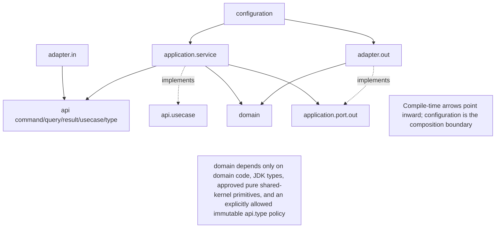
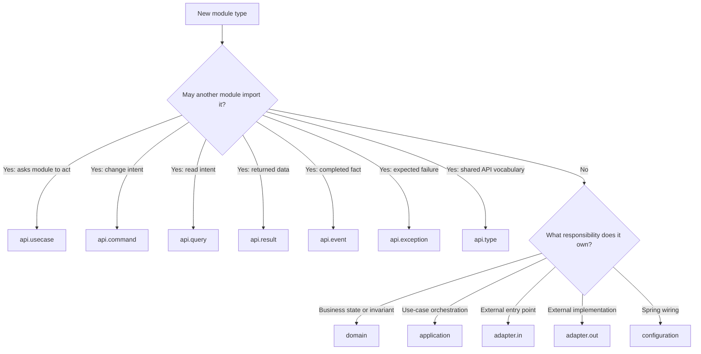
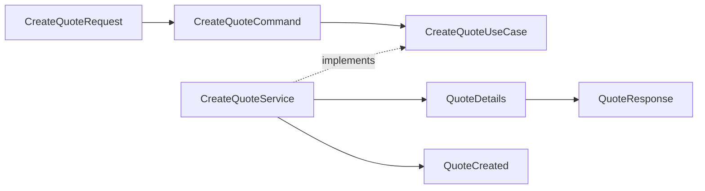

# Spring Modulith Module Template (API Grouped by Kind)

> Copy this document into a module's design notes, replace every `<placeholder>` with the module's real names, materialize only the branches the module actually needs, and treat the remaining rules as that module's internal package and production-readiness contract. This template complements [modulith-application-template.md](modulith-application-template.md) by detailing one concrete, code-level layout for DDD + Hexagonal modules whose `api` package is grouped by kind (`command`, `query`, `result`, `usecase`, `event`, `exception`, and `type`).

> **Template status:** Approved baseline. Adopt the mandatory rules for every production module. Mark any deliberate deviation in the module metadata and record the decision in an ADR.

## 1. Module metadata

| Field | Value |
|---|---|
| Module | `<module-name>` |
| Business capability | `<capability>` |
| Base namespace | `<base-namespace>.<module-name>` |
| Spring Modulith baseline | `2.1.0` — revalidate annotation and verification behavior on upgrade |
| Aggregate(s) | `<aggregate-names>` |
| Architecture owner | `<team-or-role>` |
| Status | Draft / Approved |
| Last reviewed | `<yyyy-mm-dd>` |
| Data classification | Public / Internal / Confidential / Restricted |
| Availability tier | Tier 1 / Tier 2 / Tier 3 |
| Recovery objective | RTO `<duration>` / RPO `<duration>` |
| Operational owner | `<team-or-role>` |
| Dependencies reviewed | `<date-and-review-link>` |

## 2. Purpose

This template defines a Spring Modulith module built with DDD + Hexagonal Architecture, where the module's public `api` package is standardized by **kind** rather than by feature: every command, query, result, use case, event, exception, and type gets its own dedicated subpackage. The goal is that a developer can answer "what is this class for?" from its package alone, without reading the class body. Input validation follows the [backend validation conventions](../architecture/01-backend/validation.md): Jakarta Bean Validation on inbound records, custom constraints for cross-field transport rules, and explicit domain/application validation for business truth.

The template covers two contracts at once:

1. **Structural contract:** package ownership, dependency direction, public interfaces, and executable architecture rules.
2. **Operational contract:** data ownership, security, tenancy, transactions, idempotency, resilience, observability, migrations, testing, and recovery expectations.

Spring Modulith provides the module discovery and verification mechanism; this template defines the stronger engineering conventions applied inside each module. Spring Modulith verification checks for cycles, API-only efferent access, and optionally explicitly allowed dependencies. Named interfaces can expose a narrower API such as `api`, `events`, or `spi`. See the [official verification guide](https://docs.spring.io/spring-modulith/reference/verification.html) and [named-interface documentation](https://docs.spring.io/spring-modulith/docs/current/api/org/springframework/modulith/NamedInterface.html).

Use this layout when a module's `api` package has grown past a handful of flat files and mixes commands, results, and exceptions together, or when a project wants one enforceable, code-level convention for every module from the start.

## 3. Package structure principles

1. `api` is the deliberate public contract other modules may import. Its subpackages classify contracts by kind, not by use case. Every materialized API kind joins the logical `api` named interface; whenever `api.event` exists, it also joins the narrower `events` interface.
2. `domain` contains business rules only and must not depend on Spring, JPA, Kafka, HTTP clients, JSON, or controllers.
3. `application` orchestrates: it loads aggregates, invokes domain behavior, calls outbound ports, and publishes events. It does not encode business invariants.
4. `adapter.in` translates external input (web, messaging, scheduler) into calls against `api.usecase`. `adapter.out` implements the outbound ports declared in `application.port.out`.
5. Both adapter groups point inward; nothing inside `domain` or `application` depends on `adapter`.
6. Place a small `package-info.java` in every **materialized** architectural package. It is the package's local responsibility contract and, where applicable, carries Spring Modulith metadata.
7. A package is materialized only when it contains a real type, owns descendants with a real responsibility, or carries required module/named-interface metadata. Do not create optional branches merely to reproduce the full tree.
8. Validation follows ownership: `adapter.in.*` validates transport shape, `application` validates workflow/external facts, and `domain` protects business invariants. Do not put Jakarta validation annotations on domain types.

## 4. Full package tree

```text
<base-namespace>
└── <module>/
    ├── api/
    │   ├── command/
    │   ├── query/
    │   ├── result/
    │   ├── usecase/
    │   ├── event/
    │   ├── exception/
    │   └── type/
    │
    ├── application/
    │   ├── service/
    │   ├── port/
    │   │   └── out/
    │   └── mapper/
    │
    ├── domain/
    │   ├── model/
    │   ├── service/
    │   ├── event/
    │   ├── exception/
    │   └── specification/
    │
    ├── adapter/
    │   ├── in/
    │   │   ├── web/
    │   │   │   ├── controller/
    │   │   │   ├── request/
    │   │   │   ├── response/
    │   │   │   ├── mapper/
    │   │   │   ├── advice/
    │   │   │   └── validation/                         # C: cross-field input constraints
    │   │   ├── messaging/
    │   │   │   ├── consumer/
    │   │   │   └── mapper/
    │   │   └── scheduler/
    │   │
    │   └── out/
    │       ├── persistence/
    │       │   ├── aspect/                              # C: persistence-side cross-cutting adapter
    │       │   ├── entity/
    │       │   ├── repository/
    │       │   ├── adapter/
    │       │   ├── mapper/
    │       │   └── projection/
    │       ├── messaging/
    │       │   ├── publisher/
    │       │   └── mapper/
    │       ├── client/
    │       │   └── <external-system>/
    │       └── observability/
    │
    └── configuration/
```

### Complete module filesystem reference

The following is the **maximum approved shape**, not a scaffold to generate blindly. `R` means required for every implemented module; `C` means conditional and is created only with the first real responsibility of that kind.

```text
modules/<module>/
├── build.gradle.kts                                      # R: module build declaration
│
└── src/
    ├── main/
    │   ├── java/<base-namespace-path>/<module>/
    │   │   ├── package-info.java                         # R: @ApplicationModule
    │   │   │
    │   │   ├── api/                                      # C: public module contract namespace
    │   │   │   ├── package-info.java
    │   │   │   ├── command/
    │   │   │   │   ├── package-info.java
    │   │   │   │   └── <Verb><Subject>Command.java
    │   │   │   ├── query/
    │   │   │   │   ├── package-info.java
    │   │   │   │   └── <ReadVerb><Subject>Query.java
    │   │   │   ├── result/
    │   │   │   │   ├── package-info.java
    │   │   │   │   └── <Subject><Shape>.java
    │   │   │   ├── usecase/
    │   │   │   │   ├── package-info.java
    │   │   │   │   └── <Verb><Subject>UseCase.java
    │   │   │   ├── event/
    │   │   │   │   ├── package-info.java
    │   │   │   │   └── <Subject><PastParticiple>.java
    │   │   │   ├── exception/
    │   │   │   │   ├── package-info.java
    │   │   │   │   └── <Subject><Failure>Exception.java
    │   │   │   └── type/
    │   │   │       ├── package-info.java
    │   │   │       └── <Concept><Qualifier>.java
    │   │   │
    │   │   ├── application/                              # C: use-case orchestration
    │   │   │   ├── package-info.java
    │   │   │   ├── service/
    │   │   │   │   ├── package-info.java
    │   │   │   │   └── <Verb><Subject>Service.java
    │   │   │   ├── port/
    │   │   │   │   ├── package-info.java
    │   │   │   │   └── out/
    │   │   │   │       ├── package-info.java
    │   │   │   │       ├── <Capability>Port.java
    │   │   │   │       ├── <Aggregate>Repository.java
    │   │   │   │       ├── <ReadCapability>Port.java
    │   │   │   │       └── <Fact>Publisher.java
    │   │   │   ├── mapper/
    │   │   │   │   ├── package-info.java
    │   │   │   │   └── <Module>ApplicationMapper.java
    │   │   │   └── process/                              # C: long-running process manager only
    │   │   │       ├── package-info.java
    │   │   │       └── <BusinessProcess>ProcessManager.java
    │   │   │
    │   │   ├── domain/                                   # C: business model and rules
    │   │   │   ├── package-info.java
    │   │   │   ├── model/
    │   │   │   │   ├── package-info.java
    │   │   │   │   ├── <Aggregate>.java
    │   │   │   │   ├── <Entity>.java
    │   │   │   │   ├── <ValueObject>.java
    │   │   │   │   └── <Aggregate>Status.java
    │   │   │   ├── service/
    │   │   │   │   ├── package-info.java
    │   │   │   │   ├── <BusinessConcept>Policy.java
    │   │   │   │   └── <BusinessConcept>Calculator.java
    │   │   │   ├── event/
    │   │   │   │   ├── package-info.java
    │   │   │   │   └── <Subject><PastParticiple>.java
    │   │   │   ├── exception/
    │   │   │   │   ├── package-info.java
    │   │   │   │   └── <RuleViolation>Exception.java
    │   │   │   ├── specification/
    │   │   │   │   ├── package-info.java
    │   │   │   │   └── <Subject><Predicate>.java
    │   │   │   └── factory/                              # C: complex domain construction only
    │   │   │       ├── package-info.java
    │   │   │       └── <Aggregate>Factory.java
    │   │   │
    │   │   ├── adapter/                                  # C: technical boundaries
    │   │   │   ├── package-info.java
    │   │   │   ├── in/
    │   │   │   │   ├── package-info.java
    │   │   │   │   ├── web/
    │   │   │   │   │   ├── package-info.java
    │   │   │   │   │   ├── controller/
    │   │   │   │   │   │   ├── package-info.java
    │   │   │   │   │   │   └── <Resource>Controller.java
    │   │   │   │   │   ├── request/
    │   │   │   │   │   │   ├── package-info.java
    │   │   │   │   │   │   └── <Verb><Resource>Request.java
    │   │   │   │   │   ├── response/
    │   │   │   │   │   │   ├── package-info.java
    │   │   │   │   │   │   └── <Resource><Shape>Response.java
    │   │   │   │   │   ├── mapper/
    │   │   │   │   │   │   ├── package-info.java
    │   │   │   │   │   │   └── <Resource>WebMapper.java
    │   │   │   │   │   ├── advice/
    │   │   │   │   │   │   ├── package-info.java
    │   │   │   │   │   │   └── <Module>ExceptionHandler.java
    │   │   │   │   │   └── filter/                      # C: module-owned HTTP filter
    │   │   │   │   │       ├── package-info.java
    │   │   │   │   │       └── <Concern>Filter.java
    │   │   │   │   ├── messaging/
    │   │   │   │   │   ├── package-info.java
    │   │   │   │   │   ├── consumer/
    │   │   │   │   │   │   ├── package-info.java
    │   │   │   │   │   │   └── <Fact>Consumer.java
    │   │   │   │   │   └── mapper/
    │   │   │   │   │       ├── package-info.java
    │   │   │   │   │       └── <Module>MessageMapper.java
    │   │   │   │   ├── scheduler/
    │   │   │   │   │   ├── package-info.java
    │   │   │   │   │   └── <Action><Subject>Scheduler.java
    │   │   │   │   ├── grpc/                             # C: gRPC transport
    │   │   │   │   │   ├── package-info.java
    │   │   │   │   │   ├── <Resource>GrpcService.java
    │   │   │   │   │   └── <Resource>GrpcMapper.java
    │   │   │   │   ├── graphql/                          # C: GraphQL transport
    │   │   │   │   │   ├── package-info.java
    │   │   │   │   │   ├── <Resource>QueryResolver.java
    │   │   │   │   │   └── <Resource>MutationResolver.java
    │   │   │   │   ├── cli/                              # C: command-line entry point
    │   │   │   │   │   ├── package-info.java
    │   │   │   │   │   └── <Action><Subject>CliCommand.java
    │   │   │   │   ├── webhook/                          # C: inbound provider callback
    │   │   │   │   │   ├── package-info.java
    │   │   │   │   │   ├── <Provider>WebhookController.java
    │   │   │   │   │   └── <Provider>WebhookMapper.java
    │   │   │   │   └── batch/                            # C: bounded batch entry point
    │   │   │   │       ├── package-info.java
    │   │   │   │       ├── <Subject>BatchJob.java
    │   │   │   │       └── <Subject>BatchRecordMapper.java
    │   │   │   │
    │   │   │   └── out/
    │   │   │       ├── package-info.java
    │   │   │       ├── persistence/
    │   │   │       │   ├── package-info.java
    │   │   │       │   ├── aspect/                      # C: persistence-side cross-cutting adapter
    │   │   │       │   │   ├── package-info.java
    │   │   │       │   │   └── <Concern>Aspect.java
    │   │   │       │   ├── entity/
    │   │   │       │   │   ├── package-info.java
    │   │   │       │   │   ├── <Aggregate>Entity.java
    │   │   │       │   │   └── <Concept>Embeddable.java
    │   │   │       │   ├── repository/
    │   │   │       │   │   ├── package-info.java
    │   │   │       │   │   └── SpringData<Aggregate>Repository.java
    │   │   │       │   ├── adapter/
    │   │   │       │   │   ├── package-info.java
    │   │   │       │   │   ├── <Aggregate>PersistenceAdapter.java
    │   │   │       │   │   └── <ReadCapability>PersistenceAdapter.java
    │   │   │       │   ├── mapper/
    │   │   │       │   │   ├── package-info.java
    │   │   │       │   │   └── <Aggregate>PersistenceMapper.java
    │   │   │       │   └── projection/
    │   │   │       │       ├── package-info.java
    │   │   │       │       └── <ReadShape>Projection.java
    │   │   │       ├── messaging/
    │   │   │       │   ├── package-info.java
    │   │   │       │   ├── publisher/
    │   │   │       │   │   ├── package-info.java
    │   │   │       │   │   └── <Technology><Fact>Publisher.java
    │   │   │       │   └── mapper/
    │   │   │       │       ├── package-info.java
    │   │   │       │       └── <Fact>EventMapper.java
    │   │   │       ├── client/
    │   │   │       │   ├── package-info.java
    │   │   │       │   └── <external-system>/
    │   │   │       │       ├── package-info.java
    │   │   │       │       ├── <Provider>HttpClient.java
    │   │   │       │       ├── <Operation>Request.java
    │   │   │       │       ├── <Operation>Response.java
    │   │   │       │       ├── <Provider>ClientMapper.java
    │   │   │       │       └── <Provider><Capability>Adapter.java
    │   │   │       ├── observability/
    │   │   │       │   ├── package-info.java
    │   │   │       │   ├── <Module>MetricsAdapter.java
    │   │   │       │   └── <Module>TracingAdapter.java
    │   │   │       ├── cache/                            # C: cache port implementation
    │   │   │       │   ├── package-info.java
    │   │   │       │   └── <Technology><Subject>CacheAdapter.java
    │   │   │       ├── search/                           # C: search-index port implementation
    │   │   │       │   ├── package-info.java
    │   │   │       │   └── <Technology><Subject>SearchAdapter.java
    │   │   │       └── storage/                          # C: object/file storage implementation
    │   │   │           ├── package-info.java
    │   │   │           └── <Technology><Subject>StorageAdapter.java
    │   │   │
    │   │   └── configuration/
    │   │       ├── package-info.java
    │   │       ├── <Module>Configuration.java
    │   │       ├── <Provider>ClientConfiguration.java
    │   │       └── <Capability>Properties.java
    │   │
    │   └── resources/
    │       ├── contracts/event/<module>/                 # C: broker schemas
    │       ├── queries/<module>/                         # C: external SQL/query resources
    │       ├── templates/<module>/                       # C: module-owned render templates
    │       └── <module>-defaults.yml                     # C: non-secret safe defaults
    │
    ├── test/
    │   ├── java/<base-namespace-path>/<module>/          # R: mirrors production packages
    │   │   ├── domain/                                   # pure domain unit tests
    │   │   ├── application/                              # service tests with fake ports
    │   │   ├── adapter/in/web/                           # controller/web slice tests
    │   │   ├── architecture/                             # module/layer rules
    │   │   └── <Module>ModuleTest.java                   # Spring Modulith slice when needed
    │   └── resources/
    │       └── fixtures/<module>/                        # C: immutable test data
    │
    ├── integrationTest/
    │   ├── java/<base-namespace-path>/<module>/
    │   │   ├── adapter/out/persistence/                  # real database behavior
    │   │   ├── adapter/out/client/                       # provider contract/sandbox tests
    │   │   ├── adapter/out/messaging/                    # publication/delivery tests
    │   │   └── adapter/in/                               # real transport integration tests
    │   └── resources/
    │       ├── wiremock/<module>/                        # C: provider stubs
    │       └── datasets/<module>/                        # C: integration datasets
    │
    └── testFixtures/
        ├── java/<base-namespace-path>/<module>/
        │   ├── domain/model/<Aggregate>Mother.java
        │   └── api/<kind>/<Type>Fixture.java
        └── resources/fixtures/<module>/
```

#### Module build declaration

The build filename is always `build.gradle.kts`; the Gradle path is `:modules:<module>`. It declares what the module **is** separately from the optional capabilities it needs:

```kotlin
plugins {
    id("emme.spring-module")       // module type
    id("emme.persistence")         // only when adapter.out.persistence exists
    id("emme.messaging")           // only when messaging capability exists
    id("emme.test-fixtures")       // only when src/testFixtures exists
}
```

Use `api(project(...))` only when another artifact's types appear in this module artifact's public binary signatures; otherwise use `implementation(project(...))`. Gradle dependency exposure does not replace Spring Modulith's `allowedDependencies`: both the build graph and logical named-interface graph must be correct. Delivery-only capabilities such as container image creation and deployment belong on executable applications, not ordinary business modules.

#### Resource and test-source ownership

| Path | Owns | Naming / guardrail |
|---|---|---|
| `database/src/main/resources/db/<database>/` | EMME's centralized Liquibase assembly for module-owned schema evolution | Root changelog includes release changelogs deterministically; changeset IDs are globally unique and immutable after release |
| `src/main/resources/db/<tool>/<module>/` | Alternative module-local migration location, only when the application explicitly assembles those locations | Follow the selected tool's naming/order rules; never run a second uncoordinated schema history |
| `src/main/resources/contracts/event/<module>/` | External broker schemas | Versioned by compatibility policy; never substitute a broker DTO for `api.event` |
| `src/main/resources/queries/<module>/` | SQL/query templates owned by an adapter | Bounded, tenant-scoped, and covered by real-database tests |
| `src/main/resources/templates/<module>/` | Module-owned email/document/render templates | Versioned with the behavior that consumes them; escaped, localized, size-bounded, and covered by rendering tests |
| `src/main/resources/<module>-defaults.yml` | Non-secret safe defaults | No credentials, tenant data, environment endpoints, or production-only values |
| `src/test/java/.../<module>/` | Fast domain/application tests, web slices, module slices, architecture rules | Mirror production responsibility; `<Type>Test`, `<Controller>WebTest`, `<Module>ModuleTest` |
| `src/test/resources/fixtures/<module>/` | Immutable test inputs/expected outputs | Descriptive scenario names; no production personal data or secrets |
| `src/integrationTest/java/.../<module>/` | Real database, broker, provider, and transport behavior | `<Adapter>IT` or `<Provider>ContractTest`; isolated and repeatable |
| `src/integrationTest/resources/wiremock/<module>/` | Controlled provider HTTP stubs | Name by provider operation and outcome |
| `src/integrationTest/resources/datasets/<module>/` | Integration datasets | Minimal, deterministic, tenant-safe, and reset between tests |
| `src/testFixtures/java/.../<module>/` | Reusable module-owned mothers/builders/fakes | `<Aggregate>Mother`, `<Type>Fixture`, `<Port>Fake`; no production wiring |

Generated sources and build outputs are never placed under hand-written source packages. If code generation is required, configure a dedicated generated-source directory and make its ownership and regeneration command explicit.

For this repository, physical migrations remain in the top-level `database` project even though the business module owns the affected tables and approves the change:

```text
database/src/main/resources/db/
├── changelog-root.yml
└── <database>/
    ├── changelog.yaml
    └── releases/<release>/
        ├── <sequence>-<description>.yaml
        └── <sequence>-<description>.sql
```

The root/application assembly determines execution order. A business module must link to its changesets in module design notes and test them through the assembled Liquibase configuration; it must not start an independent Flyway/Liquibase history inside its own artifact.

#### Approved extension rule

The tree names the standard and common optional branches. If a real responsibility is not represented, add one capability-specific package under the closest architectural owner and document it in `package-info.java`. Examples:

| Extension | Use only when | Typical files |
|---|---|---|
| `application.process` | A long-running process has state, compensation, or awaits multiple facts | `<Process>ProcessManager`, `<Process>State` |
| `domain.factory` | Valid aggregate construction spans several objects or policies and cannot live cleanly on the aggregate | `<Aggregate>Factory` |
| `adapter.in.grpc` | The module owns a gRPC endpoint | `<Resource>GrpcService`, request mapper |
| `adapter.in.graphql` | The module owns GraphQL resolvers | `<Resource>QueryResolver`, `<Resource>MutationResolver` |
| `adapter.in.cli` | A command-line entry point invokes module use cases | `<Action><Subject>CliCommand` |
| `adapter.in.webhook` | An external provider calls the module | `<Provider>WebhookController`, signature verifier, mapper |
| `adapter.in.batch` | A bounded import/export job initiates use cases | `<Subject>BatchJob`, record mapper |
| `adapter.out.cache` | A defined outbound cache port has a production implementation | `Redis<Subject>CacheAdapter` |
| `adapter.out.search` | A search-index port is implemented | `OpenSearch<Subject>SearchAdapter` |
| `adapter.out.storage` | An object/file-storage port is implemented | `S3<Document>StorageAdapter` |

Do not add generic alternatives such as `common`, `utils`, `helper`, `impl`, `dto`, `manager`, `infrastructure`, top-level `repository`, or top-level `service`. If a proposed responsibility does not fit and is not an approved extension, record the new package convention in an ADR before using it across modules.

### Dependency direction

Runtime invocation flows from an entry point through a use-case interface to its application-service implementation:

```text
adapter.in
    ↓ calls
api.usecase
    ↓ dispatches to implementation
application
    ↓ invokes
domain

application
    ↓ calls
application.port.out
    ↑ implemented by
adapter.out
```

That runtime flow is not the Java source-dependency graph. The API interface never imports its implementation. At compile time, implementations and adapters depend inward on contracts:



Within `api`, commands, queries, results, use cases, events, and public exceptions may depend on `api.type` and approved shared-kernel primitives, never on application, domain implementations, adapters, or framework/persistence types. `application.port.out` may use domain and API types required by its contract. The domain imports no API kind except immutable `api.type` primitives when the project explicitly adopts that pragmatic identity/value-type policy. Because persistence/client mappers live in sibling adapter packages, those internal implementation types can be Java-`public` when compilation requires it without becoming Modulith named-interface APIs.

### Package classification decision

Use this decision before creating or moving a class:



> [!IMPORTANT]
> Package by responsibility, not by class suffix. A class named `PricingService` belongs in `domain.service` only when it expresses a business policy; it belongs in `application.service` when it coordinates a use case; it belongs in `adapter.out.client.pricing` when it calls an external pricing system.

### `package-info.java` policy

Every materialized package in the tree has a `package-info.java` that answers three questions:

1. What belongs here?
2. What must never belong here?
3. Is this package public to other modules or internal?

Apply annotations only where they have architectural meaning:

| Package | Annotation | Purpose |
|---|---|---|
| `<module>` | `@ApplicationModule` | Declares the module boundary, display name, and allowed dependencies |
| `api.command`, `api.query`, `api.result`, `api.usecase`, `api.exception` | `@NamedInterface("api")` | Merges every public API kind into one explicit `module :: api` contract |
| `api.type` | `@NamedInterface("api")`; optionally add `events` at package or individual-type level | Keeps all API vocabulary in `api` while exposing only event-signature types to event-only consumers |
| `api.event` | `@NamedInterface({"api", "events"})` | Makes events part of the complete API and available as the narrower `module :: events` contract |
| Internal packages | None | Javadoc defines responsibility; implementation remains encapsulated |

`@NamedInterface` applies to the annotated package, not automatically to every nested API package. Therefore, annotating only `api/package-info.java` does **not** expose `api.command`, `api.query`, and the other children. Annotate each materialized API kind with the same logical interface name. Spring Modulith merges packages with the same named-interface name.

An event-only named interface must be closed over its public signatures. If `QuoteSubmitted` contains a `QuoteId` from `api.type`, that type also joins `events`; otherwise a consumer allowed only `quote :: events` could see the event but not its field type. If every public type in `api.type` is event-safe, the package may join both interfaces. If only a subset is needed, keep the package in `api` and annotate just those types for `events`. Public events may refer only to JDK/shared-kernel types and API types deliberately included in the same interface.

> [!NOTE]
> Package declarations in this template omit `propagate` because propagation applies to type-based assignments. For a least-privilege type assignment, use `propagate = false` unless related types should intentionally join the interface. Architecture tests must still detect API signatures that expose internal types.

The complete copy-ready package and naming catalog is in [Appendix A](#appendix-a-copy-ready-module-source-catalog). Copy a file only when its package is materialized.

## 5. `api` — public module contract

Everything under `api` may be used by other modules. It must remain small, stable, and independent of implementation details.

| Subpackage | Answers | Think | Example |
|---|---|---|---|
| `api.command` | What state-changing intention can a caller send? | "Please do this." | `SubmitQuoteCommand`, `CreateQuoteCommand` |
| `api.query` | What information can a caller request? | "Please tell me this." | `GetQuoteQuery`, `SearchQuotesQuery` |
| `api.result` | What public answer does the module return? | "Here is the answer." | `QuoteDetails`, `QuoteSummary`, `QuotePage` (suffix varies — see below) |
| `api.usecase` | What operations does the module expose? | "What capabilities does this module offer?" | `SubmitQuoteUseCase`, `GetQuoteUseCase` |
| `api.event` | What fact does the module announce? | "This already happened." | `QuoteCreated`, `QuoteSubmitted`, `QuoteApproved` |
| `api.exception` | What expected failure can callers handle? | "The operation could not complete for an expected reason." | `QuoteNotFoundException` |
| `api.type` | What stable public vocabulary does the API share? | "This concept has a stable public meaning." | `QuoteId`, `QuoteStatusView`, `HealthCondition` |

### `api.command`

Represents an intention to change the module's state. Contains input data only — no business logic.

```java
/**
 * Public commands accepted by the Quote module.
 *
 * A command expresses an intention to perform an operation that may change
 * application state. Commands contain input data only and do not implement
 * business logic.
 */
@org.springframework.modulith.NamedInterface("api")
package <base-namespace>.quote.api.command;
```

```java
public record SubmitQuoteCommand(QuoteId quoteId) {
}
```

### `api.query`

Represents a request to retrieve information without changing state.

```java
public record GetQuoteQuery(QuoteId quoteId) {
}

public record SearchQuotesQuery(
        String customerId,
        QuoteStatusView status,
        int page,
        int size
) {
}
```

### `api.result`

Public read models returned to consumers. Not JPA entities; must not expose domain internals or the whole aggregate.

```java
public record QuoteDetails(
        QuoteId id,
        QuoteStatusView status,
        MoneyView premium
) {
}
```

The contract this template enforces is the **package** (`api.result`), not a mandatory class-name suffix. `Details`, `Summary`, and `Page` above are illustrative, not a fixed vocabulary — pick whichever suffix fits what the type represents, and stay consistent within one project:

- `Details` / `Summary` / `Page` — this template's own convention, useful when a module returns different shapes of the same concept (a full view vs. a list-row view vs. a paginated wrapper).
- `Info` — a common alternative for a single flat read model (`UserInfo`, `TenantInfo`). Equally valid; adopt it project-wide if a codebase already uses it rather than mixing conventions.
- `View` / `Result` — also seen in the wild for the same purpose.

Whichever suffix a project picks, apply it consistently across every module — the failure mode to avoid is not "wrong suffix," it's *inconsistent* suffixes within the same codebase.

### `api.usecase`

Inbound ports implemented by application services.

```java
public interface SubmitQuoteUseCase {
    QuoteDetails submit(SubmitQuoteCommand command);
}

public interface GetQuoteUseCase {
    QuoteDetails get(GetQuoteQuery query);
}
```

Relationship: `api.usecase` interface ← implemented by ← `application.service`.

### `api.event`

Public facts other modules may consume. Use past tense.

```java
public record QuoteSubmitted(
        QuoteId quoteId,
        Instant occurredAt
) {
}
```

Good: `QuoteSubmitted`, `QuoteApproved`, `PaymentCompleted`.
Avoid imperative names: `SubmitQuote`, `ApproveQuote`, `ProcessPayment` — those are commands.

### `api.exception`

Only exceptions intentionally exposed to other modules. Domain-internal exceptions stay under `domain.exception`.

**`QuoteNotFoundException.java`**

```java
public final class QuoteNotFoundException extends RuntimeException {

    public QuoteNotFoundException(QuoteId quoteId) {
        super("Quote not found: " + quoteId);
    }
}
```

**`QuoteCannotBeSubmittedException.java`**

```java
public final class QuoteCannotBeSubmittedException extends RuntimeException {

    private final QuoteId quoteId;
    private final QuoteSubmissionFailure failure;

    public QuoteCannotBeSubmittedException(
            QuoteId quoteId,
            QuoteSubmissionFailure failure
    ) {
        super("Quote cannot be submitted: " + failure);
        this.quoteId = Objects.requireNonNull(quoteId);
        this.failure = Objects.requireNonNull(failure);
    }

    public QuoteId quoteId() {
        return quoteId;
    }

    public QuoteSubmissionFailure failure() {
        return failure;
    }
}
```

Do not expose `SQLException`, `JpaSystemException`, `HttpClientException`, or similar infrastructure failures.

### `api.type`

Small public value types shared across the module API. Must not expose the complete domain aggregate.

**`QuoteId.java`**

```java
@org.springframework.modulith.NamedInterface(
        value = "events",
        propagate = false
)
public record QuoteId(UUID value) {

    public QuoteId {
        Objects.requireNonNull(value);
    }
}
```

**`MoneyView.java`**

```java
public record MoneyView(
        BigDecimal amount,
        Currency currency
) {
    public MoneyView {
        Objects.requireNonNull(amount);
        Objects.requireNonNull(currency);
    }
}
```

**`QuoteSubmissionFailure.java`**

```java
public enum QuoteSubmissionFailure {
    INCOMPLETE,
    INVALID_STATE
}
```

Good API types: `QuoteId`, `CustomerId`, `MoneyView`, `QuoteStatusView`, `HealthCondition`.
Avoid exposing: the `Quote` aggregate, `QuoteEntity`, mutable internal objects.

Choose and enforce one API/domain value-type policy:

| Policy | Dependency rule | Use when |
|---|---|---|
| Shared semantic primitive (used by the examples in this template) | Domain code may use immutable, behavior-light identifiers/value types from `api.type`; no other `api.*` kind is allowed | The type is genuinely stable and means exactly the same thing in public contracts and domain behavior |
| Strict contract isolation | Domain owns its own value object; `application.mapper` translates it to/from the similarly named `api.type` | Public compatibility must evolve independently from the domain model |

Do not drift between policies class by class. Record the project choice in its architecture document and enforce it with ArchUnit. Even under the shared-primitive policy, API serialization annotations and transport validation stay outside the domain-facing type; use web/provider DTOs when wire concerns differ.

## 6. `application` — use-case orchestration

The application layer executes workflows. It coordinates the domain and outbound ports.

```text
application/
├── service/
├── port/out/
└── mapper/
```

### `application.service`

Implementations of the public use cases. Application services may handle transactions, aggregate loading, invoking domain behavior, saving aggregates, calling external ports, publishing events, and use-case-level authorization. They should not contain detailed business invariants — those belong in `domain`.

```java
@Service
@Transactional
class SubmitQuoteService implements SubmitQuoteUseCase {

    private final QuoteRepository quoteRepository;
    private final QuoteEventPublisher eventPublisher;
    private final Clock clock;

    SubmitQuoteService(
            QuoteRepository quoteRepository,
            QuoteEventPublisher eventPublisher,
            Clock clock
    ) {
        this.quoteRepository = quoteRepository;
        this.eventPublisher = eventPublisher;
        this.clock = clock;
    }

    @Override
    public QuoteDetails submit(SubmitQuoteCommand command) {
        Quote quote = quoteRepository.findById(command.quoteId())
                .orElseThrow(() -> new QuoteNotFoundException(command.quoteId()));

        try {
            quote.submit();
        } catch (IncompleteQuoteException exception) {
            throw new QuoteCannotBeSubmittedException(
                    command.quoteId(),
                    QuoteSubmissionFailure.INCOMPLETE
            );
        } catch (InvalidStateTransitionException exception) {
            throw new QuoteCannotBeSubmittedException(
                    command.quoteId(),
                    QuoteSubmissionFailure.INVALID_STATE
            );
        }

        quoteRepository.save(quote);
        eventPublisher.publish(new QuoteSubmitted(quote.id(), Instant.now(clock)));

        return QuoteApplicationMapper.toDetails(quote);
    }
}
```

Expected failures crossing `api.usecase` are public contract failures. Application services translate internal domain exceptions into `api.exception` types (or an explicitly modeled public result) before returning control to another module or inbound adapter. Never let a caller need an import from `domain.exception` to handle an expected outcome.

### `application.port.out`

Interfaces for dependencies required by the application. Adapters under `adapter.out` implement these interfaces.

```java
public interface QuoteRepository {

    Optional<Quote> findById(QuoteId quoteId);

    Quote save(Quote quote);
}
```

Relationship: application service → depends on → outbound port ← implemented by ← outbound adapter.

### `application.mapper`

Converts between public API models and domain models. Introduces no HTTP, persistence, or messaging concerns.

```java
public final class QuoteApplicationMapper {

    public static QuoteDetails toDetails(Quote quote) {
        return new QuoteDetails(
                quote.id(),
                QuoteStatusView.valueOf(quote.status().name()),
                new MoneyView(
                        quote.premium().amount(),
                        quote.premium().currency()
                )
        );
    }

    private QuoteApplicationMapper() {
    }
}
```

## 7. `domain` — business model and rules

The domain layer contains the behavior that makes the module unique. It should remain independent of HTTP, persistence, messaging, and framework concerns whenever practical.

```text
domain/
├── model/
├── service/
├── exception/
├── event/
└── specification/
```

| Subpackage | Contains | Example |
|---|---|---|
| `domain.model` | Aggregates, entities, value objects, domain enums | `Quote`, `HealthProfile`, `Premium`, `Coverage`, `QuoteStatus` |
| `domain.service` | Business logic spanning multiple domain objects, not owned by one aggregate | `QuotePricingPolicy` |
| `domain.exception` | Violations of business rules and invariants | `InvalidStateTransitionException`, `HealthDataNotAllowedException`, `IncompleteQuoteException` |
| `domain.event` | Internal events produced by the domain model | `QuoteSubmissionRequested`, `PremiumCalculated` |
| `domain.specification` | Reusable, composable business predicates | `QuoteCanBeSubmitted` |

```java
public class Quote {

    private QuoteStatus status;
    private HealthProfile healthProfile;

    public void submit() {
        if (healthProfile == null) {
            throw new IncompleteQuoteException();
        }

        if (status != QuoteStatus.DRAFT) {
            throw new InvalidStateTransitionException(status, QuoteStatus.SUBMITTED);
        }

        status = QuoteStatus.SUBMITTED;
    }
}
```

`domain.event` is internal to the module; `api.event` is the public contract for other modules. Omit `domain.event` entirely when the aggregate does not collect internal domain events.

Use a domain service only when the behavior cannot reasonably live inside an aggregate or value object. Do not create specifications for every simple `if` — use them when a rule genuinely benefits from reuse or composition.

## 8. `adapter.in` — entry points

Inbound adapters translate external input into module use-case calls. They must not contain domain rules or persistence logic.

```text
adapter/in/
├── web/
│   ├── controller/
│   ├── request/
│   ├── response/
│   ├── mapper/
│   └── advice/
├── messaging/
│   ├── consumer/
│   └── mapper/
└── scheduler/
```

| Subpackage | Role |
|---|---|
| `web.controller` | Validates transport-level input, maps requests to commands/queries, invokes use cases, maps results to HTTP responses |
| `web.request` | Wire contract (JSON shape, transport-level validation); not a domain model |
| `web.response` | External JSON representation; may differ from application results to preserve API versioning |
| `web.mapper` | Translates web requests into commands/queries and application results into HTTP responses |
| `web.advice` | Converts caller-visible `api.exception` failures into stable HTTP error responses (e.g. RFC 9457 Problem Details) and hides unexpected internals |
| `messaging.consumer` | Deserializes incoming messages, validates metadata, ensures idempotent processing, invokes use cases |
| `messaging.mapper` | Translates incoming message contracts into commands/queries |
| `scheduler` | Determines when a use case should run; delegates the actual operation to the application layer |

Request/response flow:

```text
CreateQuoteRequest → CreateQuoteCommand → CreateQuoteUseCase → QuoteDetails → QuoteResponse
```

Example advice mapping:

```text
QuoteNotFoundException          → 404
QuoteCannotBeSubmittedException
  failure = INVALID_STATE       → 409
  failure = INCOMPLETE          → 422
```

## 9. `adapter.out` — external implementations

Outbound adapters implement capabilities requested through outbound ports.

```text
adapter/out/
├── persistence/
│   ├── entity/
│   ├── repository/
│   ├── adapter/
│   ├── mapper/
│   └── projection/
├── messaging/
│   ├── publisher/
│   └── mapper/
├── client/
│   └── <external-system>/
└── observability/
```

| Subpackage | Role |
|---|---|
| `persistence.entity` | Database mappings; must not be exposed as domain models, API results, or HTTP responses |
| `persistence.repository` | Framework-specific persistence definitions (Spring Data/JPA/JDBC); not an application-layer port |
| `persistence.adapter` | Implements the application-layer repository port; coordinates repository + mapper, hides DB technology |
| `persistence.mapper` | Translates domain models ↔ persistence representations (e.g. `Quote` ↔ `QuoteEntity`) |
| `persistence.projection` | Optimized read models for search screens, lists, reports; never used to execute aggregate behavior |
| `messaging.publisher` | Publishes module events to Spring application events, Kafka, RabbitMQ, or a transactional outbox |
| `messaging.mapper` | Translates public/domain events into broker-specific representations |
| `client.<external-system>` | One package per external dependency: transport client, request/response models, mapper, port adapter |
| `observability` | Module-specific metrics, tracing, and diagnostic signals; observes execution without becoming a business system of record |

```java
public interface SpringDataQuoteRepository extends JpaRepository<QuoteEntity, UUID> {
}

@Component
final class QuotePersistenceAdapter implements QuoteRepository {

    private final SpringDataQuoteRepository repository;
    private final QuotePersistenceMapper mapper;

    QuotePersistenceAdapter(
            SpringDataQuoteRepository repository,
            QuotePersistenceMapper mapper
    ) {
        this.repository = repository;
        this.mapper = mapper;
    }

    @Override
    public Optional<Quote> findById(QuoteId quoteId) {
        return repository.findById(quoteId.value()).map(mapper::toDomain);
    }

    @Override
    public Quote save(Quote quote) {
        QuoteEntity saved = repository.save(mapper.toEntity(quote));
        return mapper.toDomain(saved);
    }
}
```

A client package groups everything needed for one external dependency:

```text
client/pricing/
├── PricingHttpClient.java     # performs the HTTP call
├── PricingRequest.java        # external provider contract
├── PricingResponse.java       # external provider contract
├── PricingClientMapper.java   # translates external <-> internal models
└── PricingClientAdapter.java  # implements PricingPort
```

## 10. `configuration`

Spring and module wiring. Assembles implementations, registers beans, configures framework integrations. Must not contain business rules.

```text
configuration/
└── QuoteConfiguration.java   # @Bean declarations, client/serialization/transaction wiring
```

```java
/**
 * Spring and module wiring for the Quote module.
 *
 * Configuration classes assemble implementations, register beans, and configure
 * framework integrations. They must not contain business rules.
 */
package <base-namespace>.quote.configuration;
```

Use it for `@Bean` declarations, client configuration, serialization configuration, and transaction configuration.
Do not use it for quote validation rules, premium calculations, or state transitions.

Choose one wiring style consistently per module:

| Wiring style | Visibility consequence | Guardrail |
|---|---|---|
| Component scanning | `@Service`/`@Component` implementations may remain package-private when Spring and the selected proxy mode support them | Constructor injection only; no hidden service-locator lookups |
| Explicit `@Bean` composition | Types and constructors referenced from the sibling `configuration` package must be Java-`public` | Public Java visibility still does not expose them as a Modulith named interface |

Transactional/AOP beans must remain proxyable under the project's configured proxy strategy. Do not make a class or advised method `final` when class-based proxies are in use; verify proxy creation in a module-slice test.

The Spring Modulith declaration does **not** belong here. Keep `@ApplicationModule` in the module-root `<module>/package-info.java`, because the module root is the package Spring Modulith discovers as the application module boundary.

## 11. Synchronous vs event-based module communication

### Synchronous — immediate queries

```java
@Service
class PolicyCreationService {

    private final GetQuoteUseCase getQuoteUseCase;

    PolicyCreationService(GetQuoteUseCase getQuoteUseCase) {
        this.getQuoteUseCase = getQuoteUseCase;
    }

    void createPolicy(QuoteId quoteId) {
        QuoteDetails quote = getQuoteUseCase.get(new GetQuoteQuery(quoteId));
    }
}
```

Allowed dependency: `policy.application` → `quote.api`.
Forbidden: `policy.application` → `quote.adapter.out.persistence.repository`.

### Event-based — reactions without an immediate response

**`adapter/in/messaging/consumer/QuoteSubmittedConsumer.java`**

```java
@Component
class QuoteSubmittedConsumer {

    @ApplicationModuleListener
    void on(QuoteSubmitted event) {
        // start underwriting
    }
}
```

Both local Spring Modulith event listeners and external broker consumers live in `adapter.in.messaging.consumer`; the annotation and adapter-specific collaborators make the delivery mechanism explicit. The consumer remains thin and invokes the receiving module's use case.

| Use API calls for | Use events for |
|---|---|
| Current-state queries | Notifications |
| Immediate validation | Audit |
| Operations requiring an immediate result | Analytics |
| Strongly consistent workflows | Starting another workflow |
| — | Eventually consistent updates |
| — | Integration with external systems |

## 12. Package visibility

Expose only deliberate public contracts as Spring Modulith named interfaces, keeping implementation packages internal. In this template, all materialized API-kind packages join the logical `api` interface, while `api.event` also joins the narrower `events` interface. The module root remains the Modulith metadata boundary; do not place business API types directly in it. When dependencies are explicit, reference `module :: named-interface` so consumers cannot accidentally depend on internal subpackages.

```java
@org.springframework.modulith.ApplicationModule(
        displayName = "Quote",
        allowedDependencies = {
                "customer :: api",
                "pricing :: api"
        }
)
package <base-namespace>.quote;
```

`api/package-info.java` documents the API namespace but intentionally has no `@NamedInterface`; the public types live in its child packages.

```java
/**
 * Public commands accepted by the Quote module.
 */
@org.springframework.modulith.NamedInterface("api")
package <base-namespace>.quote.api.command;
```

Every other materialized API-kind package uses the same `api` name. When `api.event` exists, it also exposes the canonical narrow event-only contract:

```java
@org.springframework.modulith.NamedInterface({"api", "events"})
package <base-namespace>.quote.api.event;
```

The `api.type` package always joins the complete `api` interface:

```java
@org.springframework.modulith.NamedInterface("api")
package <base-namespace>.quote.api.type;
```

Then include only the types required by event signatures in the narrower interface:

```java
@org.springframework.modulith.NamedInterface(
        value = "events",
        propagate = false
)
public record QuoteId(UUID value) {
}
```

If every public `api.type` is deliberately event-safe, annotating the package with `@NamedInterface({"api", "events"})` is the simpler alternative. Do not expose the whole type package merely to make verification pass.

That produces two deliberate dependency options:

```java
@ApplicationModule(allowedDependencies = "quote :: api")
package <base-namespace>.policy;
```

```java
@ApplicationModule(allowedDependencies = "quote :: events")
package <base-namespace>.underwriting;
```

The second consumer can react to quote facts without gaining access to quote commands, queries, results, or use cases.

## 13. Architecture tests

Verify module boundaries with Spring Modulith:

```java
class ModularityTests {

    private final ApplicationModules modules =
            ApplicationModules.of(<Application>.class);

    @Test
    void verifiesModuleStructure() {
        modules.verify();
    }
}
```

Add ArchUnit rules for layer-specific constraints:

```java
@ArchTest
static final ArchRule domain_must_not_depend_on_spring =
        noClasses()
                .that()
                .resideInAPackage("..domain..")
                .should()
                .dependOnClassesThat()
                .resideInAnyPackage("org.springframework..");
```

### Executable rule set

| Rule | Verification |
|---|---|
| Module graph is acyclic and internal packages are private | `ApplicationModules.verify()` |
| Actual cross-module dependencies match `allowedDependencies` | `ApplicationModules.verify()` |
| Module root contains metadata only, so the implicit unnamed interface exposes no business type | ArchUnit/source-tree verification |
| Every API kind is present in the intended `api`/`events` named interface and each interface is closed over signature types | Custom executable assertion against the Spring Modulith application-module model |
| Domain imports no Spring, JPA, JSON, messaging, HTTP, adapter code, or API kind other than the approved `api.type` policy | ArchUnit |
| Application imports no concrete adapter | ArchUnit |
| Inbound adapters import use cases, not repositories or persistence entities | ArchUnit |
| Outbound adapters implement ports and do not contain application services | ArchUnit |
| Persistence entities never appear in API, event, or controller signatures | ArchUnit |
| Package and filename suffixes match the naming matrix | ArchUnit naming rules |
| Every materialized source package has `package-info.java` | Source-tree verification task |
| No forbidden package aliases (`impl`, `utils`, `common`, top-level `repository`) exist | Source-tree/ArchUnit verification task |

Example naming rules:

```java
@ArchTest
static final ArchRule commands_are_named_commands =
        classes()
                .that()
                .resideInAPackage("..api.command..")
                .should()
                .haveSimpleNameEndingWith("Command");

@ArchTest
static final ArchRule use_cases_are_interfaces =
        classes()
                .that()
                .resideInAPackage("..api.usecase..")
                .should()
                .beInterfaces()
                .andShould()
                .haveSimpleNameEndingWith("UseCase");

@ArchTest
static final ArchRule application_does_not_depend_on_adapters =
        noClasses()
                .that()
                .resideInAPackage("..application..")
                .should()
                .dependOnClassesThat()
                .resideInAPackage("..adapter..");
```

Architecture checks run in the normal CI verification lifecycle and fail the build. Generated diagrams are evidence, not enforcement; never replace `verify()` with visual inspection.

## 14. Production readiness controls

The package tree is necessary but not sufficient for a production module. Complete the following controls before a module is marked `Approved`.

| Control | Mandatory production rule | Evidence |
|---|---|---|
| Ownership | One team owns the capability, contracts, data, alerts, and runbook | Metadata + ownership record |
| Boundary | No cycles; only declared public interfaces are consumed | `ApplicationModules.verify()` + ArchUnit |
| Data | The module owns its schema/tables and migration lifecycle | Owned changesets + database-assembly link + data ownership note |
| Security | Authentication, authorization, tenant scope, and sensitive-data handling are explicit | Security tests + threat notes |
| Consistency | Transaction boundary and event timing are documented | Use-case tests + transaction policy |
| Reliability | Retries, idempotency, timeouts, and failure recovery are defined for every external side effect | Resilience tests + runbook |
| Observability | Logs, metrics, traces, and audit signals have stable names and correlation fields | Dashboard/alert links |
| Testing | Unit, module-slice, persistence, contract, and architecture coverage match the risk | CI report |
| Delivery | Migrations, feature flags, rollback, and compatibility are release-safe | Release checklist |

### 14.1 Data ownership and persistence

The module owns the data required to enforce its invariants. Other modules do not query its tables directly, even when the database is shared.

```text
module application
       ↓ repository port
module persistence adapter
       ↓
module-owned tables / schema
```

Rules:

- Keep schema changes in the module's migration ownership area or in the explicitly documented database assembly.
- Apply migrations forward-only and make them backward-compatible with the previous application version during rolling deployment.
- Do not use another module's entity, repository, table, or persistence projection as an integration API.
- Use public read models, synchronous APIs, events, or an owned projection for cross-module data needs.
- Protect tenant predicates at the repository/database boundary; application checks are defense in depth, not the only control.
- Record retention, deletion, archival, and data-classification requirements for personal or regulated data.

### 14.2 Transactions and consistency

Every state-changing use case documents its consistency boundary:

```text
command
  → validate authorization and tenant scope
  → load aggregate
  → execute invariant-preserving behavior
  → persist state
  → register/publish event after the state transition
  → commit
```

Rules:

- Keep the transaction around the smallest set of state that must change atomically.
- Do not call slow external systems inside the primary database transaction unless the failure semantics are intentional and tested.
- Publish completed facts after the aggregate state transition, not before it. For durable delivery, publication registration occurs while the producer transaction is active so the record commits atomically; consumer execution occurs after commit.
- Use Spring Modulith's transactional event publication support for recoverable listeners; configure retry, staleness, and resubmission behavior rather than assuming an asynchronous listener is durable.
- For broker delivery or cross-system publication, use a transactional outbox/externalization mechanism when losing an event is unacceptable. See the [Spring Modulith event publication reference](https://docs.spring.io/spring-modulith/reference/events.html).
- Document whether a consumer observes the event synchronously, after commit, or through an external broker.

### 14.3 Security and tenancy

Security is part of the module contract, not only a controller concern.

| Concern | Module responsibility |
|---|---|
| Authentication | Consume the authenticated principal supplied by the application security boundary |
| Authorization | Enforce capability/action authorization at the use-case boundary |
| Tenant scope | Require a resolved tenant context and verify resource ownership |
| Sensitive data | Minimize, classify, encrypt, redact, and avoid logging sensitive fields |
| External credentials | Read from managed configuration/secrets; never from source or event payloads |
| Audit | Record security-relevant state transitions with actor, tenant, correlation, and outcome |

Rules:

- Never trust a tenant ID supplied only by a request body or query parameter.
- Do not use authorization annotations as the sole protection for domain operations; enforce the invariant in the application/domain path too.
- Keep authorization failures indistinguishable from resource absence where disclosure would be unsafe.
- Test cross-tenant reads, writes, event handling, and background jobs.
- Treat inbound events and provider responses as untrusted input: validate schema, signature, freshness, and replay/idempotency keys where applicable.

### 14.4 Idempotency and resilience

For every inbound command, event handler, scheduler, and external provider call, record the duplicate and failure behavior.

| Operation | Required policy |
|---|---|
| HTTP mutation | Idempotency key or documented non-repeatable semantics |
| Event consumer | Deduplicate by event ID/business key and tolerate redelivery |
| Scheduled job | Lease/lock or idempotent processing across multiple instances |
| External call | Timeout, bounded retry, backoff, and provider error mapping |
| Provider webhook | Signature validation, replay protection, and durable acknowledgement |
| Batch/list operation | Pagination, bounded work, and resumable progress |

Do not retry validation, authorization, or permanent business conflicts. Use a dead-letter or manual-recovery path for failures that exceed the retry policy. Expose retry counts and terminal failures through metrics and alerts.

### 14.5 Observability and audit

Every production module defines stable telemetry for its highest-value use cases.

```text
trace:   module.usecase
metric:  module_usecase_total{operation,outcome}
metric:  module_external_call_duration_seconds{provider,operation}
log:     structured event with correlationId, tenantId, actorId, module, operation
audit:   business/security state transition with before/after or reason
```

Rules:

- Use structured logs and stable event names; do not log secrets, tokens, full personal data, or raw provider payloads by default.
- Propagate correlation and causation IDs through synchronous calls, events, jobs, and provider calls.
- Measure both success and failure outcomes, including retries and rejected authorization.
- Treat compliance/security audit as durable business data: publish or persist it through an explicit application port or a precisely owned audit capability, never only through best-effort telemetry.
- Alert on symptoms users cannot recover from: publication backlog, repeated provider failures, migration failure, tenant-isolation violation, and latency/error-budget breaches.
- Link dashboards, alerts, and the module runbook in the module metadata.

### 14.6 Testing strategy

Use the smallest test boundary that proves the behavior, then add one module-level test for integration risk.

| Test | Proves | Typical tool |
|---|---|---|
| Domain unit | Invariants, value objects, policies, state transitions | JUnit + plain objects |
| Application unit | Orchestration, authorization decisions, port failures | Mockito/fakes |
| Module slice | Spring wiring and use-case behavior within the module | `@ApplicationModuleTest` |
| Persistence integration | Query, transaction, locking, tenant, and migration behavior | Testcontainers PostgreSQL |
| Provider contract | Adapter maps real provider contracts and errors | WireMock/provider sandbox |
| Event integration | Publication, listener timing, retry, duplicate delivery | Spring Modulith event support |
| Architecture | No cycles, no internal imports, layer purity | `ApplicationModules.verify()` + ArchUnit |
| End-to-end | Critical user outcome across application boundaries | REST/UI E2E |

Spring Modulith's `@ApplicationModuleTest` provides vertical module slicing and supports standalone or dependency-aware bootstrap modes. Prefer the narrowest mode that proves the behavior; mock unrelated module beans instead of bootstrapping the whole application by default. See the [official module testing guide](https://docs.spring.io/spring-modulith/reference/testing.html).

### 14.7 Dependency declarations

For production modules, prefer explicit allowed dependencies:

```java
@ApplicationModule(
    displayName = "Booking",
    allowedDependencies = {
        "customer :: api",
        "calendar :: api"
    }
)
package <base-namespace>.booking;
```

Use `module :: named-interface` when only a specific public surface is required. Avoid `module :: *` unless the module genuinely needs every declared public interface. Open modules are migration aids, not the default.

### 14.8 Operational readiness

Before release, the module must have:

- a health/dependency behavior documented for degraded external systems;
- a migration and rollback compatibility note;
- a feature-flag or safe rollout strategy for risky behavior;
- a runbook for retries, replay, data repair, and incident escalation;
- dashboards and alerts linked to the owning team;
- a data retention/deletion procedure where applicable;
- a dependency inventory and security review;
- a clear definition of what can be disabled without corrupting primary business state.

## 15. Compact cheat sheet

| Package | Question it answers |
|---|---|
| `api.command` | What state-changing intention can a caller send? |
| `api.query` | What information can a caller request? |
| `api.result` | What public answer does the module return? |
| `api.usecase` | What operations does the module expose? |
| `api.event` | What fact does the module announce? |
| `api.exception` | What expected failure can callers handle? |
| `api.type` | What stable public vocabulary does the API share? |
| `application.service` | How is a use case coordinated? |
| `application.port.out` | What external capability does the application require? |
| `application.mapper` | How are API and domain models translated? |
| `domain.model` | What state and behavior make up the business? |
| `domain.service` | What business rule spans multiple domain objects? |
| `domain.exception` | What business invariant was violated? |
| `domain.event` | What internal domain fact occurred? |
| `domain.specification` | Does this object satisfy a reusable business rule? |
| `adapter.in` | What external mechanism invokes the application? |
| `adapter.out` | What external technology implements a required capability? |
| `configuration` | How are implementations wired together? |

The most important distinction:

```text
Command    = please do this
Query      = please tell me this
Result     = here is the answer
Use case   = this capability is available
Event      = this already happened
Exception  = this operation failed
Type       = this concept has a stable public meaning
Service    = these steps coordinate or perform behavior
```

## 16. Worked example: business-file tree

The tree below shows a fully populated set of business filenames for `quote` next to sibling modules. The exhaustive filesystem reference in [§4](#4-full-package-tree) remains authoritative: every materialized package shown here also has the corresponding `package-info.java`, omitted from this worked tree only to keep the naming example readable.

```text
com.clara.insurancequotes
├── quote/
│   ├── api/
│   │   ├── command/
│   │   │   ├── CreateQuoteCommand.java
│   │   │   ├── UpdateHealthProfileCommand.java
│   │   │   ├── SubmitQuoteCommand.java
│   │   │   └── ApproveQuoteCommand.java
│   │   │
│   │   ├── query/
│   │   │   ├── GetQuoteQuery.java
│   │   │   └── SearchQuotesQuery.java
│   │   │
│   │   ├── result/
│   │   │   ├── QuoteDetails.java
│   │   │   ├── QuoteSummary.java
│   │   │   └── QuotePage.java
│   │   │
│   │   ├── usecase/
│   │   │   ├── CreateQuoteUseCase.java
│   │   │   ├── UpdateHealthProfileUseCase.java
│   │   │   ├── SubmitQuoteUseCase.java
│   │   │   ├── ApproveQuoteUseCase.java
│   │   │   ├── GetQuoteUseCase.java
│   │   │   └── SearchQuotesUseCase.java
│   │   │
│   │   ├── event/
│   │   │   ├── QuoteCreated.java
│   │   │   ├── QuoteSubmitted.java
│   │   │   ├── QuoteApproved.java
│   │   │   └── QuoteRejected.java
│   │   │
│   │   ├── exception/
│   │   │   ├── QuoteNotFoundException.java
│   │   │   └── QuoteCannotBeSubmittedException.java
│   │   │
│   │   └── type/
│   │       ├── QuoteId.java
│   │       ├── QuoteStatusView.java
│   │       ├── HealthCondition.java
│   │       ├── MoneyView.java
│   │       └── QuoteSubmissionFailure.java
│   │
│   ├── application/
│   │   ├── service/
│   │   │   ├── CreateQuoteService.java
│   │   │   ├── UpdateHealthProfileService.java
│   │   │   ├── SubmitQuoteService.java
│   │   │   ├── ApproveQuoteService.java
│   │   │   ├── GetQuoteService.java
│   │   │   └── SearchQuotesService.java
│   │   │
│   │   ├── port/
│   │   │   └── out/
│   │   │       ├── QuoteRepository.java
│   │   │       ├── QuoteEventPublisher.java
│   │   │       ├── PricingPort.java
│   │   │       ├── CustomerVerificationPort.java
│   │   │       └── SearchQuotesPort.java
│   │   │
│   │   └── mapper/
│   │       └── QuoteApplicationMapper.java
│   │
│   ├── domain/
│   │   ├── model/
│   │   │   ├── Quote.java
│   │   │   ├── QuoteStatus.java
│   │   │   ├── HealthProfile.java
│   │   │   ├── Premium.java
│   │   │   └── Coverage.java
│   │   │
│   │   ├── service/
│   │   │   └── QuotePricingPolicy.java
│   │   │
│   │   ├── event/
│   │   │   └── PremiumCalculated.java
│   │   │
│   │   ├── exception/
│   │   │   ├── InvalidStateTransitionException.java
│   │   │   ├── HealthDataNotAllowedException.java
│   │   │   └── IncompleteQuoteException.java
│   │   │
│   │   └── specification/
│   │       └── QuoteCanBeSubmitted.java
│   │
│   ├── adapter/
│   │   ├── in/
│   │   │   ├── web/
│   │   │   │   ├── controller/
│   │   │   │   │   └── QuoteController.java
│   │   │   │   │
│   │   │   │   ├── request/
│   │   │   │   │   ├── CreateQuoteRequest.java
│   │   │   │   │   ├── UpdateHealthProfileRequest.java
│   │   │   │   │   └── SearchQuotesRequest.java
│   │   │   │   │
│   │   │   │   ├── response/
│   │   │   │   │   ├── QuoteResponse.java
│   │   │   │   │   └── QuotePageResponse.java
│   │   │   │   │
│   │   │   │   ├── mapper/
│   │   │   │   │   └── QuoteWebMapper.java
│   │   │   │   │
│   │   │   │   └── advice/
│   │   │   │       └── QuoteExceptionHandler.java
│   │   │   │
│   │   │   ├── messaging/
│   │   │   │   ├── consumer/
│   │   │   │   │   └── CustomerUpdatedConsumer.java
│   │   │   │   └── mapper/
│   │   │   │       └── QuoteMessageMapper.java
│   │   │   │
│   │   │   └── scheduler/
│   │   │       └── ExpireQuotesScheduler.java
│   │   │
│   │   └── out/
│   │       ├── persistence/
│   │       │   ├── entity/
│   │       │   │   ├── QuoteEntity.java
│   │       │   │   └── HealthProfileEmbeddable.java
│   │       │   │
│   │       │   ├── repository/
│   │       │   │   └── SpringDataQuoteRepository.java
│   │       │   │
│   │       │   ├── adapter/
│   │       │   │   ├── QuotePersistenceAdapter.java
│   │       │   │   └── QuoteSearchPersistenceAdapter.java
│   │       │   │
│   │       │   ├── mapper/
│   │       │   │   └── QuotePersistenceMapper.java
│   │       │   │
│   │       │   └── projection/
│   │       │       └── QuoteSummaryProjection.java
│   │       │
│   │       ├── messaging/
│   │       │   ├── publisher/
│   │       │   │   └── SpringQuoteEventPublisher.java
│   │       │   └── mapper/
│   │       │       └── QuoteEventMapper.java
│   │       │
│   │       ├── client/
│   │       │   ├── pricing/
│   │       │   │   ├── PricingHttpClient.java
│   │       │   │   ├── PricingRequest.java
│   │       │   │   ├── PricingResponse.java
│   │       │   │   ├── PricingClientAdapter.java
│   │       │   │   └── PricingClientMapper.java
│   │       │   │
│   │       │   └── customer/
│   │       │       └── CustomerVerificationAdapter.java
│   │       │
│   │       └── observability/
│   │           └── QuoteMetricsAdapter.java
│   │
│   └── configuration/
│       └── QuoteConfiguration.java
│
├── customer/
│   ├── api/
│   ├── application/
│   ├── domain/
│   ├── adapter/
│   └── configuration/
│
└── policy/
    ├── api/
    ├── application/
    ├── domain/
    ├── adapter/
    └── configuration/
```

`customer` and `policy` follow the same package rules as `quote`; their contents are abbreviated only for readability. Each sibling still materializes only the branches required by its own real responsibilities, so its concrete tree may be smaller or different.

## 17. Shared kernel and project-wide technical concerns

A generic `shared/` sibling is **not** part of the canonical module template. Under Spring Modulith's default detection, each direct subpackage of the application root is an application module, so an unclassified `shared` package is not "outside" the module model. Use one of the explicit homes below instead.

| Concern | Correct home | Admission rule |
|---|---|---|
| Stable cross-domain primitive | A deliberately governed shared-kernel library such as `libraries/kernel` | At least three real consumers, identical semantics, no workflow, architecture approval |
| Business concept with an owner | The owning module's `api.type`, `api.result`, or another appropriate API kind | Other modules consume the owner's named interface |
| HTTP problem details / global advice | Application composition root or a precisely named web-support library | No module-specific business failures or policies |
| Generic pagination mechanism | A contract/support library only when bounds and semantics are truly identical | Do not force unrelated modules into one paging contract |
| Logging, tracing, metrics conventions | A technical observability library | No business decision-making |
| Global Spring configuration | The deployable application's composition root | No module business rules |

Do not create a new business module named `shared`, `common`, or `utils`. A cross-cutting runtime capability with business meaning becomes a precisely named supporting module with an owner and public API; a reusable technical capability becomes a library. An existing direct `shared` package is migration-only: acknowledge that Spring Modulith detects it as a module, declare its boundary explicitly while it exists, and move each type to an owning module, a precise technical library, or the application composition root.

See [modulith-application-template.md §9](modulith-application-template.md#9-shared-kernel-versus-supporting-module-versus-library) for the full module-versus-library decision.

## 18. New-module checklist

- [ ] `api` contains only `command/`, `query/`, `result/`, `usecase/`, `event/`, `exception/`, `type/` — no mixed flat files.
- [ ] Every materialized package has a responsibility-focused `package-info.java`; optional branches were not created speculatively.
- [ ] `domain` has zero imports from Spring, JPA, Kafka, HTTP clients, or JSON libraries.
- [ ] `application.service` classes implement `api.usecase` interfaces and contain no business invariants.
- [ ] Every `application.port.out` interface has at least one production implementation in `adapter.out`; if multiple implementations exist, selection is explicit, observable, and covered by provider/contract tests.
- [ ] `adapter.in` classes call `api.usecase`, never `domain` or `adapter.out` directly.
- [ ] `adapter.out.persistence.entity` classes are never returned from `api` or `application`.
- [ ] Events in `api.event` are past-tense completed facts, not imperative commands.
- [ ] Only exceptions meant for other modules live in `api.exception`; domain-internal failures stay in `domain.exception`.
- [ ] Application services translate every expected internal domain failure before it can escape an `api.usecase` boundary.
- [ ] `@ApplicationModule` is declared only at the module root; every materialized API-kind package joins the `api` named interface.
- [ ] No business class lives directly in the module-root package.
- [ ] `api.event`, when present, also exposes the narrow `events` named interface.
- [ ] Every public type referenced by an event belongs to the same `events` interface or an approved shared kernel.
- [ ] The project uses one explicit API/domain value-type policy; domain imports from `api` are limited to `api.type` only when that policy permits it.
- [ ] `ApplicationModules.verify()` and any domain-purity ArchUnit rules pass.
- [ ] Every filename follows the package-to-filename matrix; no roleless `Impl`, `Manager`, `Helper`, `Utils`, or ambiguous `Dto` name was introduced.
- [ ] The module metadata names its owning team, operational owner, data classification, availability tier, RTO, and RPO.
- [ ] Allowed module dependencies are explicit and reference named interfaces where possible; no open-module exception is undocumented.
- [ ] The module owns its tables and migration lifecycle; forward/backward compatibility for rolling deployment is documented.
- [ ] Tenant scope, authorization, sensitive-data handling, retention, and audit requirements are documented and tested.
- [ ] Each state-changing use case documents its transaction boundary and consistency behavior.
- [ ] Event publication is after the state transition and has durable retry/resubmission behavior where loss is unacceptable.
- [ ] HTTP mutations, event consumers, scheduled jobs, and provider callbacks have an idempotency or duplicate-delivery policy.
- [ ] External calls have bounded timeouts, retry rules, permanent-failure mapping, and a terminal recovery path.
- [ ] Correlation IDs, tenant IDs, actor IDs, metrics, traces, structured logs, and audit signals are defined without leaking secrets or sensitive payloads.
- [ ] Unit, module-slice, persistence, provider-contract, event, architecture, and critical end-to-end tests are mapped to the module's risk.
- [ ] Dashboards, alerts, runbook, rollback, data repair, and feature-flag/rollout procedures are linked from the module design notes.

## Appendix A: Copy-ready module source catalog

This catalog makes the architecture explain itself from inside the source tree. It combines the `package-info.java` contracts with one file/type naming vocabulary. Replace `<base-namespace>` and `<module>`, adapt examples to the module's ubiquitous language, and copy only files for packages that genuinely exist.

> [!CAUTION]
> Do not copy the complete catalog into a new module on day one. Add a package and its `package-info.java` together when the first real type or architectural child belongs there. A package contract is useful; speculative scaffolding is not.

<details>
<summary><strong>A.1 Module root and public API</strong></summary>

### Module root

**`<module>/package-info.java`**

```java
/**
 * The <Module> application module.
 *
 * This module owns <business capability>, its business rules, data, public
 * contracts, and operational behavior. Other modules may depend only on its
 * explicitly named interfaces.
 *
 * It must not contain business types directly in this root package.
 */
@org.springframework.modulith.ApplicationModule(
        displayName = "<Module>",
        allowedDependencies = {
                "<dependency> :: api"
        }
)
package <base-namespace>.<module>;
```

Use `allowedDependencies = {}` when the module has no module dependencies. Do not leave dependencies unrestricted after the module is approved.

### API namespace

**`api/package-info.java`**

```java
/**
 * Public contract namespace of the <Module> module.
 *
 * Child packages group the contract by kind: commands, queries, results, use
 * cases, events, expected exceptions, and stable public types. Other modules
 * must never import <Module> application, domain, adapter, or configuration
 * packages.
 *
 * This package is documentation-only; named interfaces are declared on each
 * materialized child package because Spring Modulith interfaces are
 * package-scoped.
 */
package <base-namespace>.<module>.api;
```

### Commands

**`api/command/package-info.java`**

```java
/**
 * Public state-changing intentions accepted by the <Module> module.
 *
 * Commands contain validated application input only. They describe what a
 * caller asks the module to do and contain no orchestration, domain behavior,
 * persistence annotations, or transport-specific types.
 *
 * Examples: Create<Aggregate>Command, Submit<Aggregate>Command.
 */
@org.springframework.modulith.NamedInterface("api")
package <base-namespace>.<module>.api.command;
```

### Queries

**`api/query/package-info.java`**

```java
/**
 * Public read intentions accepted by the <Module> module.
 *
 * Queries describe information a caller requests and must be side-effect free
 * at the business level. They define filters, identifiers, pagination, and
 * ordering without exposing HTTP or persistence concerns.
 *
 * Examples: Get<Aggregate>Query, Search<Aggregate>Query.
 */
@org.springframework.modulith.NamedInterface("api")
package <base-namespace>.<module>.api.query;
```

### Results

**`api/result/package-info.java`**

```java
/**
 * Stable public results returned by <Module> use cases.
 *
 * Results expose only data required by callers. They must not expose mutable
 * aggregates, JPA entities, provider DTOs, lazy-loaded associations, or
 * transport-specific response models.
 *
 * Examples: <Aggregate>Details, <Aggregate>Summary, <Aggregate>Page.
 */
@org.springframework.modulith.NamedInterface("api")
package <base-namespace>.<module>.api.result;
```

### Use cases

**`api/usecase/package-info.java`**

```java
/**
 * Public inbound ports exposed by the <Module> module.
 *
 * A use-case interface defines one capability available to callers and is
 * implemented by an application service. Callers depend on these interfaces,
 * never on implementation services, repositories, aggregates, or adapters.
 *
 * Examples: Create<Aggregate>UseCase, Get<Aggregate>UseCase.
 */
@org.springframework.modulith.NamedInterface("api")
package <base-namespace>.<module>.api.usecase;
```

### Events

**`api/event/package-info.java`**

```java
/**
 * Public business facts published by the <Module> module.
 *
 * Events describe completed facts in past tense and form a compatibility
 * contract for consumers. They contain stable identifiers and required
 * correlation metadata, but no aggregates, entities, secrets, or provider
 * payloads.
 *
 * Examples: <Aggregate>Created, <Aggregate>Submitted.
 */
@org.springframework.modulith.NamedInterface({"api", "events"})
package <base-namespace>.<module>.api.event;
```

### Public exceptions

**`api/exception/package-info.java`**

```java
/**
 * Expected failures intentionally exposed by the <Module> contract.
 *
 * Callers may handle these failures explicitly. Infrastructure exceptions,
 * stack traces, database errors, and internal invariant failures must be
 * translated or remain inside the module.
 *
 * Examples: <Aggregate>NotFoundException,
 * <Aggregate>CannotBe<Operation>Exception.
 */
@org.springframework.modulith.NamedInterface("api")
package <base-namespace>.<module>.api.exception;
```

### Public types

**`api/type/package-info.java`**

```java
/**
 * Small, stable value types shared by the <Module> public API.
 *
 * These types give semantic meaning to primitives used by commands, queries,
 * results, use cases, and events. They must be immutable and must not expose
 * the complete domain aggregate or persistence representation.
 *
 * Examples: <Aggregate>Id, <Aggregate>StatusView.
 */
@org.springframework.modulith.NamedInterface("api")
package <base-namespace>.<module>.api.type;
```

When a public event uses one of these types, either assign that individual type to `events` with `@NamedInterface(value = "events", propagate = false)` or, only when every type in this package is event-safe, assign the entire package to `{"api", "events"}`. The type-level option preserves the narrower contract.

</details>

### A.2 File and type naming catalog

Names communicate architectural role before a file is opened. Use the module's ubiquitous language for the business concept and the suffix catalog below for the technical role.

#### A.2.1 Universal file rules

| Rule | Required convention |
|---|---|
| One primary type | One top-level public Java type per file |
| File/type match | The filename exactly matches the primary type, including case |
| Package names | Lowercase Java identifiers, usually singular capability words; no hyphens or underscores, and no unexplained abbreviations |
| Module name | A stable business capability (`quote`, `policy`, `customer`), not a technical layer (`database`, `web`) |
| Initialisms | Treat initialisms as words: `Api`, `Http`, `Id`, `Json`, `Jpa`, `Sql`, `Url`, `Uuid` |
| Public API | Prefer immutable records/value types and names that survive implementation changes |
| Implementations | Name the role or technology explicitly; do not append `Impl` |
| Package metadata | `package-info.java` is the only filename for package Javadoc and package annotations |
| Generated types | Follow the generator's naming convention and isolate generated code from hand-written module code |

> [!IMPORTANT]
> Avoid roleless names such as `Manager`, `Processor`, `Handler`, `Helper`, `Utils`, `Common`, `Base`, `Default`, and `Impl`. Use one only when it names a real domain or framework role. For example, an HTTP `Handler` can be valid in a functional-web stack; `QuoteServiceImpl` is not useful when `SubmitQuoteService` states the capability.

#### A.2.2 Package-to-filename matrix

| Package | Filename pattern | Examples | Naming rule |
|---|---|---|---|
| `api.command` | `<Verb><Subject>Command.java` | `CreateQuoteCommand`, `SubmitQuoteCommand` | Imperative intention; one state-changing use case |
| `api.query` | `<ReadVerb><Subject>Query.java` | `GetQuoteQuery`, `SearchQuotesQuery` | `Get` for one known identity; `Search` for criteria; `List` for a bounded collection |
| `api.result` | `<Subject><Shape>.java` | `QuoteDetails`, `QuoteSummary`, `QuotePage` | Name the returned shape, not its transport |
| `api.usecase` | `<Verb><Subject>UseCase.java` | `SubmitQuoteUseCase`, `GetQuoteUseCase` | Match exactly one capability and its command/query verb |
| `api.event` | `<Subject><PastParticiple>.java` | `QuoteCreated`, `QuoteSubmitted` | Completed fact in past tense |
| `api.exception` | `<Subject><Failure>Exception.java` | `QuoteNotFoundException`, `QuoteUnavailableException` | Expected caller-visible failure |
| `api.type` | `<Concept><Qualifier>.java` | `QuoteId`, `QuoteStatusView` | Stable semantic public vocabulary |
| `application.service` | `<Verb><Subject>Service.java` | `SubmitQuoteService`, `SearchQuotesService` | Implements the matching use case; never `*ServiceImpl` |
| `application.service` | `<Subject>ApplicationService.java` | `PaymentApplicationService`, `FeatureFlagApplicationService` | Approved only for a cohesive aggregate/application façade implementing multiple tightly related use cases; never a generic dumping ground |
| `application.port.out` | `<Capability>Port.java` | `PricingPort`, `CustomerVerificationPort` | External capability with no technology in the name |
| `application.port.out` | `<Aggregate>Repository.java` | `QuoteRepository` | Aggregate persistence port |
| `application.port.out` | `<ReadCapability>Port.java` | `SearchQuotesPort` | Read capability returning application/API results without exposing database projections |
| `application.port.out` | `<Fact>Publisher.java` | `QuoteEventPublisher` | Publication capability |
| `application.mapper` | `<Module>ApplicationMapper.java` | `QuoteApplicationMapper` | API ↔ domain translation |
| `application.process` | `<BusinessProcess>ProcessManager.java` | `QuoteUnderwritingProcessManager` | Stateful long-running coordination; never a synonym for service |
| `domain.model` | Business noun | `Quote`, `HealthProfile`, `Premium` | Aggregate/entity/value-object name from ubiquitous language |
| `domain.model` | `<Aggregate>Status.java` | `QuoteStatus` | Internal domain enum; use `*View` only in public API |
| `domain.service` | `<BusinessConcept>Policy.java` | `QuotePricingPolicy` | Stateless business decision |
| `domain.service` | `<BusinessConcept>Calculator.java` | `PremiumCalculator` | Pure calculation with a meaningful domain name |
| `domain.event` | `<Subject><PastParticiple>.java` | `PremiumCalculated` | Internal domain fact; distinguish from public event by package |
| `domain.exception` | `<RuleViolation>Exception.java` | `IncompleteQuoteException` | Invariant violation with business meaning |
| `domain.specification` | `<Subject><Predicate>.java` | `QuoteCanBeSubmitted` | Reads as a business predicate |
| `domain.factory` | `<Aggregate>Factory.java` | `QuoteFactory` | Complex invariant-preserving aggregate construction |
| `adapter.in.web.controller` | `<Resource>Controller.java` | `QuoteController` | HTTP resource boundary; split by resource or cohesive route group |
| `adapter.in.web.request` | `<Verb><Resource>Request.java` | `CreateQuoteRequest` | Versioned inbound wire shape |
| `adapter.in.web.response` | `<Resource><Shape>Response.java` | `QuoteResponse`, `QuotePageResponse` | Outbound wire shape; not an application result |
| `adapter.in.web.mapper` | `<Resource>WebMapper.java` | `QuoteWebMapper` | Request/response ↔ module API |
| `adapter.in.web.validation` | `Valid<Concept>.java`, `<Concept>Validator.java` | `ValidQuoteDateRange`, `QuoteDateRangeValidator` | Cross-field transport constraints; stateless and free of I/O |
| `adapter.in.web.advice` | `<Module>ExceptionHandler.java` | `QuoteExceptionHandler` | Module-specific HTTP failure mapping |
| `adapter.in.web.filter` | `<Concern>Filter.java` | `QuoteIdempotencyFilter` | Module-owned request-pipeline concern |
| `adapter.in.messaging.consumer` | `<Fact>Consumer.java` | `CustomerUpdatedConsumer` | Names the fact received, not an imperative operation |
| `adapter.in.messaging.mapper` | `<Module>MessageMapper.java` | `QuoteMessageMapper` | Inbound message ↔ command/query |
| `adapter.in.scheduler` | `<Action><Subject>Scheduler.java` | `ExpireQuotesScheduler` | Names the scheduled trigger; delegates behavior |
| `adapter.in.grpc` | `<Resource>GrpcService.java` | `QuoteGrpcService` | gRPC transport implementation |
| `adapter.in.graphql` | `<Resource><Operation>Resolver.java` | `QuoteQueryResolver` | GraphQL resolver by operation kind |
| `adapter.in.cli` | `<Action><Subject>CliCommand.java` | `ImportQuotesCliCommand` | CLI entry point; distinguish from `api.command` |
| `adapter.in.webhook` | `<Provider>WebhookController.java` | `PricingWebhookController` | Provider callback boundary |
| `adapter.in.batch` | `<Subject>BatchJob.java` | `QuoteImportBatchJob` | Bounded batch trigger |
| `adapter.out.persistence.entity` | `<Aggregate>Entity.java` | `QuoteEntity` | Persistence representation |
| `adapter.out.persistence.entity` | `<Concept>Embeddable.java` | `HealthProfileEmbeddable` | Persistence value embedded in an entity |
| `adapter.out.persistence.repository` | `SpringData<Aggregate>Repository.java` | `SpringDataQuoteRepository` | Framework repository; technology is explicit |
| `adapter.out.persistence.adapter` | `<Aggregate>PersistenceAdapter.java` | `QuotePersistenceAdapter` | Implements the aggregate repository port |
| `adapter.out.persistence.adapter` | `<ReadCapability>PersistenceAdapter.java` | `QuoteSearchPersistenceAdapter` | Implements a read port using database queries/projections |
| `adapter.out.persistence.mapper` | `<Aggregate>PersistenceMapper.java` | `QuotePersistenceMapper` | Domain ↔ persistence representation |
| `adapter.out.persistence.projection` | `<ReadShape>Projection.java` | `QuoteSummaryProjection` | Database-specific read projection |
| `adapter.out.messaging.publisher` | `<Technology><Fact>Publisher.java` | `SpringQuoteEventPublisher`, `KafkaQuoteEventPublisher` | Concrete publication technology |
| `adapter.out.messaging.mapper` | `<Fact>EventMapper.java` | `QuoteEventMapper` | Module fact ↔ broker schema |
| `adapter.out.client.<provider>` | `<Provider>HttpClient.java` | `PricingHttpClient` | Performs transport call only |
| `adapter.out.client.<provider>` | `<Operation>Request.java` | `PricingRequest` | Provider wire request; package supplies provider context |
| `adapter.out.client.<provider>` | `<Operation>Response.java` | `PricingResponse` | Provider wire response |
| `adapter.out.client.<provider>` | `<Provider>ClientMapper.java` | `PricingClientMapper` | Provider contract ↔ internal contract |
| `adapter.out.client.<provider>` | `<Provider><Capability>Adapter.java` | `PricingClientAdapter` | Implements application port |
| `adapter.out.observability` | `<Module>MetricsAdapter.java` | `QuoteMetricsAdapter` | Module-specific metrics implementation |
| `adapter.out.observability` | `<Module>TracingAdapter.java` | `QuoteTracingAdapter` | Module-specific trace enrichment/instrumentation |
| `adapter.out.cache` | `<Technology><Subject>CacheAdapter.java` | `RedisQuoteCacheAdapter` | Implements an application cache port |
| `adapter.out.search` | `<Technology><Subject>SearchAdapter.java` | `OpenSearchQuoteSearchAdapter` | Implements a search-index port |
| `adapter.out.storage` | `<Technology><Subject>StorageAdapter.java` | `S3QuoteDocumentStorageAdapter` | Implements object/file storage port |
| `configuration` | `<Module>Configuration.java` | `QuoteConfiguration` | Module composition |
| `configuration` | `<Provider>ClientConfiguration.java` | `PricingClientConfiguration` | External-client wiring |
| `configuration` | `<Capability>Properties.java` | `PricingProperties` | Typed configuration properties |

#### A.2.3 Command, query, result, use-case, and event alignment

The names across one use-case slice should tell one coherent story:



| Concept | Name form | Meaning |
|---|---|---|
| HTTP request | `CreateQuoteRequest` | What arrived over HTTP |
| Command | `CreateQuoteCommand` | What the caller asks the module to do |
| Use case | `CreateQuoteUseCase` | Capability the module exposes |
| Service | `CreateQuoteService` | Internal orchestration implementing that capability |
| Result | `QuoteDetails` | Stable answer from the module |
| HTTP response | `QuoteResponse` | Versioned wire representation |
| Event | `QuoteCreated` | Fact published after creation completed |

Do not collapse these types merely because fields currently match. They belong to different contracts and may evolve for different reasons. For a genuinely trivial internal-only use case, omit redundant mappings only when the module API and transport are intentionally the same contract and that coupling is recorded.

#### A.2.4 Method naming

| Type | Method convention | Examples |
|---|---|---|
| Use-case interface | Business verb matching the type | `submit(command)`, `get(query)`, `search(query)` |
| Application service | Same method signature as its use-case interface | `SubmitQuoteService.submit(...)` |
| Aggregate | Behavior/state-transition verb | `submit()`, `approve()`, `reject(reason)` |
| Boolean domain query | `is*`, `has*`, or business predicate | `isSubmitted()`, `hasRequiredHealthProfile()` |
| Repository port | Domain-oriented persistence verb | `findById`, `save`, `existsByCustomerId` |
| Mapper | Directional conversion | `toCommand`, `toDomain`, `toDetails`, `toEntity`, `toResponse` |
| Consumer/listener | `on` plus typed event parameter, or explicit fact verb | `on(QuoteSubmitted event)` |
| Scheduler | Trigger verb; delegates immediately | `expireQuotes()` |
| Provider client | Remote operation verb | `calculatePremium`, `verifyCustomer` |

Avoid generic `execute`, `process`, `handle`, or `run` when the business verb is known. Framework-required method names are the exception.

#### A.2.5 Result-shape vocabulary

Choose one project-wide vocabulary and use it consistently:

| Suffix | Use |
|---|---|
| `Details` | Full public view of one resource |
| `Summary` | Compact list/search item |
| `Page` | Paginated result containing items plus page metadata |
| `Info` | Accepted alternative for a general flat public read model |
| `View` | Public projection where the project consistently uses CQRS/read-view terminology |

Do not mix `Details`, `Info`, `Dto`, `View`, and `Result` as interchangeable suffixes inside one project. `Result` is best reserved for an operation outcome that is not naturally a resource shape; `Dto` does not communicate which boundary owns the type.

#### A.2.6 File-set blueprints

#### State-changing use case

```text
api/command/CreateQuoteCommand.java
api/usecase/CreateQuoteUseCase.java
api/result/QuoteDetails.java
application/service/CreateQuoteService.java
adapter/in/web/request/CreateQuoteRequest.java
adapter/in/web/response/QuoteResponse.java
adapter/in/web/mapper/QuoteWebMapper.java
```

#### Read use case

```text
api/query/SearchQuotesQuery.java
api/usecase/SearchQuotesUseCase.java
api/result/QuoteSummary.java
api/result/QuotePage.java
application/service/SearchQuotesService.java
application/port/out/SearchQuotesPort.java
adapter/out/persistence/projection/QuoteSummaryProjection.java
adapter/out/persistence/adapter/QuoteSearchPersistenceAdapter.java
```

The projection remains an adapter-internal database shape. `QuoteSearchPersistenceAdapter` maps it to `QuoteSummary`/`QuotePage` before returning through `SearchQuotesPort`; the application service never imports `adapter.out.persistence.projection`.

#### Aggregate persistence

```text
application/port/out/QuoteRepository.java
adapter/out/persistence/entity/QuoteEntity.java
adapter/out/persistence/repository/SpringDataQuoteRepository.java
adapter/out/persistence/mapper/QuotePersistenceMapper.java
adapter/out/persistence/adapter/QuotePersistenceAdapter.java
```

#### Public event publication

```text
api/event/QuoteSubmitted.java
application/port/out/QuoteEventPublisher.java
adapter/out/messaging/mapper/QuoteEventMapper.java
adapter/out/messaging/publisher/SpringQuoteEventPublisher.java
```

#### A.2.7 Names to reject in review

| Reject | Prefer | Reason |
|---|---|---|
| `QuoteService.java` | `SubmitQuoteService.java` or `QuoteApplicationService.java` | Names one use case, or explicitly identifies a cohesive multi-use-case façade |
| `QuoteServiceImpl.java` | `SubmitQuoteService.java` | Role beats implementation suffix |
| `QuoteManager.java` | A use-case service or domain policy | `Manager` hides responsibility |
| `QuoteHelper.java` | `QuoteApplicationMapper` or named policy | `Helper` hides responsibility |
| `QuoteUtils.java` | Value object behavior or a focused component | `Utils` becomes unowned logic |
| `CreateQuoteDto.java` | `CreateQuoteRequest` or `CreateQuoteCommand` | Boundary is explicit |
| `QuoteModel.java` | `Quote`, `QuoteDetails`, or `QuoteEntity` | Role is explicit |
| `ProcessQuoteEvent.java` | `QuoteSubmitted` | Events are completed facts |
| `GenericRepository.java` | `QuoteRepository` | Ports model aggregate needs |
| `BaseController.java` | Composition/delegation | Inheritance obscures endpoint behavior |
| `CommonException.java` | A specific public/domain failure | Failure semantics are explicit |
| `DefaultPricingPort.java` | `RemotePricingAdapter` or `RuleBasedPricingAdapter` | Implementation strategy is explicit |

#### A.2.8 Test filenames

| Test scope | Filename pattern | Example |
|---|---|---|
| Domain unit | `<Type>Test.java` | `QuoteTest.java` |
| Application unit | `<Service>Test.java` | `SubmitQuoteServiceTest.java` |
| Web slice | `<Controller>WebTest.java` | `QuoteControllerWebTest.java` |
| Module slice | `<Module>ModuleTest.java` | `QuoteModuleTest.java` |
| Persistence integration | `<Adapter>IT.java` | `QuotePersistenceAdapterIT.java` |
| Provider contract | `<Provider>ContractTest.java` | `PricingClientContractTest.java` |
| Event integration | `<Fact>PublicationTest.java` | `QuoteSubmittedPublicationTest.java` |
| Architecture | `ModularityTest.java` / `<Layer>ArchitectureTest.java` | `DomainArchitectureTest.java` |
| End-to-end | `<Outcome>E2ETest.java` | `QuoteSubmissionE2ETest.java` |

Test method names describe observable behavior, for example `rejectsSubmissionWhenHealthProfileIsIncomplete()`, not implementation details such as `callsRepositorySave()`.

#### A.2.9 Naming checklist

- [ ] The package identifies architectural responsibility and the filename identifies business purpose.
- [ ] Every command/query/use case/service family uses the same verb and subject.
- [ ] Every event is an immutable, past-tense fact.
- [ ] Public results, HTTP responses, persistence entities, and provider DTOs have visibly different names.
- [ ] Ports use business capabilities; adapters use technology or strategy names.
- [ ] No new `Impl`, `Manager`, `Helper`, `Utils`, `Common`, or ambiguous `Dto` type exists.
- [ ] Result suffixes follow the project-wide vocabulary.
- [ ] Tests use the repository's scope suffix and describe behavior.
- [ ] Renaming a public API or event is reviewed as a compatibility change.

#### A.2.10 Java type design rules

| Concern | Convention |
|---|---|
| API data types | Prefer immutable `record` types when identity/behavior does not require a class |
| API interfaces | One cohesive use case per interface; avoid module-wide god facades |
| Application services | One implementation per use case; constructor injection only; package-private with component scanning or public for cross-package `@Bean` wiring; `final` only when the proxy strategy permits |
| Domain aggregates | Classes with behavior and private mutation; no public field setters |
| Value objects | Immutable, validated at construction, equality by value |
| Collections | Never return `null`; return immutable snapshots or unmodifiable views |
| Optional values | Use `Optional<T>` mainly for return values, not fields, command parameters, or persistence entities |
| Identifiers | Wrap raw UUID/string/long values in semantic API/domain types (`QuoteId`) |
| Time | Inject `Clock` at the application boundary and pass the resolved `Instant`/business date into domain behavior; use local date/time types only when business semantics require them |
| Money | Use an explicit money value object or amount plus currency; never `double`/`float` |
| Pagination | Define bounded page size, stable ordering, and deterministic cursor/page semantics |
| Exceptions | Name the business failure, preserve the cause internally, and never expose infrastructure details |
| Framework annotations | Keep transport/persistence annotations in adapters; transaction annotations at the application boundary |
| Constructors | Require every mandatory dependency/value; reject invalid state early |
| Visibility | API contracts are public. Internal types are package-private when possible, but a type referenced from a sibling package must be public at the Java level. Java visibility does not make it a Modulith API; named interfaces and architecture tests control that boundary. |

Public records defensively copy mutable collections in their compact constructor. API enums define an unknown-value evolution strategy when serialized beyond the process. Provider DTOs, generated schemas, and JPA entities are never reused as module API types.

> [!NOTE]
> Java subpackages are separate packages: `application.service` cannot access a package-private type in `application.mapper`, and `persistence.adapter` cannot access a package-private repository in `persistence.repository`. Use the minimum Java visibility that compiles across those internal packages, then rely on Spring Modulith named interfaces and architecture tests—not package-private alone—to prevent cross-module imports.

<details>
<summary><strong>A.3 Inbound adapters</strong></summary>

### Adapter namespace

**`adapter/package-info.java`**

```java
/**
 * Inbound and outbound adapters of the <Module> module.
 *
 * Adapters translate between the application core and external mechanisms.
 * Both directions depend inward on public use cases or outbound ports; the
 * application and domain layers never depend on adapter implementations.
 */
package <base-namespace>.<module>.adapter;
```

### Inbound adapter namespace

**`adapter/in/package-info.java`**

```java
/**
 * External mechanisms that initiate <Module> use cases.
 *
 * Inbound adapters validate and translate transport input, invoke one or more
 * public use-case interfaces, and translate outcomes back to the caller. They
 * contain no persistence access or core business rules.
 */
package <base-namespace>.<module>.adapter.in;
```

### Web adapter namespace

**`adapter/in/web/package-info.java`**

```java
/**
 * HTTP transport boundary for the <Module> module.
 *
 * This package owns controllers, request and response wire models, web mappers,
 * and module-specific exception advice. HTTP concerns stop at this boundary.
 */
package <base-namespace>.<module>.adapter.in.web;
```

### Web controllers

**`adapter/in/web/controller/package-info.java`**

```java
/**
 * HTTP entry points for <Module> use cases.
 *
 * Controllers enforce transport-level constraints, resolve trusted request
 * context, map requests to commands or queries, invoke use cases, and map
 * results to responses. They never contain domain rules or call repositories.
 */
package <base-namespace>.<module>.adapter.in.web.controller;
```

### Web request models

**`adapter/in/web/request/package-info.java`**

```java
/**
 * HTTP request models accepted by <Module> endpoints.
 *
 * Requests define the versioned wire shape and transport-level validation.
 * They are not commands, domain objects, persistence entities, or reusable
 * contracts for other modules.
 */
package <base-namespace>.<module>.adapter.in.web.request;
```

### Web validation

Create `adapter/in/web/validation` only when a request has a real cross-field
or conditional transport rule that cannot be expressed with field annotations.
Use a type-level `Valid<Concept>` annotation and a stateless `<Concept>Validator`.
Keep the validator free of repositories, HTTP clients, authorization, and
business state transitions. The complete annotation, error, i18n, and testing
policy is defined in the [backend validation conventions](../architecture/01-backend/validation.md).

### Web response models

**`adapter/in/web/response/package-info.java`**

```java
/**
 * HTTP response models returned by <Module> endpoints.
 *
 * Responses define the external JSON representation and may differ from
 * application results to preserve transport versioning, links, formatting, and
 * compatibility without changing the module API.
 */
package <base-namespace>.<module>.adapter.in.web.response;
```

### Web mappers

**`adapter/in/web/mapper/package-info.java`**

```java
/**
 * Translation between <Module> HTTP models and public API models.
 *
 * Mappers convert requests to commands or queries and results to responses.
 * They contain formatting and transport translation only, never authorization
 * decisions, business invariants, persistence access, or external calls.
 */
package <base-namespace>.<module>.adapter.in.web.mapper;
```

### Web exception advice

**`adapter/in/web/advice/package-info.java`**

```java
/**
 * HTTP failure translation for the <Module> module.
 *
 * Advice maps expected api.exception failures to stable RFC 9457 problem
 * responses and maps unexpected failures without leaking domain or
 * infrastructure internals. It changes representation only, never business
 * behavior.
 */
package <base-namespace>.<module>.adapter.in.web.advice;
```

### Inbound messaging namespace

**`adapter/in/messaging/package-info.java`**

```java
/**
 * Message-driven entry points into the <Module> module.
 *
 * This boundary owns inbound broker or application-event contracts, consumer
 * mechanics, delivery-mode-specific acknowledgement/deduplication, and
 * translation into module commands or queries.
 */
package <base-namespace>.<module>.adapter.in.messaging;
```

### Message consumers

**`adapter/in/messaging/consumer/package-info.java`**

```java
/**
 * Consumers that initiate <Module> use cases from local application events or
 * external broker messages.
 *
 * Consumers validate schema, metadata, tenant scope, freshness, and
 * idempotency as required by their delivery mode before invoking an application
 * use case. Durable consumers tolerate redelivery; no consumer contains domain
 * rules.
 */
package <base-namespace>.<module>.adapter.in.messaging.consumer;
```

### Inbound message mappers

**`adapter/in/messaging/mapper/package-info.java`**

```java
/**
 * Translation from inbound message contracts to <Module> API models.
 *
 * These mappers isolate broker schemas and message versions from commands,
 * queries, and stable public types used by the application core.
 */
package <base-namespace>.<module>.adapter.in.messaging.mapper;
```

### Schedulers

**`adapter/in/scheduler/package-info.java`**

```java
/**
 * Scheduled entry points for <Module> workflows.
 *
 * Schedulers decide when work is triggered, establish bounded batches or
 * leases, and delegate to use cases. They must be safe across multiple runtime
 * instances and must not implement domain rules directly.
 */
package <base-namespace>.<module>.adapter.in.scheduler;
```

</details>

<details>
<summary><strong>A.4 Outbound adapters</strong></summary>

### Outbound adapter namespace

**`adapter/out/package-info.java`**

```java
/**
 * Technical implementations of capabilities required by <Module>.
 *
 * Outbound adapters implement application-owned ports for persistence,
 * messaging, external clients, and observability. Vendor types and failure
 * semantics are translated before they cross into the application core.
 */
package <base-namespace>.<module>.adapter.out;
```

### Persistence namespace

**`adapter/out/persistence/package-info.java`**

```java
/**
 * Persistence implementation for the <Module> module.
 *
 * This boundary owns database mappings, framework repositories, port adapters,
 * persistence mappers, and optimized projections. No persistence type is part
 * of the public module contract.
 */
package <base-namespace>.<module>.adapter.out.persistence;
```

### Persistence entities

**`adapter/out/persistence/entity/package-info.java`**

```java
/**
 * Database-specific representations of <Module> state.
 *
 * Entities and embeddables define persistence mappings only. They must never be
 * returned as API results, HTTP responses, events, or domain aggregates.
 */
package <base-namespace>.<module>.adapter.out.persistence.entity;
```

### Framework repositories

**`adapter/out/persistence/repository/package-info.java`**

```java
/**
 * Framework-specific repositories and database queries for <Module>.
 *
 * These types contain Spring Data, JPA, JDBC, or database-specific mechanics
 * used by the persistence adapter. They are not application-layer repository
 * ports and are never imported by another module.
 */
package <base-namespace>.<module>.adapter.out.persistence.repository;
```

### Persistence port adapters

**`adapter/out/persistence/adapter/package-info.java`**

```java
/**
 * Persistence adapters implementing <Module> outbound repository ports.
 *
 * Adapters coordinate framework repositories, mappings, tenant scope,
 * concurrency, and database error translation while hiding storage technology
 * from application and domain code.
 */
package <base-namespace>.<module>.adapter.out.persistence.adapter;
```

### Persistence mappers

**`adapter/out/persistence/mapper/package-info.java`**

```java
/**
 * Translation between <Module> domain models and persistence representations.
 *
 * Mappers preserve aggregate invariants during reconstitution and prevent JPA,
 * JDBC, or database schema concerns from leaking into the domain.
 */
package <base-namespace>.<module>.adapter.out.persistence.mapper;
```

### Read projections

**`adapter/out/persistence/projection/package-info.java`**

```java
/**
 * Bounded, read-only database projections for <Module> queries.
 *
 * Projections optimize lists, searches, and reports by loading only required
 * fields. They never execute aggregate behavior or become public API models
 * without explicit mapping.
 */
package <base-namespace>.<module>.adapter.out.persistence.projection;
```

### Outbound messaging namespace

**`adapter/out/messaging/package-info.java`**

```java
/**
 * Message publication implementation for the <Module> module.
 *
 * This boundary owns publication mechanics, durability, broker schemas,
 * correlation metadata, and mapping from completed module facts.
 */
package <base-namespace>.<module>.adapter.out.messaging;
```

### Message publishers

**`adapter/out/messaging/publisher/package-info.java`**

```java
/**
 * Implementations that publish <Module> events.
 *
 * Publishers implement application-owned event ports through Spring events,
 * an outbox, Kafka, RabbitMQ, or another broker. They make delivery,
 * idempotency, retry, and terminal failure behavior explicit.
 */
package <base-namespace>.<module>.adapter.out.messaging.publisher;
```

### Outbound message mappers

**`adapter/out/messaging/mapper/package-info.java`**

```java
/**
 * Translation from <Module> facts to broker-specific messages.
 *
 * These mappers allow public or internal event models and versioned broker
 * schemas to evolve independently. They must not publish aggregates, entities,
 * secrets, or unnecessary personal data.
 */
package <base-namespace>.<module>.adapter.out.messaging.mapper;
```

### External client namespace

**`adapter/out/client/package-info.java`**

```java
/**
 * Outbound integrations with external systems used by <Module>.
 *
 * Each child package represents one provider or external capability and owns
 * its transport client, provider request/response models, mapper, and adapter
 * implementing an application-owned port.
 */
package <base-namespace>.<module>.adapter.out.client;
```

### One external system

**`adapter/out/client/<external-system>/package-info.java`**

```java
/**
 * <External System> integration for the <Module> module.
 *
 * This package owns the transport client, provider DTOs, authentication,
 * timeout and retry policy, provider error mapping, and the adapter that
 * implements the corresponding application port. No provider type escapes
 * this package.
 */
package <base-namespace>.<module>.adapter.out.client.<external-system>;
```

### Observability adapters

**`adapter/out/observability/package-info.java`**

```java
/**
 * Module-specific metrics, traces, and diagnostic-signal adapters for <Module>.
 *
 * Observability records execution and outcomes without becoming the source of
 * business decisions. Signals use stable names and correlation metadata while
 * excluding secrets and sensitive payloads. Durable compliance/security audit
 * records belong behind an explicit application port or in an owned audit
 * capability, not only in best-effort telemetry.
 */
package <base-namespace>.<module>.adapter.out.observability;
```

</details>

<details>
<summary><strong>A.5 Configuration and composition</strong></summary>

### Configuration

**`configuration/package-info.java`**

```java
/**
 * Spring composition and framework configuration for the <Module> module.
 *
 * Configuration assembles implementations, registers beans, and configures
 * clients, serialization, transactions, and module-owned framework behavior.
 * It contains no business rules and does not declare the Spring Modulith module
 * boundary; {@code @ApplicationModule} belongs in the module-root
 * {@code package-info.java}.
 */
package <base-namespace>.<module>.configuration;
```

</details>

### Catalog maintenance rules

- Keep each comment about responsibility and prohibited dependencies, not a list of current classes that will immediately become stale.
- Add examples only when they clarify the module's ubiquitous language.
- Do not place author names, change history, tickets, or generated timestamps in package Javadoc; version control owns history.
- Keep Spring Modulith annotations fully qualified in `package-info.java` unless the repository has a consistent import convention for package annotations.
- Treat any named-interface change as a public contract change: verify consumers, compatibility, generated module documentation, and allowed dependencies.
- Run `ApplicationModules.verify()` after adding or moving any package or named-interface declaration.

<details>
<summary><strong>A.6 Application orchestration and outbound ports</strong></summary>

### Application namespace

**`application/package-info.java`**

```java
/**
 * Use-case orchestration for the <Module> module.
 *
 * The application layer coordinates authorization, transactions, aggregates,
 * outbound ports, and event publication. It may depend on the public API and
 * domain, but never on inbound or outbound adapter implementations.
 */
package <base-namespace>.<module>.application;
```

### Application services

**`application/service/package-info.java`**

```java
/**
 * Implementations of <Module> public use-case interfaces.
 *
 * Services coordinate one application workflow: validate use-case access, load
 * domain state through ports, invoke domain behavior, persist changes, publish
 * completed facts, and map the result. Business invariants belong in domain
 * objects or policies, not here.
 */
package <base-namespace>.<module>.application.service;
```

### Port namespace

**`application/port/package-info.java`**

```java
/**
 * Technology-neutral boundaries used by the <Module> application layer.
 *
 * Ports describe capabilities at the core boundary. This template places
 * application-required external capabilities under {@code out}; add another
 * direction only when it has a concrete responsibility.
 */
package <base-namespace>.<module>.application.port;
```

### Outbound ports

**`application/port/out/package-info.java`**

```java
/**
 * External capabilities required by <Module> use cases.
 *
 * These interfaces are owned by the application core and implemented by
 * outbound adapters. Signatures use module API or domain vocabulary and never
 * vendor SDK, HTTP, broker, filesystem, or persistence-specific types.
 *
 * Examples: <Aggregate>Repository, EventPublisher, PricingPort.
 */
package <base-namespace>.<module>.application.port.out;
```

### Application mappers

**`application/mapper/package-info.java`**

```java
/**
 * Translation between <Module> public API models and domain models.
 *
 * These mappers introduce no HTTP, JSON, messaging, provider, or persistence
 * concerns. Keep mapping explicit when it protects the public contract; avoid a
 * mapper when construction is already clear and safe.
 */
package <base-namespace>.<module>.application.mapper;
```

</details>

<details>
<summary><strong>A.7 Domain model and business rules</strong></summary>

### Domain namespace

**`domain/package-info.java`**

```java
/**
 * Business model and invariant boundary of the <Module> module.
 *
 * Domain code owns business state, language, decisions, and state transitions.
 * It remains independent of Spring, JPA, JSON, HTTP, brokers, vendor SDKs,
 * environment access, and adapter implementations.
 */
package <base-namespace>.<module>.domain;
```

### Domain model

**`domain/model/package-info.java`**

```java
/**
 * Aggregates, entities, value objects, and domain enums for <Module>.
 *
 * Models protect their own invariants and expose behavior through meaningful
 * methods instead of unrestricted setters. They represent business truth, not
 * database rows or transport payloads.
 */
package <base-namespace>.<module>.domain.model;
```

### Domain services

**`domain/service/package-info.java`**

```java
/**
 * Stateless <Module> business policies spanning multiple domain objects.
 *
 * Use a domain service only when a business rule does not naturally belong to
 * one aggregate or value object. Domain services contain no workflow
 * orchestration, transactions, repositories, or external calls.
 */
package <base-namespace>.<module>.domain.service;
```

### Internal domain events

**`domain/event/package-info.java`**

```java
/**
 * Internal facts raised by the <Module> domain model.
 *
 * These events help the module model meaningful domain transitions but are not
 * public integration contracts. Translate an internal event into an
 * {@code api.event} only when another module has a deliberate need to consume
 * that stable fact.
 */
package <base-namespace>.<module>.domain.event;
```

### Domain exceptions

**`domain/exception/package-info.java`**

```java
/**
 * Violations of <Module> business rules and invariants.
 *
 * Domain exceptions describe business failure independently of HTTP status,
 * databases, brokers, and providers. They remain internal unless deliberately
 * translated into a public failure under {@code api.exception}.
 */
package <base-namespace>.<module>.domain.exception;
```

### Specifications

**`domain/specification/package-info.java`**

```java
/**
 * Reusable and composable predicates over the <Module> domain.
 *
 * A specification answers whether a domain object satisfies a non-trivial
 * business rule. Use one only when the rule benefits from reuse, composition,
 * or independent naming; keep simple one-off conditions near the behavior they
 * protect.
 */
package <base-namespace>.<module>.domain.specification;
```

</details>

<details>
<summary><strong>A.8 Approved optional extensions</strong></summary>

These package contracts are optional. Add one only when the extension rule in the complete filesystem reference is satisfied.

### Long-running application processes

**`application/process/package-info.java`**

```java
/**
 * Long-running business-process coordination for the <Module> module.
 *
 * Process managers coordinate multiple use cases or awaited facts and may own
 * explicit process state and compensation. Ordinary request orchestration
 * remains in {@code application.service}; this package is not a generic home
 * for complex services.
 */
package <base-namespace>.<module>.application.process;
```

### Domain factories

**`domain/factory/package-info.java`**

```java
/**
 * Complex invariant-preserving construction of <Module> aggregates.
 *
 * Factories are used only when valid creation spans several domain objects or
 * policies and cannot live clearly on the aggregate. They do not load data,
 * open transactions, or call external systems.
 */
package <base-namespace>.<module>.domain.factory;
```

### Module-owned web filters

**`adapter/in/web/filter/package-info.java`**

```java
/**
 * Module-owned HTTP request-pipeline concerns for <Module>.
 *
 * Filters handle transport concerns such as module-specific idempotency or
 * request metadata before delegating to controllers. Authentication and global
 * platform filters stay at the application/security boundary.
 */
package <base-namespace>.<module>.adapter.in.web.filter;
```

### gRPC

**`adapter/in/grpc/package-info.java`**

```java
/**
 * gRPC transport adapter for <Module> use cases.
 *
 * Services validate protocol input, map protobuf messages to commands or
 * queries, invoke public use cases, and map results or failures back to gRPC.
 * Generated protobuf types do not escape this adapter.
 */
package <base-namespace>.<module>.adapter.in.grpc;
```

### GraphQL

**`adapter/in/graphql/package-info.java`**

```java
/**
 * GraphQL transport adapter for <Module> use cases.
 *
 * Resolvers map GraphQL arguments and selection needs to bounded commands or
 * queries. They enforce transport limits and avoid N+1 access without
 * containing business rules or repository calls.
 */
package <base-namespace>.<module>.adapter.in.graphql;
```

### Command-line entry points

**`adapter/in/cli/package-info.java`**

```java
/**
 * Command-line entry points for <Module> use cases.
 *
 * CLI commands parse process arguments, establish trusted execution context,
 * invoke public use cases, and map outcomes to stable exit codes. They contain
 * no business rules or direct infrastructure access.
 */
package <base-namespace>.<module>.adapter.in.cli;
```

### Provider webhooks

**`adapter/in/webhook/package-info.java`**

```java
/**
 * External provider callback boundary for the <Module> module.
 *
 * Webhooks verify signatures, freshness, replay keys, schema, and tenant
 * context before translating provider payloads into module commands. Durable
 * acknowledgement and idempotency behavior are explicit.
 */
package <base-namespace>.<module>.adapter.in.webhook;
```

### Batch entry points

**`adapter/in/batch/package-info.java`**

```java
/**
 * Bounded batch entry points for <Module> workflows.
 *
 * Batch jobs own chunking, checkpoints, restartability, input record mapping,
 * and execution limits, then delegate each business operation to a use case.
 * They do not bypass aggregate invariants for throughput.
 */
package <base-namespace>.<module>.adapter.in.batch;
```

### Cache adapters

**`adapter/out/cache/package-info.java`**

```java
/**
 * Cache implementations for application-owned <Module> cache ports.
 *
 * Adapters define key ownership, tenant isolation, TTL, invalidation,
 * serialization, stampede behavior, and safe degradation. Cache state is never
 * the sole source of business truth unless explicitly designed as such.
 */
package <base-namespace>.<module>.adapter.out.cache;
```

### Search adapters

**`adapter/out/search/package-info.java`**

```java
/**
 * Search-index implementations for application-owned <Module> search ports.
 *
 * Adapters own index mappings, bounded queries, tenant filters, refresh
 * semantics, projection updates, and rebuild behavior. Search documents are
 * technical projections, not domain aggregates or public API models.
 */
package <base-namespace>.<module>.adapter.out.search;
```

### Storage adapters

**`adapter/out/storage/package-info.java`**

```java
/**
 * Object or file storage implementations for <Module> storage ports.
 *
 * Adapters own object naming, encryption, content limits, checksums, retention,
 * signed access, provider errors, and cleanup behavior. Provider SDK types and
 * credentials never cross into the application core.
 */
package <base-namespace>.<module>.adapter.out.storage;
```

</details>
