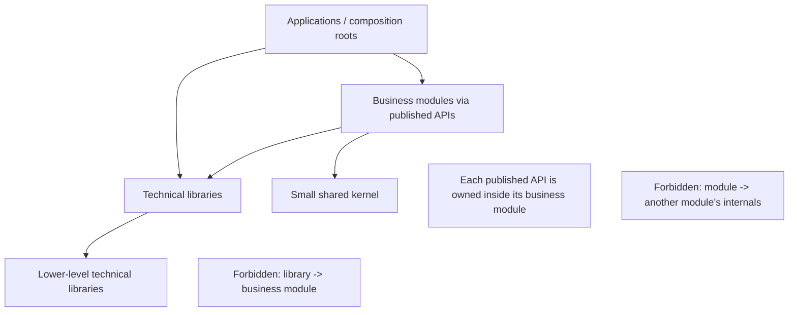
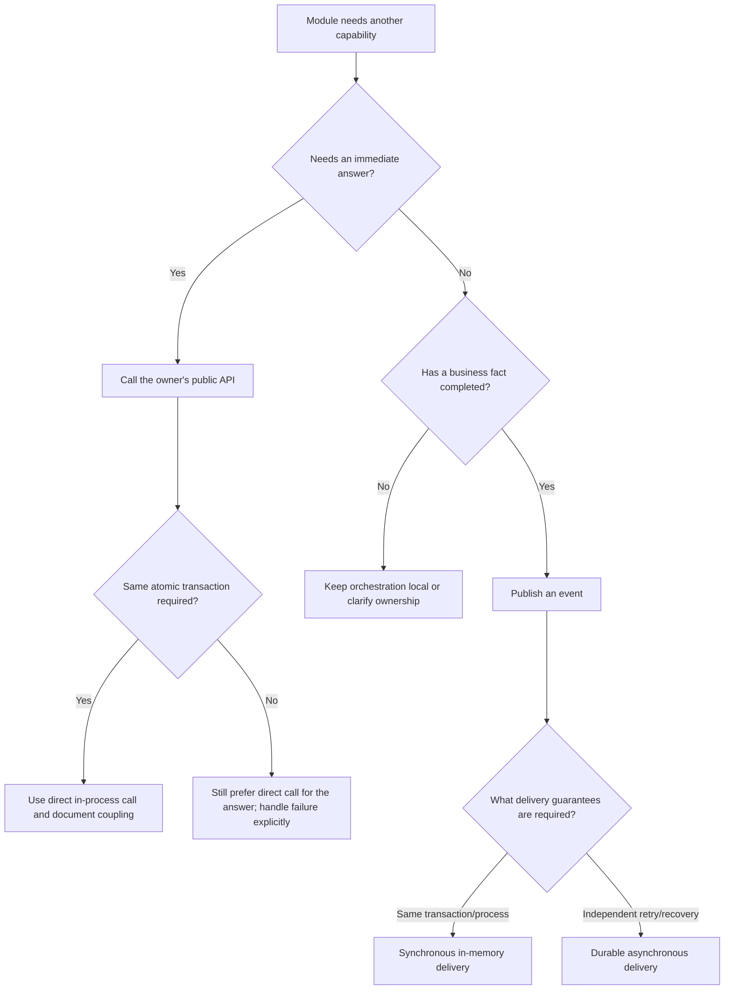

# Modulith Application Architecture Template

> Copy this document into a new project, replace every `<placeholder>`, delete examples that do not apply, and treat the remaining rules as the project's architectural contract.

> **Production standard:** An application is approved only when structural rules, security, data lifecycle, operational ownership, delivery controls, and recovery evidence are complete. Folder presence alone is not architecture compliance.

## 1. Project metadata

| Field | Value |
|---|---|
| Project | `<project-name>` |
| Business domain | `<business-domain>` |
| Base namespace | `<base-namespace>` |
| Primary runtime | `<runtime-and-version>` |
| Build system | `<build-system>` |
| Architecture owner | `<team-or-role>` |
| Status | Draft / Approved |
| Last reviewed | `<yyyy-mm-dd>` |
| Operational owner | `<team-or-role>` |
| Data classification | Public / Internal / Confidential / Restricted |
| Availability tier | Tier 1 / Tier 2 / Tier 3 |
| RTO / RPO | `<duration>` / `<duration>` |
| Production environments | `<environment-list>` |
| ADR index | `<link>` |

## 2. Purpose

This repository contains one or more deployable applications assembled from independently understandable business modules. Each deployable application is a modular monolith: its modules run together in one process and release unit. Each module owns a business capability, hides its implementation, exposes deliberate contracts, and can be tested in isolation.

### Unreleased-system rule

When the application or module has not been released to external consumers, use
the canonical structure directly: remove obsolete names, packages, wrappers, and
compatibility aliases during the migration and update all repository consumers in
the same change. Retain compatibility only for an external released consumer,
persisted/serialized contract, or an explicitly approved migration window recorded
in an ADR or migration plan.

The objective is not to imitate distributed microservices inside one process. The objective is to gain clear ownership and replaceable internals without accepting unnecessary network, deployment, and operational complexity.

## 3. Architecture principles

1. Organize business code by capability, not by technical type.
2. A module owns its behavior, data, public contracts, and emitted events.
3. Other modules may use only the owning module's published API or events.
4. Internal types, database tables, repositories, and adapters are private.
5. Dependencies point toward stable contracts and domain logic.
6. Applications compose modules but contain no business rules.
7. Libraries provide reusable technical capabilities and never depend on business modules.
8. The shared kernel is intentionally small; `common`, `commons`, and `utils` dumping grounds are forbidden.
9. Prefer direct in-process calls when an immediate answer is required. Prefer events for completed facts and independent side effects.
10. Architecture rules are executable in CI rather than dependent on convention alone.
11. Do not place mixed API contracts, models, exceptions, or ports directly in a flat package. Public package responsibilities must remain visible in dedicated subpackages.

## 4. Top-level project structure

```text
<project-root>/
├── applications/                    # Deployable composition roots
│   └── <application>/
├── modules/                         # Business capabilities / bounded contexts
│   └── <module>/
├── libraries/                       # Reusable technical capabilities
│   └── <library>/
├── platform/                        # Version/dependency alignment (optional)
├── database/                        # Deployment-level DB assembly (optional)
├── architecture-tests/              # Cross-project structural rules
└── docs/
    ├── architecture/
    ├── decisions/
    └── templates/
```

### Allowed dependency direction



Applications may know concrete implementations because they are composition roots. Business modules and libraries depend on abstractions at their boundaries.

## 5. What is a module?

A module represents a cohesive business capability with its own language, rules, data ownership, and reason to change. Examples include identity, booking, billing, inventory, notification, and audit.

Create a module when most of these statements are true:

- The capability has business rules or policies.
- A product or domain owner can name and explain the capability.
- It owns or controls data with meaningful invariants.
- It exposes use cases to users or other modules.
- It changes for business reasons rather than framework upgrades.
- It could eventually need a distinct team, scaling profile, or deployment boundary.

Do not create a module merely for controllers, repositories, DTOs, helpers, or a third-party SDK. Those are layers or adapters within a capability.

### Why use modules?

- They make business ownership explicit.
- They prevent unrelated features from sharing internal state accidentally.
- They localize changes and tests.
- They provide a safe path to future service extraction if a real operational need appears.
- They let the monolith retain simple in-process calls and transactions.

### Module cohesion test

A module is well bounded when a developer can answer all four questions without reading its internals:

1. What business capability does it own?
2. Which public operations does it provide?
3. Which facts does it publish?
4. Which other contracts does it require?

If two areas always change together and cannot state separate invariants, keep them in one module. If an area has its own vocabulary, lifecycle, and ownership, consider a separate module.

## 6. Standard module structure

Every future Spring Modulith module uses the DDD + Hexagonal, API-grouped-by-kind structure defined by the [module package structure template](module-package-structure-template.md). That template is authoritative for package meanings, `package-info.java`, named interfaces, filenames, and module approval. This application template governs how modules are assembled into a deployable product.

```text
modules/<module>/
├── build.gradle.kts
└── src/
    ├── main/
    │   ├── java/<base-package>/<module>/
    │   │   ├── package-info.java    # @ApplicationModule and allowed dependencies
    │   │   ├── api/                 # command, query, result, usecase, event, exception, type
    │   │   ├── application/         # service, port/out, mapper
    │   │   ├── domain/              # model, service, event, exception, specification
    │   │   ├── adapter/
    │   │   │   ├── in/              # web, messaging, scheduler
    │   │   │   └── out/             # persistence, messaging, client, observability
    │   │   └── configuration/       # Spring composition only
    │   └── resources/               # contracts, queries, templates, safe defaults
    ├── test/                         # Unit, slice, module, and architecture tests
    ├── integrationTest/             # Real boundary tests
    └── testFixtures/                 # Fixtures owned by this module
```

Materialize only branches with a real responsibility. Every materialized Java package carries the matching `package-info.java` contract. Public module types live in the appropriate `api.*` kind, application services implement `api.usecase`, outbound ports live in `application.port.out`, and technical implementations live under `adapter.out`.

Schema ownership is logical even when migrations are physically centralized. In EMME, the top-level `database` project assembles Liquibase changelogs; a module owns and approves changes to its tables but does not create an independent migration history under its own resources.

### Package-layout invariant

The public contract is grouped by kind:

```text
api/{command,query,result,usecase,event,exception,type}
```

Do not flatten these types into `api/`, combine them in `api/model`, publish use cases from `api/port`, or keep public events in a separate top-level `events/` package. `api.exception` contains only expected failures intentionally exposed to callers; invariant violations remain in `domain.exception`.

### Class kinds by folder

Folder names describe what kind of class goes where, independent of what triggers the module: an HTTP request, a scheduled tick, a consumed message, or a CLI invocation all end up calling the same `application/service/` orchestrator through a different inbound adapter. Use this table when deciding where a new class belongs, in any module of any application type (web API, background worker, CLI, event-driven consumer).

| Folder | Class kind | Example |
|---|---|---|
| `api/command/` | Immutable public state-changing intentions | `CreateBookingCommand` |
| `api/query/` | Immutable public read intentions | `GetBookingQuery` |
| `api/result/` | Stable public read/result shapes | `BookingDetails`, `BookingSummary` |
| `api/usecase/` | Inbound use-case interfaces published by the module | `ConfirmBookingUseCase` |
| `api/event/` | Past-tense public completed facts | `BookingConfirmed` |
| `api/exception/` | Expected failures intentionally exposed to callers | `BookingNotFoundException` |
| `api/type/` | Small stable public value types | `BookingId`, `BookingStatusView` |
| `domain/exception/` | Domain rule violations and invariant failures | `InvalidBookingStateException` |
| `domain/model/` | Aggregates, entities, value objects; state plus invariants | `Booking`, `Money` |
| `domain/service/` | Stateless business rules spanning domain objects | `BookingCollisionPolicy` |
| `domain/event/` | Internal domain facts not exposed as module contracts | `BookingCapacityReserved` |
| `domain/specification/` | Reusable composable business predicates | `BookingCanBeConfirmed` |
| `application/port/out/` | Interfaces application orchestration needs from outside | `BookingRepository`, `ModelProvider`, `ImageStorage` |
| `application/service/` | One use-case orchestrator implementing `api.usecase` | `ConfirmBookingService` |
| `application/mapper/` | Public API ↔ domain translation | `BookingApplicationMapper` |
| `adapter/in/` | Controllers, message consumers, and scheduled triggers | `BookingController`, `CustomerUpdatedConsumer` |
| `adapter/out/` | Persistence, messaging, external-client, and observability implementations | `BookingPersistenceAdapter`, `GoogleCalendarClientAdapter` |
| `configuration/` | Framework wiring and adapter selection | `BookingConfiguration` |

Misplacement smells to watch for, regardless of which boundary layout option is in use:

- A class that calls an external SDK, database driver, HTTP client, or web-socket connection directly is an adapter. It belongs in the outbound boundary behind a port, never in `application/` or `domain/`, even if it currently has only one caller.
- A class that enforces a rule which must hold no matter who calls it is a domain policy (`domain/service/`), even if today only one service calls it.
- A class implementing an outbound capability with more than one interchangeable strategy (e.g. a model-provider selector with several backends) means the interface belongs in `application/port/out/` and every concrete strategy belongs in the outbound boundary, not stacked together in `application/`.
- A persistence-mapped class (ORM entity, table row mapping) sitting in the same folder as its own repository interface or repository implementation is a sign domain/persistence separation was skipped entirely. The model belongs in `domain/model/`, the repository interface in `application/port/out/`, and its persistence-backed implementation in the outbound boundary. Treat a framework-mapped class doubling as the domain model as a deliberate, documented exception for a trivial CRUD module — never the default.

### Recurring smell: a port flattened together with its adapters

The single most common drift in a growing codebase is a folder that holds one interface plus every concrete implementation of it: a legacy domain port next to adapters, an application port next to adapters, or — worst — a bare top-level folder (`provider/`, `client/`, `gateway/`) that was never assigned to a layer at all and accumulates both. Recognize the shape regardless of naming; the canonical destination owns outbound ports in `application.port.out`.

```text
# Smell: port and every adapter in one undifferentiated folder
payment/provider/
├── PaymentProvider.java             # the port
├── StripeProvider.java              # adapter
├── PayPalProvider.java              # adapter
├── MercadoPagoProvider.java         # adapter
└── MockPaymentProvider.java         # test adapter
```

```text
# Fixed: port owned by the layer that needs it, adapters in the outbound boundary
payment/
├── application/port/out/
│   └── PaymentProvider.java
└── adapter/out/client/payment/
    ├── StripePaymentAdapter.java
    ├── PayPalPaymentAdapter.java
    ├── MercadoPagoPaymentAdapter.java
    └── FakePaymentProvider.java     # test fixture; keep out of production wiring
```

This applies equally to external API clients, storage strategies, and notification channels — any place where "one interface, several backends" shows up. A dedicated folder for the interface plus its adapters is not extra ceremony; it is what makes the outbound boundary's job legible.

### Legacy application-layout migration

The options below describe existing layouts that may be encountered during migration. They are not alternatives for future Spring Modulith modules; new modules use `application/{service,port/out,mapper}` and place event/message/scheduled entry points in `adapter.in`.

| Option | Use when | Benefits | Costs |
|---|---|---|---|
| A. Flat `service/` | The module has few application-layer files and each one's trigger (request, event, timer) is obvious from its name | Minimal ceremony | Trigger and kind become implicit as the module grows |
| B. Grouped by kind (`service/`, `listener/`, `scheduler/`) | The module mixes request-driven, event-driven, and/or time-driven orchestration | Trigger is visible from the folder alone | A few more folders to navigate |
| C. Fully typed (adds `saga/`, `support/`) | The module has genuine multi-step process managers, or internal helpers shared by more than one service | Every orchestration concern has an explicit, greppable home | Highest ceremony; unnecessary without real sagas or shared helpers |

Application-layout decision rules:

1. Do not select any legacy option for a new module; use the canonical module template.
2. Migrate listeners and scheduled triggers to `adapter.in` when their boundary changes or an architecture violation is corrected.
3. Model a genuine long-running saga/process manager explicitly in the application layer and record the deviation; do not create `saga/` or `support/` speculatively.
4. Preserve behavior while migrating package names and enforce the target with architecture tests.

### Legacy boundary-layout migration

Folder names do not create architecture by themselves. The options below explain legacy forms; future Spring Modulith modules use `adapter.in`, `adapter.out`, and `configuration` consistently.

| Option | Use when | Benefits | Costs |
|---|---|---|---|
| A. Flat `infrastructure` (legacy only) | Existing trivial CRUD modules during migration | Few folders, easy navigation, low ceremony | Inbound and outbound direction is implicit; prohibited for new production modules |
| B. Directional `infrastructure` | An existing framework-centric module already separates inbound and outbound concerns | Makes direction visible during migration | Still uses a competing broad `infrastructure` namespace |
| C. `adapter/in` and `adapter/out` | Canonical destination for all future modules | Explicit hexagonal vocabulary and one project-wide convention | Migration may require behavior-preserving package moves |

#### Option A: flat infrastructure (legacy only; do not use for new production modules)

```text
infrastructure/
├── web/                             # Controllers and transport mapping
├── persistence/                     # DB models, repositories, mappings
├── provider/                        # External API and SDK clients
├── messaging/                       # Publishers and consumers
└── config/                          # Framework wiring
```

Keep this only while documenting or migrating an existing trivial module. New boundaries use the canonical `adapter` structure.

#### Option B: directional infrastructure

```text
infrastructure/
├── inbound/
│   ├── web/                         # HTTP/RPC entry points
│   └── messaging/                   # Event/message consumers
├── outbound/
│   ├── persistence/                 # Repository implementations
│   ├── provider/                    # External service clients
│   └── messaging/                   # Event/message publishers
└── config/                          # Framework wiring
```

Treat this as an intermediate legacy state. When the boundary changes, migrate it to the canonical `adapter.in`, `adapter.out`, and `configuration` structure rather than extending the competing namespace.

#### Option C: explicit ports and adapters (canonical destination)

```text
adapter/
├── in/
│   ├── web/                         # Controllers and transport mapping
│   └── messaging/                   # Event/message consumers
└── out/
    ├── persistence/                 # Repository implementations
    ├── client/                      # External service clients
    └── messaging/                   # Event/message publishers
configuration/                       # Framework wiring and adapter selection
```

This is the conceptual predecessor of the canonical layout. For future modules, use singular `adapter/` and place composition in `configuration/` as defined by the module template.

### Layout decision rules

1. New modules use `adapter/in`, `adapter/out`, and `configuration`; there is no layout choice.
2. Existing modules may retain a legacy layout temporarily when a rename would add risk without changing behavior.
3. Migrate when changing the affected boundary or correcting an architecture violation.
4. Module-specific deviations name an owner, reason, guard, and removal condition.
5. Never place module-owned controllers, repositories, or providers in a global technical folder outside their owning module.

### Layer responsibilities

| Area | Owns | May depend on | Must not depend on |
|---|---|---|---|
| `api.*` | Stable public interfaces, immutable contract types, and published facts grouped by kind | Shared primitives | Adapters, internal domain types |
| `domain` | Business invariants and policies | Shared primitives | Web, database, third-party SDKs |
| `application` | Use-case orchestration and transactions | Domain, required contracts | Concrete external clients |
| `adapter.in` | Protocol translation into use cases | Module API | Business rules, repositories, another module's internals |
| `adapter.out` | Persistence, messaging, provider, and observability implementations | Application ports | Business orchestration, another module's internals |
| `configuration` | Framework wiring and module registration | Ports and concrete implementations | Business decision logic |
| composition root | Concrete dependency wiring | All assembled modules/libraries | Business decision logic |

### Why boundary implementations live inside the module

Boundary implementations remain inside the module because the module owns the complete capability boundary: its HTTP endpoints, persistence mapping, messages, and provider translations change with that capability. Grouping all controllers or repositories globally by technical type would weaken business ownership and encourage cross-module access.

## 7. Public interfaces and concrete implementations

The module that owns a behavior also owns its public interface. Consumers should not define copies of another module's contract.

Example neutral contract:

```text
CreateBookingUseCase
  create(CreateBookingCommand) -> BookingDetails

GetBookingUseCase
  get(GetBookingQuery) -> BookingDetails or BookingNotFoundException
```

The concrete implementation remains internal:

```text
CreateBookingService implements CreateBookingUseCase
  requires BookingRepository
  requires AvailabilityPort
  requires EventPublisher
```

Rules:

- Public contracts use immutable, framework-neutral values. Durable or remote contracts must also be serialization-safe.
- Public contracts never expose persistence entities, ORM repositories, framework request objects, or provider SDK types.
- Concrete implementations are not imported by consumers.
- Dependencies are injected through constructors or equivalent explicit factories.
- Only the application composition root selects concrete implementations.
- Contract changes are reviewed for consumer impact and compatibility.

### API, port, and adapter vocabulary

| Term | Meaning |
|---|---|
| Module API | Operations a module offers to other modules or application adapters |
| Inbound port | A use case that an external caller may invoke |
| Outbound port | A capability the module requires, such as persistence, time, payment, or messaging |
| Adapter | A concrete implementation that translates a port to a framework or external system |

Outbound ports live in `application/port/out` when use-case orchestration needs persistence, messaging, time, identifiers, or an external provider. Keep the domain deterministic by passing resolved values or domain policies into aggregate behavior rather than letting domain objects call infrastructure.

When consuming another module, call its provider-owned public API directly by default. A consumer-owned anti-corruption port is appropriate when the consumer must translate an unstable or foreign model into its own language. Its adapter may call the provider's published API, but it must not expose or bypass the provider's internals.

## 8. What is a library?

A library provides a reusable technical capability without owning a business workflow. Examples include structured logging, telemetry, cryptography wrappers, result types, generic HTTP clients, test containers, and framework-neutral identifiers.

Create a library when all of these statements are true:

- The code is useful to multiple modules or applications.
- Its behavior is technical rather than specific to one business capability.
- It can be named by one focused responsibility.
- It has no dependency on business modules.
- Its public API can remain small and stable.
- Reuse removes genuine duplication rather than merely anticipating it.

Keep code inside its module when any of these statements are true:

- It encodes business vocabulary or policy.
- Only one module uses it.
- It depends on a module's entities, repositories, fixtures, or services.
- Its reuse would force unrelated capabilities to change together.

### Why use libraries?

- They centralize a proven technical capability.
- They reduce duplicate infrastructure code.
- They make dependency and version ownership clear.
- They can be tested and evolved without knowing business modules.

### Library rules

- One library has one reason to change.
- A library may depend only on lower-level libraries or external dependencies.
- Generic testing libraries may not import business modules; module-specific fixtures stay with their module.
- Avoid `common`, `commons`, `shared-utils`, or `helpers` libraries.
- Prefer an internal module implementation until at least two real consumers demonstrate stable reuse.
- Split a library when its consumers, dependencies, or release reasons diverge.

## 9. Shared kernel versus supporting module versus library

| Choice | Use when | Examples | Avoid when |
|---|---|---|---|
| Module | Code owns a business capability | Booking, identity, billing | It is only a technical helper |
| Shared kernel | A few stable domain primitives must mean exactly the same thing everywhere | Tenant identifier, money value, correlation identifier | The type belongs to one module or changes often |
| Supporting module | A named business/supporting capability has explicit ownership, public APIs, and possibly owned state | Authorization decisions, tenant lifecycle, audit | It lacks a bounded capability or becomes a generic shared bucket |
| Library | Reusable technical capability independent of business ownership | Observability, testing harness, functional helpers | It imports business concepts |

Shared-kernel admission requires an architecture review. A candidate must have at least three real consumers, identical semantics for every consumer, and no business workflow. When ownership is clear, keep the type in the owning module and publish it through that module's API.

Do not create a module named `shared`. If a cross-cutting runtime capability is business-relevant, give it a precise capability name, owner, invariants, public API, dependency rules, and data ownership like every other module.

## 10. Choosing direct communication or events

First choose the semantic interaction: a request for an operation or answer uses a direct API; notification of a completed fact uses an event. Then independently choose event delivery: synchronous or asynchronous, and durable or in-memory. An event is not automatically asynchronous, durable, retried, or eventually consistent.

### Use direct communication when

- The caller needs an immediate answer to continue.
- The operation is a query.
- The caller must know whether a command succeeded.
- The behavior belongs inside one consistency boundary or transaction.
- Failure must be returned directly to the caller.
- There is one authoritative provider of the capability.

Examples:

- Booking asks Catalog for current service duration before validating a request.
- Identity asks Tenancy whether a tenant is active.
- Checkout asks Pricing to calculate the authoritative total.

Direct calls must target the provider module's public API, never its concrete service, entity, or repository.

### Use events when

- A business action has completed and other modules may react independently.
- The publisher does not need an immediate response from consumers.
- Zero, one, or many consumers are valid.
- Side effects do not need to determine the publisher's immediate result.
- One or more consumers may evolve independently.
- Coupling the publisher to every downstream workflow would create unstable dependencies.

Examples:

- `BookingConfirmed` triggers notifications, audit recording, and calendar synchronization.
- `TenantActivated` triggers default configuration and analytics initialization.
- `PaymentCaptured` triggers fulfillment and receipt generation.

Events describe completed facts in past tense. Do not publish vague commands such as `ProcessBooking` merely to hide a synchronous dependency.

### Decision table

| Question | Direct API | Event |
|---|---:|---:|
| Does the caller need a return value now? | Yes | No |
| Must caller and provider succeed or fail together? | Usually | Depends on event delivery mode |
| Is this a query? | Yes | Never |
| Are multiple independent reactions expected? | Possible, but coupled | Preferred |
| Can processing be eventually consistent? | Optional | Often, when asynchronous |
| Must consumers retry independently? | No | Choose durable asynchronous delivery |
| Is the message a completed business fact? | Not necessary | Yes |

### Event delivery modes

| Mode | Use when | Failure semantics |
|---|---|---|
| Synchronous in-memory | Consumers must react in the same process and transaction phase | Consumer failure may fail or roll back the publisher according to the documented policy |
| Asynchronous in-memory | Best-effort local side effects are sufficient | Process failure may lose delivery; no independent recovery |
| Durable asynchronous | Delivery must survive crashes or consumers need independent retries | Publisher atomically records the event; consumers retry and deduplicate |

Choose the least complex mode that satisfies the business reliability and consistency requirements. Delivery mode may change without changing the meaning of the event, provided its documented timing and failure contract remains compatible.

### Communication decision flow



### Combining both styles

A use case may call another module directly for required information and then publish an event after its own state changes. For example:

1. Booking directly queries Availability.
2. Booking validates the reservation.
3. Booking atomically commits the reservation and an outbox/publication record.
4. A dispatcher delivers or externalizes the atomically recorded `BookingConfirmed` publication after commit.
5. Notification and Calendar react independently and idempotently.

For intentionally in-memory delivery, publish within the documented transaction phase and accept that process failure can lose post-commit delivery. Do not use request/reply events to simulate a direct function call inside the same deployment unless a measured scalability or isolation requirement justifies the complexity.

## 11. Event contract rules

Every published event defines this minimal semantic contract:

| Field | Requirement |
|---|---|
| Event name | Past-tense business fact, such as `BookingConfirmed` |
| Occurred at | Timestamp supplied by an injected clock |
| Subject ID | Identifier of the relevant business object when one exists |
| Tenant/partition ID | Included when the system is multi-tenant or partitioned |
| Payload | Minimum stable facts consumers require; no persistence entities |
| Correlation/causation IDs | Included when tracing workflows matters |

Durable or externally published events additionally require a globally unique event ID and an explicit schema version. Their consumers must be idempotent. Durable asynchronous delivery must define retry policy, dead-letter handling, observability, ordering requirements, and an outbox or equivalent atomic-publication strategy.

Synchronous in-memory consumers participate in the publisher's documented failure and transaction semantics. They need deduplication only if the delivery mechanism can repeat delivery. In-memory events are acceptable only when their delivery and loss characteristics satisfy the business requirement.

Events are immutable. Add compatible fields when possible; introduce a new version for breaking semantic changes. Publishers do not depend on consumer implementations.

## 12. Data ownership and transactions

- Each table, collection, stream, or file has one owning module.
- Each module owns its schema definitions and migrations. A top-level `database/` project may order and package those migrations for deployment but must not redefine ownership.
- Only the owning module's persistence adapter reads or writes its data directly.
- Other modules use the owner's API, projection, or events.
- Cross-module database joins are forbidden in business code.
- A direct in-process workflow may share one transaction only when atomic consistency is a documented business requirement.
- Prefer module-local transactions plus events for independent side effects.
- Reporting and search projections may combine data, but they are explicitly owned, read-only views rebuilt from source modules.

## 13. Application composition roots

An application selects modules and concrete adapters for one deployable product.

```text
applications/<application>/
├── bootstrap
├── configuration
├── dependency wiring
├── runtime resources
└── end-to-end tests
```

Rules:

- Do not place domain entities, repositories, or business use cases here.
- Module-local configuration may expose registration or factory functions. The application root decides which concrete implementations are active and invokes that wiring.
- Use one authoritative composition root per deployable application.
- An application may intentionally exclude modules or adapters to produce a restricted product surface.

## 14. Error handling

| Boundary | Error strategy |
|---|---|
| Domain | Typed rule violations with business meaning |
| Module API | Application service translates expected internal domain failures into stable typed outcomes or documented `api.exception` contracts |
| HTTP/RPC adapter | Map public failures into protocol-safe responses and hide unexpected internal failures |
| External provider adapter | Translate SDK/network errors into the outbound port's error model |
| Event consumer | Record failure, retry according to policy, preserve idempotency |
| Composition root | Fail fast for invalid mandatory configuration |

Never leak database, framework, or provider exceptions through a module's public API.

## 15. Security and tenant boundaries

- Authentication mechanisms, token parsing, cryptography, and framework security integration belong in technical libraries or boundary adapters.
- Identity lifecycle and authoritative principal data belong to a precisely named identity module.
- Business authorization policies belong to the module that owns the protected action because they are business rules.
- Shared identity and tenant identifiers may enter the shared kernel only when their semantics are stable across modules.
- Tenant resolution occurs at an inbound boundary; every module still enforces tenant ownership when accessing its data.
- Never rely only on UI visibility or gateway filtering for authorization.
- Security context propagation is explicit, testable, and cleared at asynchronous and request boundaries.

## 16. Testing strategy

| Test level | Purpose | Dependencies |
|---|---|---|
| Domain unit | Business invariants and policies | None or simple values |
| Application unit | Use-case orchestration | Fake outbound ports |
| Adapter integration | Database, web, messaging, or provider translation | Real boundary or controlled test double |
| Module integration | Public API plus internal wiring | Current module; mock other module APIs when useful |
| Architecture | Dependency direction, exports, naming, ownership | Compiled structure/source graph |
| Application E2E | Critical user journeys across assembled modules | Running application and real infrastructure where required |

Required architecture tests:

- The module graph is acyclic.
- Only explicitly named `api.*` packages are accessible across module boundaries; event-only consumers use `module :: events`.
- Domain code does not depend on adapters or infrastructure frameworks.
- Persistence entities and repositories remain module-private.
- Libraries have no dependencies on business modules.
- Applications do not contain business logic.
- Every declared dependency exists and every actual dependency is declared.
- Public API and event contracts do not expose framework or persistence types.

### Test package structure

Tests mirror the responsibility of the production class. Do not put all behavior in one aggregate test:

```text
modules/<module>/src/test/java/<base-package>/<module>/
└── domain/
    ├── model/
    │   ├── QuoteTest.java
    │   └── HealthProfileTest.java
    └── exception/
        └── InvalidStateTransitionExceptionTest.java
```

Use one exception test class only when the exception has meaningful behavior such as a specific error code, structured metadata, a nontrivial message, or protocol mapping. A simple exception that only calls `super()` is covered through the application service that throws it. Aggregate tests focus on business behavior: draft creation, allowed updates, invalid transitions, incomplete submission rejection, and state preservation after failed operations.

Test fixtures mirror production responsibility. For example, a domain aggregate factory belongs at `modules/<module>/src/testFixtures/java/<base-package>/<module>/domain/model/QuoteMother.java`, not in a flat module fixture package.

## 17. Module definition worksheet

Complete this section for every module.

### `<module-name>`

| Item | Definition |
|---|---|
| Business capability | `<capability>` |
| Owner | `<team-or-role>` |
| Invariants | `<rules this module alone protects>` |
| Owned data | `<tables/collections/streams>` |
| Public APIs | `<operations and result types>` |
| Published events | `<completed facts>` |
| Consumed APIs | `<module: interface>` |
| Consumed events | `<event: reason>` |
| External systems | `<provider through outbound port>` |
| Consistency requirements | `<atomic or eventual, with rationale>` |
| Failure behavior | `<errors/retries/fallbacks>` |

## 18. Library definition worksheet

### `<library-name>`

| Item | Definition |
|---|---|
| Single technical responsibility | `<responsibility>` |
| Consumers | `<at least two real consumers>` |
| Public API | `<small stable surface>` |
| Dependencies | `<external or lower-level libraries only>` |
| Why this is not module-owned | `<rationale>` |
| Removal criterion | `<when it should be folded back or deleted>` |

## 19. New-module checklist

- [ ] The capability and owner are named.
- [ ] Invariants and owned data are documented.
- [ ] Public API contains only necessary operations and immutable contract types.
- [ ] Public types are grouped under `api/{command,query,result,usecase,event,exception,type}` with no mixed flat API package.
- [ ] Every materialized package has its responsibility-focused `package-info.java`.
- [ ] Filenames follow the module template's package-to-filename matrix.
- [ ] Expected public failures live under `api/exception/`; invariant failures live under `domain/exception/`.
- [ ] No expected `domain.exception` escapes a public use-case call; application services translate it to the module contract.
- [ ] Domain exceptions do not depend on HTTP-oriented abstractions or status codes.
- [ ] Published events are completed facts, not disguised commands.
- [ ] Direct dependencies and event subscriptions have explicit rationale.
- [ ] Domain logic is isolated from frameworks.
- [ ] Outbound dependencies are represented by ports.
- [ ] Inbound boundary implementations call public use cases rather than domain internals.
- [ ] Outbound adapters implement ports owned by `application.port.out`.
- [ ] New code uses `adapter.in`, `adapter.out`, and `configuration`; any legacy-layout exception is documented.
- [ ] No outbound adapter, SDK client, or domain policy is misfiled directly under `application/`.
- [ ] Concrete adapters are wired in the module/application composition root.
- [ ] Unit, integration, and architecture tests exist.
- [ ] No code was added to a generic shared dumping ground.
- [ ] The module can be understood without inspecting another module's internals.

## 20. New-library checklist

- [ ] The library has one technical responsibility.
- [ ] At least two real consumers need the same semantics.
- [ ] It contains no business workflow or module-specific fixtures.
- [ ] It does not depend on a business module.
- [ ] Its public API is smaller than its implementation.
- [ ] It has independent tests.
- [ ] Its name describes a capability, not a generic bucket.

## 21. Framework mappings

The core architecture above is framework-neutral. Apply the following mappings without changing ownership or dependency rules.

| Neutral concept | Java / Spring | TypeScript / Node | Python |
|---|---|---|---|
| Module manifest | Package convention plus optional Spring Modulith `@ApplicationModule` metadata | Package boundary metadata / lint rules | Package metadata / import rules |
| Published API | Named interface package + Java interfaces/records | Export map + interfaces/types | Explicit package exports + protocols/dataclasses |
| Outbound port | Java interface in `application.port.out` | TypeScript interface | `Protocol` or abstract base class |
| Adapter | Spring component implementing a port | Class/factory implementing an interface | Class implementing a protocol |
| Inbound adapter | Controller, listener, or scheduled-job component | Route/message handler | Router/view/message handler |
| Outbound adapter | Repository/client component implementing a port | Repository/provider implementation | Repository/provider implementation |
| Composition root | Boot application/configuration | Application bootstrap/container | Application factory/bootstrap |
| Scheduled trigger adapter | `@Scheduled` component in `adapter.in.scheduler` invoking a use case | Cron library (e.g. node-cron, BullMQ repeatable jobs) invoking a use case | Celery beat / APScheduler job invoking a use case |
| Event listener adapter | `@EventListener`/`@ApplicationModuleListener` component in `adapter.in.messaging.consumer` | Broker consumer or EventEmitter handler | Broker consumer or signal receiver |
| Boundary verification | Spring Modulith + ArchUnit | dependency-cruiser/ESLint/custom tests | import-linter/custom tests |
| Unit testing | JUnit/Vitest as appropriate | Vitest/Jest | pytest |

For Spring Modulith, keep public contracts in the owning module's kind-specific `api.*` packages and expose them through explicit named interfaces as defined by the [module template](module-package-structure-template.md). `ApplicationModules.verify()` checks cycles, access to module internals, and declared allowed dependencies. For Gradle Java libraries, use `api` only for dependencies exposed through the library's public binary interface and prefer `implementation` otherwise.

## 22. Generation contract

A project generator using this template must require:

```text
project-name
base-namespace
application-name
initial-module-names
module-specifications (capability, owner, invariants, owned data, APIs, events, dependencies, consistency, failure behavior)
module-layout (api-grouped-by-kind with adapter.in/adapter.out)
runtime/build-system
persistence choice (optional)
messaging choice (optional)
```

For each initial module, it generates:

- Only the standard directory branches required by specified responsibilities, each with `package-info.java`.
- A module manifest with no undeclared dependencies.
- Module-root metadata plus only the API kinds required by the module specification; no empty export packages.
- One real use-case slice when requested; outbound ports and adapters only when required by that slice.
- Unit, integration, and architecture test placeholders.
- A completed module worksheet containing no unresolved architectural choices.

Generated projects must begin with all architecture checks passing. Example code must be removable and must not introduce a production dependency.

## 23. Architecture review cadence

Review this document when:

- A new module or library is proposed.
- A module begins importing another module's internal types.
- A synchronous dependency is replaced by events or vice versa.
- Shared-kernel membership changes.
- A new application composition root is introduced.
- A module needs independent scaling or deployment.

Record durable exceptions and architecture changes in decision records. Temporary violations require an owner, an expiry date, and an executable test that prevents the exception from expanding.

## 24. Production readiness and governance

### Release gates

The assembled application is production-ready only when all of the following are true:

- [ ] Every module and library has an owner, capability statement, data boundary, and dependency rationale.
- [ ] `ApplicationModules.verify()` and custom architecture rules pass.
- [ ] Public APIs, events, and frontend/backend contracts pass compatibility tests.
- [ ] Authentication, authorization, tenant isolation, data classification, and audit behavior are tested.
- [ ] Database migrations are forward-compatible with the rollout strategy and have a recovery plan.
- [ ] External calls have timeout, retry, idempotency, rate-limit, and terminal-failure behavior.
- [ ] Event publication is durable where business loss is unacceptable; backlog and replay are observable.
- [ ] Unit, module-slice, persistence, contract, frontend, and critical E2E tests pass.
- [ ] Images/artifacts have SBOM, vulnerability results, provenance, signature, and immutable digest.
- [ ] Dashboards, alerts, runbooks, SLOs, on-call ownership, and rollback instructions exist.
- [ ] Production configuration and secrets are injected securely and are not present in source or artifacts.

### Architecture change control

Record an ADR when changing:

- module boundaries or ownership;
- public named interfaces, API schemas, or event schemas;
- data ownership, migration strategy, or consistency model;
- authentication, authorization, tenancy, or sensitive-data handling;
- application composition roots or deployment topology;
- shared-kernel/library membership;
- build or delivery capability boundaries.

Temporary exceptions must name an owner, risk, mitigation, expiry date, and executable guard. Review architecture at each new module, library, application, external provider, or deployment target.

### Application approval record

| Evidence | Link / result |
|---|---|
| Architecture verification | `<CI job or report>` |
| Contract compatibility | `<CI job or report>` |
| Security/threat review | `<review link>` |
| Migration review | `<migration plan>` |
| Production smoke test | `<CI job or dashboard>` |
| Runbook and rollback | `<runbook link>` |
| Owner/on-call | `<team/contact>` |

## 25. References

- [Spring Modulith: Application-module verification](https://docs.spring.io/spring-modulith/reference/verification.html)
- [Spring Modulith: Application modules and named interfaces](https://docs.spring.io/spring-modulith/reference/fundamentals.html)
- [Spring Modulith: Module integration testing](https://docs.spring.io/spring-modulith/reference/testing.html)
- [Gradle: Java Library plugin and API/implementation separation](https://docs.gradle.org/current/userguide/java_library_plugin.html)
