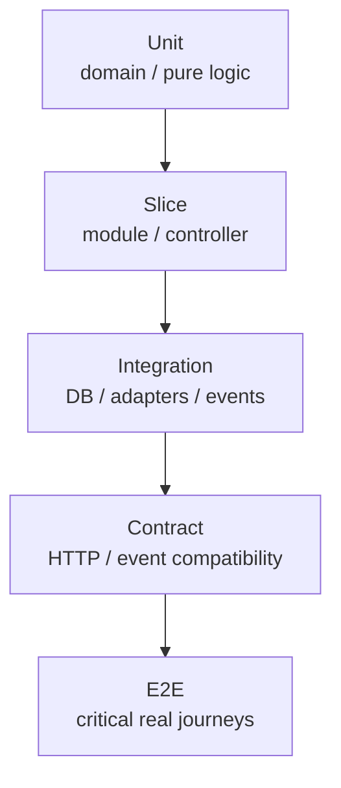

# Testing Policy

Tests are executable architecture and behavior evidence. Use the lowest-cost
lane that can prove the behavior.

## Backend lanes

| Lane | Location | Purpose |
|---|---|---|
| Unit | `src/test` | Domain, application, provider selection, plugin logic |
| Integration | `src/integrationTest` | Persistence, messaging, external adapter behavior |
| Functional | `src/functionalTest` in build-logic | Real Gradle plugin execution with TestKit |
| E2E | `src/e2eTest` | Critical API journeys against a running deployment |

- Unit tests MUST not require Docker or a network.
- Use Testcontainers when real infrastructure behavior matters; do not replace
  PostgreSQL behavior with H2.
- Use Spring Modulith module tests and scenarios for focused module behavior.
- Architecture verification MUST remain green.

## Required scenarios

Cover success, invariants, boundaries, empty/limit cases, authorization denial,
timeouts, unavailable dependencies, retry/idempotency, transaction rollback,
contract drift, and operational recovery where applicable.

## Test doubles

- Fake owned ports through explicit interfaces.
- Stub third-party systems at protocol boundaries.
- Control time through injected clocks or fake timers.
- Do not mock the class under test or assert incidental call order.
- Never commit credentials, tokens, HAR recordings, or customer data.

## Development loop

For behavior changes use Red → Green → Refactor:

1. Write one focused failing test.
2. Confirm the intended failure.
3. Implement the smallest passing behavior.
4. Refactor without changing behavior.
5. Run focused and repository-level verification.
